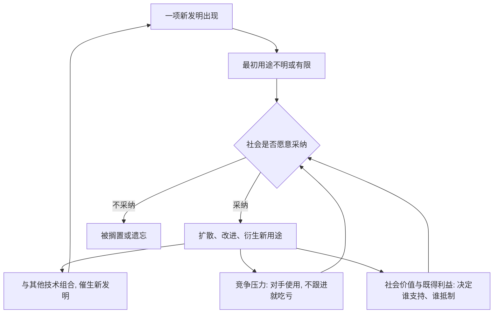

# 11｜为什么技术是「发明之母」，而不是「需要之母」？

> 一句我们从小听到大的谚语，可能正好说反了。

---

## 一、先说结论

戴蒙德的观点可以浓缩成一句反常识的话：**不是需求逼出了技术，而是技术出现之后，才慢慢长出需求。**

他认为，历史上大量发明在被造出来的时候，连发明者自己都说不清它有什么用。留声机、微波炉、便利贴这类东西，最初都不是为了满足某种明确的市场需求，而是先在实验室或工坊里冒出来，之后才被社会赋予用途。

真正决定一项技术能否活下来的，不是它有多「被需要」，而是：社会是否愿意接纳它、它能不能扩散开来、以及会不会因为竞争压力而被大规模采用。技术还会自我催化——一项发明成了另一项发明的前提，积累越多，新发明出现得越快。

---

## 二、我们先理解一个问题

我们从小就被告知一句谚语：需要是发明之母。

这句话之所以听起来毫无破绽，是因为我们总在用「结果」倒推「原因」：既然某样东西现在被广泛使用，那它当初一定是被巨大的需求推动出来的。

但历史记录并不同意这个倒推。

有些技术刚被发明时，用途极其有限，甚至被视为玩具；有些技术多年无人问津，直到某个条件改变才突然爆发；还有一些技术，明明已经被使用，后来却被整个社会主动放弃了。

最耐人寻味的例子之一，是火器在日本的命运。历史记录显示，火器大约在 16 世纪传入日本，很快被大量仿制和使用；可是在政治格局变化之后，火枪的使用反而减少，刀剑重新成为身份与地位的象征。

如果技术只由「有没有用」决定，这一幕就很难解释。**它提示我们：技术能否被保留，取决于社会，而不只是取决于它本身。**

---

## 三、作者到底提出了什么观点？

戴蒙德的核心主张是：把「需要是发明之母」反过来。

他认为，**发明往往先于需求出现**，然后由社会来筛选它。至于一项技术最终是否被采纳，他列出四个关键因素：

| 因素 | 含义 |
|---|---|
| 相对利益 | 与现有做法相比，它在经济或军事上是否划算 |
| 社会价值与声望 | 它是否符合这个社会看重的东西，用它是加分的还是丢脸的 |
| 既得利益 | 它会不会威胁到某些群体的地位、收入或权力 |
| 竞争压力 | 周围的对手是否在用；不用，会不会吃亏 |

戴蒙德还提出第二个关键机制：**技术的自我催化**。技术不是一项一项孤立出现的，而是一层一层叠上去的。有了更好的材料，才能造出更好的机器；有了更好的机器，才能加工出更精密的零件。

---

## 四、把这个观点翻译成人话

想象你家里那个「杂物抽屉」。

里面堆着各种小工具：一根奇怪的转接头、一把很少用的扳手、一卷不知道从哪来的胶带。它们买回来的时候，你并没有明确的需求，只是觉得「将来可能有用」。

某一天，灯坏了、管子漏了、家具要装，你突然发现抽屉里那根转接头正好派上用场。工具先存在，需求后出现。

技术也是这样。**人类社会的技术储备像一个巨大的杂物抽屉，很多发明静静地躺在里面，直到某个时刻被需要「唤醒」。** 决定它有没有机会被唤醒的，往往不是它好不好，而是它在不在一个对的社会里。

---

## 五、为什么会这样？

这条回路的关键在于 **C**：发明只是进入系统的输入，社会才是那道闸门。而 **F** 说明技术会滚雪球——这正是欧亚社会越到后期跑得越快的原因之一。

---

## 六、举一个现实生活中的例子

先看两个「玩具变刚需」的例子。

微波炉的技术源头与雷达研究有关，最初并不是为了做饭；便利贴来自一次「失败」的胶水配方——粘性太弱，本该被淘汰，却恰好适合反复粘贴。两者都不是被明确需求催生的。

再看手机。短信、摄像头、定位这些功能，在刚出现时都没有被预见到今天的样子：短信最初只是通话之外的附属服务，摄像头是手机的附加卖点。它们的价值，是社会在长期使用中一点点「发现」的。

也有反过来的职场场景。一家公司上线了明显更好用的协作系统，却被老部门拖着不用——因为新系统会暴露旧流程的低效，动摇一些人的话语权，这就是**既得利益**在起作用。最后真正推动上线的，往往是竞争对手都在用，逼得不得不跟进，这就是**竞争压力**。

技术的生死，常常就卡在这几道社会闸门上，而不是卡在它好不好用。

---

## 七、回到书中重新理解

现在再看戴蒙德的观点，会发现他并不是说需求毫无作用。他要纠正的是一种**单线程的想象**：以为先有需求、再有发明、然后自动普及。

真实过程更接近：**先有发明，遇到一个愿意接纳它的社会，扩散开来，被反复改进，最后反过来塑造出新的需求。**

这也解释了为什么一个社会不必发明所有东西。它只要能接触到别人的技术，并且有足够的社会条件去采用和改进，就能快速追上来。技术在欧亚大陆的加速，很大程度上是「扩散 + 积累」的结果，而不只是「聪明人更多」。

---

## 八、这个观点背后还有什么？

第一层隐含前提：技术是一个**生态系统**，而不是孤立的点子。孤立看一项发明，很难解释它的命运；把它放进社会结构里，才看得清。

第二层：技术被采纳与否，是一种**社会选择**，涉及利益、身份和权力，不只是效率问题。这也是戴蒙德与纯粹的经济决定论分道扬镳的地方。

第三层：这与下一篇要讲的「大陆轴线」直接相接。技术要扩散，得先能移动；能移动，才谈得上积累和竞争。**传播的通道，决定了技术能滚多大的雪球。**

第四层：戴蒙德借此反对「伟大发明家史观」。个人才华当然重要，但他更关心的是，为什么某些社会持续地产出并采用新技术，而另一些社会不能。

---

## 九、这个观点有问题吗？

有几个争议点。

第一，**有些技术确实是被明确的需求逼出来的。** 军事技术是最典型的例子：战争压力、国家动员和大量资金，会直接推动研发。所以「需要是发明之母」并非全错，而是只说对了一部分。

第二，**存在滑向「技术自主论」的风险。** 如果把技术说成自己长出来的、与需求无关，就容易忽略资本、国家和市场对研发方向的巨大塑造作用。现实中，谁投钱、谁定方向，往往决定哪些技术被优先发展。

第三，**日本火枪的例子，学界有不同解释。** 有学者更强调政治统一、国家垄断武力、维护成本、火药质量等因素，而不是单纯的文化偏好。把它完全归因于社会价值观，可能过度简化。

第四，**「自我催化」很难被证伪。** 当它能解释任何一个成功案例时，也就存在「事后都说得通」的风险。

戴蒙德的贡献在于把一个被忽略的机制推到台前；但说他完全正确，同样需要谨慎。

---

## 十、今天再看这个观点

（以下为现代延伸，不是戴蒙德原文）

在今天的 AI 与互联网里，戴蒙德的框架反而更明显了。

很多基础能力在被做出来时，谁也不知道会用来做什么；真正的分野出现在「谁能把它接入生态、形成正反馈」。同一项技术，在不同的组织、市场和制度里，命运可能完全不同。

这也提醒我们：技术竞争的关键，可能不是谁先想到，而是谁能更快地让技术被采用、被组合、被扩散。**在这个意义上，社会本身也是一种技术——一种决定其他技术能否存活的技术。**

---

## 十一、这一篇真正应该记住什么？

1. **发明常常先于需求。** 很多技术诞生时用途不明，甚至被视为玩具，是后来才被社会赋予价值的。

2. **技术能否存活，取决于社会是否采纳。** 相对利益、社会价值、既得利益和竞争压力，是四道关键闸门。

3. **技术会自我催化。** 一项发明成为另一项的前提，积累越多，新发明出现得越快。

4. **不要把「需要」当作唯一答案。** 需求确实能推动技术，但它解释不了为什么有些技术被放弃、有些被雪藏。

5. **传播与采纳，和发明同样重要。** 一个社会能借用、改进并扩散技术，比它能否原创更关键。

---

## 十二、留一个问题

技术能不能扩散、扩散得有多快，除了社会愿不愿意接纳，还取决于一个更朴素的条件：它要经过的「路」好不好走。

为什么欧亚大陆上的作物、牲畜、技术和文字，能够一路横向地传开，而非洲和美洲的很多东西，却常常传不了多远？

下一篇，我们把镜头拉到整个地球，看一看大陆的形状：**为什么欧亚大陆是东西向的，这为什么至关重要？**
