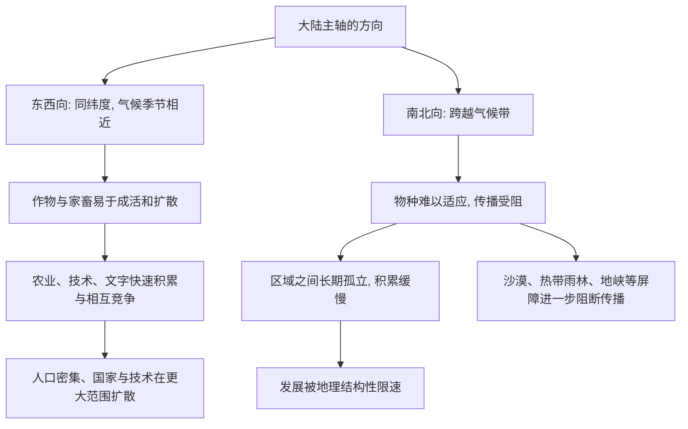

# 12｜为什么欧亚大陆是东西向的，这为什么至关重要？

> 一个几乎像冷笑话的地理事实，可能悄悄决定了文明的扩散速度。

---

## 一、先说结论

戴蒙德认为，欧亚大陆的主轴是东西向的，而非洲和美洲的主轴大致是南北向。这个区别看似无关紧要，却深刻影响了历史的节奏。

在同一条纬线上，气候、日照、季节高度相似；所以欧亚大陆的作物和家畜只要横向移动，就比较容易活下来、扩散开。而南北向的大陆要穿越不同气候带，同一种作物或牲畜很难适应，传播经常半途而废。

戴蒙德据此提出：**大陆的形状，决定了资源、技术和知识扩散的难易，从而加速或阻碍了文明的积累。** 这不是说地理决定每一个事件，而是说它改变了扩散的「摩擦系数」。

---

## 二、我们先理解一个问题

我们通常觉得，决定文明的是人：谁更聪明、谁更勤奋、谁的组织更强。

很少人会想到「大陆长什么样」。毕竟，一条山脉、一片沙漠，和几千年的技术积累之间，能有什么关系？

但请设想一个很具体的问题：假设你手里有一袋小麦种子，要把它从原产地运到一千公里外去种。如果这趟旅程是**向东或向西**，沿途的气候几乎不变，种子大概率能种活；如果是**向南或向北**，你会经过完全不同气候的地区，可能干旱、可能酷热、可能霜冻，种下去的作物很可能活不了。

同样是「一千公里」，方向不同，结果天差地别。而大陆的整体形状，恰恰决定了历史上大多数物种传播是「横向」还是「纵向」。

---

## 三、作者到底提出了什么观点？

戴蒙德把大陆轴线看作「终极因」的一部分。

他的推理是：农业的起源地是有限的，因此历史的差异，很大程度上取决于**物种扩散的效率**。

- **东西向的大陆**：同一纬度带气候、日照、季节相近，作物、家畜、技术乃至文字都能沿着相似环境横向传播，容易形成大范围的相互竞争与借鉴。
- **南北向的大陆**：要跨越气候带，物种必须重新适应，传播困难；再加上沙漠、雨林、地峡等天然屏障，很多地方长期处于相对孤立状态。

戴蒙德强调，孤立本身就是成本：**孤立的社会积累慢，连接的社会积累快。**

---

## 四、把这个观点翻译成人话

把地球想象成一栋大楼。

东西向的传播，相当于在同一层楼里搬东西：气候差不多、环境差不多，家具直接搬过去就能用。南北向的传播，相当于楼上楼下搬：每往上一层或下一层，光照、温度、湿度都变了，你搬的不是一件家具，而是一整套需要重装的东西。

作物和家畜就是这么「搬家」的。**一株植物在同一个温度带里迁移，几乎没有障碍；一旦要跨越温度带，它面对的是完全不同的环境。**

大陆的形状，本质上决定了历史上大多数「搬家」是同层搬运，还是跨层搬运。

---

## 五、为什么会这样？

注意 **G**：轴线不是一个抽象的箭头，而是和具体的屏障联系在一起的。撒哈拉沙漠、赤道雨林、美洲的巴拿马地峡，都在实际历史中扮演了「墙」的角色。

---

## 六、举一个现实生活中的例子

先看传播顺利的一面。历史记录显示，小麦、大麦等作物大致从西南亚起源后，沿着相似的气候带向东西两个方向扩散，进入欧洲、中亚、印度和中国；马匹的传播路径也大体如此。**它们能走这么远，很大程度上是因为沿途没有剧烈变化的气候带。**

再看受阻的一面。非洲的北缘是地中海气候，向南则要面对撒哈拉沙漠，再往南是赤道雨林和热带疾病高发区。一般认为，这种落差让地中海地区的作物和家畜很难直接南下。美洲的情况类似：玉米从墨西哥向北或向南扩散，都要跨越沙漠、高原或雨林，有研究显示这个过程相当缓慢；而羊驼、美洲驼这类安第斯动物的驯化，也没能传播到北美洲。

再用一个现代类比：一家连锁餐厅想把菜单复制到新城市。如果在同一气候带、口味相近的城市开店，复制成本低；一旦跨到饮食习惯完全不同的地区，同一套菜单就要大改，很多单品可能根本卖不动。**传播的难易，往往不取决于内容本身，而取决于沿途的环境是否连续。**

---

## 七、回到书中重新理解

回到戴蒙德，你会发现他关心的从来不是「谁更聪明」，而是**扩散的速度和规模**。

同样的一个发明，在一个传播摩擦很小的环境里，几十年就能传遍一大片；在摩擦很大的环境里，可能几百年都走不出一个区域。单个事件的差距似乎不大，但在几千年、上万年的尺度上，摩擦系数会累积成巨大的鸿沟。

这也是为什么他把大陆轴线放在整本书的后半段——它是解释「为什么欧亚跑得更快」的一个重要拼图。

---

## 八、这个观点背后还有什么？

第一层隐含前提：历史的关键不只是「能不能发明」，更是「能不能传播」。**能连接的地方，知识会复利；被隔离的地方，知识会反复归零。**

第二层：戴蒙德实际上把「连接性」当作文明的加速器。一个社会的优势，未必来自它自己有多少创造，而来自它能吸收多少别人的创造。

第三层：这一篇与下一篇直接相连。前面讲的农业、病菌、文字、技术，都是「能力」；而大陆轴线决定这些能力**能扩散多远、能被多少人共享**。卡哈马卡的胜负，正是这些能力在具体地点的兑现。

---

## 九、这个观点有问题吗？

有几个地方需要保持警惕。

第一，**轴线不是绝对的。** 欧亚大陆内部也有严重的南北向障碍，比如喜马拉雅山脉和内陆沙漠；非洲也存在东西向的传播带，比如撒哈拉以南的草原地带。用「东西向 / 南北向」概括整个大陆，难免粗糙。

第二，**屏障不是墙。** 骆驼商队穿越过撒哈拉，印度洋季风贸易连接了不同气候带，波利尼西亚人更是在太平洋上远航。贸易和航海能突破地理限制，戴蒙德有时低估了这种能动性。

第三，**「同纬度」不等于环境相同。** 同一纬度的土壤、降雨、海拔差异可以非常大，「沿纬度传播更容易」这个前提，有时被说得过于顺滑。

第四，**考古证据也在更新。** 一些研究显示，美洲内部的交流可能比戴蒙德描述的更活跃。把所有差异都归因于轴线，可能低估了政治、制度和偶然事件的作用。

所以更稳妥的说法是：**轴线是一个真实存在、但并非唯一的影响因素。**

---

## 十、今天再看这个观点

（以下为现代延伸，不是戴蒙德原文）

在全球化时代，「大陆轴线」似乎已经被技术和贸易碾平了。但戴蒙德式的视角依然有解释力。

今天的「同纬度」，更像是「同一种网络」。光纤、航线、港口、数据中心，都沿着既有的经济节点聚集；互联网看似无处不在，但算力、能源、人才和资本依然聚集在少数地区，形成新的「资源禀赋」。

换句话说，**地理没有消失，只是换了一种形态。** 过去决定传播效率的是气候带和沙漠，今天可能是网络连通性、能源成本和制度环境。

这也提醒我们：谈论「为什么某个地方发展得快」时，不要只看那里的人，还要看它有没有被接进那张高效率的网络。

---

## 十一、这一篇真正应该记住什么？

1. **大陆主轴方向不同。** 欧亚大致东西向，非洲和美洲大致南北向，这个差异影响了物种传播的难易。

2. **同纬度传播更容易。** 气候、日照、季节相近，作物和家畜横向移动就能活下来，扩散成本低。

3. **跨气候带传播很困难。** 沙漠、雨林、地峡等屏障，让南北向的扩散经常中断，社会因此趋于孤立。

4. **扩散效率会累积成文明差距。** 连接让知识复利，孤立让积累缓慢，差距在上千年里被放大。

5. **轴线是影响因素，不是宿命。** 贸易、航海和人的能动性都能突破地理限制，只是速度与规模不同。

---

## 十二、留一个问题

到这里，我们已经把戴蒙德的「机制清单」过了一遍：作物、牲畜、农业、病菌、文字、技术、地理。

但机制终究是抽象的。它们要真正改变世界，必须在一个具体的时间、具体的地点一起发作。

1532 年，一队不到两百人的西班牙人，在一个几百万人口的帝国腹地，生擒了它的皇帝。这看起来完全说不通。

下一篇，我们就回到那场战役：**卡哈马卡——168 个人如何击败 8 万人？**
