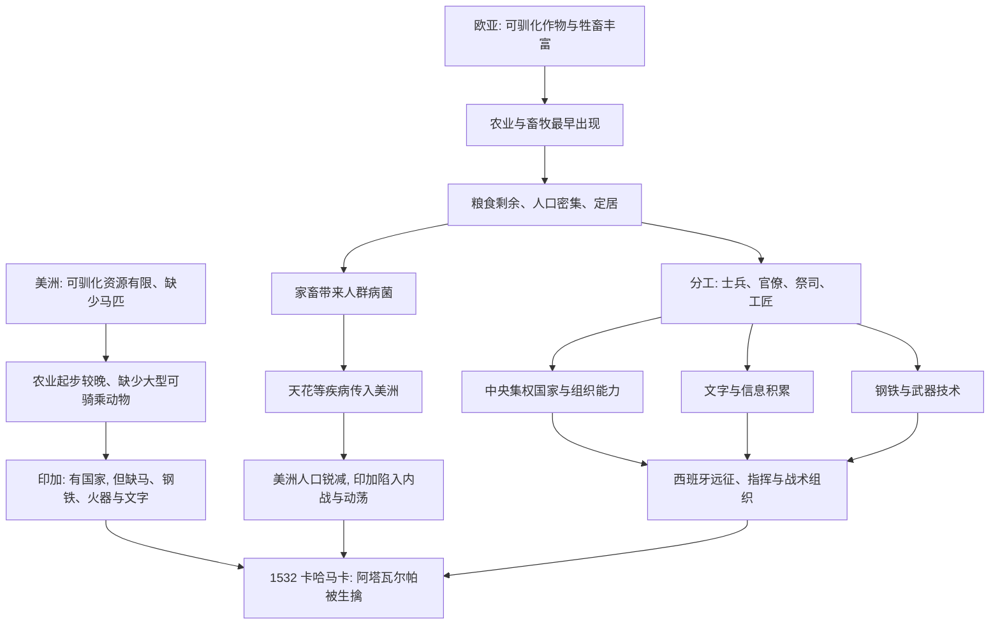

# 13｜卡哈马卡：168 个人如何击败 8 万人？

> 全书所有论证的一场实战演示：为什么一场战役的胜负，早在几百年前就已经注定。

---

## 一、先说结论

戴蒙德认为，1532 年发生在卡哈马卡的这一幕，是整本书论证的「浓缩演示」。

西班牙人带去的，不只是勇气，而是一整套农业社会长期积累的成果：钢铁刀剑与盔甲、马匹、火器、由文字保存下来的情报与远征经验，以及中央集权国家支持的指挥体系。而印加人只拥有其中的一部分——他们有一个庞大的帝国，却几乎没有马、钢铁、火器和文字。

所以，戴蒙德的结论是：**这场战役的胜负，早在双方相遇之前就已经被决定了。** 卡哈马卡不是原因，而是一个长期积累的结果。至于「168 人对 8 万人」这个说法本身是否准确，后面我们会专门讨论。

---

## 二、我们先理解一个问题

1532 年 11 月，一支西班牙远征队深入南美，抵达印加帝国的城市卡哈马卡。领队是弗朗西斯科·皮萨罗，历史记录显示，他身边的人数据说只有大约一百多名。

他们面对的，是一个刚刚经历内战、但依然庞大而强盛的帝国，以及它的皇帝阿塔瓦尔帕。

按常识，这几乎是不可能完成的任务：人数悬殊、地形陌生、补给遥远、语言不通。可结果是，西班牙人在很短的时间内就生擒了皇帝本人。此后，这个庞大帝国的指挥系统迅速瓦解。

问题就在眼前：**凭什么？**

---

## 三、作者到底提出了什么观点？

戴蒙德把这个案例当作「近因的集中体现」，也就是前面讲过的因果链，在一个具体场景里同时兑现。

他列出西班牙人手中握有的几样东西：

| 西班牙人拥有 | 作用 |
|---|---|
| 钢铁武器与盔甲 | 在近距离搏斗中形成巨大的攻防优势 |
| 马匹 | 提供机动性，也造成强烈的心理威慑 |
| 火器 | 实战杀伤有限，但巨响与火光带来强烈震慑 |
| 文字与记录 | 通过书面情报和前人远征经验，了解美洲并制定计划 |
| 国家与组织 | 中央集权支持的远征、明确的指挥与分工 |
| 病菌（背景） | 天花等疾病此前已传入美洲，造成大量死亡，也牵动了印加政局 |

而印加这一边：没有马匹，没有钢铁武器，没有火器，没有文字（他们用结绳来记录），却有一个高度集权的帝国结构。

戴蒙德特别点出后者的双面性：**集权既是印加的力量，也是它的死穴。** 一旦皇帝被擒，整个指挥系统就失去了大脑。

---

## 四、把这个观点翻译成人话

把这件事想得更直白一点。

两个人发生冲突。一个人带着全套专业装备、有后勤、有情报、有队友配合；另一个人只有一双手和一身勇气，甚至不知道对方是从哪来的。

结果几乎不需要打，就能猜出来。

关键在于，那个人的装备并不是当天才有的——它来自长期的积累：有人冶炼金属、有人养马、有人记录信息、有人组织军队。**卡哈马卡那一天的悬殊，是两套「准备系统」之间几十代人的差距。**

---

## 五、为什么会这样？

把前面各篇的因果链串起来，卡哈马卡就变得可以理解了：

这张图要说明的只有一件事：**卡哈马卡不是起点，而是终点。** 所有的箭头，都指向几百年前那个关于作物和牲畜的起点。

---

## 六、举一个现实生活中的例子

先看一个体育的类比。

一支队伍带着完整的教练组、录像分析、替补席、数据团队和充足的装备；对手只有几名天赋出众的球员，没有替补、没有分析、也没有第二种打法。

比赛还没开始，胜负的概率就已经拉开了。输的一方未必不勇敢，甚至未必不聪明——它缺的是**系统**。

再看一个商业场景：一家公司带着资本、数据、成熟的供应链和组织能力，去收购另一家规模不小、但信息闭塞、内部刚刚经历过权力斗争的公司。被收购的一方并不是「不行」，而是在相遇的那一刻，缺少对方所拥有的整套工具。

卡哈马卡的同构之处在于：**决定胜负的不是那天谁更勇武，而是此前谁积累得更完整。**

---

## 七、回到书中重新理解

回到戴蒙德，你会发现他刻意不做的一件事：把功劳归给皮萨罗的个人天才。

在他笔下，皮萨罗的胆识确实重要，但真正惊人的，是那套被他随身携带的「文明组合」——钢、马、火器、文字、组织。这些东西不是西班牙独有的奇迹，而是欧亚农业社会长期积累的产物。

也就是说，**卡哈马卡是一场「不对称」的相遇：一边是几千年积累的结晶，一边是缺少其中几块关键拼图的帝国。** 戴蒙德用它来证明，宏观的环境差异，最终会在微观的战场上兑现。

---

## 八、这个观点背后还有什么？

第一层隐含前提：近因可以被终极因解释。表面的胜负，背后是长期的结构差距。

第二层：个人的作用在结构面前是有限的，但并非为零。皮萨罗的选择、时机和胆量，决定了这场「必然」以怎样的方式发生。

第三层：偶然只发生在「有准备的土壤」上。西班牙人恰好赶在印加内战之后到来，这有偶然性；但他们能利用这个时机，靠的是积累。

第四层：这也把全书的论证闭环了。从农业到病菌，从文字到技术，从地理到国家——所有的链条，最终在这一个下午同时出现。

---

## 九、这个观点有问题吗？

有几个关键争议。

第一，**「168 人对 8 万人」是戏剧化的表述。** 历史记录显示，当时广场上的印加人大多是随行人员，并未全部武装；双方实际参战人数和伤亡数字，学界有不同估计。把它说成「168 名士兵击溃 8 万正规军」，并不准确。

第二，**戴蒙德可能低估了计谋与背信的作用。** 西班牙人设下埋伏、以谈判为名诱捕皇帝，这本身就是关键。把这些策略简化为「技术优势」，会掩盖事情的另外一面。

第三，**印加内部政治的作用不容忽视。** 阿塔瓦尔帕刚刚在内战中胜出，帝国尚未稳定；他对西班牙人的判断也出现了失误。一些学者认为，这些政治因素至少与武器差异同等重要。

第四，**病菌的作用需要谨慎。** 天花等疾病确实在新大陆造成了巨大死亡，但也有研究认为，疾病的主要冲击发生在更长的时间尺度上，对卡哈马卡当天的影响不宜夸大。

第五，**用一个战役代表整个征服，容易遮蔽殖民暴力的长期性与复杂性。** 这也是第 16 篇要专门讨论的伦理争议。

---

## 十、今天再看这个观点

（以下为现代延伸，不是戴蒙德原文）

卡哈马卡式的逻辑，在现代竞争中随处可见。

商业竞争越来越像一场「相遇前的战争」：胜负往往取决于相遇之前积累了什么——供应链、数据、算力、组织能力、情报系统。很多看起来突然发生的碾压，其实是长期不对称的兑现。

但这里也有一个值得警惕的反面：如果一切都用「结构决定」来解释，人就容易忽略选择、道德与责任。戴蒙德谈的是历史的条件，而不是为征服辩护。**理解「为什么会赢」，不等于承认「赢了就应当」。**

---

## 十一、这一篇真正应该记住什么？

1. **卡哈马卡是全书论证的实战演示。** 钢铁、马匹、火器、文字、组织在同一个下午同时兑现。

2. **印加缺少其中几块关键拼图。** 没有马、钢铁、火器和文字，高度集权的结构反成弱点。

3. **胜负在相遇之前就已注定。** 决定战役的，不是当天的勇气，而是几千年积累的差距。

4. **「168 人击败 8 万人」是戏剧化说法。** 参战人数与伤亡数字存在争议，计谋与印加内政同样关键。

5. **不要把结构解释读成道德辩护。** 解释历史为什么这样发生，不代表认同征服本身。

---

## 十二、留一个问题

卡哈马卡解释了欧亚的积累如何在关键时刻兑现。

但还有一个问题没解决：非洲和美洲并不缺资源，也有人口繁盛的大帝国，为什么它们始终没能发展出与欧亚对等的技术与国家？难道真的只是「运气差」？

下一篇，我们来看地理如何给不同大陆结构性地限速：**为什么非洲和美洲的发展被地理「收割」了？**
