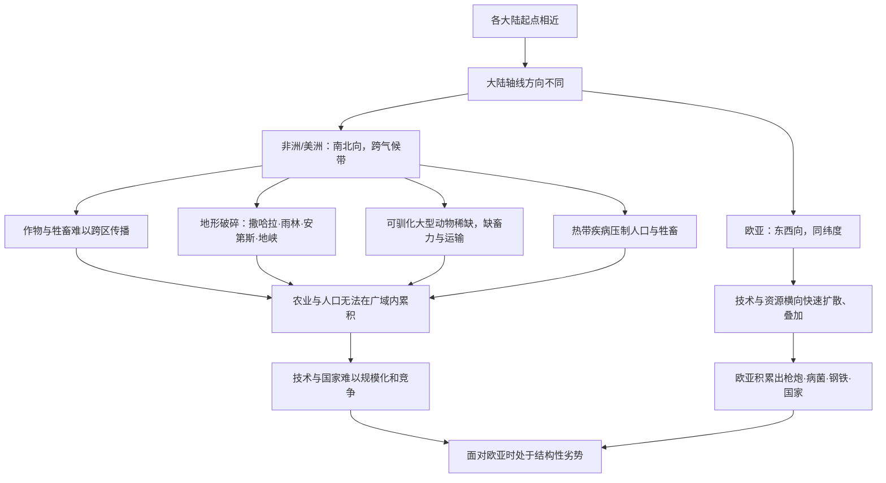

# 14｜为什么非洲和美洲的发展被地理「收割」了？

> 非洲和美洲从不缺少土地、矿产和人口，为什么它们没能发展出与欧亚对等的技术与国家？

---

## 一、先说结论

戴蒙德认为，非洲和美洲真正缺的不是资源，而是**扩散的条件**。它们有黄金、白银、肥沃的土地、庞大的帝国，也有独立发明的农业，但这些成果很难在大陆内部被反复搬运、叠加上百年。南北向的大陆轴线、破碎的地形、稀缺的可驯化大型动物、以及热带疾病，像一道道无形的墙，把同一块大陆切成了几块互不相通的小世界。

所以戴蒙德强调：这不是「落后」，而是**被地理结构性地限速**。发展不是没有发生，而是每发生一次，都要重新来一遍。

---

## 二、我们先理解一个问题

把地图摊开看，你会看到一个奇怪的对比。

撒哈拉以南的非洲，有广阔的草原、丰富的铁矿、可耕种的土地，历史上也出现过加纳、马里、桑海这样的强国。美洲更不用说：玉米、马铃薯、番茄、可可、白银，都是这里出产的，安第斯山区和中美洲还各自孕育出印加与阿兹特克这样组织度极高的帝国。

既然资源不缺、人口不缺、甚至文明也不缺，那为什么它们没有像欧亚那样，把农业、文字、冶金、国家这些成果**越攒越厚**？

最常见的答案有两种：一种是「他们的人不行」，另一种是「他们的文化不行」。戴蒙德明确拒绝这两种答案。他把问题重新表述为：

> **如果资源并不缺，那么缺的到底是什么？**

---

## 三、作者到底提出了什么观点？

戴蒙德的观点可以概括成一句话：

> **决定一个社会能走多远的，不只是它自己能产出什么，更是这些东西能不能在广阔区域内传播、叠加、竞争和积累。**

欧亚大陆像一块连通的巨大棋盘，各地的好东西可以横向流动：一种作物、一项技术、一个制度，很快就能被邻居抄走并改良。而非洲和美洲更像被切成碎片的拼图：农业发展得很早，帝国也足够强大，但各个区域之间很难低成本地互相学习。

戴蒙德列出四个具体的「扩散障碍」：

- **南北向的大陆轴线**：同样的作物和牲畜，往东西方向移动时气候相似，往南北方向移动时却要跨越完全不同的气候带。
- **破碎的地形**：撒哈拉沙漠、热带雨林、安第斯山脉、巴拿马地峡附近的热带丛林，把大陆分成互不连通的单元。
- **可驯化的大型动物稀缺**：美洲只有羊驼、骆马这类南美动物，始终没有牛、马、驴这样的通用畜力。
- **热带疾病**：疟疾、采采蝇传播的疾病，长期压制人口与牲畜。

请注意，戴蒙德说的是「限速」，不是「封印」。非洲和美洲不是停滞的，而是**每一步积累都被地理环境不断打断**。

---

## 四、把这个观点翻译成人话

想象你加盟了一个连锁品牌，总部要求你在全国开一百家店。

听起来很美好，但有个致命问题：你的门店不是沿一条东西向的高速公路排开，而是从北方的雪原一路排到南方的小岛，中间还要穿过沙漠和原始森林。

结果会怎样？

北方门店卖热汤面，南方门店卖冰粉；中央厨房的配方在两个气候带完全失效；员工培训手册换一个城市就得重写；一个店好不容易摸索出的管理经验，根本传不到隔壁区域的店。**每一家新店，都像从零开始创业。**

这就是戴蒙德说的非洲和美洲：不是没有成功的单店，而是没有一条能把成功复制的「高速公路」。

再看欧亚大陆。它的主轴线是东西向的，同一纬度带的气候、日照、季节高度相似。一种小麦从新月沃地往东传到中国、往西传到欧洲，几乎不用重新驯化；一匹马、一辆车、一种冶金技术，也能在几千公里外找到现成的使用场景。

**差距不在于谁更有创造力，而在于谁的好点子能活得久、跑得远。**

---

## 五、为什么会这样？

把戴蒙德的推理整理成链条：

这条链里最关键的一环，是 **I：积累**。

戴蒙德真正在意的，不是某个文明有没有发明轮子或文字，而是这些发明能不能被**反复继承**。历史进步更像复利，需要连续的交流和竞争。一个孤立的社会即使偶有突破，也很难把它变成下一代的起点。

---

## 六、举一个现实生活中的例子

想想连锁超市的供应链。

假设一家连锁超市要覆盖一个南北狭长的国家。总部在北方，冷库、采购、物流体系都围绕北方的气候和消费习惯搭建。当它南下开店时，会遇到一连串麻烦：南方天气湿热，生鲜损耗率完全不同；当地的口味、供应商、运输路线全部要重建；北方那套成功的采购清单几乎用不上。

结果是，这家超市在南方的每一家新店都要重新摸索，成本极高，扩张缓慢。而在另一个东西向的小国，一家超市只要沿同一条高速公路布点，供应链、仓储、员工培训几乎可以原样复制，规模迅速滚大。

**前者不是不努力，而是它的地理结构让「复制成功」这件事变得极其昂贵。**

再补一个小小的类比：一个创业团队，如果成员全在同一栋楼里，创意随手就能碰撞；如果成员分散在十二个时区、彼此语言不通，再聪明的团队，协同效率也会大打折扣。距离本身，就是一种成本。

---

## 七、回到书中重新理解

理解了「扩散」这一层，再回头看戴蒙德在书里「环游世界」的那几章，就顺了。

在非洲，他描述班图人的农业扩张：这套农业体系其实很有生命力，但一路向南时会撞上气候带的变化，还要面对采采蝇对牲畜的威胁。农业能推进，却不是无摩擦地铺满整块大陆。

在美洲，他指出一个更让现代人意外的现象：安第斯文明和中美洲文明同属一个美洲，却几乎没有互相影响。它们之间隔着热带丛林与海洋，中间没有马、没有可实用的运输畜力，也缺少持续交流的通道。两个高度发达的文明，就这样各自孤军奋战。

所以戴蒙德说，非洲和美洲的很多成就，是「**在这个地方很先进，但传不出去**」。它们不是被谁打败了，而是被地理切割成了一个个无法合流的孤岛。

**「收割」在这里是一个比喻：不是有人主动拿走了它们的机会，而是地理条件让机会难以累积。**

---

## 八、这个观点背后还有什么？

这一层背后，隐藏着一个关于「增长」的深层前提：**进步的关键不是单点突破，而是网络效应。**

戴蒙德没有明说，但他的逻辑其实在暗示：一个文明的天花板，很大程度上取决于它周围有多少邻居、邻居能否交流、交流的成本有多高。孤立的高峰，往往只是孤峰；而密集的山脉，才会连成高原。

这和前面的几篇是咬合的：

- 第 12 篇讲大陆轴线，是这里的前置条件；
- 第 07 篇讲大型动物驯化，解释了为什么美洲缺少畜力；
- 第 09 篇讲病菌，解释了为什么密集的人口既是优势也是代价。

戴蒙德把「地理」放在最底层，是因为在他看来，地形与轴线决定的不只是资源，而是**整个社会之间互相学习的机会结构**。

---

## 九、这个观点有问题吗？

这个论点有说服力，但也有明显的争议。

第一，**「孤立」可能被夸大了。** 一些考古与历史研究显示，美洲内部其实存在长距离贸易网络，黑曜石、可可、羽毛等物品在很远的区域间流动；非洲也长期参与印度洋贸易，并非与世隔绝。把大陆说成彼此割裂的板块，可能简化了真实的连接。

第二，**把技术差距归因地理，可能低估了政治与制度选择。** 有些社会面对新技术时，是统治者主动拒绝或限制，而非地理不允许。这些选择同样是原因。

第三，**戴蒙德倾向把「大陆」当成分析单位**，但同一块大陆内部的差异其实极大。用一个宏观叙事覆盖所有区域，难免遗漏细节。

第四，也是最根本的：这是不是一种环境决定论？这个争议太大，我们留到第 16 篇专门讨论。

需要注意，这些批评并不必然推翻戴蒙德，而是在提醒：**地理是重要的背景，但未必是唯一的解释。**

---

## 十、今天再看这个观点

（以下为现代延伸，不是戴蒙德原文）

戴蒙德的「扩散」逻辑，在数字时代依然好用，只是墙的形状变了。

互联网常被说成抹平了地理，但它其实复制了戴蒙德的结构：信息在同语言、同平台、同生态内传播得极快，跨过语言、制度、数据边界的成本却高得惊人。语言壁垒、平台割裂、数据主权，就是新的「巴拿马地峡」。

再看 AI。算力、能源、数据、顶尖人才在少数几个节点高度聚集，形成新的「资源禀赋」；而大量地区连稳定电力和网络都难以保证，就像农业社会缺少畜力一样，被卡在起跑线上。所谓「数字孤岛」，正是孤立效应换了张脸。

戴蒙德式的追问因此仍然有效：**不要问「他们为什么不行」，而要问「他们的成果能不能传得出去、叠得起来」。**

---

## 十一、这一篇真正应该记住什么？

1. **非洲和美洲缺的不是资源，而是扩散条件。** 它们有农业、有帝国、有矿产，却难以在大陆内部持续积累。

2. **南北向轴线是隐形的墙。** 跨气候带传播作物与牲畜的成本，被戴蒙德视为关键的地理限速器。

3. **地形破碎与畜力稀缺相互叠加。** 撒哈拉、雨林、安第斯、地峡，加上缺少马牛，让区域之间难以连通。

4. **停滞是错觉，反复重启才是真相。** 发展一直在发生，只是每次都要从头再来，无法复利式累积。

5. **「落后」是结果，不是本质。** 用地理结构解释差异，恰恰是为了避免给人或民族贴标签。

---

## 十二、留一个问题

地理能把非洲和美洲解释成「被切割的拼图」，那为什么同样幅员辽阔，中国却长期走向统一，而欧洲始终是多国并立？

更奇怪的是：戴蒙德居然认为，**分裂的欧洲反而因为竞争而跑得更快**。

这个反直觉的判断，是全书最有影响力、也最受争议的论断。下一篇，我们就来拆它。
