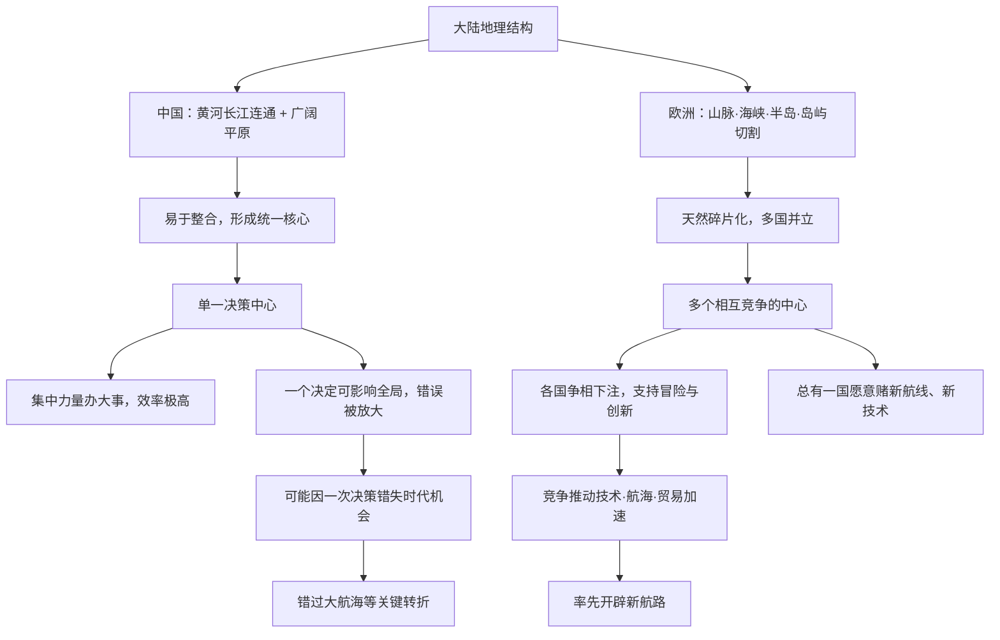

# 15｜为什么中国会走向统一，而欧洲始终分裂？

> 同样幅员辽阔、同样有几千年历史，为什么一个长期是统一帝国，一个始终是多国竞争？

---

## 一、先说结论

戴蒙德的答案是：**两块大陆的地理「骨架」不同。**

中国的核心区在黄河与长江流域，两条大河之间有大片平坦、可耕、易连通的平原，农业核心连成一体，很容易被一个政权整合。欧洲则被阿尔卑斯山、比利牛斯山、英吉利海峡、地中海上的岛屿和半岛切成许多天然单元，任何帝国都很难长期吞下全部。

由此，戴蒙德提出一个反直觉的推论：**欧洲的分裂制造了多国竞争，竞争逼着各国支持冒险与创新；中国的统一让一个决定就能覆盖全国，一旦这个决定错了，整个文明可能一起错过一个时代。** 这是戴蒙德的观点，也是全书争议最大的论断之一。

---

## 二、我们先理解一个问题

先看一组对比。

中国和欧洲的陆地面积大致处于同一量级，人口规模也都可以用「亿」来计算。但翻看历史地图会发现一个稳定的差异：中国大部分时间趋向统一，即便分裂也总会重新走向大一统；欧洲则长期是几十个甚至上百个政权并立，语言、货币、法律各不相同。

这个差异，和一个看似无关的问题连在一起：**为什么是欧洲人，而不是中国人，率先绕过了非洲、抵达了美洲？**

明代的郑和，比哥伦布早几十年就带着庞大的船队出海远航。可最后开辟新航路、改变世界格局的，却是欧洲。戴蒙德认为，统一与分裂的差别，正是理解这件事的一把钥匙。

最常见的解释是「民族性」或「文化传统」。戴蒙德同样不接受，他把目光转向地理结构。

---

## 三、作者到底提出了什么观点？

戴蒙德的核心判断是：

> **大陆的地理结构，塑造了政治结构的长期形态；而政治结构的形态，又决定了创新与冒险会不会被鼓励。**

具体来说，中国有两个条件。第一，黄河和长江流域之间没有难以逾越的山脉阻隔，平原地带广阔，交通与农业核心连成一片，整合的成本相对低。第二，一旦某个政权掌握了这个核心，它就能顺着平地和河流把影响力铺开——秦统一之后，这种「一个中心」的模式不断被复制和强化。

欧洲的条件几乎相反：山脉横亘、半岛众多、海峡密布、岛屿散布。地理把大陆切成许多独立的单元，谁也吃不掉谁，于是形成了长期的多国并立。

戴蒙德从这里推出一个更刺激的结论：

- **分裂 → 多国竞争 → 各国争相支持新技术、新航线、新思想 → 创新加速。**
- **统一 → 单一决策中心 → 决策效率极高，但错误也会被放大到全国 → 可能集体错过机会。**

在他看来，欧洲的混乱反而是一种「多样性优势」，中国的秩序反而潜藏着「单一决策风险」。

---

## 四、把这个观点翻译成人话

想象两家科技公司。

A 公司只有一个总部、一条产品线、一个战略方向。它的好处是惊人的高效：一旦总部决定 All in 某个方向，全公司立刻统一行动，资源集中，执行到位，没有内耗。

B 公司有十几个独立的事业部，各自有预算、有目标、还要互相抢资源。它的问题很明显：重复投入、彼此掣肘、内部撕扯，效率远不如 A。

但把时间拉长，事情会反转。

A 公司如果总部判断错了，整个公司会一起撞墙，因为没人能拉一把、也没人能走另一条路。而 B 公司里，总有某个事业部悄悄踩对了方向，活了下来，还把经验复制给其他部门。

**A 的优势是「集中」，B 的优势是「冗余」。**

戴蒙德想说的是：在一个充满不确定性的世界里，**多个独立的赌注，本身就是一种风险对冲。** 统一与分裂，也是这两种命运。

---

## 五、为什么会这样？

把这条逻辑画出来：

这条链的关键，是 **D 层：决策结构的集中度。** 戴蒙德认为，地理不只决定了谁拥有资源，还决定了**一个社会能否拥有多个彼此独立的「下注者」**。

---

## 六、举一个现实生活中的例子

想想打车软件补贴大战的那些年。

市场上同时有七八家公司在烧钱竞争。为了抢用户，它们拼命补贴、优化派单算法、改进地图导航、缩短等待时间，甚至推出各种闻所未闻的新功能。今天看起来很成熟的整套体验，其实是被「多个对手同时下注」硬生生逼出来的。

如果这个市场从头到尾只有一家公司呢？它当然会更高效、更省成本。但它也会缺少一个推动自己变好的力量——用户只能接受它给什么，就用什么。

这不是说垄断一定不创新，而是说：**竞争环境会让「试错」和「冒险」变成常态，而单一决策者则更倾向于求稳。**

再想一想职业体育。一个只有一支球队的联赛，水平大概率提升缓慢；而当多个俱乐部彼此竞争、争夺冠军和球员时，整个联赛的水平才会被持续拉高。戴蒙德看欧洲，看到的大概就是这样一个「多国联赛」。

---

## 七、回到书中重新理解

现在回到那个对比鲜明的历史场景。

**1400 年代，郑和率领庞大的船队多次下西洋**，航程之远、规模之大，在当时世界范围内都是罕见的。但后来，明朝朝廷逐渐停止了这类远航。戴蒙德引用这段历史时强调的是：在统一的中国，**一个中央决策就足以终止一项国家级的远洋事业**，无论它曾经多么辉煌。

而在欧洲，哥伦布为了向西航行寻找通往亚洲的路线，先后向多个国家的王室寻求资助。他在葡萄牙碰壁，在其他地方也被拒绝，最终才获得西班牙王室的支持。

戴蒙德的解读是：**分裂的欧洲有很多个「董事会」，只要有一个愿意押注，这个疯狂的提案就还有机会。** 而统一的中国只有一个董事会，一旦否决，就再也没有第二次机会。

必须说明，这是戴蒙德的观点。历史学家对「中国错过大航海」的原因有非常不同的解释，我们马上会谈到。

---

## 八、这个观点背后还有什么？

这个观点背后，藏着一个更深的前提：**创新需要冗余，需要允许「浪费」，需要多个互不协调的冒险者。**

统一降低了内耗，却也降低了多样性；分裂提高了多样性，却要付出混乱、战争与重复建设的代价。戴蒙德暗示的，其实是一个关于「多样性价值」的判断：在一个看不清未来的世界里，**多元本身就是一种保险**。

这和第 11 篇讲的「技术扩散与竞争压力」是同一个逻辑的延伸——技术不是被需求逼出来的，而是在多个社会竞相采用、彼此较劲的过程中被筛选出来的。欧洲的分裂，恰好制造了这种持续的压力。

而戴蒙德没有明说、但几乎呼之欲出的一层是：**他其实在为「政治多元」做一种地理学的背书。** 这一点，正是争议的引信。

---

## 九、这个观点有问题吗？

这一段必须小心，因为戴蒙德在这里的论断，是全书被批评最多的地方之一。

**争议一：把复杂历史压成了二元对立。** 中国并非始终统一，分裂时期同样漫长；欧洲也并非从未尝试统一，只是没有成功。用「统一 vs 分裂」两个标签概括几千年，难免粗暴。

**争议二：分裂的代价被淡化了。** 欧洲的多国竞争同时意味着连绵的战争、宗教冲突和大规模生命损失。把这些代价折算进来，「分裂促进进步」这个结论就不再那么轻巧。

**争议三：大航海的原因非常复杂。** 有研究强调奥斯曼帝国对传统商路的阻隔、宗教与商业资本的推动、航海技术与造船的积累、以及葡萄牙与西班牙的国家竞争。把它主要归因于「政治结构」，可能过度简化。

**争议四：中国的海禁有自身的内部逻辑。** 明代停止远航，牵涉财政、边防、政治斗争等多重因素。有学者认为这是具体的政策与制度选择，而不是地理必然。

所以正确的说法是：**这是戴蒙德提出的一种有启发性、但高度争议的解释，而不是定论。** 学界普遍承认地理与政治结构有影响，但很少有人认为它可以单独解释一切。

---

## 十、今天再看这个观点

（以下为现代延伸，不是戴蒙德原文）

「单一中心 vs 多中心竞争」的张力，在今天处处可见。

以 AI 为例：目前多个国家、多家公司同时投入，开源与闭源并存，彼此竞争又互相借鉴。很难说这种「混乱」是浪费——它更像是戴蒙德所说的欧洲式冗余：总有一个方向会意外跑通。反过来看，如果某个领域只剩下一个玩家，短期效率也许更高，但整个生态的试错速度可能下降。

再看创业生态。一个城市如果只有一家巨型公司，人才、资本、经验都向它集中；而当一座城市有成百上千家小公司彼此竞争，新的模式才有更大的概率被撞出来。

当然，这是对戴蒙德思路的现代借用，不是他的原话。他谈的是大陆地理与帝国政治，我们谈的是平台、企业与创新生态——**逻辑相似，尺度不同。**

---

## 十一、这一篇真正应该记住什么？

1. **地理塑造政治结构。** 中国的连通核心利于整合，欧洲的破碎地形天然产生多个中心。

2. **戴蒙德的推论是反直觉的：分裂促进竞争与创新，统一可能放大单次决策的风险。** 这是他的观点，不是历史定论。

3. **郑和与哥伦布是这组对比的经典案例。** 一个决定可以终止一项事业，而多个决策者意味着总有翻盘机会。

4. **统一与分裂各有代价，不存在纯粹的优劣。** 秩序换掉了多样性，竞争也伴随着冲突与破坏。

5. **这段论断争议极大。** 大航海、海禁背后的原因远比「政治结构」复杂，不能简化为地理必然。

---

## 十二、留一个问题

到这里，戴蒙德的全套逻辑已经基本讲完了：从可驯化的作物与牲畜，到农业、病菌、文字、技术与国家，再到大陆轴线与政治结构。它宏大、自洽，而且非常有说服力。

但正因为它解释得太多，一个更尖锐的问题也就浮了出来：

**把历史差异全部归因于地理，会不会是在为殖民、掠夺与压迫开脱？**

如果一个民族今天的处境主要是地理造成的，那么当年的征服者，还需要为他们的行为负责吗？

下一篇，我们就来正面讨论这本书最大的争议：**「地理决定论」到底是不是一种新的种族主义？**
