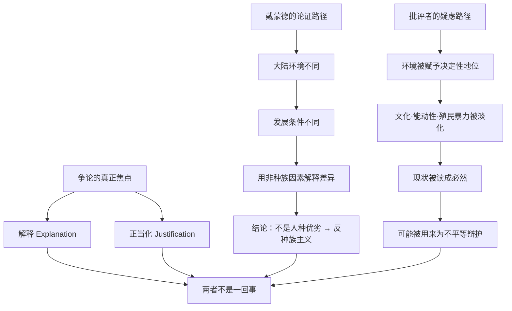

# 16｜「地理决定论」是一种新的种族主义吗？

> 把历史差异归因于环境，会不会是在为殖民与压迫开脱？

---

## 一、先说结论

这是《枪炮、病菌与钢铁》全书最大的争议。

戴蒙德自己的立场很明确：他要做的恰恰相反——**用环境解释取代种族解释。** 在他之前，解释「为什么欧洲赢」的主流答案往往是人种优劣；戴蒙德把「人的生物性差异」从解释中彻底拿掉，因此他认为自己的理论本质上是反种族主义的。

但批评者（例如詹姆斯·布劳特在《殖民者的世界模式》中的批评）指出：这套框架过度强调环境，抹去了原住民的主体性、殖民暴力和历史的偶然性，甚至可能暗示「谁赢了，谁就该赢」。争议的核心其实不是事实，而是**「解释责任」**——找出一个结果的原因，和替这个结果辩护，是两回事。

本篇不会给你一个「谁对谁错」的结论，因为这场争论本身更值得看清。

---

## 二、我们先理解一个问题

设想一个场景。

数百年间，欧洲人以征服、屠杀、奴役、掠夺的方式席卷了大半个世界。今天你告诉他们的后代：这一切主要是地理环境造成的，欧亚大陆恰好有可驯化的作物和牲畜、有利的轴线，所以它赢了。

那么问题来了：**如果一切都「注定如此」，当年那些施暴者，还需要为他们的行为负责吗？**

这正是戴蒙德必须面对的伦理拷问。一个能解释一切的理论，同时也可能变成一个能免责一切的理论——这正是许多批评者最警惕的地方。

---

## 三、作者到底提出了什么观点？

戴蒙德在书中反复强调他的意图：

> **各民族历史的差异，来源于大陆环境的差异，而不是民族自身的生物性差异。**

他专门反驳了「人种智力决定历史」的说法，认为各大陆人群在认知能力上并无本质差别；差异来自他们所继承的初始条件。他写这本书的动机之一，就是正面挑战「人种决定论」。

在戴蒙德看来，他的理论是一件武器，指向的是种族主义：**如果差异来自环境而非天赋，那么「某民族天生低劣」的说法就站不住脚了。**

问题在于，批评者并不关心他的**意图**，而在意他的论述在**实际效果**上带来了什么。

---

## 四、把这个观点翻译成人话

一个医生告诉你：某个地区某种疾病高发，主要原因是当地的水质、饮食结构和卫生条件。

这话是什么意思？

它**不等于**说「病人活该得病」；也**不等于**说「医生不该尽力救治」；更**不等于**说「这些人的身体天生就差」。找出成因，恰恰是为了预防、干预和改变。

同样的道理：有人分析犯罪率背后的社会成因——贫困、失业、教育机会不足——这**不等于**替犯罪开脱，更不等于说罪犯不该受惩罚。理解原因和承担责任，是两条不同的轨道。

戴蒙德想说的就是这个：**解释地理原因，是为了破除「他们天生不行」的偏见，而不是为了原谅暴力。**

但批评者的追问也很合理：如果这套解释被反复用来「说明现状的合理性」，那么无论作者本意如何，它都可能产生一种副作用——**让不平等看起来像是自然的、不可避免的。**

---

## 五、为什么会这样？

争议的结构，可以画成两条并行的链：

两条链的起点相同——都是「环境差异」——但走向了完全相反的评价。争议的真正焦点，落在最下面那个方框里：**解释一件事的原因，不等于为它辩护。**

---

## 六、举一个现实生活中的例子

想想一支长期成绩不佳的球队。

如果有人说：这支球队落后，是因为青训体系薄弱、场地设施不足、资金投入有限、周边没有高水平对手可打——这是在分析**结构性原因**。

这显然不是在说「这个地方的人天生不会踢球」，也不是在说「球员不该努力」。恰恰相反，找出这些原因，正是为了改善青训、投入资源、创造竞争环境。

但换个角度：如果这番话被俱乐部管理层拿去说「我们成绩差是没办法的，先天条件如此」，然后什么都不做，那它就变成了一种**推卸责任的借口**。

**同一套解释，可以指向改变，也可以指向放弃。** 戴蒙德的理论正处在这样一个位置上：它的方向由使用者决定，而不是由理论本身决定。

这就是为什么这场争论很难有终点。

---

## 七、回到书中重新理解

现在再回看戴蒙德在书末的态度，会更清楚。

他明确写道：他的目标是解释各大陆历史的差异，而不是评判哪个民族更优秀；他反复强调，人类在生物性上没有本质高下之分，差异来自环境条件的积累。从这个角度说，把「地理决定论」直接等同于种族主义，至少在**作者的主观意图**上是不准确的。

但「意图」不等于「效果」。一个理论一旦进入公共讨论，就会脱离作者的控制。批评者担心的是：当人们只记住「地理决定一切」这个简化版本时，殖民暴力、被征服者的反抗、历史中的偶然转折，都会被悄悄抹平。

戴蒙德本人对殖民暴力的严重性是承认的——他没有说征服是善的，只说它是被条件促成的。这个区分很重要，但在传播中极易丢失。

---

## 八、这个观点背后还有什么？

这场争论背后，是历史哲学里的一个老问题：**结构与能动性（agency）的关系。**

戴蒙德站在「结构」这一边：长期的历史走向由地理条件塑造，个人和群体的选择只是在一个很小的空间里摆动。批评者站在「能动性」这一边：人对自己的历史有选择权，压迫者做了选择，被压迫者也在反抗，这些不能被降格成一个地理常数。

还有一个隐含前提值得注意：戴蒙德相信历史可以被「科学地」解释，存在可识别的地理规律。而批评者更倾向于认为，历史的意义恰恰存在于那些无法被规律化的部分——文化、信念、决断与偶然。

于是问题变成：

> **我们是要一个能解释一切、但会抹平个体与责任的宏大理论，还是要一个尊重复杂性、但难以给出简洁答案的历史叙事？**

这道题，没有标准答案。

---

## 九、这个观点有问题吗？

我们不做裁决，只把双方的主要理由摆出来。

**批评者一方（如詹姆斯·布劳特等）认为：**

- 戴蒙德的框架是「欧洲中心」的环境决定论，把不同大陆当成同质板块，忽略了内部的巨大差异；
- 它把殖民暴力、文化传统和原住民的主体性放在次要位置，甚至近乎消失；
- 它暗示现状有其自然必然性，可能被用来为不平等辩护。

**支持者一方则认为：**

- 戴蒙德提供了明确的非种族解释，直接反驳了「人种优劣」论；
- 他没有否认殖民的暴力，只是追问「为什么权力对比会如此悬殊」；
- 地理确实是重要变量，承认它并不等于说它是唯一变量。

一个相对平衡的看法是：**双方常常在不同层面上说话。** 批评者问的是「谁该为差异与伤害负责」，戴蒙德回答的是「是什么条件让这种差异成为可能」。前者关乎道德与政治，后者关乎因果结构——它们并不必然矛盾，只是经常被混在一起吵。

而学界的中间立场往往指向：地理是重要的背景条件，但制度、政治选择与偶然性同样关键。这恰恰是我们下一篇要展开的。

---

## 十、今天再看这个观点

（以下为现代延伸，不是戴蒙德原文）

这场争论在今天的翻版，随处可见。

当有人用「环境」「结构」「基因」去解释不同群体的贫富差距、教育差距、健康差距时，同样的陷阱就会出现：**把解释变成标签，把成因变成宿命。**

在 AI 与大数据时代，这个风险甚至更高。算法用历史数据预测个体行为，如果历史数据本身就带着结构性偏见，那么「用数据解释差异」很容易变成「用数据固化差异」。戴蒙德这场三十年前的争论，今天读来一点都不过时。

一条可以随身携带的原则是：

> **解释成因，是为了改变它；一旦解释被用来证明现状无需改变，它就已经越界了。**

戴蒙德是否越界，不同的人会给出不同答案。但这个边界该怎么划，值得每个人自己想清楚。

---

## 十一、这一篇真正应该记住什么？

1. **这是全书最大的争议。** 批评者认为它抹去主体性与殖民暴力，支持者认为它是反种族主义的。

2. **戴蒙德的主观意图是反种族主义。** 他明确用环境解释取代人种解释，这一点他在书中反复声明。

3. **意图不等于效果。** 理论一旦被简化传播，就可能被用来为不平等辩护，这不受作者控制。

4. **争议的核心是「解释责任」。** 解释一件事的原因，和替它辩护、替它开脱，是两条不同的轨道。

5. **结构与能动性之间没有廉价答案。** 地理重要，但殖民暴力、文化选择与偶然性，同样属于历史。

---

## 十二、留一个问题

如果地理不是唯一的变量，那么文化、制度和「大人物」到底还剩下多少位置？

同样的地理条件，为什么有的国家走向繁荣、有的长期停滞？为什么戴蒙德在解释「中国为什么没有产生工业革命」时，会显得用力过猛、忽略了煤、殖民地、战争和偶然事件？

下一篇，我们把镜头拉近：**在环境影响之外，制度、文化与偶然性，究竟有多重？**
