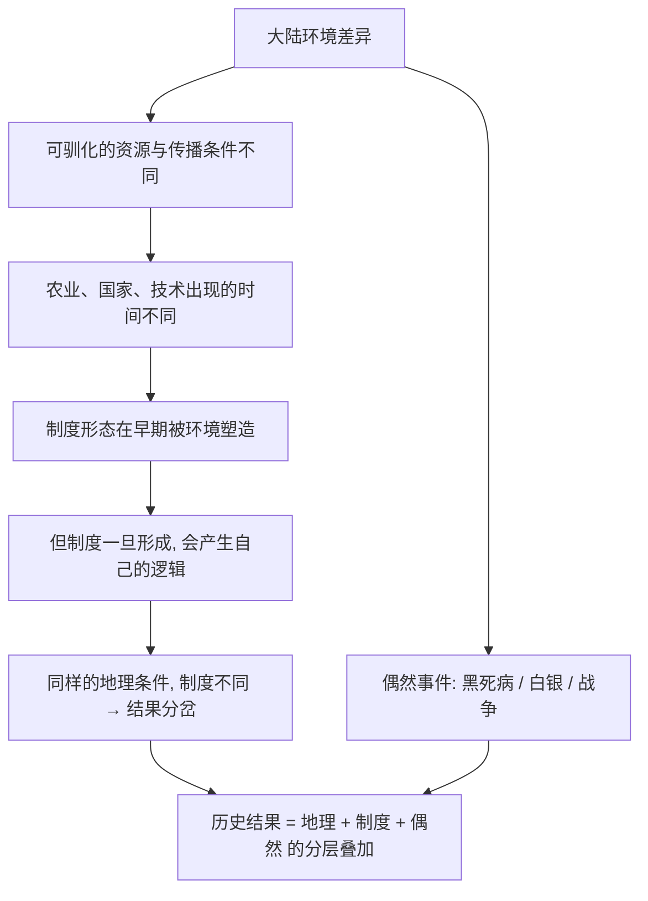

# 17｜环境影响之外：文化、制度与偶然性到底有多重？

> 如果地理是终极因，那制度、文化和「大人物」还剩下多少解释的空间？

---

## 一、先说结论

戴蒙德从来没有说「地理是唯一原因」。他说的是：地理是最深的那一层原因，它决定了各个社会**手里有哪些选项**。但选项之内，人、制度、政治选择、以及纯粹的运气，仍然在起作用。

后来的研究者把这一点推得更远。阿西莫格鲁与罗宾逊认为，在同样地理条件下，**制度**（包容性的还是攫取性的）可以让国家走向完全不同的命运；彭慕兰认为，欧洲率先工业化，煤与殖民地的作用被低估了；也有历史学家强调黑死病、美洲白银这类偶然事件。

所以更准确的说法不是「地理对、制度错」，而是：**地理是底层的约束，制度是中间层的选择，偶然性是表层的事件——三者要分层来解释。**

---

## 二、我们先理解一个问题

假设有两座城市，只隔着一条线。

同样纬度、同样气候、同样的土壤和降雨，甚至连居民的祖先都差不多。几十年后，线的这一边人均收入是另一边的好几倍，孩子上学的时间更长，商店里的商品更丰富。

这时候你要怎么解释？

如果只用地理解释，你会卡住——因为两边的地理几乎一模一样。这说明，在环境这个变量被「控制住」之后，还有别的东西在起作用。

戴蒙德的整本书，回答的是「为什么不同大陆会分岔」。但这一篇要问的是一个更尖锐的问题：**当地理不再能解释差异时，我们还剩下什么解释工具？**

---

## 三、作者到底提出了什么观点？

先说清楚：**戴蒙德本人其实给非地理因素留了位置。**

他在讨论中国为什么没有率先工业化时，确实把大部分原因归给地理——统一的地理核心让单一政权能一纸命令终止远洋航行。但他也承认，一个决定、一个统治者、一次偶然的判断，可能改变历史走向。

不过在整本书的框架里，文化、制度和偶然性，基本被放在**地理的下游**：地理塑造了社会结构，社会结构再塑造了人的选择。换句话说，戴蒙德不是否认制度的作用，而是认为制度本身很大程度上也是环境的产物。

一些学者的看法不同：制度不是环境的傀儡。同样的环境，不同的政治安排，会导向不同的长期结果。

---

## 四、把这个观点翻译成人话

把历史想成一场牌局。

地理发给你什么牌，你没法选。但**怎么打这副牌，是可以选的。**

- 两个人拿到同样的牌，一个谨慎布局，一个胡乱出牌，结局可以天差地别。
- 牌是地理，打法是制度和文化。

戴蒙德的解释重心在「发牌」——他关心的是一万年的尺度上，为什么有些玩家手里的牌天生更好。

而制度论者的重心在「打牌」——他们认为，就算牌一样，怎么打才是关键。那种「一墙之隔、命运迥异」的现象，正是在说：发牌相同，打法不同，结果就不同。

两者其实不冲突。**它们回答的是不同层次的问题。** 只是当你把「发牌」说成唯一重要的东西时，就把「打法」这一层给抹掉了。

---

## 五、为什么会这样？

把「为什么会有争议」这条推理链拆开，大概是这样的：

关键在 **D 到 E 这一步**。

制度最初可能是环境的产物：地理碎片化的地方容易形成竞争性的小国，大平原容易形成统一帝国。但制度一旦定型，它就开始**按自己的逻辑运行**——既得利益、路径依赖、权力结构，都会让它脱离最初的环境原因。

这就是争议的根源：

- 戴蒙德看到的是 B、C——环境决定了**分岔的起点**。
- 制度论者看到的是 E、F——制度决定了**分岔之后的走向**。
- 而偶然性提醒我们：G 这一层，同样会改变结局。

---

## 六、举一个现实生活中的例子

历史上就有一个近乎「自然实验」的案例：**同一条人为划出的边界，把地理条件几乎相同的两块地方分开**，几十年后，两边的生活水平出现巨大差距。

最常被提到的例子，是朝鲜半岛被一条军事分界线一分为二；研究者也常拿美国与墨西哥边境上相邻的两座城镇作对比。这些地方的气候、地形、物种几乎一样，唯一的差别是**边界线两侧实行了完全不同的制度与治理方式**。

再看一个日常版本。

同一个城区里的两所学校，生源、家庭背景、学区范围都差不多。但 A 校有一套稳定的规则：老师有明确激励，家长有参与渠道，资源分配透明；B 校管理混乱，资源被少数人把持，老师频繁流失。几年后，两校的升学表现天差地别。

如果你只看「这一片城区」，你会以为差异是「学生不行」。但真正不同的，是**制度**。

这两个例子都在说同一件事：**当地理被固定住，制度的重要性就浮出水面。**

---

## 七、回到书中重新理解

现在我们回头看戴蒙德关于中国的那段论述（第 15 篇详细讲过），就能看出争议在哪。

戴蒙德认为，中国的地理核心统一，所以容易被单一政权控制；欧洲破碎，所以长期竞争，竞争带来创新，创新带来大航海与工业化。这个推论有一种漂亮的反直觉感。

但一些历史学家指出，这里有一个逻辑陷阱：**倒推。**

我们已经知道欧洲赢了、中国没赢，然后回过头去，在欧洲的特征里挑出「分裂」，在中国的特征里挑出「统一」，把它们解释成胜负的原因。可是分裂未必总是好事——分裂也意味着战争、内耗和被各个击破；统一未必总是坏事——统一也意味着大市场、统一度量衡和大型工程。

换句话说，**同样的特征，在解释胜负时，可能被任意地贴上「好」或「坏」的标签。** 这就是「结果倒推原因」的典型风险，也是戴蒙德这一论断最受质疑的地方。

---

## 八、这个观点背后还有什么？

这里藏着两个容易被忽略的隐含前提。

第一，**「环境可以被识别为初始条件」。** 这种分层解释假设我们能干净地把「环境」和「制度」切开。但现实中，制度往往就是环境长期作用的产物，两者互相纠缠，很难真正分离。

第二，**解释的尺度问题。** 在几千年、几万年的尺度上，环境是主导变量；在几十年、几百年的尺度上，制度和偶然性的权重会大幅上升。戴蒙德讲的是大尺度，而批评者往往盯着中短尺度。**很多争论，其实是尺度之争，而不是事实之争。**

理解这一点很重要：它让我们不至于把「地理解释」和「制度解释」当成二选一的站队，而看成**分层叠加的因果结构**。

---

## 九、这个观点有问题吗？

争议大致集中在三处。

**第一，地理 vs 制度。** 一派学者（如戴蒙德、以及强调地理与气候长期作用的萨克斯式思路）强调环境的力量；另一派学者（如阿西莫格鲁与罗宾逊）在《国家为什么会失败》中主张，制度安排——包容性制度还是攫取性制度——才是决定国家命运的关键变量。关于这一问题，学界存在不同解释，而且两派各有实证支持。

**第二，「大分流」的时间与原因。** 彭慕兰在《大分流》中提出：在 18 世纪以前，中国最发达的地区与欧洲最发达的地区差距并没有想象中那么大；欧洲的突破，很大程度上依赖了**煤的便利开采**和**美洲殖民地提供的资源与市场**。如果这个判断成立，那么「欧洲文明天然领先」的叙事就被削弱了，而戴蒙德对煤和殖民地的强调，被认为不够。

**第三，偶然性。** 黑死病造成的人口剧变、美洲白银的全球流动、某场战争的胜负、某个统治者的一个决定——这些事件很难被还原成地理的必然。历史记录显示，它们确实在关键节点上改变了走向。

所以，比「戴蒙德对还是错」更准确的提问方式是：**在哪个尺度上、解释哪一段历史时，地理、制度、偶然各占多少权重？**

---

## 十、今天再看这个观点

（以下为现代延伸，非戴蒙德原文）

如果把这三个变量搬到今天，会看得更清楚。

一个国家的命运，不再只由降雨和作物决定。**制度质量、教育体系、法治程度、对外开放度**，越来越像当年的「可驯化作物」——它们决定了这个社会能吸收多少技术、留住多少人才、抵御多少冲击。

用戴蒙德的方法追问，问题就变成了：**为什么有些社会能建立起包容性的制度，而另一些不能？** 这又可能被追溯到更早的历史条件——殖民遗产、资源诅咒、初始的平等程度。于是地理、制度和偶然，再次叠在了一起。

戴蒙德的价值不在于给出唯一答案，而在于提醒我们：**别停在最近的那一层原因上。**

---

## 十一、这一篇真正应该记住什么？

1. **戴蒙德没有说地理是唯一原因。** 他说地理是最深层的原因，制度和文化是他承认但权重较低的下游变量。

2. **同样的地理，可以走出不同的命运。** 一墙之隔的两座城市、同一学区的两所学校，都说明制度与治理本身也是关键变量。

3. **「欧洲分裂促进竞争」有倒推之嫌。** 用已知胜负去挑选原因，容易把有利有弊的特征，包装成决定性的优势。

4. **大分流不只有文明差异。** 彭慕兰等人提醒我们，煤、殖民地、白银与偶然事件，可能被戴蒙德低估了。

5. **更好的解释是多因、分层的。** 地理管大尺度，制度管中尺度，偶然管具体节点——不必二选一。

---

## 十二、留一个问题

如果地理决定的是「起点」，制度决定的是「走向」，那么一个社会究竟是**被过去锁死**，还是**始终留有改写的空间**？

换句话说：不平等是历史的必然延续，还是可以在某个节点被打破？

下一篇，我们就从这个追问出发，看看**为什么世界的不平等至今难以消除**。
