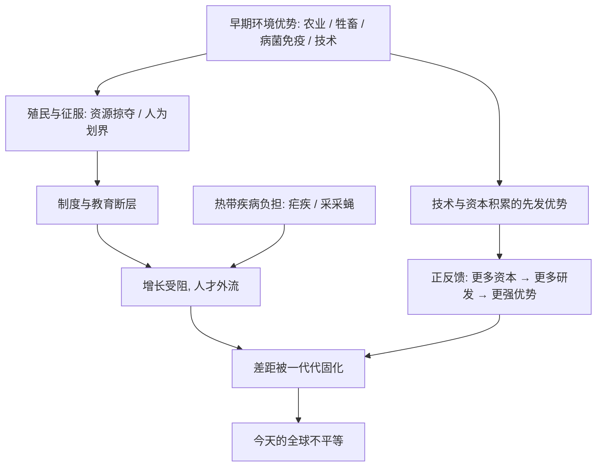

# 18｜为什么世界的不平等至今难以消除？

> 如果枪炮、病菌与钢铁决定的是五百年前的分岔，它是否仍在悄悄决定今天的贫富差距？

---

## 一、先说结论

需要先交代一句：**戴蒙德在这本书里，主要回答的是农业起源到公元 1500 年前后的分岔，他并没有系统写一部现代发展经济学。** 所以这一篇的后半部分，是对他框架的**延伸分析，不是他的原文**。

但这个延伸很有力：早期的分岔，会通过「路径依赖」被固化下来。殖民时代人为划定的边界、被掠夺的资源、被切断的教育与制度，热带地区沉重的疾病负担，以及技术、资本、基础设施的自我累积——这些因素让先发者的优势不断自我强化。

所以今天的贫富差距顽固，不是因为某群人天生不行，而是因为**五百年前启动的那条因果链，至今仍在持续发力**。

---

## 二、我们先理解一个问题

世界上有一些国家，用几十年就从很低的起点追了上来；也有一些地方，过了半个世纪，人均收入几乎没有实质变化。

如果只解释「五百年前为什么分岔」，我们没法解释这种差别。因为分岔本身早就发生过一次了，问题在于：**为什么有些社会能翻篇，有些社会却被反复按在原地？**

这就要引入一个戴蒙德没明说、但完全符合他思路的概念——**为什么早期优势会持续那么久？**

---

## 三、作者到底提出了什么观点？

先把界线划清楚。

**戴蒙德在书中提出的观点是：** 环境差异导致了农业、病菌、技术、国家出现的时间差，进而导致了征服与殖民。这是一条从环境到征服的因果链。

**在这本书里，他并没有专门论证现代贫富差距。** 但他提供了一把钥匙——在书的尾声，他主张「人类史可以作为一门科学，而不只是「一件又一件该死的事情」的堆叠」，也就是说，历史中存在可以被识别的长期规律。

另一个他自己用过的概念是**自我催化**：技术一旦开始积累，就会不断催生新的技术，形成加速（第 11 篇讲过）。把这个逻辑从技术延伸到资本、人才和基础设施，就是这一篇要做的延伸。

---

## 四、把这个观点翻译成人话

想象一条老街。

一百年前，第一批人在这里修了路、埋了水管、拉了电线。后来所有店铺都沿着这条路开，公交车跟着走，学校建在旁边，房价围绕着它上涨。

现在你想在这里重新修一条更合理的新路，会发现代价大得惊人——要拆房子、要迁店铺、要重铺管网。

于是那条一百年前随手画下的路，就决定了今天整片街区的形态。

**这就是「路径依赖」：早期的一个选择，会把后来的很多可能性锁死。** 不是因为那个选择最好，而是因为它来得最早。

戴蒙德的思路延伸过来就是：五百年前谁先有了枪炮、病菌和钢铁，谁就先铺好了路；后来者不是不努力，而是起点的那条「路」已经决定了他们要走多远才能追上。

---

## 五、为什么会这样？

把「不平等为何顽固」拆成一条链：

这里有三条腿同时在走。

**第一条是殖民遗产。** 殖民者在划界时并不考虑当地族群与生态，留下大量人为拼凑的国家；资源被单向抽取，本土的教育、工业与制度被压制或打断。独立之后，这些结构往往原样保留。

**第二条是正反馈。** 有钱的地方能投更多研发、建更好的学校、吸引更强的人才；人才和资本又带来更多钱。这不是公平竞争，而是一场赢家不断加码的比赛。

**第三条是热带疾病负担。** 采采蝇让牲畜难以存活，疟疾长期消耗劳动力与健康，直接影响农业产出与人口质量。戴蒙德自己就强调过，这类因素在非洲的发展中作用极大。

三条腿叠加，差距就不只是「起点差一点」，而是**起点差一点，之后每一代都在扩大那一点**。

---

## 六、举一个现实生活中的例子

先看一个每个人都摸过的东西：**键盘。**

我们今天用的 QWERTY 布局，最早是为早期的机械打字机设计的，据说部分是为了避免相邻字杆卡住。它未必是打字最快的布局，也未必最科学。但因为它最早普及，所有打字机、后来所有电脑、所有培训教材都跟着它走。今天你想换一套更优的布局，代价是让全世界重新学打字。

**它不是被选出来的最优解，而是被「先用起来」锁定的历史遗产。**

再看一个更大的例子：**铁路轨距。**

一个国家最早修的铁路用什么宽度，后面的所有机车、车厢、站台、隧道就都得跟着它。等你想改，全国的路网都要重来。历史记录显示，不同国家因为早期选择不同，留下了互不兼容的轨距，至今仍在为跨国运输制造麻烦。

把这两个例子放大到国家层面，就是这一篇的核心：**先发者铺下的「轨道」，决定了后来者必须付出多大的代价，才能接上同一张网。**

---

## 七、回到书中重新理解

现在再回看戴蒙德在书中反复强调的那条链——环境 → 农业 → 粮食剩余 → 病菌、文字、技术、国家——你会发现它并不只在讲古代。

它的每一个环节，都能在现代找到对应物：

| 戴蒙德的环节 | 现代对应物 |
|---|---|
| 可驯化的作物与牲畜 | 资本、技术、能源、人才 |
| 粮食剩余与分工 | 工业基础、教育体系、专业阶层 |
| 病菌免疫差异 | 公共卫生能力、医疗资源 |
| 文字与知识传播 | 教育普及、信息基础设施 |
| 技术的自我催化 | 研发投入与产业升级的正循环 |

戴蒙德讲的是这些条件的**起源**；而全球不平等讲的是这些条件的**延续**。**起源解释了谁先起跑，延续解释了为什么差距不缩小。**

需要再次强调：这张对应表是**现代延伸**，戴蒙德本人在书中并没有这样展开。

---

## 八、这个观点背后还有什么？

这里藏着两个非常关键的区分。

**第一，解释不等于辩护。**

说明「不平等是如何形成的」，和说「不平等是合理的」，是完全不同的两件事。理解一个人为什么落后，恰恰是为了帮助他改变，而不是给他贴标签。戴蒙德自己反复强调这一点，这也是他反对种族论的核心。

**第二，群体差异不等于个体差异。**

环境和制度解释的是**统计上的、群体层面的差异**，它对任何一个具体的人都没有预测力。一个来自条件不利地区的孩子，完全可能比条件优渥地区的孩子更出色。把群体解释误读成个体命运，是最常见的偷换概念。

隐藏的假设还有一个：**因果链足够长，而且存在锁定效应。** 如果世界随时可以重新洗牌，路径依赖就没有意义；正因为大多数时候洗不了牌，历史才有记忆。

---

## 九、这个观点有问题吗？

把「路径依赖」说成一切，同样会被批评。

**第一，它可能被夸大成宿命论。** 现实中有一些社会在相对短的时间里实现了显著追赶——一些研究常举东亚若干经济体、爱尔兰、博茨瓦纳等例子。这说明路径依赖虽强，但并非不可打破。如果解释太悲观，反而会自己预言失败。

**第二，相关不等于因果。** 热带疾病与贫困同时出现，究竟是疾病导致贫困，还是贫困导致无力控制疾病？两者很可能互为因果，很难一刀切开。

**第三，地理与制度的权重之争依然存在。** 有一派学者强调地理与气候的长期作用，另一派学者（如阿西莫格鲁与罗宾逊）认为制度才是关键。关于现代贫富差距的成因，学界存在不同解释，没有任何单一因素被公认为答案。

所以，这一篇真正想说清楚的，不是「谁注定贫穷」，而是：**差距有来源、有机制、有惯性——搞清楚来源，才有可能谈改变。**

---

## 十、今天再看这个观点

（以下为现代延伸，非戴蒙德原文）

把这条思路用到今天，可以看到几种新的「路径依赖」正在形成。

- **技术与数据**：能够训练大模型、掌握算力的地方，会吸引更多资本与人才，进一步拉大与算力贫乏地区的差距。
- **供应链位置**：处在高附加值环节的国家，更容易积累技术；处在原料出口环节的国家，价格波动一来就受冲击。
- **债务与金融**：早期发展差距会转化为融资成本差距，穷国借钱更贵，还债更吃力。
- **人才流动**：条件优越的地区吸走人才，形成「越缺越走、越走越缺」的循环。

这些机制和五百年前不完全一样，但**结构惊人地相似**：先发优势通过正反馈自我放大，后发者需要加倍努力才能抵消惯性。

戴蒙德的方法在这里依然有用：**先别问「他们为什么不行」，先问「是什么条件让他们难以翻身」。**

---

## 十一、这一篇真正应该记住什么？

1. **本篇后半部分是延伸，不是戴蒙德原文。** 他主要解释古代分岔，现代不平等是顺着他的框架往下推。

2. **路径依赖让早期选择长期锁死后来选项。** 键盘布局、铁路轨距都是缩影，代价不在当初，而在每一次想改的时候。

3. **殖民遗产、疾病负担、正反馈三条腿同时作用。** 起点差一点，之后每一代都在把这个差距放大。

4. **解释不等于辩护，群体差异不等于个体差异。** 理解成因是为了改变，不是为了合理化，更不是给个人贴标签。

5. **路径依赖很强，但不是宿命。** 确实有社会实现了追赶，所以真正的问题是如何找到打破惯性的支点。

---

## 十二、留一个问题

如果地理和历史的惯性如此强大，那么它是不是连未来也一起决定了？

可是技术一直在做一件事：**跨越地理。** 互联网把信息送到每个角落，远程协作让人才不必聚集，云计算让算力可以「租」而不是「建」。

那么——在一个人工智能可以跨越山川的时代，戴蒙德的那套地理决定框架，还成立吗？

下一篇，我们就来认真检验这个问题：**如果地理决定过去，那它还能决定 AI 时代吗？**
