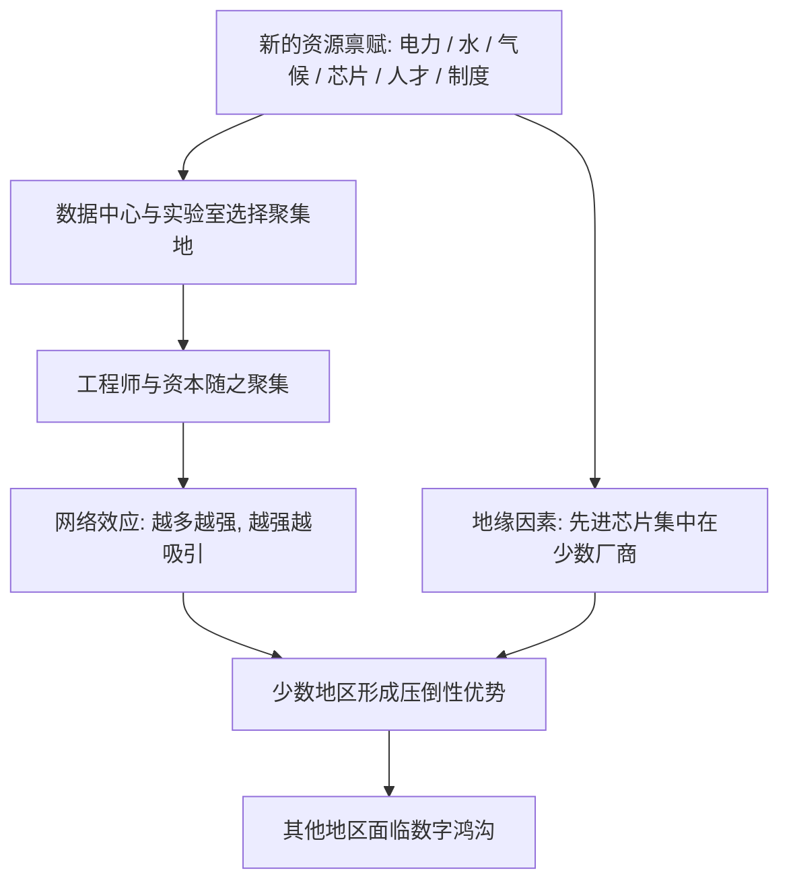

# 19｜如果地理决定过去，那它还能决定 AI 时代吗？

> 在技术可以跨越地理限制的今天，戴蒙德的那套框架，还有效吗？

---

## 一、先说结论

先明确一点：**以下分析属于现代延伸，不是戴蒙德的原文。** 他写这本书时，还没有今天意义上的互联网与人工智能。

但结论是：戴蒙德的框架并没有失效，它只是换了资源。互联网和 AI 理论上抹平了一部分地理约束——信息可以瞬间到达任何角落，算力可以「租」而不是「建」。可是**算力、能源、水、气候、人才与制度，仍然在特定地点高度聚集**，形成新的「资源禀赋」。

戴蒙德式的追问依然锋利：**为什么某些地区能率先拿到这些新资源？** 只不过这一次，「可驯化的作物」变成了芯片、电力和受过训练的头脑。

---

## 二、我们先理解一个问题

云计算听起来是最「没有地理」的东西。

你把数据放到「云」上，云在哪里？在很多人的想象里，云是飘在空中的、无处不在的。可是现实中，每一片「云」都落在某一块具体的土地上，要耗电、要用水、要散热、要连光缆。

所以真正有意思的问题是：

> **如果数字世界真的消灭了地理，为什么建数据中心的人还要满世界挑地方？**

这个问题，正好可以拿来检验戴蒙德：当技术削弱了传统地理约束之后，地理是不是就退场了？

---

## 三、作者到底提出了什么观点？

再次分清层次。

**戴蒙德在书中的观点是：** 地理之所以重要，是因为它决定了资源的分布与扩散的效率。可驯化的作物在哪里、大陆是不是东西向、疾病负担有多重，这些决定了社会发展的速度。

**他并没有讨论 AI。** 所以这里要做的是把他的**追问方式**拿来用，而不是搬他的结论。

用他的方式问，问题会变成：在数字时代，什么是新的「可驯化资源」？这些资源的分布是否均匀？扩散是否顺畅？谁先拿到，谁就获得先发优势？

一些分析者认为，答案指向的是：**稳定的廉价电力、充足的水、适宜的气候、密集的工程师、以及允许长期投入的制度。**

---

## 四、把这个观点翻译成人话

我们总觉得「软件没有重量、网络没有距离」。

但请想一想：你在网上点的外卖，还是要经过一个具体的仓库、一条具体的街道。

数字世界也一样。

一部大模型要训练，需要成千上万块芯片连续运转几个月。芯片要耗电，电要有人发；机器要散热，可能要用大量水；数据要传输，要靠海底光缆；维护它的人，得住在附近。

**所以「云」不是没有地址，而是它的地址被藏起来了。**

戴蒙德当年关心的是：小麦、牛、马能不能在某块土地上活下去。今天我们该关心的是：**电、水、芯片和人才，能不能在某块土地上聚起来。**

问题结构是一样的，只是主角换了。

---

## 五、为什么会这样？

把「AI 时代的新地理」拆成一条链：

这条链里，最像戴蒙德的地方是 **D 到 E 这一步**——**自我催化**。

他讲过技术会不断催生新技术；今天也一样：一个地方有了算力和人才，就会吸引更多创业公司与研究者；更多公司又带来更好的基础设施和更多的投资。优势像滚雪球一样越滚越大。

而 **A 和 G** 提醒我们：**数字世界并没有摆脱物理世界。** 电力有产地，水有产地，最先进的芯片只在极少数地方生产。你不能用一行代码变出一座发电厂。

---

## 六、举一个现实生活中的例子

假设你是一家小公司的负责人，要训练一个模型。

你打开地图找算力，很快就会发现，可选的地方其实不多。你要考虑：哪里的电便宜又稳定？哪里的气候凉爽、散热成本低？哪里不缺冷却水？哪里的网络延迟小、离用户和光缆近？

这些条件不会同时满足于世界上任何一个地方，它们只会在少数几个区域重叠。于是你很可能不得不**把数据和任务送到某个遥远的、你不熟悉的地方去**。

再往大一点看：一座原本安静的小镇，忽然因为建了大型数据中心，电价、用水、就业、地价都发生了变化。有人因此受益，也有人开始担心水不够用。

**这就是 AI 时代的地理：它不再写在气候带上，而是写在电网、水管、光缆和土地价格上。**

---

## 七、回到书中重新理解

现在回头看看戴蒙德讲的两个核心机制——**资源分布**和**扩散效率**——你会发现它们几乎原封不动地重演了。

他讲大陆轴线：欧亚是东西向，同纬度传播顺畅；非洲和美洲是南北向，跨气候带，传播受阻。

数字时代也有它自己的「轴线」。**光缆、电网、供应链，就是新的传播通道。** 一个地区如果接上了这些通道，就能迅速吸收技术与资本；如果被排除在外，就会像被沙漠和雨林隔开的古大陆一样，长期孤立。

他讲可驯化的动植物分布不均，决定了农业能否起步。

数字时代也一样：**先进芯片的制造能力、稳定的能源供给、高质量的教育体系，分布同样极不均匀。** 谁能先驯化这些「新作物」，谁就先拿到下一个时代的枪炮与钢铁。

需要再强调一次：**这整套类比是延伸分析，戴蒙德本人并没有这样论证过。**

---

## 八、这个观点背后还有什么？

这里有一个关键的隐含前提：**技术能够削弱自然地理，但不能取消聚集经济与制度差异。**

技术确实在「拉平」：远程办公让一部分人可以留在小城市，为远方的大公司工作；在线教育让偏远地区也能接触到优质课程；开源模型让小团队也能用上先进工具。

但技术同时也在「重新聚集」：最顶尖的机会、最密集的同行、最活跃的资本，往往仍然集中在少数几个时区和城市。你可以在家写代码，但你很难在家里遇到全行业最聪明的一群人。

所以真实的情况不是「地理消失了」，而是：**自然地理的约束在变弱，而经济地理和制度地理的约束在变强。**

理解这一点，就能避免两个极端——既不要以为技术会自动抹平一切，也不要以为地理会永远锁死一切。

---

## 九、这个观点有问题吗？

**第一，会不会是我高估了地理？** 有人会反驳：互联网已经创造了大量「不依赖本地资源」的财富，很多小国、小城也能诞生世界级公司。如果 AI 让协作成本进一步降低，地理的重要性可能真的会下降。这个反驳是严肃的。

**第二，观察样本有偏差。** 我们今天看到的「算力集中在少数地区」，只是一个当下的快照。技术变化很快，也许十年后的分布完全不同。用今天的格局推断长期规律，本身就有风险。

**第三，制度和地缘的作用很难与地理分开。** 先进芯片集中在少数厂商，是地理决定的吗？还是历史、政策、联盟与偶然共同造成的？关于这一问题，学界与产业界存在不同解释，很难把功劳或责任单独归给某一个变量。

所以，这一篇不该被读成「地理决定 AI」，而应该被读成：**戴蒙德式的提问，在新技术条件下依然值得一问。**

---

## 十、今天再看这个观点

（以下为现代延伸，非戴蒙德原文）

把戴蒙德的方法用到今天，可以问出几个很有价值的问题：

- **能源转型**：如果未来的竞争是电力的竞争，那么拥有廉价清洁能源的地区，会不会像当年拥有新月沃地一样，获得一次结构性优势？
- **气候与选址**：气温上升会让某些地区的散热成本、水资源压力上升，从而改变算力版图。这几乎是「地理再次出手」。
- **数字鸿沟**：当教育、算力和数据在少数地方聚集，落后地区会不会被进一步甩开？这和第 18 篇讲的路径依赖是同一条逻辑。
- **教育与人才**：新的「可驯化作物」可能不是小麦，而是**能够长期培养工程师的教育体系**。这恰恰是可以被制度和政策改变的变量。

这些问题没有确定答案，但它们都有一个共同点：**先问条件，再问结果；先看资源分布，再看谁先跑出来。**

这正是戴蒙德留下的方法。

---

## 十一、这一篇真正应该记住什么？

1. **本篇是延伸，不是戴蒙德原文。** 他没有写过 AI，但我们可以借用他的追问方式。

2. **数字世界没有消灭地理，只是换了地理。** 电力、水、气候、芯片、人才，成了新的「资源禀赋」。

3. **自我催化机制在 AI 时代重演。** 算力与人才越聚集，越吸引资本与人才，地区优势会被不断放大。

4. **技术同时在做两件相反的事。** 它削弱自然地理的约束，又强化经济与制度地理的聚集——所以答案是「地理的消亡与重生」，而不是简单的消失。

5. **戴蒙德式的问题依然有效：** 为什么某些地区能率先拿到新资源？这是条件问题，不是优劣问题。

---

## 十二、留一个问题

我们已经走了很长一段路。

从耶利的问题出发，我们拆穿了「民族优劣」的解释，搭建了从环境到枪炮、病菌与钢铁的因果链，又看到了它的争议、它的现代延续，以及它在 AI 时代可能的变形。

可是走到这里，一个更根本的问题浮了出来：

> **如果戴蒙德的具体论断都可以被质疑，这本书到底还剩下什么价值？**

也许答案不在他的结论里，而在他提问的方式里。

下一篇，是这个系列的最后一篇。我们来认真回答：**重读戴蒙德，我们真正该记住的是什么？**
