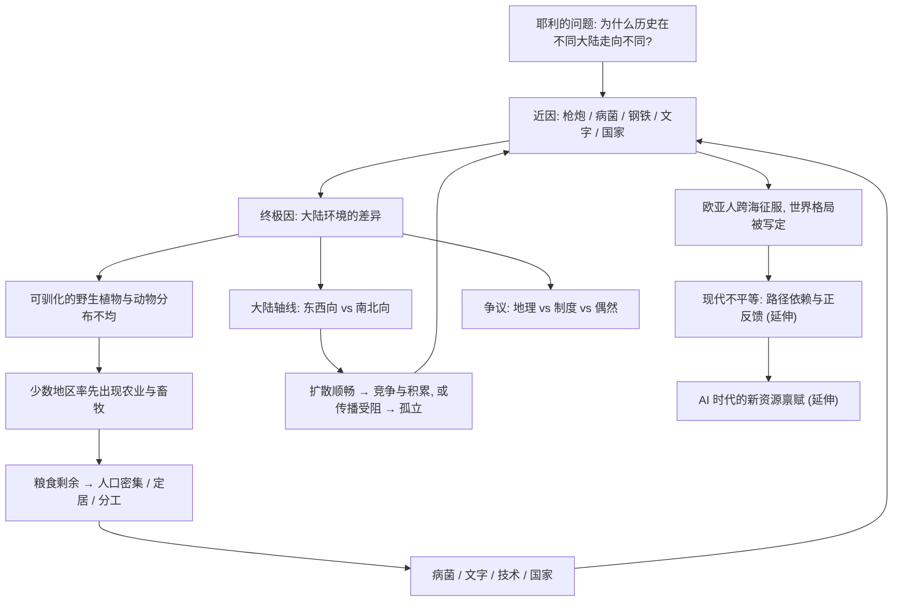

# 20｜重读戴蒙德：我们真正该记住的是什么？

> 在众多批评之后，这本书还值得读吗？它留给我们最重要的遗产，究竟是什么？

---

## 一、先说结论

这本书的具体论断，几乎每一条都可以被争论。大陆轴线的作用有多大？农业是不是「陷阱」？地理和制度谁更重要？新几内亚的起跑线真的一样吗？——这些都没有定论。

但即使把所有争议都算上，戴蒙德教给我们的**思维方法**依然稀缺。

他做的事其实只有一件：**把那些被我们当作「理所当然」的事实，重新变成需要解释的谜。** 他区分近因与终极因，拒绝用「民族优劣」解释历史，坚持追问「是什么条件让这件事成为可能」。

戴蒙德不总是对的。但他示范了一种追问方式，而这种追问方式，比他的结论活得更久。

---

## 二、我们先理解一个问题

读完前 19 篇，你可能会有一个不太舒服的感觉。

地理决定论听起来太绝对；制度论好像也说得通；大分流的证据两边都有；连「一万三千年前大家起点相近」这句话，都有人质疑。

那么问题来了：

> **如果一本这么重要的书，几乎每个结论都能被打问号，它凭什么被称为经典？**

这才是这个系列最后一篇真正要回答的问题。它不是在为戴蒙德辩护，而是在问：**当我们把一个人的结论全部拿走之后，还剩不剩下东西？**

---

## 三、作者到底提出了什么观点？

回顾一下戴蒙德在全书中反复强调的立场。

**他认为，历史不是一连串「英雄与偶然」的堆叠，而是可以被科学地解释的。** 在足够长的时间尺度上，存在可识别的规律——这些规律关于环境、关于资源、关于扩散，而不是关于哪个民族的「天赋」。

**他认为，解释历史必须往下追问一层。** 你看得见的是枪炮、病菌和钢铁，但真正要问的是：为什么这些东西出现在这一边，而不是另一边？

**他认为，把差异归给「人种」是一种懒惰而危险的解释。** 这种解释看似有力，其实什么都没解释。

请注意：这三条都不是关于「地理到底多重要」的事实论断，而是关于**如何提问、如何归因、如何避免偏见**的方法论断。这恰恰是全书最不依赖具体证据、也最不容易被推翻的部分。

---

## 四、把这个观点翻译成人话

想象一个病人，反复发烧。

医生 A 给他一片退烧药，烧退了，病人觉得「好了」。

医生 B 却不肯停手——他追问：为什么会发烧？是感染、是免疫问题、还是别的？如果只压住症状，病因还在，过几天可能更严重。

**退烧是近因，病因是终极因。**

戴蒙德就是那个医生 B。当所有人都满足于「欧洲人赢了，因为他们有枪炮」时，他非要多问一句：**那他们为什么会有枪炮？**

这个问题一旦问出来，历史就从「一场战役怎么打」变成了「一整套结构怎么形成」。

- 医生 A 得到的是症状清单。
- 医生 B 得到的是病理机制。

戴蒙德的价值，是让我们养成当医生 B 的习惯——不管面对的是历史、商业、还是自己的人生。

---

## 五、为什么会这样？

把整个系列 01 到 19 篇的因果链，连成一张图：

这条链从 01 篇的问题开始，到 19 篇的 AI 时代结束。你会发现有两条线一直并行：

- **一条是戴蒙德的主线**：环境 → 资源 → 农业 → 一切。
- **一条是争议的副线**：制度、文化、偶然、尺度、目的。

**经典之所以是经典，往往不是因为它把主线画得最漂亮，而是因为它逼着所有人去画那条副线。** 没有戴蒙德，可能就没有后面那么多关于制度、大分流和偶然性的认真讨论。

---

## 六、举一个现实生活中的例子

把「近因与终极因」放到一个日常场景里。

一个团队连续三个月业绩下滑。经理开会，直接要求大家「这个月必须加班冲上去」——这是对近因动手。业绩也许短期回升，但下个月可能继续掉。

另一个经理先花两天，把数据拉出来问：是产品问题、市场变化、还是人手不够？找到病根再动手，可能慢一点，但更可能真正解决。

再拿破案打个比方。案发现场第一个出现的人，几乎总会被怀疑，但侦探不会就此定案——他要问的是动机、时间、证据链。**“谁在场”是近因，“为什么是他、为什么是此时此地”才是终极因。**

戴蒙德做的事，就是把历史当成一个需要认真办的案子：**不接受最省事的解释，不因为某个结论「听起来有道理」就收手。**

---

## 七、回到书中重新理解

现在回头看书名，你会有完全不同的感受。

《枪炮、病菌与钢铁》——这三样东西其实是全书**最表层**的部分。书名几乎是一个陷阱：它让你以为是讲武器的，实际上它讲的是**为什么只有一方拥有这些武器**。

戴蒙德在书的尾声里说，他希望把人类历史变成一门科学。这句话本身争议很大——很多历史学家认为，人类历史太复杂，不可能像物理那样找到普适规律。

但即便你不同意他的野心，你也很难否认：**他给了我们一套可以反复使用的提问工具。** 而这套工具，不依赖你相信哪个具体结论。

---

## 八、这个观点背后还有什么？

把戴蒙德的方法提炼成几张可以随身携带的「思维卡片」：

**第一，因果分层。** 遇到任何结果，先问近因，再问终极因。不要停在最上面那一层。

**第二，反本质主义。** 当有人用「他们就是那样的人」来解释群体差异时，立刻警惕。这通常意味着他停止了追问。

**第三，大尺度思考。** 把时间轴拉长，很多短期的偶然会变成长期的规律；把地图放大，很多「个人能力」会显出「条件差异」。

**第四，区分解释与辩护。** 说明一件事为什么会发生，不等于认同它应该发生。理解成因，往往正是改变的前提。

**第五，警惕结果倒推原因。** 不要因为知道谁赢了，就把他身上的一切特征都解释成「赢的原因」。这是历史解释里最常见的陷阱，也是本书被批评最多的地方。

这五张卡片，是整本书最值得带走的东西。它们不需要你同意戴蒙德的地理决定论，也能照常使用。

---

## 九、这个观点有问题吗？

必须承认，批评是成立的，而且不少。

- **地理决定论**：把历史归因于环境，可能高估了结构的重量，低估了人的选择与反抗。
- **单一因果**：制度、文化、偶然事件的作用，在他的框架里被压缩得太小（第 17 篇）。
- **目的问题**：用环境解释差异，可能在不经意间淡化了殖民与暴力的责任（第 16 篇）。
- **经验证据**：大分流的争论表明，「欧洲天然领先」的叙事并不牢固（第 17 篇）。

关于这些问题，学界存在不同解释，没有一个可以简单判定的答案。

但有意思的是：**这些批评大多针对的是他的结论，而不是他的方法。** 批评者往往也在用「区分近因与终极因」「拒绝本质主义」这套工具去反驳他。这恰恰说明，方法比结论更耐用。

---

## 十、今天再看这个观点

（以下为现代延伸，非戴蒙德原文）

如果今天再拿起这套方法，它会指向三个很现实的问题。

**第一，AI 与新的资源禀赋。** 不要问「为什么某些国家 AI 落后」，先问「它们在电力、算力、数据、人才和制度上缺了什么条件」。这是条件问题，不是能力问题（第 19 篇）。

**第二，气候变化。** 哪些地区会因为温度、水资源和海平面的变化而失去原有的禀赋？谁又会因此获得新的机会？这几乎是戴蒙德式问题的直接重演。

**第三，全球不平等。** 不要用「落后」给一个国家或一群人贴标签，而是去追那条从殖民、疾病、制度到资本的因果链（第 18 篇）。

这些问题都没有简单答案。但戴蒙德给我们的，不是答案，而是一种**不轻易接受现成答案的态度**。

---

## 十一、这一篇真正应该记住什么？

1. **经典的价值常在方法，不在结论。** 戴蒙德的具体论断几乎都可争论，但他区分近因与终极因的追问方式依然稀缺。

2. **五张思维卡片值得随身带走。** 因果分层、反本质主义、大尺度思考、区分解释与辩护、警惕结果倒推原因。

3. **批评大多落在结论上，而非方法上。** 连批评他的人，也在使用他教的那套提问工具。

4. **解释不等于辩护。** 理解历史为什么会这样，不等于说它应该这样——这是阅读这本书最重要的伦理边界。

5. **他不总是对的，但他示范了如何提问。** 把「理所当然」重新变成「需要解释」，这件事本身就有巨大价值。

---

## 十二、留一个问题

1972 年，新几内亚海滩上，耶利问了戴蒙德一个问题：为什么你们有那么多货物，而我们几乎没有？

戴蒙德用一整本书回答了他。答案未必全对，但那个问题，把一个被所有人当作理所当然的世界，重新变成了谜。

现在换到我们。

每一代人，都有自己的「货物」问题——都有一些看起来天经地义、其实从未被认真解释的差距。

那么，**属于我们这个时代的那句耶利式问题，应该是什么？**

它可能是关于 AI、关于气候、关于贫富，也可能是关于某个你身边从未被追问过的「理所当然」。

这本书最终留给我们的，也许就是这个习惯：

> **当所有人都觉得「本来就是这样」的时候，停下来，问一句——为什么？**
