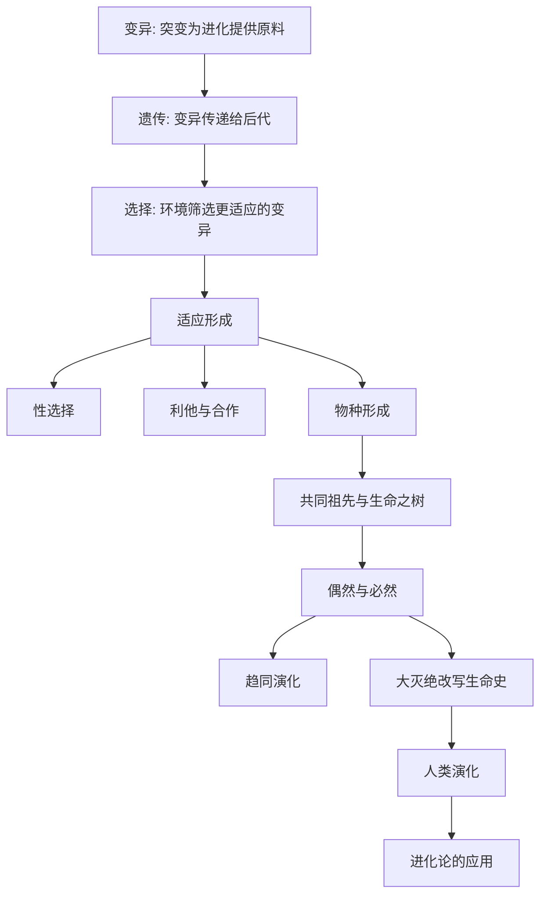

# 《王立铭进化论讲义》深度解读系列

## 系列简介

《王立铭进化论讲义》要做的，是把一门"人人以为懂、其实常误解"的科学讲清楚：**进化论到底在说什么？**

多数人对进化论的印象，可能停留在三句话：物竞天择、适者生存、人是从猴子变来的。但这三句里，藏着大量误解——"适者"不是"强者"，进化不是"进步"，更没有谁在朝着人类的方向努力。进化没有目标，它只做一件事：**让适应当前环境的变异，在下一代里变得更多。**

王立铭用讲义的方式，把进化论拆成清晰的逻辑链条：变异、遗传、选择；再用化石、生物地理、分子生物学三重证据把结论钉牢；然后解释适应、性选择、利他、物种形成这些"看似矛盾"的现象；最后回到人类自身与日常生活——为什么细菌会耐药，为什么我们爱吃糖，为什么进化论对医学、农业乃至理解社会都如此重要。

本系列围绕 **16 个核心问题**，从基本逻辑讲到进化与人类。

---

## 全书核心问题

| 层次 | 问题 |
|---|---|
| 逻辑问题 | 进化论的核心机制是什么？变异、遗传、选择如何协作？ |
| 证据问题 | 进化论有什么证据？共同祖先凭什么成立？ |
| 力量问题 | 适应、性选择、利他、物种形成是怎么发生的？ |
| 规律问题 | 演化是偶然还是必然？大灭绝如何改写生命史？ |
| 应用问题 | 人类如何进化而来？进化论对今天有什么用？ |

---

## 全书知识地图



---

## 全系列目录

### 第一部分：进化论的基本逻辑

#### 01｜进化论到底在说什么？

核心问题：抛开"猴子变人"的印象，进化论的核心到底是什么？

核心观点：进化论的核心其实很简单：**变异提供原料，遗传传递下去，选择决定去留。** 只要这三件事同时成立，物种就会随环境变化而改变。它不神秘，也不需要设计者——这正是达尔文最伟大的地方。

理解难度：★★★☆☆

关键词：变异、遗传、选择、达尔文

---

#### 02｜自然选择是怎么工作的？

核心问题：没有设计者，复杂的适应是怎么"被造出来"的？

核心观点：自然选择是一个"筛选"过程：个体之间存在差异，某些差异让它们留下更多后代，于是这些特征在群体中越来越普遍。它不是主动设计，而是被动筛选——看起来像被设计，实则只是"活下来的被记住"。

理解难度：★★★☆☆

关键词：自然选择、差异、繁殖成功、筛选

---

#### 03｜变异是从哪里来的？

核心问题：进化的"原料"从何而来？

核心观点：变异的根本来源是基因突变，而有性生殖通过基因重组大幅增加了变异的组合方式。变异是随机的，但选择不是随机的——随机变异 + 非随机筛选，这是进化论最关键的一对概念。

理解难度：★★★★☆

关键词：突变、基因重组、随机、有性生殖

---

#### 04｜“适者生存”到底是什么意思？

核心问题：为什么"适者生存"常被误解成"强者生存"？

核心观点："适者"指的是**适应当前环境**，而不是"更强、更大、更聪明"。环境变了，"最适者"也会变。因此存在大量"退化"案例（洞穴鱼失去眼睛）。此外，进化没有"进步"方向，也没有"最高点"——这是最需要纠正的两个误解。

理解难度：★★★★☆

关键词：适应、误解、退化、没有方向

---

### 第二部分：进化的证据

#### 05｜进化论有什么证据？

核心问题：进化论只是一个"理论"吗？它凭什么成立？

核心观点：进化论有来自多个独立领域的证据：化石记录、生物地理分布、比较解剖（同源器官）、胚胎发育，以及最具决定性的分子证据（DNA 序列）。当这么多互不相关的证据指向同一结论时，它的可靠性远超"一家之言"。

理解难度：★★★☆☆

关键词：证据、化石、同源器官、分子

---

#### 06｜为什么说所有生命有共同祖先？

核心问题：凭什么说人类和细菌、蘑菇、橡树是"亲戚"？

核心观点：所有已知生命共用同一套遗传密码、同一类分子机制（DNA、RNA、ATP）。这种"统一性"最合理的解释，就是它们来自同一个共同祖先。生命之树不是比喻，而是可以量化的亲缘关系图谱。

理解难度：★★★★☆

关键词：共同祖先、遗传密码、生命之树、统一性

---

#### 07｜化石、地理与分子：三条证据链

核心问题：三种看起来毫不相关的学科，如何共同证明进化？

核心观点：化石给出时间与形态的顺序；生物地理揭示物种分布与大陆漂移的关系；分子生物学则通过基因差异计算亲缘与分家时间。三条证据链彼此独立、又相互印证，构成了进化论最坚固的地基。

理解难度：★★★★☆

关键词：化石、生物地理、分子钟、交叉验证

---

### 第三部分：进化的力量

#### 08｜适应是怎么形成的？

核心问题：一个精妙的"适应"是如何一步步累积出来的？

核心观点：适应是自然选择长期累积的结果：每一代中稍微更有优势的微小变异被保留，经过无数代叠加，形成惊人的功能（如拟态、飞行、回声定位）。它不需要一步到位，只需要"每一步都略微更好"。

理解难度：★★★☆☆

关键词：适应、累积、微小优势、拟态

---

#### 09｜性选择：为什么孔雀有华丽的尾巴？

核心问题：尾巴明明拖累生存，为什么还会进化出来？

核心观点：性选择：除了"活下去"，还有"赢得配偶"。孔雀的华丽尾巴虽然增加被捕食的风险，却提高了交配机会。自然选择与性选择有时会互相拉扯，这解释了大量"看起来很浪费"的特征。

理解难度：★★★★☆

关键词：性选择、配偶竞争、炫耀、权衡

---

#### 10｜利他行为怎么可能是进化的产物？

核心问题：进化论讲"自私"，为什么还有生物牺牲自己？

核心观点：利他可以从进化角度解释：亲缘选择（帮助携带相同基因的亲属）、互惠（今天帮你，明天你帮我）、群体层面的机制等。所谓"自私的基因"不等于"自私的行为"——这是理解进化的关键一课。

理解难度：★★★★★

关键词：利他、亲缘选择、互惠、自私的基因

---

#### 11｜物种是怎么形成的？

核心问题：一个物种，怎么就变成了两个物种？

核心观点：物种形成通常始于"隔离"（地理、行为、时间），被分隔的群体各自积累不同的变异，最终繁殖上不再兼容，就成了不同物种。这说明"物种"不是固定不变的类别，而是演化长河中的一段。

理解难度：★★★★☆

关键词：物种形成、地理隔离、生殖隔离

---

### 第四部分：偶然与必然

#### 12｜演化是必然的还是偶然的？

核心问题：如果重来一遍，地球上还会有"人"吗？

核心观点：演化由偶然事件与必然规律共同塑造：突变与灾变是偶然的，选择压力是必然的。恐龙灭绝让哺乳动物有了机会——如果重来一次，人类几乎不可能原样再现。生命史既有规律，也充满偶然。

理解难度：★★★★★

关键词：偶然、必然、重演、路径依赖

---

#### 13｜趋同演化：为什么不同物种会“殊途同归”？

核心问题：为什么鱼、鲸、海豚的身体形状如此相似？

核心观点：趋同演化：面对相似的环境压力，不同来源的物种会独立演化出相似的功能（眼睛、翅膀、流线型身体都多次独立出现）。它既证明了自然选择的力量，也说明"相似"不等于"同源"。

理解难度：★★★★☆

关键词：趋同演化、独立起源、功能相似

---

#### 14｜大灭绝如何改写生命史？

核心问题：灭绝是失败，还是演化的常态与机会？

核心观点：地球曾发生多次大灭绝，最严重的一次带走了大多数物种。灭绝既是灾难，也清空了生态位，给幸存者带来爆发式机会。生命史证明：**灭绝不是终点，而是重新洗牌的起点。**

理解难度：★★★★☆

关键词：大灭绝、生态位、幸存者、洗牌

---

### 第五部分：进化与人类

#### 15｜人类是怎么进化出来的？

核心问题：我们和别的动物，究竟差在哪里？

核心观点：人类演化是一条具体的、可追溯的路径：直立行走、大脑扩张、工具使用、语言与社会协作。我们并非进化的"终点"，而只是生命之树上的一根细枝——所有物种都在同步演化，只是我们恰好能理解这件事。

理解难度：★★★★☆

关键词：人类演化、直立行走、大脑、社会协作

---

#### 16｜进化论对今天有什么用？

核心问题：一个 150 多年前的理论，和我们的日常生活有什么关系？

核心观点：关系极大：抗生素耐药、癌症演化、农业育种、病毒变异、甚至人类行为与心理，都能用进化论解释。进化论不是遥远的历史，而是理解生命、健康与社会的通用工具。它是目前最有解释力的生命科学框架之一。

理解难度：★★★★☆

关键词：抗生素耐药、癌症、育种、应用

---

## 推荐阅读顺序

**主线顺序（推荐）：01 → 16。**

```text
第一段｜逻辑（01–04）   核心机制 → 自然选择 → 变异来源 → 适者生存
第二段｜证据（05–07）   证据 → 共同祖先 → 三条证据链
第三段｜力量（08–11）   适应 → 性选择 → 利他 → 物种形成
第四段｜规律（12–14）   偶然与必然 → 趋同演化 → 大灭绝
第五段｜人类（15–16）   人类演化 → 进化论的应用
```

**阅读建议：**

- **想先抓住骨架**：读 01、02、04、05、10、16 六篇。
- **对医学/健康感兴趣**：读 02、16（抗生素耐药）最有直接价值。
- **对"人从哪来"感兴趣**：读 06、12、15。
- **想练习批判性阅读**：重点看 04、10、12 三篇（误解与争议最集中）。

---

## 全系列状态

> 本系列共 16 篇，正文生成中。
