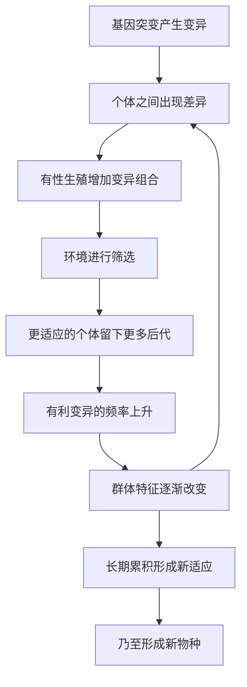

# 01｜进化论到底在说什么？

> 抛开"猴子变人"的印象，进化论的核心到底是什么？

---

## 一、先说结论

王立铭把进化论的核心，浓缩成三个词：**变异、遗传、选择。**

变异提供原料——个体之间总有差异；遗传负责传递——这些差异能传给后代；选择决定去留——更能适应当前环境的差异，会在下一代里变得更普遍。

只要这三件事同时成立，物种就会随环境变化而改变。它不需要设计者，也不需要"努力"或"目标"——这正是达尔文最了不起的地方：**用一个极简的机制，解释了生命的全部多样性。**

---

## 二、我们先理解一个问题

先破一个印象。

很多人对进化论的理解，是"猴子慢慢变成了人"。但如果进化是"朝人类努力"，那就有一个说不通的地方：

> 为什么今天的猴子没有继续变成人？为什么细菌几亿年还是细菌？

这说明"进化"不是一条向上的台阶，也不是朝着某个终点前进。它更像一棵不断分叉的树：每个物种都在适应自己的环境，没有谁比谁"更高级"。

那么问题来了：如果不是"努力变强"，那生命究竟是被什么推动、朝什么方向改变的？

---

## 三、作者到底提出了什么观点？

王立铭给出的答案，正是进化论的骨架：

1. **变异（variation）**：同一物种的个体之间，天然存在差异——有的跑得快，有的抗病强。（第 03 篇会讲它从哪来。）
2. **遗传（heredity）**：这些差异可以传给后代，让"好"的特征有机会保留下来。
3. **选择（selection）**：环境像一个筛子，让某些差异的携带者留下更多后代，而另一些被淘汰。

三者合在一起，就是一个**自动运转**的机制：**随机的变异 + 非随机的筛选 = 适应性的改变。**

他强调，进化论的伟大不在于"发现物种会变"，而在于提出了一个**不需要设计者的设计解释**：复杂、精妙、看起来像被精心策划的特征，其实只是无数代"活下来的被记住"累积的结果。

---

## 四、把这个观点翻译成人话

用达尔文观察过的**加拉帕戈斯地雀**来理解。

这些小鸟分布在不同岛屿上，喙的形状各不相同：有的又粗又壮，适合咬开硬壳种子；有的又细又尖，适合啄食昆虫。

为什么会这样？可以这样推演：

- 鸟群里本来就有差异：有的喙天生厚一点，有的薄一点；
- 在种子坚硬的小岛上，厚喙的鸟更容易活下来、留下后代；
- 于是下一代里，厚喙的比例越来越高；
- 经过许多代，"厚喙"就成了这个岛上鸟群的常态。

**没有谁在"设计"厚喙，也没有哪只鸟在"努力"变厚。** 只是：碰巧厚一点的活下来了，然后越来越多。这就是自然选择的全部魔力——它不创造，它只筛选。

---

## 五、为什么会这样？

把机制拆成一条循环：

关键在于 **A → D** 这一对。

**变异是随机的**——突变不知道环境需要什么，它只是碰巧发生；**选择是非随机的**——环境稳定地偏爱某些特征。正是"随机"与"非随机"的结合，让进化既不神秘、又富有创造力。

如果只有变异没有选择，生命会变成一团乱麻；如果只有选择没有变异，进化的原料就会枯竭。两者缺一不可。

---

## 六、举一个现实生活中的例子

看一场正在我们身边发生的进化——**抗生素耐药。**

当你使用抗生素时，它并不"聪明"地只杀病菌；它做的是：把大量细菌一起杀死。但细菌群体里本来就有极少数个体，碰巧有抗药性的变异。

这些幸存者存活下来，大量繁殖。结果就是：**下一轮感染时，用同样的药，效果变差了。**

这整个过程里，没有一只细菌"决定"要抗药。它们只是：

- 随机变异提供了抗药个体；
- 抗生素的使用把不耐药的都杀掉了（强大的选择压力）；
- 抗药个体留下后代，抗药基因迅速扩散。

于是我们亲眼见证了进化论——**不是教科书里的远古故事，而是每天都在医院里上演的现实。** 这也是第 16 篇要重点讲的：读懂进化论，能直接帮你理解健康问题。

---

## 七、回到书中重新理解

现在再回看王立铭为什么从"变异、遗传、选择"这三个词讲起，就顺了。

很多对进化论的误解——"强者生存""进化就是进步""生命在朝人努力"——都源于没抓住这个核心机制。一旦你真正理解"随机变异 + 环境筛选"，很多困惑会自然消解：

- 为什么会有"退化"（洞穴鱼失去眼睛）？因为环境不再需要眼睛。
- 为什么没有"最高等生物"？因为每个物种都只适应自己的环境。
- 为什么进化没有终点？因为环境一直在变，筛选也就一直在进行。

所以第一篇不是定义，而是**一把钥匙**：握住它，后面所有关于适应、性选择、利他、大灭绝的讨论，都会顺理成章。

---

## 八、这个观点背后还有什么？

**第一，进化不是"物种努力改变自己"，而是"环境筛选了差异"。** 主动性在环境，不在生物。

**第二，"适应"永远是相对的、暂时的。** 适应某个环境，可能意味着在另一个环境里失败。没有一劳永逸的适应。

**第三，进化的单位可以是基因、个体或群体。** "谁的收益"取决于你从哪个层次看，这是现代进化生物学的重要议题（第 10 篇会展开）。

**第四，它是目前生命科学最有解释力的框架之一。** 从抗生素耐药到癌症治疗、从育种到病毒变异，进化论提供了统一的解释工具。

---

## 九、这个观点有问题吗？

作为科学框架，进化论本身极为稳固，但需要澄清几个常见质疑与误解。

**第一，"只是个理论"是误解。** 在科学中，"理论"指经过大量证据检验的解释体系；进化论有化石、生物地理、分子等多重独立证据支持，其可靠性与"万有引力"同级别。

**第二，"随机性"不等于"什么都可能"。** 有人以为进化"纯属偶然"，能够出现任何结果。实际上：变异随机，但选择有方向（受环境约束），因此结果是被"约束的偶然"。

**第三，演化解释与个体价值无关。** 用进化论解释人类行为时，容易滑向"所以这样就对"的自然主义谬误——"是什么"不等于"应该怎样"。这是使用时必须守住的边界。

**第四，对"社会达尔文主义"要保持警惕。** 把进化论硬套到社会与道德领域，在历史上曾被用来为不平等辩护，这既误用科学，也带来过真实伤害。

**所以更准确的说法是**：作为解释生命多样性的科学框架，进化论极其坚实；但当它被引申来解释社会与道德时，必须格外谨慎，两者不是同一回事。

---

## 十、今天再看这个观点

以下部分是基于王立铭讲义内容的现代延伸，不是书中的原话。

进化论在今天，比达尔文时代更"实用"。它直接进入了医学与公共卫生：

- **抗生素耐药**，是进化论在病房里的现场直播；
- **肿瘤治疗**，本质上是与一群快速演化的细胞博弈（癌细胞也在被药物"选择"）；
- **病毒变异**，让疫苗需要不断更新；
- **农业育种**，则是人类主动利用选择的力量。

也就是说，进化论早已不只是"解释过去"，而是**处理当下最紧迫健康问题的基本工具**。不懂它的逻辑，就很难真正理解为什么"别乱用抗生素""为什么治疗方案会失效"。

---

## 十一、这一篇真正应该记住什么？

1. **进化论的核心只有三个词：** 变异、遗传、选择。
2. **变异随机，选择不随机。** 二者的结合，让生命无需设计者也能变得精巧。
3. **进化没有方向、没有终点，也没有"最高等"。** "猴子变人"是一种误解。
4. **"适者"是适应环境，不是"强者"。** 环境一变，最适者也会变。
5. **它是解释力极强的科学框架，但别把它硬套到社会与道德上。**

---

## 十二、留一个问题

> 如果进化的机制是"随机变异 + 环境筛选"，而环境一直在变，
> 那么"适应得最好"这件事，
> 究竟是值得追求的终点，还只是此刻运气刚好？

---

**下一篇**：机制说了三个词，但最神奇的其实是"选择"这一环——没有设计者，它怎么就能把复杂、精妙、看起来像被精心打造的特征，一步步筛出来？

下一篇我们就来拆开这个问题——**自然选择是怎么工作的？**
