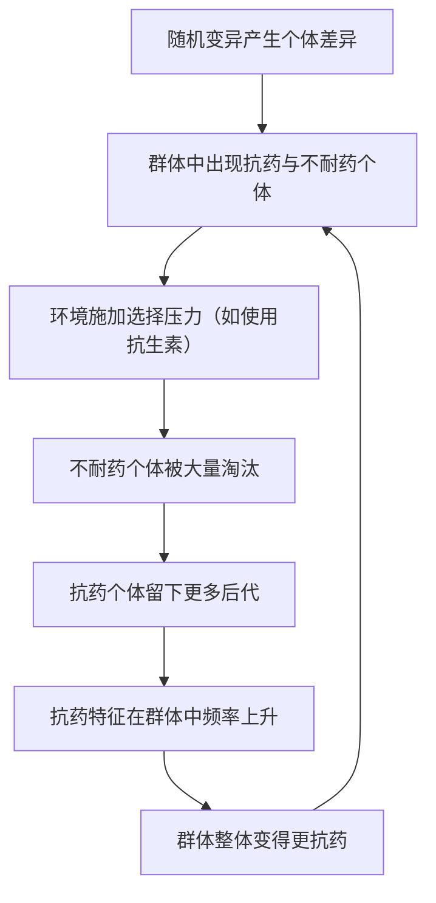

# 02｜自然选择是怎么工作的？

> 没有设计者，复杂的适应是怎么“被造出来”的？

---

## 一、先说结论

王立铭认为，自然选择不是一个“创造”过程，而是一个“筛选”过程。

它需要三个条件同时成立：个体之间存在差异；这些差异可以遗传给后代；不同差异的携带者，留下后代的数量不一样。只要这三件事同时发生，更适应当前环境的特征，就会在群体里一代代变得更普遍。

所以，自然选择看起来像“被设计”，实际上只是“活下来的被记住”。它不聪明、不主动、没有计划，却在漫长时间里造出了眼睛、翅膀、保护色这些精妙到令人惊叹的东西。**它不创造，它只筛选。**

---

## 二、我们先理解一个问题

先破一个印象。

看到眼睛这样精密的结构，我们的第一反应往往是：**这一定是被“设计”出来的。** 因为它太复杂、太精巧，零件之间配合得严丝合缝。在过去很长一段时间里，最流行的解释就是“有一位设计者”。

但进化论要回答的，恰恰是这个问题：**如果没有设计者，复杂的东西能不能自己出现？**

如果答案是“能”，那我们就必须看到一个不需要设计者的机制——一个能像设计师一样，把粗糙的零件一点点打磨成精密结构的自然过程。自然选择，就是这个机制。

---

## 三、作者到底提出了什么观点？

王立铭把自然选择讲成一个“被动筛选”的过程，而不是一个主动“追求进步”的过程。

他强调三件事：

1. **差异是前提。** 同一个群体里，个体天生就不一样——有的抗病强一点，有的代谢快一点。
2. **遗传是通道。** 这些差异必须能传给下一代，否则再有利也留不下来。
3. **繁殖成功是裁判。** 最终决定“谁赢”的，不是谁更强壮，而是谁留下了更多能存活、能繁殖的后代。

三者合起来，就是一句极简的话：**差异化的存活与繁殖，会让有利特征在群体中扩散。**

他还特别强调，自然选择是**被动**的。它不“想要”任何结果，也不“瞄准”任何目标。环境只是稳定地偏爱某些特征，于是这些特征就多了起来。所谓“适应”，是这个过程的**副产品**，而不是它追逐的目的。

---

## 四、把这个观点翻译成人话

用大家最熟悉的场景来理解：**抗生素与细菌。**

想象一瓶细菌，数量以亿计。它们之间本来就有微小的差异：绝大多数个体遇到某种抗生素会被杀死，但总有极少数，因为某个偶然的变异，恰好不怕这种药。

现在开始用药。药物像一场大清洗，把不耐药的细菌几乎全部消灭。那极少数“碰巧抗药”的个体活了下来，并且在几乎没有竞争的环境里疯狂繁殖。

一代之后，这批幸存者的后代，绝大多数都带着抗药的特征。于是，**整个细菌群体的“抗药比例”被抬高了。**

整个过程中，没有一只细菌“决定”要抗药，也没有谁在“努力”适应。它们只是：碰巧有些个体活下来了，然后越来越多。

**这就是自然选择的全部工作方式——不是造出抗药的细菌，而是让本来就存在的抗药个体，被环境“选中”。**

---

## 五、为什么会这样？

把这条机制画成一条循环，会更清楚：

关键在于 C 这一步：**环境不是“想要”什么样的细菌，它只是淘汰掉不合适的。**

而且这个过程有一个容易被忽略的特点：**它是累积的。** 每一次选择只让“略微更好”的特征多一点点优势，但经过成千上万代，这点点优势会被放大成巨大的差别。眼睛不是一步造出来的，而是“每一步都略微更好”叠加了无数代的结果。

---

## 六、举一个现实生活中的例子

抗生素耐药，就是自然选择在病房里的现场直播。

一个常被误解的地方是：**抗药性不是“用出来的”，而是“筛出来的”。** 细菌群体里，抗药变异本来就会以很低的概率自然出现；抗生素的作用，是把不耐药的都杀掉，从而给抗药者腾出巨大的生存空间。

所以会出现一个反直觉的结果：**用药越不彻底、越随意，越容易培养出抗药菌。** 因为半途而废的用药，恰恰制造了一个“只有抗药者能活”的筛选环境，还给了它们重新繁殖的机会。

这也解释了为什么医院会强调“足量、足疗程”：目的不是“杀得更狠”，而是尽可能不给抗药者留下可乘之机。进化论在这里不是抽象理论，而是直接指导用药的现实规则。

---

## 七、回到书中重新理解

现在再回看王立铭为什么反复强调“筛选而非设计”，就顺了。

- 为什么说适应是“被动”的？因为环境的偏爱不来自任何意图，它只是筛选的结果。
- 为什么说自然选择“不创造”？因为它只在既有差异里做筛选，真正的新特征还得靠变异去提供。
- 为什么它看起来“有目的”？因为筛选方向长期稳定时，结果就像有一个目标在被追求——但这只是**错觉**。

理解了这一点，很多关于进化的神秘感就消失了。自然选择的惊人之处，不在于它多么主动，而恰恰在于：**它什么都不主动，却能做出像是精心设计的东西。**

---

## 八、这个观点背后还有什么？

**第一，选择压力的大小很关键。** 环境越严酷、淘汰越彻底，特征变化越快。抗生素、极端气候、新天敌，都会让选择压力骤然变大。

**第二，选择是相对的，不是绝对的。** 一个特征在某个环境里有利，换一个环境可能就成了负担。所谓“最适者”，永远是针对特定环境而言。

**第三，自然选择不是进化的唯一力量。** 现代进化生物学认为，随机的遗传漂变、迁移与基因流动同样能改变群体，只是在不同的时间与尺度上份量不同。

**第四，时间是它的放大器。** 自然选择的“魔法”不在单代，而在于它可以持续数百万代。人类的直觉很难想象这种尺度，这正是理解进化时最大的障碍之一。

---

## 九、这个观点有问题吗？

作为一个解释框架，自然选择极为稳固，但它常被误读，也有真实的边界。

**第一，“适者生存”是不是同义反复？** 这是一个经典的批评：如果“适者”就是“活下来的人”，那这句话不就等于“活下来的活下来了”吗？对这个问题，学界的主流回应是：适者不是事后定义的，而是**可以事先用环境条件去预测**的。抗生素存在时，抗药个体更容易存活——这是一个可以被检验的预测，而不是循环论证。

**第二，自然选择不是万能的。** 关于“选择能在多大程度上塑造生物”这一问题，学界存在不同解释：有人强调它是主导力量，也有人认为漂变、约束与历史偶然同样重要。不能把一切现象都简单归给“选择”。

**第三，它有约束，不是想要什么就能变出什么。** 生物的历史、发育方式与物理限制，都会限定可以出现的形态。自然选择只能在既有材料上工作。

**第四，要小心“目的论”的陷阱。** 说“细菌为了抗药而变异”是错的——这会把被动的筛选，误读成主动的追求。

**所以更准确的说法是**：自然选择是进化最核心、最有力的机制之一，但它既不是唯一的机制，也不是一个“有意图的设计师”。

---

## 十、今天再看这个观点

以下部分是基于王立铭讲义内容的现代延伸，不是王立铭的原话。

自然选择的逻辑，今天已经进入了多个医学与公共卫生场景：

- **耐药管理**：理解“筛选”而非“杀灭”，才能设计出更聪明的用药策略；
- **肿瘤治疗**：癌细胞群体同样在被药物筛选，单一疗法常常筛选出耐药的克隆；
- **害虫防治**：长期使用同一种农药，等于反复对害虫群体做一次抗药性筛选；
- **疫苗与病毒**：病毒在免疫压力下被筛选，这也是疫苗需要不断更新的原因之一。

也就是说，这个看似抽象的理论，正在直接决定我们如何用药、如何防治、如何与“会进化的对手”打交道。

---

## 十一、这一篇真正应该记住什么？

1. **自然选择是筛选，不是创造。** 它不设计，只让合适的留下。
2. **三个条件缺一不可：** 差异、遗传、繁殖成功不同。
3. **它是被动的：** 没有意图、没有目标，环境只是稳定地偏爱某些特征。
4. **它是累积的：** 每一步只略微更好，长时间叠加就成了奇迹。
5. **它有边界：** 不是唯一机制，也不万能，还会受历史与材料的限制。

---

## 十二、留一个问题

> 既然自然选择只能筛选“已经存在的差异”，
> 那么这些差异——也就是进化的原料——
> 究竟是从哪里来的？

---

所以，选择这一环说清楚了，问题就自然转向了它的前提：**那些供选择的差异，到底是怎么冒出来的？** 下一篇，我们就来追问这个更底层的问题——**变异是从哪里来的？**
