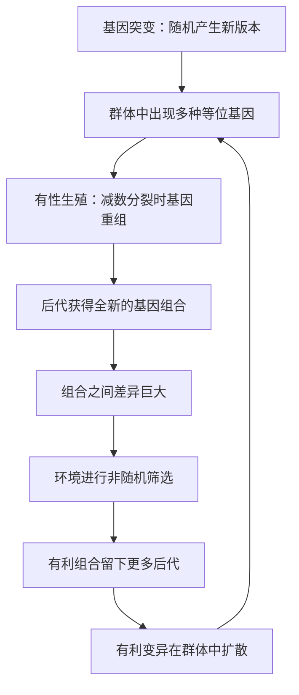

# 03｜变异是从哪里来的？

> 进化的“原料”从何而来？

---

## 一、先说结论

王立铭认为，变异有两个层次的来源。

最根本的来源是**基因突变**：DNA 在复制时会出错，环境中的辐射、化学物质也会损伤 DNA，这些都会带来随机的基因变化。这是变异最原始的源泉。

但突变本身又慢又少，单靠它远不足以解释生命的丰富多样。于是有性生殖登场了：它通过**基因重组**，把父母双方的基因重新洗牌，让每个后代都拿到一套全新的组合。**突变提供新零件，重组负责重新组装**——两者合起来，为进化提供了源源不断的原料。

最关键的一点是：**变异是随机的，选择不是随机的。** 这是理解进化论最要紧的一对概念。

---

## 二、我们先理解一个问题

先破一个印象。

很多人心里有一个隐性的假设：生物“需要”变化时，就会产生合适的变化——需要抗药，就变异出抗药；需要长颈，就变异出长颈。

如果变异真的“按需发生”，那进化就太聪明了，几乎等于有一个设计者在背后指挥。

那么真实的变异，到底是**“应环境需求而生”，还是“碰运气产生、再被环境挑走”**？这个问题，直接决定了进化论是“智慧设计”还是“自然机制”。而答案是后者。

---

## 三、作者到底提出了什么观点？

王立铭把变异的来源分成两个层次，并反复强调它们的随机性。

1. **基因突变：变异的原始来源。** DNA 在复制、修复过程中会出错，也会被外界因素损伤。这些错误的发生**与生物当前是否需要无关**——它不挑时间、不挑位置、不挑方向。
2. **基因重组：变异的放大器。** 有性生殖时，来自父母的两套基因会发生重新组合，同一个基因也常有不同版本（等位基因）。这让每个后代都成为一个新的组合，而不是父母某一方的复制品。

他强调：**突变决定“有没有新东西”，重组决定“能把东西组合得多丰富”。** 前者提供原料，后者把原料排列组合成天文数字。

而这一切的意义在于：**变异必须随机，进化才不需要设计者。** 如果变异能预知环境的需求，那进化就变成了一种“聪明”的适应，而不是自然筛选的结果。

---

## 四、把这个观点翻译成人话

先看**基因突变**。

可以把 DNA 想成一本用四个字母写成的说明书。抄写这本说明书的时候，偶尔会抄错一个字母：可能把 A 写成了 G，可能漏掉一段，也可能多抄了一段。抄错的概率很低，但只要有足够多的细胞、足够多的代际，错误就一定会积累。**关键是：抄错的那一刻，说明书并不知道这次错误将来是有用还是有害。** 它只是抄错了。

再看**有性生殖带来的重组**。

假设父亲有一套基因版本，母亲有另一套。孩子并不是“父亲的一半加母亲的一半”简单拼起来，而是把两套版本重新洗牌、随机搭配。同一对父母，生出的每个孩子都是不同的组合；兄弟姐妹之间，也不会完全一样。**重组本身不制造新字母，但它把已有的字母重新排列，制造出几乎无穷的组合可能。**

突变像“新增零件”，重组像“重新拼装”——两者共同构成了进化取之不尽的原料库。

---

## 五、为什么会这样？

可以这样理解变异与选择的分工：

这张图要抓住的，是 A 与 F 的对比：

**A 是随机的。** 突变不知道环境需要什么，也不朝任何方向使劲。
**F 是非随机的。** 环境稳定地偏爱某些特征，一遍遍地筛。

正因为“随机”在前、“筛选”在后，进化才能既不需要预言能力，又能持续产生适应。**没有随机的变异，选择就无米下锅；没有非随机的选择，变异就只是一团噪声。**

---

## 六、举一个现实生活中的例子

我们身上就带着这两个来源的证据。

**先说突变。** 每个人的基因组里，都携带着若干父母身上没有的新突变。这些突变大多发生在精子和卵子形成的过程中，属于“抄写错误”。绝大多数对健康毫无影响，少数可能带来疾病风险，个别可能带来某种优势。它们出现的时机和位置，与环境“想要什么”毫无关系。

**再说重组。** 这就是为什么同一对父母的孩子，性格、长相、体质各不相同。父母的基因版本在孩子身上重新洗牌，产生了全新的组合。也正因如此，有性生殖的群体里，个体差异要远远大于无性繁殖的群体。

把两者放在一起看：**突变负责提供新字母，重组负责写出无穷多的新句子。** 进化的原料，正是这样被源源不断制造出来的。

---

## 七、回到书中重新理解

现在再回看王立铭为什么如此强调“随机”，就明白了。

- 为什么变异必须与需求无关？因为一旦变异“应需而生”，进化就有了目的和方向，那就不再是自然选择，而是设计。
- 为什么有性生殖如此重要？因为它把“变异的生产效率”提升了好几个数量级，让群体拥有海量的组合储备。
- 为什么说突变和重组是一对搭档？因为一个负责创新，一个负责铺开，缺了谁，进化的原料都会很快枯竭。

他实际上是想让读者记住一个画面：**进化不是生物“想办法”改变自己，而是变异盲目地产生，环境冷酷地筛选。** 主动的是环境，不是生物。

---

## 八、这个观点背后还有什么？

**第一，突变率本身也受到进化影响。** 突变太快，会破坏已经适应好的基因；太慢，又跟不上环境的变化。一些进化生物学家认为，生物体演化出了调控突变率的机制，把速率维持在一个“够用又不至于失控”的区间。

**第二，有性生殖是一个“代价高昂的谜题”。** 无性繁殖可以更高效地复制自己，而有性生殖却要付出寻找配偶、只传递一半基因等代价。既然如此，它为什么如此普遍？关于这一问题，学界存在不同解释：有人强调它能更快清除有害突变，有人强调它能让后代更快适应变化的环境。

**第三，大多数突变是“中性”的。** 现代进化生物学认为，突变带来的后果大多谈不上好坏，只是中性的。它们的变化更多受随机的遗传漂变影响，而非自然选择。

**第四，变异的层次比“突变加重组”更丰富。** 除了单个基因的变化，还可能发生整段基因的重复、染色体数目的改变，甚至不同物种之间的基因水平转移。

---

## 九、这个观点有问题吗？

“变异随机”是进化论的基石，但它和“随机”的日常含义并不一样，需要澄清。

**第一，“随机”不等于“没有规律、什么都可能”。** 突变确实不朝某个“有用”的方向走，但它受化学与物理规律的约束：某些突变更容易发生，某些几乎不可能。所以它是“有偏的随机”，而不是彻底的无序。

**第二，“随机”不等于“所有变异都用得上”。** 恰恰相反，绝大多数突变是有害或无影响的，只有极少数在特定环境下恰好有利。这也是为什么选择这一环不可或缺。

**第三，并非所有变异都来自基因序列的改变。** 一部分可继承的差异来自表观遗传修饰、基因表达调控等机制，它们是否符合“随机”这一描述，学术上仍在讨论。

**第四，关于“变异与选择谁更重要”，学界存在不同解释。** 一些人强调选择塑造一切，另一些人则强调漂变与历史偶然的主导作用。更平衡的看法是：**变异提供可能性，选择与漂变共同决定这些可能性如何被兑现。**

**所以更准确的说法是**：变异是随机产生的原料，这是进化论能够成立、而不需要设计者的关键前提；但“随机”是受约束的随机，且并非唯一的变化来源。

---

## 十、今天再看这个观点

以下部分是基于王立铭讲义内容的现代延伸，不是王立铭的原话。

理解“变异从哪来”，在今天有非常现实的用途：

- **癌症**：肿瘤细胞在分裂中不断积累突变，本质上是变异在身体里疯狂生产；
- **病毒变异**：病毒复制时的高突变率，是疫苗和药物需要不断更新的根本原因；
- **基因测序**：我们能精确读出个体带有哪些突变，正是“变异可被观察”的直接应用；
- **育种**：人类利用随机的变异，再加上主动的选择，培育出了高产作物与各种家畜。

换句话说，变异与选择的分工，不只是理论图景，而是理解疾病、育种与公共卫生的基础。

---

## 十一、这一篇真正应该记住什么？

1. **变异的原始来源是基因突变，放大器是有性生殖带来的重组。**
2. **突变是随机的：** 它不预知环境需求，也不朝有用方向走。
3. **随机变异 + 非随机选择**，是进化论最重要的一对概念。
4. **没有变异，选择就无米下锅；没有选择，变异只是噪声。**
5. **“随机”是受约束的随机，且变异来源不止一种。**

---

## 十二、留一个问题

> 如果说“适者生存”只意味着“适应当前环境的活下来”，
> 那么当环境改变时，
> 昨天的“适者”，会不会恰恰变成今天的“不适者”？

---

弄清了原料从哪来，下一个问题就落在“适者”这个词上——它到底指什么？是“更强”吗？是“更进步”吗？下一篇，我们就来纠正这个最容易被误读的表述——**“适者生存”到底是什么意思？**
