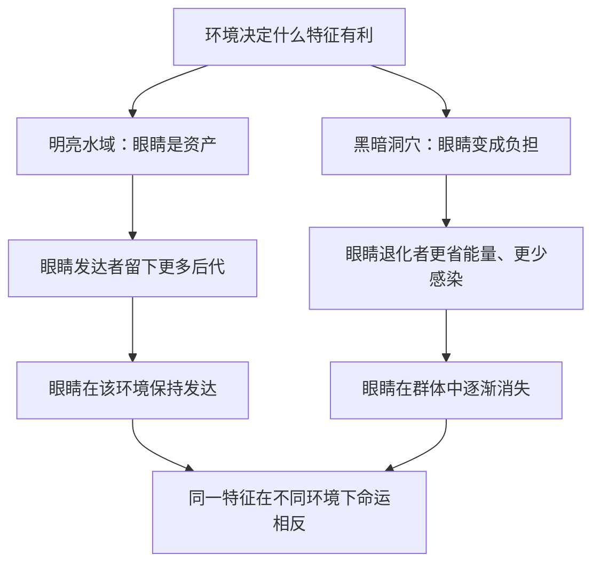

# 04｜“适者生存”到底是什么意思？

> 为什么“适者生存”常被误解成“强者生存”？

---

## 一、先说结论

王立铭认为，“适者生存”里的“适者”，指的是**适应当前环境**，而不是“更强、更大、更聪明”。

环境变了，“最适者”就会跟着变。因此进化里充满了看起来像“退化”的现象——洞穴鱼失去了眼睛，寄生生物丢掉了器官。这些不是失败，恰恰是适应。

他还强调两点：进化**没有“进步”的方向**，也**没有“最高点”**。所谓“高等”“低等”，是人类的错觉，不是自然的尺度。**生存的唯一标准，是适应当前环境，而不是变得更强。**

---

## 二、我们先理解一个问题

先破一个印象。

“适者生存”这句话，几乎每个人都听过。但很多人在心里把它翻译成了：**强者生存、弱者淘汰**——谁更大、更快、更聪明，谁就赢。这个印象，还常常被套到社会竞争上去。

可如果真是“强者通吃”，那就有一些现象完全说不通：

> 为什么生活在漆黑洞穴里的鱼，会失去眼睛？
> 为什么寄生生物会丢掉自己的消化系统？

失去眼睛、丢掉器官，看起来明明是“变弱了”，怎么反而有利于生存？这说明，“适者”的含义，一定不是我们直觉以为的“强”。

---

## 三、作者到底提出了什么观点？

王立铭的核心观点有三层。

**第一，“适者”是环境的函数，不是固定的强者标准。** 一个特征是否有利，取决于它面对的是怎样的环境。同样的特征，在环境甲里是优势，在环境乙里就可能是负担。

**第二，“退化”也是适应。** 当某个器官在特定环境里不再有用、甚至变成累赘时，自然选择会倾向于让它弱化甚至消失。所以，结构变简单、功能变弱，同样可以是有利的变化。

**第三，进化没有方向，也没有进步。** 不存在“从低级到高级”的梯子，也不存在“进化的最高点”。细菌、橡树、人类，都只是各自适应自己环境的结果，而不是同一台阶上的不同高度。

这三点合起来，就把“适者生存”从一句听起来像社会竞争的格言，还原成了一个精确的科学表述：**适应当前环境的个体，平均留下更多后代。**

---

## 四、把这个观点翻译成人话

用洞穴鱼来理解。

在明亮的水域里，眼睛是必需品：找食物、躲天敌都靠它。但当一个鱼类种群被带进终年不见光的洞穴后，情况完全变了：

- 黑暗里，眼睛几乎派不上用场；
- 眼睛却是脆弱的器官，容易受伤、容易感染，还要消耗能量去发育和维持；
- 于是，在洞穴环境里，**眼睛从“资产”变成了“负债”**。

结果就是：那些碰巧眼睛发育弱一些、甚至不发育的个体，反而更省能量、更少感染，留下更多后代。一代代筛选下来，洞穴鱼的眼睛逐渐退化，最终消失。

看清楚了：**不是洞穴鱼“决定”放弃眼睛，也不是退化本身有什么好处，而是在那个特定环境里，“不把资源浪费在无用的眼睛上”更划算。** 这就是“适者”的真实含义——适应环境，而不是变强。

---

## 五、为什么会这样？

可以用一张图看清“环境决定谁最适”：

这张图的关键，是 A 这个箭头：**环境先决定“什么算有利”，生物才被筛选。** 方向不在生物身上，而在环境身上。

所以同一套结构，可能在甲环境里越用越发达，在乙环境里越用越退化。这不是自相矛盾，而是同一个机制的两种结果。**判断适与不适，永远要问一句：在什么环境里？**

---

## 六、举一个现实生活中的例子

“退化”在自然界里比比皆是，而且都在讲述同一件事。

**洞穴鱼失去眼睛**，是因为黑暗让眼睛失去了价值，又让它成了累赘。

**寄生生物简化身体**，是因为宿主已经替它完成了觅食、消化、防御等工作，自己保留那些器官既费力又无益，于是逐渐舍弃。

**岛屿上的鸟类丧失飞行能力**，是因为在缺少天敌的岛上，飞行既耗能，又可能把它们吹向海里；留在岛上反而更安全，翅膀便慢慢退化。

这些例子有一个共同点：**它们的“退化”，都发生在原本的功能变得不划算的环境里。** 一旦功能不再是优势，维持它就成了负担，自然选择就会倾向于把它削减。这不是“用进废退”，而是环境的账本变了。

---

## 七、回到书中重新理解

现在再回看王立铭为什么要专门澄清“适者生存”，就懂了。

- 为什么“适者”不等于“强者”？因为环境只关心“能不能留下更多后代”，不关心谁更强大。
- 为什么会有大量“退化”？因为适应的标准是相对的，环境一变，昨天的优势可能就是今天的包袱。
- 为什么说没有“进步”？因为进步暗含一条从低到高的阶梯，而进化只是一棵树，每个枝头都在适应各自的环境。

他实际上是在拆掉一个流行的误解：**把“适者生存”读成“强者生存”，进而引申为“弱肉强食天经地义”。** 这既误解了科学，也常被拿去支撑不该有的社会结论。

---

## 八、这个观点背后还有什么？

**第一，适应总是带权衡的。** 一项能力增强，往往要以另一项能力为代价。生物很少有“全面变强”这回事，多的是“在这个方向上更划算”。

**第二，进化不能提前规划。** 它只能对当下的选择压力做出反应，无法为将来预留后路。所以环境骤变时，曾经的适者可能猝不及防。

**第三，路径依赖很强。** 现有的结构会被继续改造利用，而不是推倒重来。这解释了为什么生物身上常留着“历史包袱”式的不完美设计。

**第四，复杂度总体在增加，但这不等于进步。** 现代进化生物学认为，生命史上确实出现过整体复杂度的上升，但这更多是偶然与机会的结果，而不是进化的目标——简单的生命至今依然占据着地球生物量的主体。

---

## 九、这个观点有问题吗？

围绕“适者生存”“自然选择有没有方向”，确实存在需要谨慎处理的争议。

**第一，“适者生存”是同义反复吗？** 这是最经典的批评。回应是：适者并非事后追认，而是可以用环境条件事先作出检验性预测。抗生素一出现，我们就能预测抗药个体会胜出——这是可检验的，不是循环定义。

**第二，自然选择有方向吗？** 关于这一问题，学界存在不同解释。一种看法是：选择本身没有内在方向，只是对环境作出反应；另一种看法是：在某些层面（比如复杂度、信息量）确实存在长期趋势。比较稳妥的说法是：**选择没有预定终点，但受环境约束而带有局部、暂时的方向。**

**第三，“进步”的直觉从何而来？** 我们的直觉来自观察：从细菌到人类，似乎越来越复杂。但这种“进步感”更多是人站在自己位置上的错觉。是否该把复杂度上升称作“进步”，本身就是有争议的价值判断。

**第四，别把“是什么”当成“应该怎样”。** 即使某特征在自然中很“适应”，也不代表它在道德与社会层面就是“对的”。从描述滑向规范，是使用进化论时最容易犯的错误。

**所以更准确的说法是**：作为科学描述，“适者生存”讲的是“适应当前环境者更容易留下后代”；它既不等于强者生存，也不意味着进化有目标或方向。

---

## 十、今天再看这个观点

以下部分是基于王立铭讲义内容的现代延伸，不是王立铭的原话。

这个观点在今天的现实意义，往往出现在“不适应”的时刻：

- **抗生素**：细菌的适应速度，常常超过我们的新药研发速度；
- **环境剧变**：气候、栖息地的快速改变，会让许多原本“适应良好”的物种突然变成不适者；
- **人类自身**：我们的一些身体特征与行为倾向，是在远古环境中形成的，放在现代生活里可能变成负担；
- **技术环境**：病毒、害虫、癌细胞，都在各自的“新环境”里快速被筛选。

它提醒我们：**没有一劳永逸的适应，只有不断变化的账本。** 谁把“当前的适应”误当成“永恒的优越”，谁就最容易在下一次环境改变时措手不及。

---

## 十一、这一篇真正应该记住什么？

1. **“适者”是适应当前环境，不是“更强”。**
2. **环境一变，最适者也会变。**
3. **“退化”也可以是适应：** 没用的器官可能变成累赘而被削减。
4. **进化没有进步方向，也没有最高点。**
5. **别把自然里的“适应”，偷换成社会或道德上的“应该”。**

---

## 十二、留一个问题

> 如果“适者”只是“适应当前环境”的另一种说法，
> 那么要让人相信进化真的发生过，
> 我们究竟能拿出哪些看得见、摸得着的证据？

---

把“适者”这个词讲清楚之后，接下来要面对的，是一个更硬的问题：**凭什么相信进化真的发生了？** 光有逻辑还不够，科学需要证据。下一篇，我们就来看那些看得见、摸得着的证据——**进化论有什么证据？**
