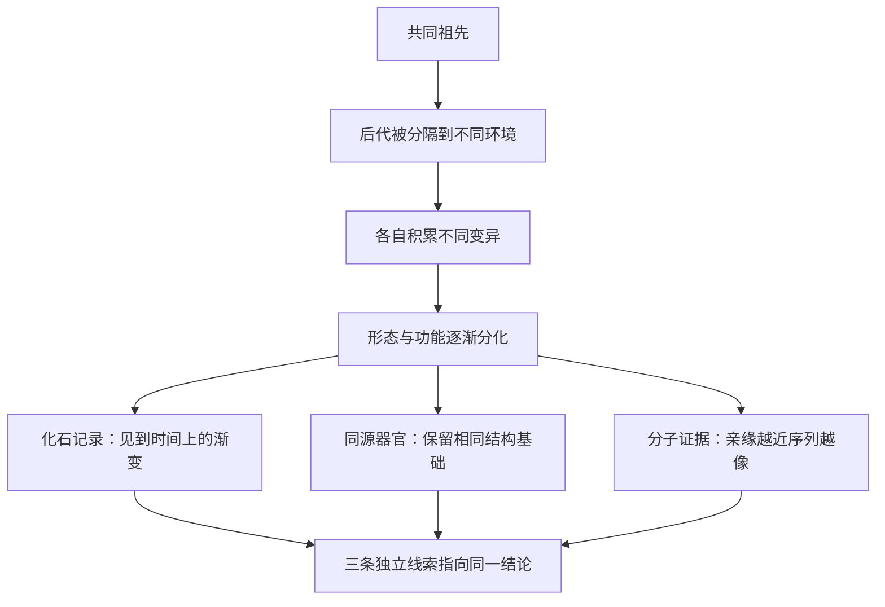

# 05｜进化论有什么证据？

> 进化论只是一个“理论”吗？它凭什么成立？

---

## 一、先说结论

王立铭认为，进化论之所以可靠，不在于它讲得动听，而在于它有来自**多个独立领域**的证据，并且这些证据彼此印证。

主要的几条证据是：**化石记录**给出生命形态随时间变化的顺序；**比较解剖**发现不同物种身上竟有结构相似、用途不同的器官；**生物地理分布**揭示物种分布与地理历史的关系；**胚胎发育**显示不同动物早期发育惊人相似；而最具决定性的，是**分子证据**——所有生命共享同一套遗传密码。

当这么多互不相关的线索指向同一个结论时，它的可靠性，远超“一家之言”。

---

## 二、我们先理解一个问题

先破一个印象。

反对进化论时最常听到的一句话是：**它只是“一个理论”而已。** 言下之意，理论就等于猜测，证据不足。

但在科学里，“理论”的意义恰恰相反：它指的是经过大量证据检验、能够解释和预测现象的解释体系。万有引力是理论，原子论是理论，它们都不是“随便猜猜”。

所以真正的问题不是“它是不是理论”，而是：**它有没有证据？证据是否来自独立的多个方向？** 这才是判断一个科学结论可靠性的关键。

---

## 三、作者到底提出了什么观点？

王立铭强调的是“证据的交叉验证”，而不是只靠某一条孤立的证据。

他把证据组织成几条相对独立、又彼此支持的线索：

1. **化石记录**：地层里保存着不同时代的生物遗体与痕迹，它们按时间呈现出形态上的渐变与更替。
2. **比较解剖（同源器官）**：人手、蝙蝠的翼、鲸的鳍，外观与功能天差地别，骨骼结构却共享同一套基本方案。
3. **生物地理**：物种的分布，常与大陆漂移、岛屿隔离等地理历史吻合。
4. **胚胎发育**：不同类群的动物，在胚胎早期会呈现出相似的阶段。
5. **分子证据**：DNA、RNA、蛋白质等分子机制在所有生命里高度统一，且亲缘越近，序列越像。

他指出，这几条线索来自完全不同的学科、不同的方法、不同的证据类型。**它们各自独立，却共同指向“生命有共同祖先、并在不断演化”这一结论。** 这种“殊途同归”，才是进化论最坚固的地方。

---

## 四、把这个观点翻译成人话

先看**化石记录**。

地层就像一部按顺序叠放的史书：越往下的岩层越古老。科学家在这些岩层里发现了不同时代的生物遗迹，并且看到了一个规律：**越古老的生物，形态越简单、越原始；越接近现代的岩层，形态越接近今天的生物。** 更重要的是，经常能发现处在两类生物之间的“过渡形态”，把原本断裂的链条接起来。

再看**同源器官**。

把手伸出来、把蝙蝠的翼摊开、把鲸的鳍剖开——它们看起来毫无共同点。但看骨骼就会发现：它们都是由**同一套基本骨骼**改造而成的，只是比例、形状和用途变了。人的手用来抓握，蝙蝠的“手”被拉长成翼膜骨架，鲸的“手”变成划水的鳍。

**不同用途，同一套设计。** 最合理的解释就是：它们来自同一个祖先，各自朝不同方向被改造——这就是同源器官的意义。

---

## 五、为什么会这样？

几条独立证据为什么会指向同一个结论？可以这样理解：

关键在 H 这一步。**如果这些证据各自独立地指向同一结论，那么它们同时出错的可能性就极低。** 一个假说，如果只靠一条证据支撑，可能是巧合；但如果解剖学、地层学、分子生物学用完全不同的方法得到同一个答案，这就非常难以用巧合解释。

这就是“交叉验证”的力量——**不是某一条证据特别强，而是许多条互不相关的证据，共同把结论钉牢。**

---

## 六、举一个现实生活中的例子

把化石与同源器官放在一起看，画面会更清楚。

**化石**告诉我们“什么时候发生了什么”。在越古老的岩层里，越能见到结构原始的鱼类；往上的岩层里，陆续出现既能用鳃、又疑似有肺的水陆过渡形态；再往上的岩层里，才出现更适应陆地生活的四足动物。地层一层层记录着时间，形态也一层层地变化。

**同源器官**则告诉我们“变化的底层逻辑是什么”。人类的手臂、蝙蝠的翼、鲸的鳍，都是同一套前肢骨骼的不同改装版。它们不是各造各的，而像是从同一份图纸出发，按不同用途各改一处。

一个提供**时间顺序**，一个提供**结构线索**——两者相互配合，共同指向同一个解释：**这些生物来自共同的祖先，在漫长的时间里被环境筛选、逐步改造。** 这正是进化论所描述的图景。

---

## 七、回到书中重新理解

现在再回看王立铭为什么要罗列这么多条证据，就明白了。

- 为什么单一证据不够？因为任何一条证据都可能存在漏洞与缺口，可信度会打折扣。
- 为什么“独立”如此关键？因为来自不同学科的独立证据，很难被同一个错误同时解释。
- 为什么他反复强调“交叉验证”？因为科学结论的可靠性，正来自这种**多路径指向同一答案**的结构。

所以，进化论的力量不在于它是“一个理论”，而在于它是一个**被解剖学、地层学、地理学、分子生物学从不同方向反复检验过的理论**。

---

## 八、这个观点背后还有什么？

**第一，证据有“预测能力”。** 进化论不只是事后解释，它还能做出预测。比如，根据“水陆过渡”的演化预期，科学家曾预计某类古老地层中应当存在介于鱼和四足动物之间的化石，后来确实找到了相应形态的过渡化石。能做出并被验证的预测，是科学理论的重要标志。

**第二，分子证据后来居上。** DNA、RNA、遗传密码在全部已知生命中高度统一，且亲缘关系越近、序列差异越小。这一类证据在定量上极为精确，被视为最具决定性的证据之一。

**第三，多条证据之间可以相互校准。** 化石给出的时间顺序、解剖给出的结构关系、分子给出的亲缘距离，可以互相印证，也能互相校正时间尺度。

**第四，证据越丰富，结论越稳定。** 现代进化生物学的证据量，比达尔文时代多了几个数量级，而结论的方向始终没有被推翻。

---

## 九、这个观点有问题吗？

证据充分，并不意味着每一个细节都已解决；这里需要更平衡地看。

**第一，化石记录确实不完整。** 因为形成化石需要极苛刻的条件，能保存下来的只是极小一部分。所以“缺环”是常态，而不是反例。换句话说：**化石的不完整是预料之中的，而已经找到的大量过渡形态，恰恰是进化论的正面证据。** 至于怎么解释缺失的部分，学界仍在通过新发现不断补充。

**第二，同源结构也可能与“趋同”混淆。** 有些相似来自共同祖先（同源），有些则来自不同祖先面对相似环境的独立演化（趋同）。区分这两者需要仔细分析，不能见到相似就断定同源。

**第三，进化论可以被证伪吗？** 这正是它属于科学而非常识的原因：如果发现一具明确处在错误地层、与演化顺序严重矛盾的化石，或者找到与遗传密码体系毫无关系却共享同一生化机制的生命，都会构成严峻挑战。它们至今没有被发现，这本身就是一种支持。

**第四，“只是理论”这个说法，混淆了两种含义。** 日常语言里的“理论”接近“猜测”，科学里的“理论”却意味着“经过检验的解释体系”。进化论属于后者，其证据强度与万有引力、原子论属于同一量级。

**所以更准确的说法是**：进化论不是靠某一条“铁证”成立的，而是靠一批来自独立方向的证据共同支撑；它的细节会继续被修正，但核心结论至今稳固。

---

## 十、今天再看这个观点

以下部分是基于王立铭讲义内容的现代延伸，不是王立铭的原话。

进化论的证据，在今天比过去任何时候都更充分：

- **基因组测序**：我们能够直接比较任意两个物种的 DNA 序列，精确计算亲缘关系；
- **过渡化石**：鱼与四足动物、恐龙与鸟类、陆生哺乳动物与鲸之间的过渡形态，陆续被找到；
- **分子钟**：利用分子差异的积累速度，可以估算物种分家的时间，并与化石记录相互印证；
- **实验进化**：在实验室里，微生物的演化甚至能被实时观察。

也就是说，进化论早已不是“只有化石撑腰”的假说，而是**被多重现代技术反复检验的主流科学框架**。

---

## 十一、这一篇真正应该记住什么？

1. **进化论不是“一个猜测”，而是被多重证据检验过的科学理论。**
2. **证据来自多个独立领域：** 化石、比较解剖、生物地理、胚胎、分子。
3. **同源器官是最直观的证据之一：** 不同用途，同一套结构基础。
4. **交叉验证是关键：** 独立证据共同指向同一结论时，可靠性极高。
5. **化石不完整是常态，** 而已经找到的过渡形态，正是正面证据。

---

## 十二、留一个问题

> 如果说化石、解剖与分子的证据都指向“不同生物来自共同祖先”，
> 那么接下来更惊人的推论是：
> 我们和细菌、蘑菇、橡树之间，真的存在“亲戚关系”吗？

---

证据指向了一个方向：所有生命似乎都从共同祖先分叉而来。顺着这条线，下一个问题就变得不可避免——**为什么说所有生命有共同祖先？** 下一篇，我们就从最不起眼的分子出发，去追问这个足以重塑生命观的结论。
