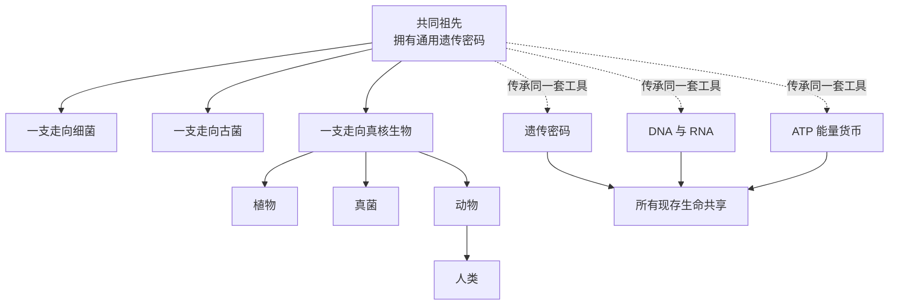

# 06｜为什么说所有生命有共同祖先？

> 凭什么说人类和细菌、蘑菇、橡树是“亲戚”？

---

## 一、先说结论

王立铭认为，所有已知生命之所以能被放进同一棵“生命之树”，不是因为我们主观上想给它们攀亲戚，而是因为它们共用一套几乎一模一样的“底层系统”：**同一套遗传密码，同一类遗传物质（DNA 与 RNA），同一个能量货币（ATP）。**

换句话说，人类、细菌、蘑菇、橡树之间的相似，不是表面的相似，而是“代码级”的统一。面对这种统一，最省事、也最合理的解释只有一个：它们不是各自从零发明，而是从同一个共同祖先那里继承下来的。

生命之树因此不是文学比喻，而是一张可以量化的亲缘关系图谱。

---

## 二、我们先理解一个问题

先问一个听起来有点荒谬的问题。

如果地球上的生命是各自独立起源的，或者是被分别“设计”出来的，那么它们最可能的样子是什么？应该是各说各的语言——你有一套密码，我有一套密码，彼此互不相通，就像地球上不同地区各自发明了不同的文字。

可事实恰恰相反：从深海热泉里的细菌，到热带雨林里的橡树，从一朵蘑菇到你身上的一个细胞，读基因的方式几乎完全相同。这不是“有点像”，而是“对得上”。

这就不再是巧合问题了。它要求我们解释：**为什么差异如此巨大的生命，会在最底层使用同一套规则？**

---

## 三、作者到底提出了什么观点？

王立铭的观点可以拆成三层。

**第一，统一性发生在“密码”层面。** 遗传信息用四个字母写就，每三个字母组成一个密码子，对应一种氨基酸；这套对应表，几乎在所有已知生命里通用。你身上的一个基因，换到细菌里，细菌大致能读得懂。

**第二，统一性还发生在“机器”层面。** 遗传物质是 DNA（少数病毒用 RNA），转录、翻译、供能用的是同一类分子机制，连能量货币都是同一个 ATP。生命在关键环节上共享同一套零件。

**第三，统一性是“倒逼出来的推论”。** 王立铭强调，共同祖先不是凭信仰相信的，而是被证据逼出来的结论：如果大家各有各的起源，就很难解释为何共用同一套密码；而如果大家同源，这套统一性就顺理成章。科学在这里用的是“最简解释”的原则。

他还特别提醒区分“同源”与“相似”：相似可以是环境逼出来的巧合，同源的相似才指向共同祖先。这一点，是理解整棵生命之树的关键。

---

## 四、把这个观点翻译成人话

把遗传密码想象成一本词典。

这本词典只有四个字母，却规定了“哪三个字母连在一起，代表哪一种氨基酸”。全世界所有生命，都用同一本词典、同一套查词规则，写出各自的“文章”。

如果人类和细菌是各自独立发明的文字系统，那么两套系统碰巧使用同一本词典、同一套语法，概率低到近乎不可能。合理的解释是：**这本词典是祖传的，大家一起用，一直用到现在。**

于是“共同祖先”就从一个宏大的说法，变成了一个非常具体的判断：所有现存生命，都继承自同一个曾经活过的祖先群体。

---

## 五、为什么会这样？

从共同祖先出发，统一性自然就分叉成了今天的多样性：

关键在于：**分叉改变的是“用这套系统做什么”，而不是“用哪套系统”。**

细菌拿这套系统去适应极端高温，橡树拿它去长高，人类拿它去长出大脑——任务千差万别，但底层的工具没有换。就像同一套字母表，可以写出科学论文，也可以写出一首情诗。

---

## 六、举一个现实生活中的例子

最直观的现实例子，就是**人们把基因从一个物种搬进另一个物种，而后者居然真的能用。**

比如人胰岛素的生产：科学家把人类的胰岛素基因接进大肠杆菌，让细菌按照自己那套通用密码去读取这段人类基因，结果细菌真的造出了和人体内一样的胰岛素。今天许多糖尿病患者使用的胰岛素，正是这样由微生物“代工”生产的。

这件事能够成功，反过来就是一个极强的旁证：**细菌与人类读的是同一本词典。**

如果密码各不相同，把人的基因塞给细菌，只会得到一堆无意义的乱码，而不是可用的蛋白质。跨物种的基因操作之所以成立，前提正是那套代码级的统一性。

---

## 七、回到书中重新理解

现在再看王立铭为什么反复强调“统一性”，逻辑就清楚了。

一般人说到进化，总盯着差异：长颈鹿的脖子、蝙蝠的翅膀、人类的大脑，各有各的奇观。但真正有说服力的证据，往往藏在这些差异的**背面**——那些所有人都一样的地方。

差异可以被环境一一解释掉，可“大家共用同一套底层系统”这件事，很难用“各自适应”来搪塞。它更像一份遗产清单：因为来自同一个祖先，所以大家都分到了同一套家当。

这也是为什么共同祖先与生命之树不是修辞，而是可检验的科学命题：它预测你会在任何一个尚未研究过的物种身上，再次找到同一套密码。而这个预测，至今没有被推翻。

---

## 八、这个观点背后还有什么？

**第一，它指向“现存生命大概率只有一次起源”。** 至少我们今天看到的所有生命，共享同一个起点。这不等于说宇宙中生命只起源过一次，但在地球上，现存的这一大家子很可能同宗。

**第二，它让分子生物学变成了一门“通用语言”。** 正因为密码通用，研究细菌得到的规律，往往能迁移到人身上；实验工具、基因编辑手段也才能跨物种使用。

**第三，它把“生命之树”落到了具体的节点上。** 人们用“最近共同祖先”来描述所有现存生命回溯到的那一个祖先群体。但要注意，它未必是地球上的“第一个生命”，更不是进化的目标或顶点。

**第四，统一性并不排斥多样性。** 恰恰是同一套系统，被不同分支用出了千姿百态。统一是地基，多样是楼阁。

---

## 九、这个观点有问题吗？

作为科学结论，共同祖先极为稳固，但仍有几处必须分清的边界。

**第一，统一性是强证据，但“强证据”不等于“绝对证明”。** 逻辑上，你可以设想生命多次起源后彼此交换了共同的工具箱；然而目前没有任何证据支持独立起源，最简解释依然是同源。

**第二，现代研究发现，“树”也可能部分是“网”。** 一些进化生物学家认为，尤其在微生物世界里，水平基因转移和病毒让基因可以在不同分支间横向流动，生命之树的某些部分更像一张互相交织的网。关于树与网孰主孰次，学界仍在讨论。

**第三，那个共同祖先从未被直接观察到。** 它不是一具化石，而是我们从现存生命的共同特征反推出来的一个推论。区分“证据”与“推论”，是严肃对待科学的基本功。

**第四，“共同祖先”不等于“进化的终点指向人类”。** 我们只是这棵大树上一根很晚才抽出的枝条，而不是整棵树的顶端。

所以更准确的说法是：共同祖先目前是对生命统一性最有力的解释，但它是一张不断被验证、也允许被局部修正的网，而不是一句不可触碰的口号。

---

## 十、今天再看这个观点

以下部分是这一观点的现代延伸，不是王立铭的原话。

今天的生物技术产业，几乎都建立在这套统一密码之上。基因工程之所以能把一段基因从人搬到细菌、从植物搬到酵母，正是因为底层规则相通；基因编辑、重组蛋白药物、部分疫苗技术，也都依赖这种跨物种的可操作性。

在基础研究里，科学家常常用酵母、果蝇、线虫、小鼠这些“模式生物”来研究人类生理，就是因为大家共用同一套分子机制。研究细菌的代谢，有时能照见人类细胞的秘密。

而在寻找地外生命时，这套逻辑也被反过来使用：如果将来在某颗星球上找到的生命，用的是**另一套**完全不同的遗传密码，那才可能说明它是独立起源的；若仍是同一套，人们反而要谨慎地怀疑它是不是地球生命的“亲戚”或污染物。统一性，既是地球生命的历史，也是一把判断外星的尺子。

---

## 十一、这一篇真正应该记住什么？

1. **所有已知生命共用同一套遗传密码、同一类遗传物质和同一个能量货币。**
2. **这种统一性最合理的解释，是它们来自同一个共同祖先。**
3. **生命之树不是比喻，而是可以量化的亲缘关系图谱。**
4. **要区分“相似”与“同源”，也要区分“证据”与“反推的推论”。**
5. **统一不等于单调；恰恰是同一套系统，被用出了全部的多样性。**

---

## 十二、留一个问题

> 如果所有生命都写着同一套密码，那么这套密码究竟是被老老实实“垂直继承”下来的，
> 还是在漫长岁月里被病毒和微生物“横向借来借去”？
> 如果后者发生的比我们想象的多，我们画生命之树的方式，是不是需要改一改？

---

**下一篇**：共同祖先这个判断，靠的不是单一权威，而是几条来源完全不同的证据同时指向同一个答案。化石、地理、分子——这三条看起来毫不相干的线索，究竟是怎么互相印证的？

下一篇我们就来拆开这个问题——**化石地理与分子：三条证据链。**
