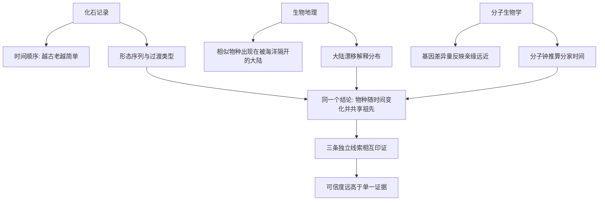

# 07｜化石、地理与分子：三条证据链

> 三种看起来毫不相关的学科，如何共同证明进化？

---

## 一、先说结论

王立铭认为，进化论之所以坚固，不在于某一件“决定性证据”，而在于三条彼此独立、却又指向同一结论的证据链：

- **化石**给出时间与形态的顺序；
- **生物地理**揭示物种分布与大陆漂移的关系；
- **分子生物学**通过基因差异推算亲缘关系与分家时间。

三条链各自从不同方向走来，最后汇到同一个结论上。真正让进化论站稳的，不是“某一门学科说了什么”，而是“多个互不相通的学科说了同一件事”。

---

## 二、我们先理解一个问题

先想一个问题：如果只有一条证据，它可靠吗？

一条线索，往往可以被单独解释掉。地质学家可以争论某块化石代表什么，也可以争论某个地层是不是被扰动过；只要是一根独木桥，就总有掉下去的可能。

但如果有三条**来源完全不同**的线索，各自独立得出同一个结论，情况就变了。因为它们要同时出错、还要错得彼此吻合，这种概率极低。

这就是科学里“交叉验证”的力量：**不是把一条证据说得很响，而是让多条独立证据互相咬合。** 进化论正是靠这一点，从“一种猜想”变成了“几乎无法撼动的地基”。

---

## 三、作者到底提出了什么观点？

王立铭把证据整理成三条链。

**第一条，化石链——时间顺序。** 地层是一层压一层的时间档案。越古老的地层里，生物形态越简单、越原始；从老到新，能看到形态逐步变化的序列，也能看到一些兼具两类特征的过渡类型。化石给出的，是“何时有什么”的历史顺序。

**第二条，地理链——分布与漂移。** 为什么隔着大海的两块大陆上，会出现亲缘很近却又不完全相同的物种？如果物种是被固定创造在各自位置的，这很难解释；但如果这两块大陆曾经相连，后来漂开，一切都说得通。地理链给出的，是“为何在这里”的空间解释。

**第三条，分子链——亲缘与分家时间。** 比较不同物种的 DNA 序列，差异越小，亲缘通常越近；差异越大，分家通常越早。把这种差异量当成一种“分子钟”，就能推算两个物种大约在多久以前分道扬镳。分子链给出的，是“谁和谁最近、何时分手”的量化答案。

他强调的，不是三条链各自有多精彩，而是它们**必须互相印证**。

---

## 四、把这个观点翻译成人话

可以把这三条证据链想象成三个互不通气的侦探。

第一个侦探只看现场旧照片（化石），能说出事情大概按什么顺序发生；第二个侦探只看地图和房间布局（生物地理），能说出东西为什么摆在这些位置；第三个侦探只做化学化验（分子），能算出当事人之间谁和谁更亲。

三个人用的是完全不同的方法，拿的是完全不同的材料，独立破案。如果最后他们给出的结论完全一致，那么真相几乎不言自明。

反过来，如果任何一个侦探的结论和其他两人严重冲突，这个案子就还有大问题。进化论的稳固，正来自这三份“独立报告”的相互吻合。

---

## 五、为什么会这样？

这张图想说明的，是**收敛**：三条链不是简单地叠加，而是从三个独立起点，指向同一个终点。

值得留意的是，它们各自还有一层时间上的呼应。化石告诉你某类生物在哪个年代出现，分子钟独立估算出它与其他类群分家的时间，生物地理再告诉你它的分布是怎么被大陆分裂和迁徙解释的。三者的时间线若能大致对上，这个结论就非常硬。

---

## 六、举一个现实生活中的例子

**第一，化石记录的时间顺序。** 地层像一叠没有打乱的书页，越靠下越古老。人们在古老地层里很难找到复杂动物的身影，而在较新的地层里，复杂形态逐渐丰富。更重要的是，某些地层中出现了兼具两类特征的过渡类型——它们既像甲，又像乙，恰好出现在“按时间推算应该出现”的位置。这不是凭空断言，而是可以被不断挖掘检验的预测。

**第二，生物地理与大陆漂移。** 南美洲和非洲之间隔着宽阔的大西洋，可两块大陆上却生活着一些亲缘很近、却不完全相同的物种。更巧的是，把两块大陆的海岸线拼起来，能大致合拢。合理的解释是：它们原本相连，物种可以自由来往；后来大陆裂开漂走，两边的生命从此各走各的路，慢慢分化出不同的模样。分布，于是成了一段地质史的记录。

**第三，分子钟推算亲缘与分家时间。** 比较两个物种的 DNA 序列，会发现差异不是随机的，而是随着亲缘远近呈现规律。差异小，说明分家不久；差异大，说明分家很早。把这些差异量放到校准过的“时钟”上，就能估算出大约在多少万年前分开。奇妙的是，这样算出来的时间，常常能和化石给出的年代大致对上。

三条证据，用的语言完全不同：一个是石头的语言，一个是地图的语言，一个是字母的语言。它们能对话，本身就是一件了不起的事。

---

## 七、回到书中重新理解

再回看王立铭的安排，就明白他为什么把这三条专门放在一起讲。

因为单独看任何一条，都留有被质疑的余地：化石有缺失，地理解释有争议，分子钟有误差。可一旦三条独立线索在关键结论上重合，质疑就需要一个更“贵”的解释——你得同时解释掉三条本来毫无关系的证据，还要解释它们为何碰巧一致。

这正是进化论区别于普通猜测的地方：它不是靠一个权威的口吻说话，而是靠**多路证据的共同约束**说话。王立铭想传递的，与其说是某个结论，不如说是一种做科学的方式：不迷信单一来源，看重独立证据的收敛。

---

## 八、这个观点背后还有什么？

**第一，交叉验证是一种方法论。** 它的价值不限于进化论。任何领域，当多个独立来源指向同一结论时，可信度都会大幅提升；反之，只靠单一来源的“铁证”，往往经不起时间检验。

**第二，三条链其实共享一套时间框架。** 地质年代、生物演化、分子钟，都在同一根时间轴上对话。谁和谁对上，谁和谁冲突，是可以被追问、被修正的。

**第三，证据的“独立性”本身也值得审视。** 严格说，三条链并非完全独立，它们多少都依赖对地质与生物的共同假设。所以科学的严谨，不在于宣称“绝对独立”，而在于诚实地标明哪里可能共享前提。

**第四，这条思路让“预测”成为可能。** 如果结论成立，就能预测：在某个年代的地层里，应当能找到某类形态；在两个曾相连的大陆上，应当能找到亲缘相近的物种。证据链不是事后诸葛，而是能提前下注的框架。

---

## 九、这个观点有问题吗？

必须承认，三条证据链各有软肋。

**第一，化石记录不完整。** 能变成化石、又被发现的，只是历史上存在过的生命中的极小一部分。因此“某个环节缺失”本身不能直接用来反驳演化，缺的可能只是样本；反过来，把缺失直接当作“从未存在”，逻辑上也站不住。

**第二，分子钟并不精确。** 它依赖校准点，也假设基因变化速率大致稳定，而现实中不同类群、不同基因的速率可能不同。因此分子钟给出的是估算与区间，而不是精确到点的日期。

**第三，地理解释存在竞争假说。** 面对相似的分布格局，有人强调大陆漂移造成的隔离，也有人强调生物自身的扩散能力。关于某一段历史究竟该用哪套解释，学界常有不同意见。

**第四，三条链的“独立”是有限度的。** 它们会共享一些底层前提，因此这种收敛虽强，也不宜被夸大成“绝对无法推翻”。科学结论的可靠，是概率意义上的高，而不是逻辑意义上的死。

所以更准确的说法是：每条证据链单独看都有局限，但局限并不抵消它们的相互印证；正是这种“各自有缺陷、却共同收敛”，构成了进化论最坚固的部分。

---

## 十、今天再看这个观点

以下部分是这一观点的现代延伸，不是王立铭的原话。

今天的证据链，比王立铭所讲的那个经典版本更密。基因组测序让“分子链”从比较几个基因，扩展到比较整个基因组；大规模数据让亲缘关系图谱画得越来越细。古 DNA 技术则把分子证据直接读进了化石与遗骸里，让“石头”和“字母”第一次真正在同一具样本上对话。

在生物地理一侧，卫星影像、板块重建模型与物种分布数据被结合起来，能更精细地复原大陆漂移与迁徙路径。化石研究也不再只靠肉眼形态，而是借助显微与化学手段，从骨骼和软组织中榨取更多信息。

于是，当年三条相对粗糙的线索，如今已经长成一张互相嵌套的证据网。它们仍会争辩细节，却极少动摇那个共同的结论——因为要推翻它，你需要同时解释掉整张网。

---

## 十一、这一篇真正应该记住什么？

1. **进化论的坚固，来自三条独立证据链的收敛，而非单一铁证。**
2. **化石给时间顺序，生物地理给空间解释，分子给亲缘与分家时间。**
3. **交叉验证的方法论，比任何单条证据都更有力量。**
4. **每条链都有局限：化石不完整、分子钟不精确、地理解释有竞争假说。**
5. **证据的收敛是概率意义上的极强，而不是逻辑意义上的不可推翻。**

---

## 十二、留一个问题

> 如果三条证据链偶尔彼此打架——化石说的年代和分子钟差了一截，
> 那么一个诚实的研究者，
> 究竟应该相信谁，又该怎样处理这种冲突？

---

**下一篇**：证据链建好了，但还有一个更细的问题没解开——那些看起来精妙绝伦、仿佛被精心设计的“适应”，究竟是怎样从零开始，一点一点被累积出来的？

下一篇我们就来拆开这个问题——**适应是怎么形成的。**
