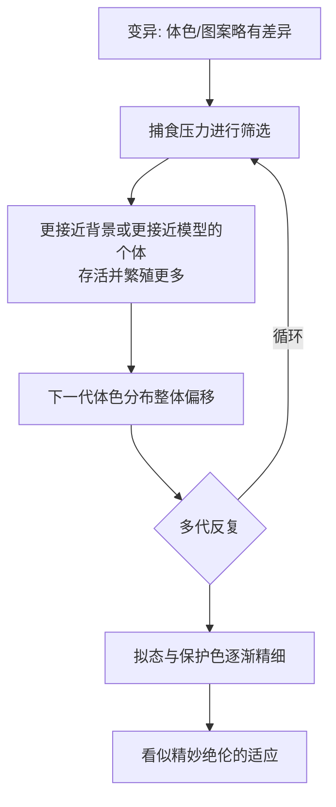

# 08｜适应是怎么形成的？

> 一个精妙的“适应”，是如何一步步累积出来的？

---

## 一、先说结论

王立铭认为，适应不是一步到位被“造”出来的，而是**微小优势长期累积的结果。**

每一代里，只要某些个体略微更有优势，它们就更容易活下来、留下更多后代；这些微小的优势被一代代保留、叠加，经过无数代，就可能长成看起来精妙绝伦的功能——就像拟态与保护色那样，从“不太像”一直磨到“几乎认不出”。

所以适应的关键，不是“必须一次成功”，而是**“每一步都略微更好”**。这正是它能无需设计者、也无需奇迹的原因。

---

## 二、我们先理解一个问题

先面对一个常见的怀疑。

看到一只昆虫完美地伪装成一片枯叶，或者一种动物精确地模仿另一种有毒物种的配色，人很容易觉得：这么精巧的东西，怎么可能是随机凑出来的？中间那些“半成品”难道不是废物吗？

这个怀疑很自然，但它建立在一个错误的前提上：它假设适应必须“一次性达到终点”，中间状态没有价值。

真正的难点不是“能不能一次造出完美”，而是：**是否存在一条每一步都略微占优的缓慢斜坡。** 只要斜坡存在，累积就能发生；而不用指望一步登天。

---

## 三、作者到底提出了什么观点？

王立铭的答案，可以归纳成四点。

**第一，适应靠累积，不靠跃迁。** 自然选择每一代只需要筛出“稍微好一点”的个体，时间足够长，效果就会非常惊人。

**第二，微小优势是有意义的。** 不必一开始就“很像”，只要比同伴略像一点，就可能在捕食者眼里少被注意一点，多留一点后代。优势虽小，方向一致。

**第三，中间形态不是废品。** 在半途的形态，往往在自己的环境里也有用，甚至是进一步改良的基础。适应是“就地取材、逐步打补丁”，而不是先画好图纸再施工。

**第四，适应是相对的。** 适应某个环境，不等于适应所有环境；环境一变，曾经的“精妙”也可能变成负担。

他特别强调，正是“累积”这一个看似朴素的机制，让自然选择拥有了近乎无穷的创造力。

---

## 四、把这个观点翻译成人话

用**拟态与保护色**来理解。

设想有一群生活在某片环境里的昆虫。它们的体色本来五花八门：有的鲜艳，有的灰扑扑。捕食者靠视觉找食。

- 那些体色碰巧更接近背景（比如更像树皮、更像叶片）的个体，被发现的概率低一点，于是多活下来一些，多留一些后代；
- 下一代里，这群昆虫的体色分布就整体往“更接近背景”的方向偏了一点；
- 新的一代中，又会有个体碰巧更贴近一点、图案更碎一点；
- 捕食压力继续筛选，偏一点点的再次占优……

**不需要任何一代出现“完美伪装者”。** 每一代只要求“比平均稍微隐蔽一点”，几十代、几百代、成千上万代之后，我们就看到了一只几乎与环境融为一体的昆虫。

同样的道理，也适用于模仿：若某种无毒昆虫里，碰巧有个体颜色略微像一种有毒昆虫，捕食者会少吃它；于是“略像”被保留，“更像”又被保留……久而久之，就出现了令人惊叹的拟态。

---

## 五、为什么会这样？

累积选择是一个不断“升级”的循环：

关键在 **C → D** 这一步：它把一次微小优势，转化成了下一代整体分布的偏移。这个小小的“挪动”若能持续重复，累积起来就是巨大的距离。

这里要理解一对概念：**变异是随机的**，突变不会“朝着更像树干”的方向发生；**选择是非随机的**，环境稳定地偏爱更隐蔽的一方。随机的原料，加上稳定的筛选，几十年、几百万年地跑下去，就会产生方向感。

所以适应的“聪明”，不是生物算出来的，而是被淘汰机制一遍遍打磨出来的。

---

## 六、举一个现实生活中的例子

拟态与保护色，在现实中既经典又直观。

先说保护色。有一个被反复讲述的真实案例：某些蛾类平时以浅色为主，停在浅色树干上不易被发现。当环境改变、树干颜色变深后，**深色个体反而更隐蔽**，于是存活率更高、繁殖更多，群体中深色的比例随之上升；环境若再变回去，浅色又会重新占优。整个过程没有哪只蛾“决定”变色，只是不同深浅的个体被环境轮流偏爱而已。

再说拟态。一些无毒的物种，会演化出与有毒物种相似的色彩与图案。捕食者曾因误食有毒者而吃过亏，于是学会避开这套“警戒配色”；无毒者只要长得像它，就能分享这份“被回避”的好处。从“略微像”到“几乎难辨”，正是无数代微小优势累积的产物。

这两个例子合起来说明同一件事：**精妙不是被设计出来的，而是被一遍遍筛选、叠加出来的。** 每一代都只是“比上一代好一点点”，时间却把这点点好，攒成了令人惊叹的效果。

---

## 七、回到书中重新理解

现在再看王立铭讲适应，就能抓住他的重点。

很多人误以为，进化必须先有蓝图，再有施工；先有目的，再有手段。但累积选择的图景恰好相反：**没有蓝图，只有方向；没有目的，只有筛选。** 每一步都是局部的、当前的、微小的，可只要方向稳定，长期结果就好像被“规划”过。

这也解释了为什么适应常常显得“够用但不完美”。因为它是从已有结构上一点点改出来的，带着历史的痕迹与将就的补丁，而不是从零重新设计的杰作。理解了累积，也就理解了为什么适应既精妙，又总有些别扭。

---

## 八、这个观点背后还有什么？

**第一，累积解释了“复杂”可以不靠奇迹。** 复杂结构不必一次诞生，它可以是许多小改进的叠加。这让“无需设计者的设计”成为可能。

**第二，累积也解释了“不完美”。** 因为只能就着旧结构改，所以适应常带着历史包袱，像是不断加盖、又不断打补丁的老房子。

**第三，中间形态有意义，是反驳“半成品无用”的关键。** 只要中间状态在自己的环境里也能用，斜坡就存在，累积就能继续。

**第四，累积选择天然连接着时间尺度。** 它在几十代里效果微弱，在成千上万代里就足以改天换地。时间，是这个机制最被低估的原料。

---

## 九、这个观点有问题吗？

累积选择极为有力，但它的适用范围需要诚实地圈定。

**第一，对于某些极其复杂的结构，中间形态是否真有优势，曾引发争论。** 有人质疑眼睛这类器官的“半成品”有什么用；而研究表明，从感光斑点到能成像的眼睛，中间阶段往往各自都有不同的用途。这说明质疑可以被回答，但回答依靠的是具体证据，而不是一句“反正能累积”。

**第二，存在“过度适应主义”的风险。** 一些进化生物学家提醒，并非所有特征都是自然选择打磨出的适应。有些特征可能只是中性漂变的结果，有些可能是别的适应“顺带”带出来的副产物——像拱顶的拱肩，本不是为装饰而生，却被后人当成了装饰。把所有特征都解释成适应，容易过度解读。

**第三，拟态本身也可能有竞争解释。** 比如捕食者的感官偏好、学习行为等，都可能参与塑造色彩与图案。关于某一具体拟态究竟是哪种力量主导，学界仍有不同意见。

**第四，累积需要“可累积的斜坡”。** 如果某个功能要求多个部件同时到位才有用，那么单靠微小优势的累积就会遇到困难。这类“协同门槛”是否可由累积跨越，是需要逐案分析的问题，不能一概而论。

所以更准确的说法是：累积选择是理解适应的核心机制，但它不是万能钥匙；面对具体特征，仍需分清哪些是适应、哪些是搭便车、哪些只是历史偶然。

---

## 十、今天再看这个观点

以下部分是这一观点的现代延伸，不是王立铭的原话。

“微小优势不断累积”这一思想，早已走出生物学。计算机里的进化算法、遗传算法，就是模仿这套逻辑：不必一步求最优，而是让大量候选方案不断变异、筛选、保留，逐代逼近期望的结果。类似的思路也进入了工程优化与人工智能的搜索方法。

在应用层面，这个视角对现实管理极有价值。农业与公共卫生中，害虫抗药性、细菌耐药性的出现，本质上就是“微小优势在药物选择压力下被迅速放大”的过程。理解累积，就能理解为什么轮换用药、减少滥用、设置“避难所”能延缓抗性扩散。

在医学与环境保护中，人们也开始更谨慎地对待“适应”二字：一个特征看起来有用，未必就是被选择出来的；反过来，一个看似没用的特征，也可能在特定环境里至关重要。分清这些，直接关系到干预措施是否有效。

---

## 十一、这一篇真正应该记住什么？

1. **适应是微小优势长期累积的结果，不是一步到位的设计。**
2. **关键不是一次成功，而是每一步都略微更好。**
3. **中间形态往往有自己的用处，斜坡存在，累积就能发生。**
4. **变异随机、选择非随机；随机原料加稳定筛选，产生方向。**
5. **适应常“够用但不完美”，因为它是在旧结构上不断打补丁。**

---

## 十二、留一个问题

> 如果适应总是“够用就好”，而不是追求极致，
> 那么一个看似精妙、实则累赘的特征——
> 比如拖着沉重却华丽尾巴的孔雀——
> 为什么反而会被保留下来？它适应的究竟是什么？

---

**下一篇**：有些特征明明在拖生存的后腿，却依然被演化保留甚至加强。这说明“活下去”之外，还有另一股力量在起作用。

下一篇我们就来拆开这个问题——**性选择：为什么孔雀有华丽的尾巴。**
