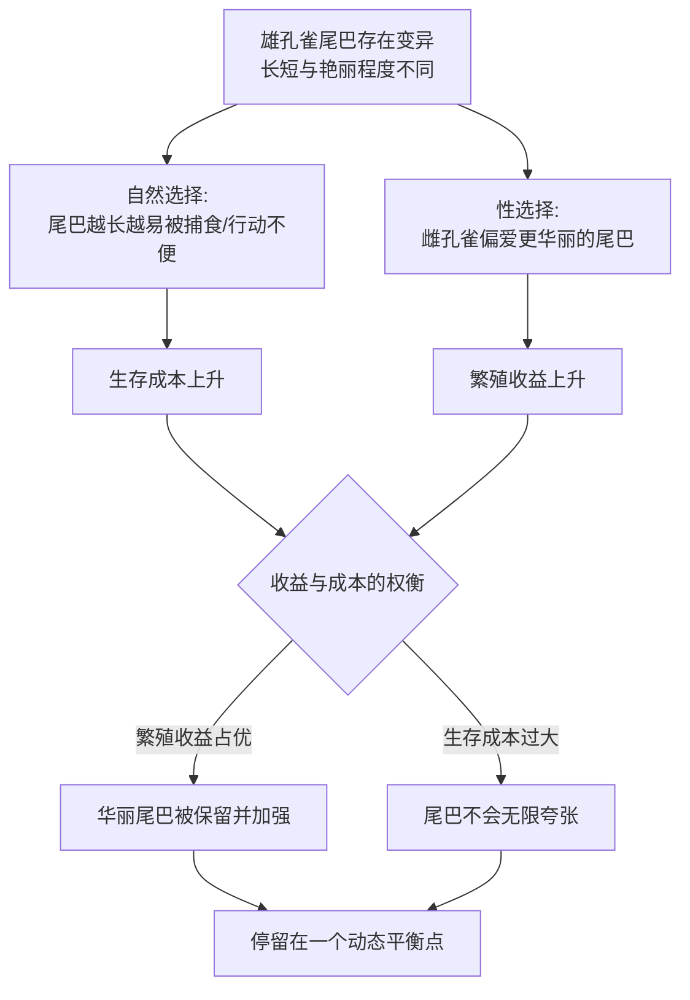

# 09｜性选择：为什么孔雀有华丽的尾巴？

> 尾巴明明拖累生存，为什么还会进化出来？

---

## 一、先说结论

王立铭认为，生命的目标不只有“活下去”，还有“赢得配偶”。除了自然选择，还存在另一股力量——**性选择。**

孔雀那条华丽而累赘的尾巴，确实让它行动笨拙、更容易被天敌盯上，但它同时也提高了交配机会：拥有更华丽尾巴的雄孔雀，能留下更多后代。于是尾巴被一代代保留、加强，哪怕代价是生存风险。

因此在很多物种身上，自然选择与性选择会互相拉扯：**一个把生命往“更安全”的方向拉，另一个把它往“更招异性喜欢”的方向拉。** 最终的形态，是两股力量妥协的结果。

---

## 二、我们先理解一个问题

先看一个矛盾。

如果自然选择只看“谁活得更久、更能活”，那么任何拖累行动、增加被捕食风险的特征，都应该被淘汰。按这个逻辑，孔雀的尾巴简直是自找麻烦：又长、又重、又显眼，飞不快、跑不动，还容易被发现。

可它偏偏存在，而且越华丽的雄孔雀，往往越成功。这说明一件事：**“活下来”并不等于“留下后代”。**

自然选择关心的是繁殖成功，而不只是生存时长。如果一个特征让个体少活几年、却多留下几倍的后代，那么它在进化上依然是“划算”的。这就是矛盾背后的突破口——也是性选择要解释的现象。

---

## 三、作者到底提出了什么观点？

王立铭的要点可以分成四层。

**第一，性选择是与自然选择并列的力量。** 达尔文早就注意到，很多特征对生存毫无帮助，甚至有害，却依然进化出来，他为此专门提出了性选择的概念。

**第二，性选择主要通过两种途径发生。** 一是同性之间的竞争，比如雄性为争夺交配机会而搏斗、炫耀；二是异性之间的选择，比如雌性在多个追求者中有所偏好。

**第三，性选择可能与自然选择直接冲突。** 一个特征在该力量下受宠，在另一力量下受罚，最终形态取决于两者的相对强弱。

**第四，“浪费”也可能是优势的信号。** 能拖着这么累赘的尾巴还活得不错，本身就传递了某种“我质量很好”的信息。这里的关键不是尾巴本身有用，而是它作为信号的价值。

他强调，一旦把性选择放进视野，大量“看起来不可理喻”的特征就都能被重新理解。

---

## 四、把这个观点翻译成人话

用**孔雀的尾巴**来理解。

设想一群孔雀。雄孔雀的尾巴本来长短、艳丽程度各异，这是变异提供的原料。

- 那些尾巴更长、更艳丽的雄孔雀，在求偶时更容易得到雌孔雀的青睐，于是交配成功、留下更多后代；
- 它们的后代里，又会出现尾巴更长、更艳丽的个体，再次在交配中占优；
- 与此同时，自然选择在另一边施加惩罚：尾巴越夸张，行动越不便、越容易被捕食者发现；
- 两股力量持续拉扯，尾巴在“更大更艳”与“别太要命”之间，找到一个动态平衡点。

于是我们看到的结果是：**尾巴没有进化到无限长，也没有被削减到无影无踪，而是停在了一个既招人喜欢、又不至于立刻送命的位置。** 这不是哪只孔雀的选择，而是两股筛选力量长期博弈的产物。

---

## 五、为什么会这样？

性选择与自然选择的拉扯，可以画成一个权衡：

这张图的关键是 **F 这个节点**：形态不是由单一力量决定的，而是由两股力量博弈后的净结果决定。

换句话说，性选择并不会让尾巴无限制地膨胀下去。当尾巴长到让个体太容易死掉时，自然选择的惩罚就会压过交配带来的好处，膨胀就此刹车。于是我们看到的，是一个被两股力量共同“定价”的形态。

---

## 六、举一个现实生活中的例子

最经典的例子，就是孔雀本身。

雄孔雀开屏时，一大片眼状斑纹层层展开，既显眼又沉重。它在林间穿行、起飞时明显不如尾巴短小的个体灵活；在捕食者眼里，它也更容易暴露。从纯粹“活下去”的角度看，这几乎是一身累赘。

但求偶场上，情况完全颠倒：尾巴更长、更对称、眼斑更繁复的雄孔雀，更容易获得雌孔雀的青睐，交配机会显著更多。于是自然选择的惩罚，被性选择的收益抵消甚至反超，华丽尾巴得以留存并不断被强化。

这里还有一处微妙之处：尾巴之所以“可信”，正因为它昂贵。一个体弱、有病、基因质量差的雄孔雀，很难维持那样一条又长又亮的尾巴还能活得下去。所以雌孔雀偏爱的，表面是尾巴，实际可能是尾巴背后所透露的“综合素质”。把累赘当信号，是性选择里非常耐人寻味的一环。

这也解释了为什么自然界有那么多“华而不实”的特征：它们未必是为了生存，而可能是为了在求偶场上被看见。

---

## 七、回到书中重新理解

现在再看王立铭为什么专门为性选择留出一席之地，就清楚了。

如果只讲自然选择，那么自然界里一大类现象会成为解释上的“盲区”：过于鲜艳的羽毛、过于响亮的鸣叫、过于笨重的犄角、过于招摇的展示。这些特征用“更好生存”解释不通，用“性选择”却顺理成章。

性选择补上的，是进化逻辑里一个容易被人忽略的目标函数：**繁殖成功。** 生存只是手段之一，留下后代才是真正被计分的终点。理解了这一点，很多看似违背常识的形态，就都落回了进化论的框架之内——不是自然选择失灵了，而是我们之前只算了半本账。

---

## 八、这个观点背后还有什么？

**第一，它把“适应”的定义拓宽了。** 适应不只是“活得更好”，也包括“更能获得配偶”。两者有时一致，有时冲突。

**第二，它引出了两性差异的问题。** 为什么在很多物种里，是雄性艳丽、雌性朴素？一种流行的解释是：双方在繁殖中的投入不同，导致承受的选择压力不同。但这类解释要谨慎使用，不能一概而论。

**第三，它揭示了信号与诚实的关系。** 一个昂贵而难以伪造的信号，往往比廉价信号更可信。累赘之所以能当招牌，正在于它不容易装出来。

**第四，它提醒我们区分“生存最优”与“繁殖最优”。** 这两者常常不是一回事，理解它们的差别，是理解许多生物奇观的关键。

---

## 九、这个观点有问题吗？

性选择是重要解释，但其中仍有不少悬而未决之处。

**第一，雌性为什么会偏爱华丽尾巴，本身就有多种解释。** 一些进化生物学家认为，偏好可能意味着对方携带更“好”的基因；也有观点认为，偏好会与特征相互放大、失控般共同演化；还有观点强调感官偏好或抗寄生能力。关于哪一种解释更贴合孔雀，学界存在不同解释，尚无定论。

**第二，信号是否“诚实”也有争论。** 累赘或许能透露质量，但也可能只是被偏好拖着走，未必真的对应优质基因。把“昂贵”直接等于“优质”，需要谨慎。

**第三，性选择被套用到人类身上时尤其危险。** 用动物界的择偶现象去论证人类的性别角色或社会分工，很容易滑向刻板印象，把科学结论误当成价值判断。

**第四，平衡点不是固定的。** 环境一变、捕食压力一变、种群密度一变，两股力量的相对强弱就会改变，形态也可能随之调整。把孔雀尾巴看成某个永恒最优解，是过度简化。

所以更准确的说法是：性选择很好地解释了“累赘为何存在”，但它对“为什么偏偏是这一种偏好”给出的答案，仍在多种假说之间竞争。

---

## 十、今天再看这个观点

以下部分是这一观点的现代延伸，不是王立铭的原话。

今天的性选择研究，正借助更好的观测手段变得越来越精细：研究者可以长期追踪个体的求偶与繁殖成果，测算某些特征究竟带来多少实际的繁殖优势。这让过去的推测，逐渐有了可量化的检验。

在保护生物学中，性选择也带来一个耐人寻味的警示：被性选择推到极端的特征，可能让物种在环境剧变时更脆弱。一个把大量资源投在炫耀上的种群，遇到栖息地破碎或天敌增加时，往往更难以调整。

在人类层面，性选择则常被谨慎地用来讨论择偶偏好等问题。需要强调的是，人类行为受文化、社会与个体选择影响极大，不能把动物界的规律直接照搬。把它当作理解人类的一个参照视角尚可，当作解释一切的铁律则危险。

---

## 十一、这一篇真正应该记住什么？

1. **除了活下去，还要赢得配偶；繁殖成功才是真正被计分的终点。**
2. **性选择与自然选择有时互相拉扯，最终形态是两者权衡的结果。**
3. **“累赘”也可能是优势信号，因为昂贵的特征不容易伪装。**
4. **不是所有特征都为生存服务；用“更好生存”解释不通的，可能要用性选择解释。**
5. **性选择解释人类行为时必须格外谨慎，避免把“是什么”当成“应该怎样”。**

---

## 十二、留一个问题

> 如果进化的计分板是“留下多少后代”，那么个体为了繁殖，
> 是不是也该把自己照顾得好一点、甚至牺牲自己去帮助别人？
> 可进化明明讲“自私”，为什么还会有生物甘愿为同伴付出？

---

**下一篇**：性选择让我们看到，进化的账本远比“活下去”复杂。那么，当一只工蜂终生不育、当一只吸血蝙蝠把食物分给饥饿的同伴时，这种“损己利人”的行为，又该怎么放进同一本账里算清楚？

下一篇我们就来拆开这个问题——**利他行为怎么可能是进化的产物。**
