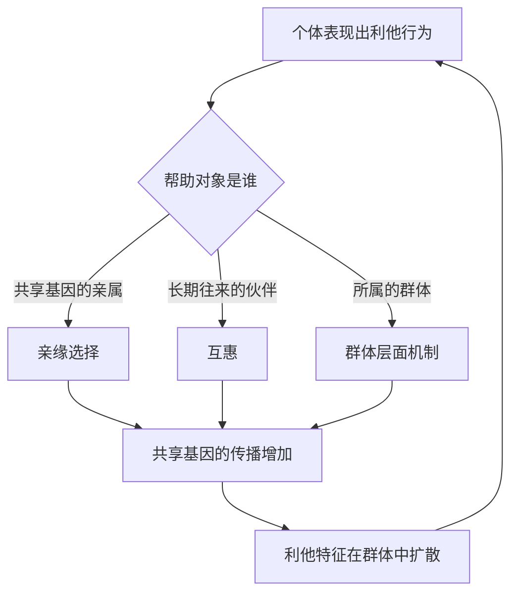

# 10｜利他行为怎么可能是进化的产物？

> 进化论讲"自私"，为什么还有生物牺牲自己？

---

## 一、先说结论

王立铭认为，利他并不是进化论的例外，而是进化逻辑的必然产物之一。关键是要把两个层次区分开：**"基因的自私"和"行为的利他"，完全可以同时成立。**

一只工蜂为蜂群蜇刺入侵者，蜇完自己就死了；一只吸血蝙蝠把吸到的血吐给没吃到的同伴。这些行为看起来都在"利他"，但它们背后的进化机制其实相当务实：帮助的不是"别的个体"，而是**与自己共享基因的个体**，或者是**将来会回报自己的伙伴**。

所以结论是：进化确实能造出利他，但前提是——这份利他，最终要以某种方式回馈到基因的传播上。

---

## 二、我们先理解一个问题

先破一个印象。

如果进化的唯一标准是"谁留下更多后代"，那么一只为了别人而死的工蜂，似乎是个彻底的失败者：它没有后代，却把命搭了进去。

可现实是：这种"自我牺牲"在自然界里不仅存在，还非常普遍——蜂群、蚁群里有大量不繁殖的工蜂、工蚁；鸟类里会有个体冒险为同伴报警；哺乳动物里会有个体分享食物、互相梳毛。

于是问题来了：如果自然选择只保留"对自己有利"的行为，这些明显"吃亏"的行为，究竟是怎么被保留下来的？

---

## 三、作者到底提出了什么观点？

王立铭给出了几条并行的解释路径，它们共同回答了"利他为何能进化出来"。

**第一条是亲缘选择。** 你帮助的对象，如果和你共享基因，那么帮助他们，等于间接帮助了自己基因的传播。工蜂和蜂群里的姐妹共享大量基因，它牺牲自己保全蜂群，从一个"基因视角"看，并不亏。

**第二条是互惠。** 今天你帮我，明天我帮你。只要双方长期反复打交道、彼此能识别、能记住、能惩罚"只拿不给"的骗子，那么"乐于分享"就可能成为稳定策略。吸血蝙蝠互吐血液，就是典型。

**第三条是群体层面的机制。** 有些特征对个体不利，却让整个群体更容易存续——群体之间的竞争，也可能让这类特征扩散。

王立铭反复强调一句话：**"自私的基因"描述的是基因传播的逻辑，不是生物行为的道德属性。** 一个由"自私基因"构成的生物，行为上完全可以是利他的。

---

## 四、把这个观点翻译成人话

用两个例子来理解。

**工蜂。** 蜂群里绝大多数是工蜂，它们自己不产卵，一生都在保育幼虫、采集、守卫。当蜂巢受威胁，工蜂会蜇刺入侵者——蜇针带倒钩，蜇完内脏被扯出，自己活不了。从个体角度看，它"牺牲"了；但从亲缘角度看，它保护的是蜂群里的姐妹与母后，也就是与自己共享大量相同基因的个体。它自己繁殖不了，可它的基因通过亲属大量复制。**它舍掉的是个体的命，保住的是基因的延续。**

**吸血蝙蝠。** 吸血蝙蝠夜里出去吸血，常常有蝙蝠空手而归。空手的那只如果连续几晚吸不到血，就可能饿死。吸到血的蝙蝠，会把血反吐给没吃到的同伴——尤其是平时也分享过给自己的老伙伴。这不是亲缘利他（很多同伴并非近亲），而是**互惠**：今天我救你一命，等我倒霉那天，你也记得救我。

一句话：工蜂的利他靠"血浓于水"，蝙蝠的利他靠"礼尚往来"。

---

## 五、为什么会这样？

把几条机制各画一条线，就容易理解了。

亲缘选择可以写成一个近似的不等式：**当"利他者与被帮助者的亲缘度 × 被帮助者获得的收益 > 利他者付出的代价"时，利他行为就有机会被选择保留。** 一些进化生物学家把这称为汉密尔顿法则，它是理解亲缘利他的核心工具。

互惠的条件则更"社会"一些：需要反复相遇，需要能识别对方，需要记得谁帮过自己，还需要能对"骗子"做出惩罚。少了任何一条，互惠都会崩塌。

这两种机制看起来不同，底层的算盘其实一样：**利他只是手段，基因的延续才是目的。** 只不过在互惠里，"回报"被推迟到了将来。

---

## 六、举一个现实生活中的例子

**吸血蝙蝠的献血互助。**

吸血蝙蝠生活在一个需要天天进食的物种里：它们几乎每天都要吸到血，否则撑不了几天。而夜里的捕食成功率并不稳定，总有蝙蝠一无所获。

在这样的处境下，"分享"就成了一种救命机制。吸到血的蝙蝠反吐一部分给饥饿的同伴，往往优先给那些**曾经分享给自己**的伙伴。研究者发现，这种基于过往记录的互惠，能让群体里更多个体熬过食物短缺的夜晚。

这很像人类社会的"人情账"：不是因为我天生博爱，而是因为在反复博弈里，"我帮你、你帮我"这套规则，比"只顾自己"更能让人长期活下来。**互惠不需要道德觉悟，它只需要记性和重复相遇。**

---

## 七、回到书中重新理解

现在再回看王立铭为什么要把"利他"单独讲一篇，就清楚了。

因为"利他"是普通人最容易拿来反驳进化论的现象：既然进化讲竞争、讲自私，那为他人牺牲怎么解释？王立铭的回应不是回避，而是深入到"基因层次"重新定义问题：

- 从**个体层次**看，工蜂是牺牲的；
- 从**基因层次**看，工蜂的行为是在替自己传播。

这也呼应了前面提到的"进化的单位"问题——收益该算在谁头上，取决于你从哪个层次看。利他这件事，正是把"层次"问题摆到台面上的最好案例。

---

## 八、这个观点背后还有什么？

**第一，它把道德从"天性"里解耦了一部分。** 利他行为可以不需要"我要做好人"这种动机，它只需要机制上的回报路径。

**第二，"基因自私"是一种视角，不是事实断言。** 它是为了方便理解传播逻辑而做的抽象，并不是说基因真的有欲望。

**第三，互惠解释了人类社会性的重要一块。** 声誉、礼尚往来、惩罚骗子，都可以放进这个框架里理解。

**第四，它给"为什么好人会吃亏"提供了新视角。** 在一次性、无重复的交往里，互惠的约束力很弱；而在长期、稳定的群体里，互惠才更牢固。

---

## 九、这个观点有问题吗？

关于利他如何进化，学界存在不同解释，而且争论持续了几十年，需要如实呈现。

**第一，群体选择和亲缘选择之争。** 早期有人提出，某些利他行为是为"群体利益"服务的，但这种"群体选择"式解释后来遭到严厉批评——批评者认为，只要有个体搭便车，为群体牺牲的特征就会被淘汰。此后相当长时间里，学术界更偏好亲缘选择和互惠这类"还原到个体或基因"的解释。而近二三十年，随着理论工具的更新，一些进化生物学家又重新主张**多层次选择**：选择可以同时作用在基因、个体、群体等多个层次上。也就是说，"群体选择"并没有被彻底否定，而是被重新表述。

**第二，互惠可能被过度使用。** 有学者担心，"互惠"太容易讲故事：任何说不清的利他都归给"将来会回报"。可互惠要成立，需要识别、记忆、惩罚等一整套条件，并不是随口一说就成立。

**第三，人类的利他远比动物复杂。** 人类有陌生人之间的大规模合作、有"即使没人看见也要做好事"的倾向、有愿意惩罚骗子哪怕自己付代价的"强互惠"。这些现象单靠基因层面的亲缘和互惠，未必讲得圆，往往还需要文化演化、社会规范等额外解释。

**所以更准确的说法是**：亲缘选择、互惠、多层次选择各能解释一部分现象，但没有任何单一机制能包打天下。利他之所以难，正因为它同时牵涉基因、个体、群体和文化多个层次。

---

## 十、今天再看这个观点

以下部分是利他研究的现代延伸，不是王立铭的原话。

今天，这条思路已经延伸到行为经济学、人类学和社会神经科学。研究者会关心：惩罚骗子为什么会让人"爽"；声誉机制如何让人在匿名环境下也会变好；小规模社群与大规模陌生人社会，合作规则有什么不同。

一个常被提起的洞见是：**能反复相遇、能记住彼此、能谈论某某人品的社会，合作更容易稳定。** 这提示我们，制度和环境的设计——能不能让人长期打交道、言行能不能被看见——本身就影响利他能不能生根。利他不只是"道德问题"，也是一个"结构问题"。

---

## 十一、这一篇真正应该记住什么？

1. **"自私的基因"不等于"自私的行为"。** 基因传播的逻辑，和生物行为的道德面貌是两回事。
2. **亲缘选择**：帮亲属，等于间接帮自己共享的基因。
3. **互惠**：反复打交道、能被记住、能惩罚骗子，才让"今天帮你"稳定成立。
4. **利他的"回报"可以推迟。** 利他者付出的当下，收益可能在将来、或通过亲属兑现。
5. **利他研究仍有争论**，多层次选择、互惠边界、人类利他的独特性，都还没讲完。

---

## 十二、留一个问题

> 如果利他的底层逻辑，是"帮助共享基因的亲属"和"帮助会回报我的伙伴"，
> 那么人类对陌生人的善意、
> 对完全不会回报自己的人的善意，又该怎么解释？

---

**下一篇**：利他讲的是同一物种内部的事——大家还愿意互相帮忙，说明彼此仍是"一家人"。可如果有些群体被长期隔开、各自改变，久而久之连"一家人"都做不成了，那会发生什么？

下一篇我们就来拆开这个问题——**物种是怎么形成的？**
