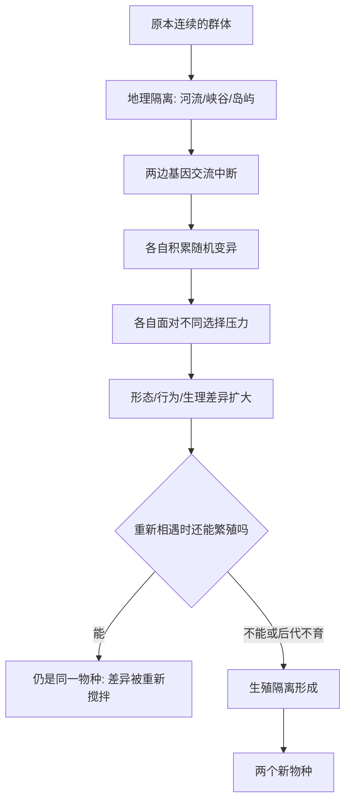

# 11｜物种是怎么形成的？

> 一个物种，怎么就变成了两个物种？

---

## 一、先说结论

王立铭认为，物种形成通常始于**隔离**：地理、行为或时间上的阻隔，把一个群体拆成互不往来的两拨。被分开之后，两边各自积累不同的变异，走上不同的适应道路；等到差异大到一定程度，即便重新相遇，也无法再交配、或交配后生不出后代——这时，一个新物种就算诞生了。

换句话说，**"物种"不是自然界里一个固定不变的格子，而是演化长河中被人为截取的一段。** 它不是先有边界再有分化，而是分化到某个程度，我们才回头给它起了个名字。

---

## 二、我们先理解一个问题

先厘清"物种"到底指什么。

生物学上最常用的一种定义是：**能互相交配、并产生可育后代的群体，属于同一物种。** 比如家犬和灰狼能顺利繁殖并留下可育后代，通常被视为近缘；马和驴能生出骡子，但骡子几乎不育，于是马和驴被判为不同物种。

问题随之而来：既然物种是"会变的"，那么一个原本能互相交配的群体，是怎么一步步走到"不能再交配"的？**"变成两个物种"这个动作，究竟发生在哪一刻？**

---

## 三、作者到底提出了什么观点？

王立铭把物种形成的过程，拆成一条清晰的链条：

1. **隔离**：群体被隔开。最常见的是地理隔离——一条河、一道山脊、一片沙漠、一次迁徙，都能把原本连续的群体分成两半。此外还有行为隔离（偏好不同）、时间隔离（繁殖季节错开）等。
2. **各自演化**：两边的环境不同，遇到的突变不同，选择压力也不同。它们各自积累差异，就像两条分开的支流。
3. **生殖隔离**：差异积累到某个程度后，两边即便再碰面，也无法交配，或交配后后代不育。到了这一步，**它们已经是两个物种。**

他强调，关键在于"隔离"这一步：**没有隔离，差异就会被不断的基因交流重新搅拌均匀；有了隔离，差异才可能长期累积。** 所以隔离不是配角，而是物种形成这场戏的开幕。

---

## 四、把这个观点翻译成人话

想象一片连续的林地，中间被一条又宽又深的峡谷切开。原本生活在两岸的松鼠，是同一个群体，偶尔还能碰面、交配，基因在两岸之间流动。

峡谷一旦足够宽、足够久地阻隔了往来，情况就变了：

- 北岸气候更冷、种子不同，南岸更暖、食物不同；
- 两岸的松鼠群各自随机积累变异，各走各的路；
- 北岸偏好厚实皮毛的个体更占优势，南岸则未必；
- 几万年、几十万年过去，两边的外形、习性、甚至求偶方式，都越来越不一样。

某一天，某人把一只北岸松鼠带到南岸，发现它和南岸松鼠**已经不太愿意、也不太能繁殖出健康后代了**。这时，我们才说：它们成了两个物种。

**分化不是靠某一次突变"一步到位"，而是靠长期的"各过各的日子"累积出来的。** 峡谷不是造物种的手，它只是把两个群体推上了不同的车。

---

## 五、为什么会这样？

把整个过程画成一条主线：

这里有一个容易被忽略的要点：**隔离要"足够久"，差异才有时间积累。** 如果两个群体隔开后又很快恢复了接触，基因交流重新开启，好不容易攒下的差异就会被"稀释"掉，物种形成半途而废。所以地理隔离往往还要配合时间——不是隔开就行，而是隔开得够长。

反过来，如果环境差异特别大、选择压力特别强，分化也可能更快。隔离提供"停手的机会"，选择提供"拉开距离的动力"，两者合起来，才推得动物种形成。

---

## 六、举一个现实生活中的例子

**被一道峡谷分开的松鼠。**

北美洲的大峡谷，是一道天然的地理屏障。峡谷两侧的松鼠，被认为源于同一个祖先群体，后来被这道屏障隔开，各自演化了很长时间。今天的它们，毛色、耳毛、体态都已有明显差异，通常被视为不同的亚种或近缘类群。

这个例子的价值在于：它把"地理隔离"这一步变得看得见摸得着——**不是抽象的概念，而是一条实实在在的沟壑，把一群生物分成了两拨，然后任由时间把差异拉开。**

类似的情节在地球上反复上演：山脉把种群分到两侧，岛屿把种群困在海上，冰川进退把种群切成碎片。每一次长期阻隔，都是一次物种形成的潜在机会。可以说，**地球的地形变化史，本身就是一部物种形成史的背景板。**

---

## 七、回到书中重新理解

现在再回看王立铭为什么把"隔离"放在物种形成的开头，就顺了。

因为普通人直觉上会想：新物种应该来自"突变出个新奇特征"。但真实的物种形成，主角不是某次惊人突变，而是**"停止交流"**。这解释了很多现象：

- 为什么岛屿、湖泊、山脉常常是物种多样性的热点？因为隔离多。
- 为什么大陆上物种形成往往更慢？因为群体容易重新连通。
- 为什么"物种"边界有时模糊？因为分化需要时间，而时间有快有慢，有些群体正卡在"半分开"的中间状态。

所以这一篇真正要建立的，是一种动态的物种观：**物种不是造物主的分类格，而是隔离与时间共同雕刻出的阶段性成果。**

---

## 八、这个观点背后还有什么？

**第一，物种形成往往是"过程"，不是"瞬间"。** 我们习惯问"哪一刻变成两个物种"，但自然往往不给一条清晰的线，更多是连续过渡。

**第二，生殖隔离有很多种。** 可能是交配前就"看不上"（求偶信号不同、时间错开），也可能是交配后出问题（胚胎无法发育、后代不育）。前者往往更早出现。

**第三，隔离的类型不止地理一种。** 同一片区域内的行为隔离、时间隔离，同样能起到"停止交流"的作用，只是更隐蔽。

**第四，它把"时间尺度"这件事摆到了我们面前。** 物种形成常常要成千上万代，这是人类难以直观体会的长度，也是理解进化时最容易出错的地方。

---

## 九、这个观点有问题吗？

需要说明的是，"物种"这个概念本身，在学界就存在争议。

**第一，生物学物种概念并不万能。** "能交配、生可育后代"这条标准，对细菌这类无性繁殖的生物几乎失效——它们不靠交配繁殖，也就谈不上"生殖隔离"。对化石物种、对经常杂交的植物，这条线也很模糊。

**第二，隔离与分化的边界常被打破。** 自然界里存在"环形种"这样的尴尬案例：相邻群体彼此能繁殖，但绕一圈到两端，却不再能繁殖。这让人很难干脆地说清"到底几个物种"。

**第三，地理隔离并非物种形成的唯一途径，也未必是最普遍的。** 一些进化生物学家强调，在同一片区域里，靠资源利用分化、求偶偏好分化，也可能把群体拆开，不必先有物理屏障。

**所以更准确的说法是**：隔离与差异累积是物种形成的核心图景，这点已被广泛接受；但"物种"究竟如何定义、边界画在哪里，学界仍在讨论，不同生物类群往往要用不同的标准。物种既是自然过程，也带着一点人为裁切的味道。

---

## 十、今天再看这个观点

以下部分是物种形成研究的现代延伸，不是王立铭的原话。

今天，借由基因测序，研究者可以更直接地看到两个群体的分化程度：比较它们的基因差异、估算分开的时间、追踪基因交流留下的痕迹。这让"物种形成"从依赖形态观察，走向了可以量化的分子层面。

这一思路在保护生物学里格外实用。当一个群体的栖息地被公路、农田、城市切碎，它实际上正被推向"地理隔离"。如果碎片太小、太久不连通，群体内的基因交流中断，遗传多样性下降，就可能走上不可逆的分化甚至衰退之路。**换句话说，人类正在亲手制造大量"物种形成的起点"，只是多数时候，我们想要的恰恰相反——保持连通。**

---

## 十一、这一篇真正应该记住什么？

1. **物种形成通常始于隔离**：地理、行为、时间上的阻隔，切断了基因交流。
2. **隔离之后，差异各自累积**：环境不同，选择压力不同，两边越走越远。
3. **终点是生殖隔离**：不再能交配、或后代不育，新物种就出现了。
4. **隔离要"够久"**：太早重新连通，差异会被重新搅拌掉。
5. **物种不是固定格子，而是演化的一个阶段**，边界有时天然模糊。

---

## 十二、留一个问题

> 如果新物种的诞生，往往要依赖一次偶然的地理阻隔、一场恰好的灾变，
> 那么当我们回望整棵生命之树，
> 它今天长成这个形状，究竟是规律使然，还是无数次巧合的叠加？

---

**下一篇**：物种形成的故事里，已经出现了"偶然"的身影——一道峡谷、一次迁徙，本身就是偶然事件。那么，把镜头拉远到整个生命史，演化的主线到底是可预测的必然，还是无法重演的偶然？

下一篇我们就来拆开这个问题——**演化是必然的还是偶然的？**
