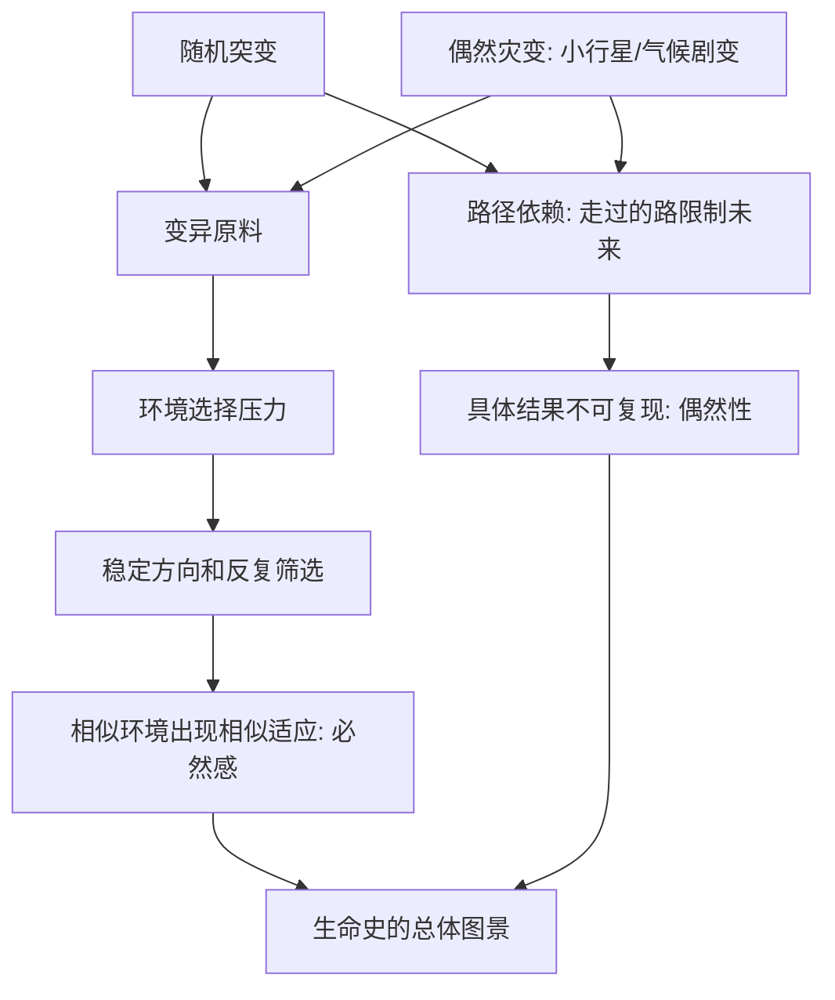

# 12｜演化是必然的还是偶然的？

> 如果重来一遍，地球上还会有"人"吗？

---

## 一、先说结论

王立铭认为，演化既不是纯粹的必然，也不是彻底的偶然，而是**两者共同塑造**的结果。

**偶然的一端**：基因突变撞上哪个方向，是随机的；小行星撞不撞地球、冰期来不来，也是偶然的。这些随机事件会深刻改变生命史的走向。

**必然的一端**：一旦某个环境压力长期存在，自然选择就会稳定地朝某个方向筛选——水里的动物容易变得流线型，弱光环境的动物容易退化掉眼睛。这种"重复出现"的方向感，来自选择，而不是运气。

所以他的答案偏向一个清醒的判断：**如果地球重来一次，生命大概率还会演化出各种适应，但"人类"这个具体结果，几乎不可能原样再现。**

---

## 二、我们先理解一个问题

这个问题容易让人左右为难。

一方面，我们确实看到大量"规律"：不同的水生动物都变得流线型，不同的地下动物都退掉了眼睛，不同环境里反复出现相似的适应。看起来演化有明确方向，像是被某种规律牵引着。

另一方面，我们又看到大量"巧合"：如果不是一颗小行星在特定的年代撞上地球，恐龙也许不会退场，哺乳动物也许至今还在夜里躲躲藏藏，人类更无从谈起。

于是问题来了：**如果演化真有规律，它为什么又如此依赖偶然？如果它纯属偶然，那些反复出现的相似适应又该怎么解释？**

---

## 三、作者到底提出了什么观点？

王立铭把这个问题拆成两个层次来看。

**第一个层次是"原料和事件"，这里充满偶然。** 突变的方向是随机的，生物无法"按需"变异；环境灾变——小行星、火山、气候剧变——何时发生、强度多大，更是偶然。而这些偶然事件，常常直接改写谁生谁死。

**第二个层次是"筛选"，这里有必然。** 只要环境稳定地偏向某种特征，选择就会稳定地保留它。环境越相似，被筛出来的结果就越像。这正是"规律感"的来源：**不是生命想这样，而是环境反复给出同一道题。**

王立铭还强调一个概念：**路径依赖**。生命史是一条走过的路，每一步都会限制下一步的可能性。今天的样子，是"当时的偶然事件"加上"沿着这条路继续走"共同决定的，不能简单倒推成"必然如此"。

---

## 四、把这个观点翻译成人话

用恐龙与哺乳动物的故事来理解。

很久以前，恐龙占据着陆地生态系统的关键位置，哺乳动物体型小、多在夜间活动，长期被压制在"配角"的位置上。

然后，一颗巨大的小行星撞上地球，引发了全球性的灾难，恐龙这类大型动物大批消失，许多生态位一下子空了出来。原本被压着、不起眼的哺乳动物，迎来了扩张的机会——体型变大、占据陆地、下海、上天，逐渐演化出我们熟悉的各种类群，其中一支，最终走向了人类。

这里的账要分开算：

- **恐龙退场是偶然的**——小行星什么时候来、撞在哪里、造成多大破坏，没有"必然"可言；
- **哺乳动物的崛起则带着路径依赖**——它们早就存在，只是被压制着，机会一旦出现，就沿着既有的身体设计迅速扩张。

所以，重来一次，即便哺乳动物仍在，人类几乎不会原样再现。**不是"人"被预定在终点，而是无数偶然推着生命，恰好走到了这里。**

---

## 五、为什么会这样？

把两条线索并排画出来，矛盾就清楚了。

这张图的意思是：**必然来自"选择的方向性"，偶然来自"原料和事件的随机性"。** 两条线不是互相否定，而是叠加在一起，共同决定了生命史。

举个例子：如果一条鱼游进了黑暗的洞穴，选择压力会稳定地"惩罚"眼睛，于是不同洞穴里的鱼会反复退化掉眼睛——这是必然。但究竟是哪一次突变先让某条鱼的眼睛变弱，哪一支谱系在灾变中侥幸幸存，则是偶然。**同样的选择压力，能造出相似的结局；但通往结局的具体道路，每次都不同。**

---

## 六、举一个现实生活中的例子

**恐龙灭绝与哺乳动物的崛起。**

恐龙在陆地生态系统中长期占据主导，哺乳动物却被限制在小体型、夜行性的角落里。小行星撞击带来的全球灾变，清空了大量大型动物的生态位——尤其是那些依赖稳定食物供给、体型巨大的类群。

生态位一空，机会就来了。哺乳动物沿着已有的身体设计，迅速扩张到各种先前被恐龙占据的位置：有的大幅增大体型，有的重返海洋，有的演化出飞行能力。最终，其中一支灵长类走上了直立行走、使用工具、发展语言的道路。

把这段历史讲成"哺乳动物注定要战胜恐龙"，是错的；把它讲成"纯属撞大运、生命毫无规律"，也是错的。**它的真实版本是：一个偶然的灾变，撞进了一条早已存在的演化路径，两者合起来，才有了今天。** 如果小行星偏了一点、地球大气的反应换了一种，这条故事线都会面目全非。

---

## 七、回到书中重新理解

现在再回看王立铭为什么要把"偶然与必然"单独讲一篇，就清楚了。

因为这个问题是进化论里最容易走极端的：一边是"进化是必然进步、人类是终点"的旧式误解；另一边是"进化纯属偶然、什么都可能"的相对主义。王立铭的立场落在中间：

- **该给偶然的地方给偶然**：灾变、突变、幸存者的运气，都不能被抹掉；
- **该给规律的地方给规律**：环境反复施加的压力，会稳定地筛出相似的适应。

这也解释了前面反复出现的一件事：为什么不同地点、不同谱系的生物，会演化出相似的形态？因为**题目相似时，答案也容易相似**。这不是命运，而是选择的重复。

---

## 八、这个观点背后还有什么？

**第一，路径依赖是一种"历史的重量"。** 走到今天，是被昨天限定的；换一条起跑线，轨迹就完全不同。

**第二，偶然事件会被放大。** 一次灾变、一次侥幸的幸存，可能把生命史推向一个全新的岔路，影响延续上亿年。

**第三，"必然"是相对的。** 我们看到的规律，往往是"在特定环境约束下的规律"，环境一变，规律也会变。

**第四，它让人对"人类"的位置更清醒。** 我们是生命之树上的一根枝，而不是树的顶点；我们的存在，带着相当多的历史偶然。

---

## 九、这个观点有问题吗？

关于偶然而必然，学界存在不同解释，而且是进化生物学里争论最久、最激烈的问题之一，两边都有重量级人物。

**一种立场强调偶然与不可预测。** 古生物学家古尔德有一个著名比喻：把生命史的录像带倒回去重放，每次都一定会播出一个截然不同的版本。在他看来，生命史由偶然事件主导，人类这样的结果是极其脆弱的侥幸，"重来一次不会有人"。

**另一种立场强调趋同与必然。** 一些学者（如康威·莫里斯）主张，生命在相似环境里反复演化出相似的功能，说明存在很强的约束和方向性；即便重来，眼睛、智慧这类"有用的东西"也很可能再次出现。在他们看来，演化远比古尔德描述的更具可预测性。

**近来的综合看法**倾向于：两者都对，只是尺度不同。**在具体物种、具体时间点上，偶然性极强，几乎不可预测；在功能与生态层面，趋同又确实反复发生，带有某种必然。** 换句话说，"会不会再长出眼睛"和"会不会再长出一个智人"，答案很可能不一样。

**所以更准确的说法是**：演化没有任何证据支持"朝着人类前进"的必然方向；但"环境压力会产生相似适应"这一层规律，也不该被偶然性完全淹没。真正值得记住的，是分清你问的是哪一个层次的问题。

---

## 十、今天再看这个观点

以下部分是这一问题的现代延伸，不是王立铭的原话。

今天，讨论"偶然还是必然"已经延伸到对地外生命的推测。既然水、有机分子、能量来源在宇宙中并不罕见，那么相似的环境压力，会不会在其他星球上也反复"筛"出类似的生命形态？有人据此认为，生命的出现可能带有相当的普遍性；也有人强调，演化中的偶然事件如此之多，即便有生命，其具体形态也难以预料。

与此同时，在复杂系统和混沌理论的视角下，"规则明确"与"结果不可预测"并不矛盾——初始条件的微小差异会被不断放大。这为理解"生命史有规律，却无法精确重演"提供了一个更现代的框架。

---

## 十一、这一篇真正应该记住什么？

1. **演化由偶然与必然共同塑造**：突变和灾变随机，选择压力有方向。
2. **必然来自选择的重复性**：环境相似，被筛出的适应就相似。
3. **偶然来自原料和事件**：哪次突变、哪场灾变，无法预料。
4. **路径依赖让历史不可倒推**：走过一遭的路，会限制接下来能走哪。
5. **重来一次，人类几乎不会原样再现**；但"相似功能反复出现"这一现象，也真实存在。

---

## 十二、留一个问题

> 如果相似的环境压力，真的会反复"筛"出相似的功能——
> 那么不同物种之间那些惊人的相似，
> 究竟是继承了同一个祖先的特征，还是各自独立演化出来的巧合？

---

**下一篇**：偶然与必然的交界处，藏着一个特别耐人寻味的事实——有些相似，并不是因为"亲戚关系"，而是因为面对同样的环境，不同谱系各自独立地找到了同一个答案。这种"殊途同归"，既像必然，又不靠血缘。

下一篇我们就来拆开这个问题——**趋同演化。**
