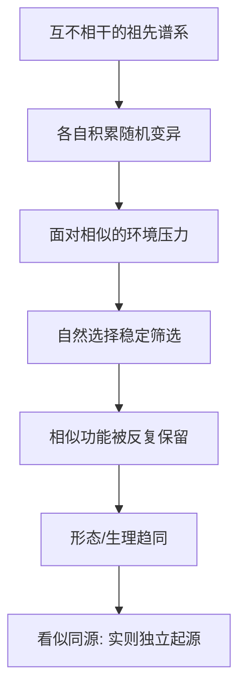

# 13｜趋同演化：为什么不同物种会“殊途同归”？

> 为什么相隔极远的物种，会独立"发明"出同样的东西？

---

## 一、先说结论

王立铭认为，趋同演化是自然选择最有说服力的证据之一：**面对相似的环境压力，来源完全不同的物种，会各自独立地演化出相似的功能。** 眼睛、翅膀、流线型的身体，都在生命史上被反复"发明"过很多次。

它带来两个关键提醒。

第一，**它证明了自然选择的力量。** 如果相似的功能能在毫无血缘关系的谱系里一次次出现，说明决定形态的往往不是"出身"，而是"环境给出的题目"。

第二，**它告诉我们"相似"不等于"同源"。** 两个结构长得像，可能是因为它们继承了同一个祖先的特征，也可能是因为它们在各自的道路上，被同样的选择压力推向了同一个答案。把这两种情况分清，是理解进化的基本功。

---

## 二、我们先理解一个问题

先厘清一个容易混淆的地方。

看到两种生物有相似的结构，我们往往会本能地想：它们应该是亲戚，这个结构大概是祖传的。这种"相似源于共同祖先"的情况，叫**同源**——比如人的手臂、蝙蝠的翅膀、鲸的鳍，骨骼基础是同一套，只是用途各不相同。

但还有另一种情况：两种生物的结构很像，血缘却相当远，它们的祖先根本没有这个结构，是在各自的谱系里**分别**演化出来的。这种情况叫**趋同**。

于是问题来了：**当一个结构反复出现在互不相干的谱系里时，我们怎么判断它是"祖传的"，还是"各自发明的"？**

---

## 三、作者到底提出了什么观点？

王立铭把趋同演化讲成一句话：**相似的环境，会筛选出相似的适应。**

它的逻辑并不神秘，甚至比"各自独立发明"听起来更朴素：

- 环境提出同一道难题（比如"要不要能看见光""要不要在水中减少阻力"）；
- 不同谱系里各自发生的随机变异，总有些碰巧朝有用的方向偏了一点；
- 选择稳定地保留这些有用的变异；
- 久而久之，两条毫不相干的血统，走向了相似的形态或功能。

他强调，趋同演化有双重意义：

**一方面，它像是自然选择做的一场"重复实验"。** 同一道题被不同的考生独立解答，如果答案反复趋同，说明这道题确实有"标准解法"，也就说明选择的作用是真实而强大的。

**另一方面，它是"相似不等于同源"的最好注脚。** 看到相似，不能想当然认定亲戚；必须去看解剖结构、发育来源、乃至基因层面的证据。

---

## 四、把这个观点翻译成人话

最能说明问题、也最令人惊叹的例子，是**眼睛**。

眼睛在动物界被独立演化了非常多次。从只能分辨明暗的简单眼点，到能成像的复杂眼睛，各种"版本"分散在不同谱系里。一些进化生物学家估计，动物界复杂或不那么复杂的成像眼，被独立发明了数十次。这意味着：**在巨大的时间尺度上，"能看见"这件事，被反复地、从零开始地找到了答案。**

更耐人寻味的是，其中有些眼睛不只是"都能看"，而是结构上惊人地相似。脊椎动物（比如人）和头足类（比如章鱼）都演化出了带晶状体的"相机式"眼睛，都能聚焦成像。可它们的共同祖先并没有这样一只眼睛，两者的相机眼是各自造出来的。

**这就是趋同演化的样子：不是亲戚之间传下来，而是陌路人各自走到了同一个地方。** 相似的是功能，甚至常常是外形；不同的是它们诞生的路径。

---

## 五、为什么会这样？

把趋同的机制画成一条线：

关键在于中间那一步：**环境压力是"同一道题"。** 只要题目不变，解答空间就有限，不同考生就容易写出相似的答案。这就是为什么水中游动的动物常常变得流线型——无论它原本是鱼、是爬行动物还是哺乳动物，水的阻力对谁都一视同仁。

但趋同也不是"随便怎么长相都会变一样"。它同时受**物理和发育的约束**：能自然形成的结构是有限的，能高效实现的方案更有限。眼睛只能落在那么几种可行设计上，所以趋同才如此频繁。**趋同不是巧合，而是"题目固定、解法有限"的必然结果。**

---

## 六、举一个现实生活中的例子

**脊椎动物与章鱼的"相机眼"。**

人的眼睛和章鱼的眼睛，都能聚焦成像，都靠晶状体把光聚到感光细胞上，外形和功能像是一对孪生设计。但它们属于相隔极远的谱系，共同祖先并没有这样一只眼睛。

差异恰好暴露了"各自独立"的真相。比如视网膜上的感光细胞朝向、神经纤维的走线，两者就不相同——脊椎动物的视网膜在结构上有一种"反装"的特征，神经纤维要穿出感光层；章鱼则不是这样。如果这是同一个"祖传设计"，不该出现这类根本性的差异；正因为是由不同路径各自拼装出来的，才留下了各自的"施工痕迹"。

**所以，看到相似，我们要问两件事：这东西的功能是不是一样？它是不是从同一个祖先那里传下来的？** 眼睛这个例子把道理讲得再清楚不过——同样能看见，未必是一家人。

---

## 七、回到书中重新理解

现在再回看王立铭为什么要把趋同演化放在"偶然与必然"之后，就顺了。

因为趋同，正是"必然"那一面最扎实的证据。如果生命史纯属偶然，我们就不该看到不同谱系反复找到同一个答案；可事实是，眼睛、翅膀、流线型身体这样的"标准解法"，在生命史上被一遍遍写出来。**这种重复，正说明选择的方向性是真实存在的。**

同时，它也把前面讲过的"区分相似与同源"这件事，推到了最要紧的位置：当我们判断两个物种的亲缘关系时，靠形态相似是不够的，必须穿透到结构来源和分子证据。**趋同演化既证明了选择的力量，也提醒我们别被表面的相似骗了。**

---

## 八、这个观点背后还有什么？

**第一，趋同可以反推功能与古环境。** 如果一群生物都演化出相似的结构，多半说明它们面临着相似的环境压力。

**第二，趋同与约束是一枚硬币的两面。** 能形成什么、不能形成什么，受物理规律和发育机制的共同限制，这也是趋同常见的原因。

**第三，趋同可能发生在分子层面。** 有时连基因层面的改变都会趋同，不同谱系为解决同一问题，改动了相似的位置。

**第四，它让"形态学"这门前分子时代的学问有了新的解释力。** 很多当年只靠外形判断的关系，今天可以用基因证据重新审视。

---

## 九、这个观点有问题吗？

趋同演化本身是公认的现象，但"如何判断趋同""趋同说明了什么"，学界仍有一些需要谨慎的地方。

**第一，趋同与同源有时很难分。** 表面上各自独立的结构，往深处追，可能用了同一套"祖传基因"来建造——这被称为"深层同源"。比如控制眼睛发育的关键基因，在亲缘很远、眼睛独立起源的动物里都能找到。于是问题变得微妙：眼睛算"独立起源"，还是"用了同一个工具、各自造了房子"？一些学者更倾向后者，认为趋同背后常常藏着更深的共同基础。

**第二，"趋同"有时被过度解读。** 看到相似就断言"进化必然朝这个方向走""这就是最优解"，是常见的滑坡。相似可能只是"可行解之一"，未必是最优，也未必意味着重来一次必定如此。

**第三，术语上还有区分。** 有的相似来自不同祖先面对相似环境的独立演化（趋同），有的则来自近亲分开后仍保持相似（平行演化），两者边界并非总是清楚。

**所以更准确的说法是**：趋同是真实且普遍的，它为自然选择提供了有力证据；但每一次具体的"相似"，都需要单独追问它到底来自独立起源、深层同源，还是近亲平行演化，不能一概而论。

---

## 十、今天再看这个观点

以下部分是趋同演化研究的现代延伸，不是王立铭的原话。

今天，进化发育生物学，也就是常说的"演化发育生物学"，正在把趋同研究推进到基因和发育层面。它揭示出一件有趣的事：生命建造复杂器官时，往往会反复调用一批古老的"工具箱基因"。眼睛在不同谱系里的反复出现，背后常常有这类共同分子的参与。这既没有推翻"独立起源"的结论，也提醒我们——**独立，并不等于毫无共同基础。**

这一视角也有现实用途。比如在药物研发里，如果不同生物用相似机制解决同一问题，研究者就能从这种"自然地重复"中，去寻找更普适、更可靠的规律。趋同，正在从一种奇观，变成一种可以借力的线索。

---

## 十一、这一篇真正应该记住什么？

1. **趋同演化**：相似环境压力，筛选出相似的适应。
2. **相似不等于同源**：长得像，可能来自共同祖先，也可能各自独立演化。
3. **眼睛是经典案例**：在不同谱系里被独立"发明"了很多次。
4. **趋同既证明选择的力量，也提醒我们看穿表面相似。**
5. **判断趋同要谨慎**，深层同源、平行演化都会让边界变得模糊。

---

## 十二、留一个问题

> 如果说相似的环境压力，能把不同谱系推向相似的适应，
> 那么当环境不是"变得相似"，而是"突然被彻底摧毁"时，
> 生命又会如何回应？

---

**下一篇**：趋同讲的是"环境稳定地提出同一道题"。可生命史上还有另一种更剧烈的剧本——环境在极短时间内被整个掀翻，大量物种被一次性带走。这既是灾难，也可能是重新洗牌的起点。

下一篇我们就来拆开这个问题——**大灭绝如何改写生命史？**
