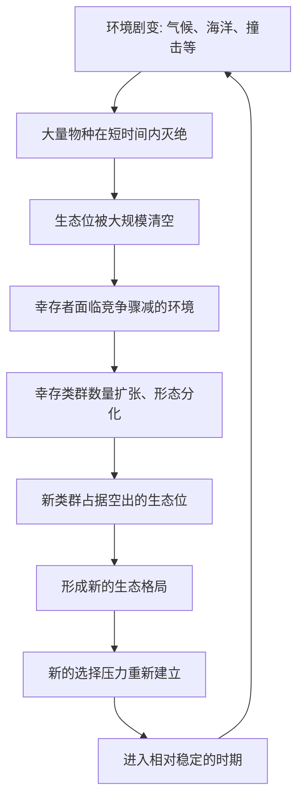

# 14｜大灭绝如何改写生命史？

> 灭绝是失败，还是演化的常态与机会？

---

## 一、先说结论

王立铭认为，灭绝不是演化的意外事故，而是演化本身的一部分。地球历史上发生过多次大灭绝，其中最严重的一次带走了当时绝大多数物种。灾难对当事者无疑是灭顶之灾，但它同时做了一件事：**把大量生态位空了出来。**

空出来的位置不会一直空着。幸存下来的类群，会在竞争骤减的环境里迅速扩张、分化，占据原本属于别人的位置。所以生命史呈现出的，不是一条平稳上升的曲线，而是一条被反复打断、又反复重启的折线。

一句话：**灭绝不是终点，而是重新洗牌的起点。**

---

## 二、我们先理解一个问题

先破一个印象：我们习惯把灭绝等同于“失败”。

但如果这个判断成立，就会得到一个荒谬的结论：地球历史上出现过的绝大多数物种都已灭绝，那么它们全都是失败者；连曾经繁盛几千万年、遍布海洋的类群也难逃灭绝，那么“成功”又意味着什么？

问题就出在把灭绝看成了失败的判决书。更值得问的是：**既然灭绝如此普遍，它在演化中究竟扮演什么角色？** 它是需要被解释的例外，还是系统运转的常规部分？

---

## 三、作者到底提出了什么观点？

王立铭的观点可以拆成三层，一层比一层反直觉：

**第一，灭绝是常态，不是意外。** 物种像个体一样，有出现也有消亡。在漫长的地质时间里，总有一些物种在消失，这叫“背景灭绝”——它几乎从不停歇。

**第二，大灭绝是常态中的极端事件。** 在某些时期，灭绝的速度和范围会在短时间内急剧升高，跨越许多毫不相干的类群，从海洋到陆地一起遭殃。这就是大灭绝。

**第三，大灭绝的后果是双面的。** 它一边做减法——清除大量物种；一边做加法——清空生态位。对幸存者来说，竞争者、捕食者、寄生者可能同时减少，原本挤不进去的位置突然敞开。

这三层合起来，就构成他对生命史的基本判断：**生命不是被一种力量推向高处，而是在“扩张—被打断—再扩张”的循环里反复重塑。**

---

## 四、把这个观点翻译成人话

可以借一个直觉来理解：想象一片被挤得密不透风的林地。

平时，阳光、土壤、水源都被现有植物占满，一粒新种子落下去，几乎没有机会长大。此时生态位是“满的”，竞争是激烈的，能活下来的，往往是那些在对现有环境的最优竞争中占据优势的玩家。

然后，一场大火烧过。灾难本身并不“挑选”更优秀的树，它只是把大片林地清空。灾后，阳光直射地面，土壤裸露，竞争暂时消失。这时，原本被压在最底层、生存在边缘角落的那些物种，会突然获得前所未有的空间。

**关键要看清的是：灾难后的赢家，未必是平时最强的那个。** 它更可能是“碰巧扛过了灾难”的那个。谁能幸存，取决于灾难的性质——是高温、是缺氧、是酸化的海水，还是遮天蔽日的尘埃——而不取决于谁在灾前活得最好。

这就是大灭绝最反直觉的地方：**它换了一套筛选标准，把原有的排名推倒重来。**

---

## 五、为什么会这样？

把机制画成一条链：

这条链上有两个要点。

第一，**灭绝提供的是“空间”，不是“方向”。** 它并不告诉幸存者该往哪里走，只是把原本拥堵的赛道清空。往哪里填、填得多快，取决于幸存者手里已有的变异和它们所处的环境。

第二，**幸存是“通过”，不是“胜利”。** 那些活下来的类群，并非在能力上更优越，只是恰好具备某些在灾变下有用的特征。可能是体型小、食性杂、能休眠、分布广，也可能纯属运气好。这些特征在平时未必是优点，甚至可能是缺点。

正因为如此，大灭绝之后常常跟着大规模的“辐射演化”——不是某一种生物突然变强了，而是一群侥幸过关的生物，忽然发现眼前空无一人。

---

## 六、举一个现实生活中的例子

地球历史上，被普遍承认的大灭绝有五次。

它们分别发生在奥陶纪末、泥盆纪晚期、二叠纪末、三叠纪末和白垩纪末。每一次都造成了生物圈的剧烈重组，但烈度并不相同。

其中**最严重的一次是二叠纪末的大灭绝。** 研究普遍认为，这次事件在相对很短的地质时间内，带走了海洋与陆地上一大半甚至更多的物种，许多曾经繁盛的类群就此彻底消失，生态系统几乎被推倒重来。它不是“某些物种没挺过去”，而是“整片舞台被拆掉重建”。

而最广为人知的一次，则是**白垩纪末的大灭绝**——包括非鸟恐龙在内的大批类群消失。这次事件之所以常被提起，是因为它的后果离我们最近：恐龙退场后，那些长期挤在边缘位置的哺乳动物开始扩张、分化，逐渐占据了从陆地到海洋、从地面到空中的各种生态位。

请注意这里的因果顺序。**哺乳动物的成功，不是“因为比恐龙更强”，而是“因为恐龙不在了”。** 在恐龙繁盛的一亿多年里，哺乳动物长期体型偏小、多在夜间活动、占据边缘生态位。它们并没有在正面对抗中胜出，只是在大洗牌之后，接住了递过来的位置。

这正是大灭绝改写生命史的方式：**它不是选出了更优秀的玩家，而是换掉了整个牌桌。**

---

## 七、回到书中重新理解

现在再回看王立铭为什么非要把大灭绝放进“演化规律”的部分，就顺了。

如果只讲自然选择、适应、趋同演化，很容易产生一种印象：生命在环境的压力下，一步步打磨出越来越精巧的形态，像是在缓慢地向上攀爬。大灭绝提醒我们：**这条路会被反复打断，而且打断它的力量，往往与“谁更适应”无关。**

更进一步说，大灭绝迫使我们区分两种筛选：

- 平时的自然选择，筛选的是“在当前环境下繁殖成功率更高”的个体，标准相对稳定；
- 大灭绝时期的筛选，标准被灾变本身临时替换，与平时的优劣排序可能完全脱节。

因此，生命史既有规律（选择始终在起作用），又充满偶然（下一次灾变何时来、以什么形式来，无法预测）。我们看到的现存生物，都是这条被反复打断的路上留下来的幸存者。

---

## 八、这个观点背后还有什么？

**第一，幸存者偏差。** 我们看到的生物都是活下来的，容易误以为它们有什么过人之处。实际上，幸存常常来自“躲过”而非“赢过”。

**第二，生态位是理解生命史的关键概念。** 空位不是抽象的，而是具体的资源、空间与相互关系。一次大灭绝清空的，是成千上万个这样的位置。

**第三，它再次破除了“进步”叙事。** 哺乳动物不是“更高级”，只是在特定的时机接住了位置。同样地，人类的崛起也与大灭绝的余波紧密相关。

**第四，灭绝有尺度之分。** 背景灭绝是常态，大灭绝是极端事件，二者之间是一条连续谱。讨论“灭绝”时，先说清尺度，很多争论自然澄清。

---

## 九、这个观点有问题吗？

作为对生命史的描述，这一判断相当稳固。但仍有三点需要保持平衡。

**第一，“机会”不应被浪漫化。** 大灭绝首先是灾难，代价是无数物种的永久消失，而不是“为了让谁上位”。把它简单说成“好事”，是对当事者的无视。

**第二，大灭绝是否算一种“选择”，学界有不同解释。** 一些进化生物学家强调，灾变中的幸存很大程度上带有随机性，更接近抽签而非有序的筛选；另一些研究者则指出，体型、分布范围、代谢方式等因素确实影响了幸存概率，因此并非纯粹的运气。关于这一问题，学界存在不同解释。较稳妥的说法是：灾变筛选既非完全随机，也非平时的适应筛选。

**第三，如何界定“大灭绝”并没有唯一的硬标准。** 不同研究对次数、时间边界和烈度的划分存在差异，“五次”是流传最广的框架，但换一套标准就会给出不同的清单。

因此，更准确的说法是：**大灭绝是生命史中真实且具有重大塑造作用的现象；把它讲成“灾难即机会”可以抓住要点，但不能替代对细节的谨慎。**

---

## 十、今天再看这个观点

以下部分是进化生物学的现代延伸，不是王立铭的原话。

大灭绝的研究在今天有了强烈的现实指向。生态学家不断讨论当前生物多样性的下降速度是否已经接近大灭绝的量级，“第六次大灭绝”的说法被广泛争论——反对者认为现有数据尚不足以支撑这一判断，支持者认为速率已经明显偏离背景水平。无论结论如何，这个框架都给了我们一个清醒的提问方式：**我们正在施加多大的选择压力，又会把哪些位置永久清空？**

与此同时，恢复生态学与保护生物学借用了“大灭绝之后发生什么”的经验：生态系统被打断后能否恢复、恢复成什么样子，往往取决于幸存者的品种库有多大、位置是否还能重新被填上。这也说明，生物多样性本身就是一种韧性储备。

---

## 十一、这一篇真正应该记住什么？

1. **灭绝是演化的常态，不是意外事故。** 大灭绝是常态中的极端事件。
2. **大灭绝同时做减法和加法：** 清除物种，也清空生态位。
3. **幸存者常常不是最强的，而是碰巧扛住的。** 灾变换掉了筛选标准。
4. **大灭绝之后往往是辐射演化。** 哺乳动物的崛起，是恐龙退场后的余波。
5. **生命史不是稳步上升，而是被反复打断又反复重启。**

---

## 十二、留一个问题

> 如果每一次大洗牌之后，
> 接住空位的都是“当时恰好在那儿”的幸存者，
> 那么我们今天以为理所当然的“人类时代”，
> 究竟是必然的结果，还是又一次洗牌之后的临时状态？

---

**下一篇**：大灭绝清空生态位之后，接住位置的不只是哺乳动物这样的整个类群——其中一支，最终走出了一个能直立行走、会使用工具、还会追问自己从何而来的物种。

这条路径究竟是怎样一步步走出来的？**人类是怎么进化出来的？**
