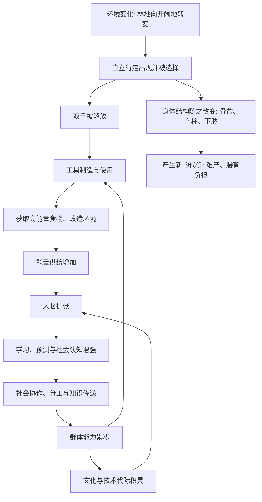

# 15｜人类是怎么进化出来的？

> 我们和别的动物，究竟差在哪里？

---

## 一、先说结论

王立铭认为，人类演化不是一次跳跃，也不是某种“更高级”的目标被实现，而是一条具体的、可以追溯的路径：**直立行走、大脑扩张、工具使用、社会协作。**

这四件事不是各自独立的，而是彼此推动的：直立行走解放了双手，双手让工具成为可能，工具与协作带来新的能量来源，能量供养了更大的大脑，更大的大脑又支持更复杂的社会协作和技术传递。

我们不是进化的终点，只是生命之树上的一根细枝。特别之处不在于我们“更进化”，而在于这根细枝上，恰好长出了能理解演化本身的能力。

---

## 二、我们先理解一个问题

先破一个印象：人是从猴子变来的吗？

不是。现生的猿类——黑猩猩、大猩猩、猩猩——不是我们的祖先，而是我们的“表亲”。我们与它们共享一个已经消失的共同祖先，之后各自沿着不同的路走了几百万年。所以更准确的说法是：人与猿，是从同一个起点出发的两支。

这带来一个真正值得问的问题：从那个共同祖先出发，“人”这条路究竟是怎么走出来的？是一次关键突变，还是一连串彼此咬合的变化？

---

## 三、作者到底提出了什么观点？

王立铭的观点是：人类演化是一条**多环节相互促进**的路径，而不是单一因素的功劳。他反复强调四个环节：

1. **直立行走。** 从四足行走转为两足行走，是这条路上最早、也最基础的一步。
2. **大脑扩张。** 脑容量显著增加，带来了更强的学习、预测与社会认知能力。
3. **工具使用。** 制造和使用工具，让获取食物和改造环境的能力大幅提升。
4. **社会协作。** 群体内的分工、分享、照顾与学习，让个体掌握的能力可以积累成群体的能力。

关键在于，这四件事是**正反馈**的关系：每一步都为下一步创造条件，而每一步又反过来强化前一步带来的压力。人不是被某一项能力“制造”出来的，而是被这几项能力互相推着走出来的。

---

## 四、把这个观点翻译成人话

可以用一个简单的生活场景来理解这条路径。

想象最早的步态变化发生在环境改变之后：原本熟悉的林地生活变得不那么可靠，需要在更开阔的地面上移动更远的距离。此时，能够较长时间用两足行走的个体，在觅食和携带物品上会占一点便宜——**只是一点点，但足以产生差异。**

一旦双手被稳定地解放出来，能做的事就多了：搬运食物、抱持幼崽、捡起石块和木棍。能做的事多了，就对“更灵巧的手”和“更会安排的头脑”提出新的要求。

而这一整套能力，都极其耗能。更大的大脑需要更多的能量支撑，单靠采集很难满足。这就需要更高质量的食物，比如肉；需要更有效的获取方式，比如合作狩猎；还需要更稳定的分享机制，比如把食物带回群体。

于是，社会协作不再是可有可无的“软实力”，而是供养大脑的硬条件：**会协作的群体，才养得起更大的大脑；而更大的大脑，又让协作变得更精细、更复杂。** 这条循环一旦转起来，就很难停下。

---

## 五、为什么会这样？

把这条正反馈画出来：

这张图最值得注意的，不是任何一个方框，而是**箭头形成的回路**。传统上人们习惯找“第一推动力”——是气候逼出来的，还是大脑点着的？但回路意味着：这个问题本身可能问错了。当一个系统内部存在互相强化时，起点的重要性会迅速下降，重要的是循环能不能持续转下去。

同时也要看到图下方那条线：**每一步适应都伴随着代价。** 直立行走改变了骨盆结构，带来了人类特有的分娩困难；更大的大脑意味着更长的童年和更强的依赖。演化没有免费的升级，只有权衡。

---

## 六、举一个现实生活中的例子

回到那条路径本身——直立行走、大脑扩张、工具使用与社会协作——它在化石与考古记录里留下了相当清晰的顺序感。

**最早出现的是直立行走。** 化石证据显示，在与黑猩猩的谱系分开之后不久，就已经出现了以两足行走为主要移动方式的早期人类近亲。它们的脑容量与猿类差别不大，但腿骨、骨盆和脊柱的形态已经显示出行走方式的改变。换句话说，**先站起来的，并不是先聪明起来的。**

**接着是工具的痕迹。** 考古记录中出现了反复被打击、加工的石器，说明“制造工具”已经成为固定的行为模式，而不只是偶然捡起一块石头。工具与肉食的获取往往被联系在一起：更有效的取食，意味着更稳定的高能量来源。

**然后是脑容量的显著增加。** 在随后的演化中，人属成员的脑容量明显大于更早的近亲，并且这一增长是在相当长的时期内持续发生的，而非一夜之间。需要说明的是，具体数值与时间线会随着新化石和新方法而修正，这里描述的是被广泛接受的大致趋势。

**贯穿始终的是社会协作的线索。** 从群体的食物分享，到对受伤个体的照顾，再到技术的代际传递，越来越多迹象显示：人类的能力很大程度上不是“装在单个脑袋里”，而是**存放在群体之中**。一个人发明的东西，可以被整个群体继承，再被下一代改进。这种可以累积的文化，才是这条路径上最不寻常的一段。

这也解释了为什么“差在哪里”这个问题，答案可能不在某项孤立的生理指标上：**真正的差别，是一个能自我加速的循环。**

---

## 七、回到书中重新理解

现在再回看王立铭为什么强调“我们不是进化的终点”，就顺了。

如果把人类演化理解成“从低到高的阶梯”，就一定会追问：为什么只有我们走到了顶端？而路径视角给出的答案是：**没有顶端。** 直立行走、大脑、工具、协作，都是在特定环境下被筛选出来的适应，每一项都有代价，每一项也都能在别的动物身上找到雏形。

我们与其说是“最进化的物种”，不如说是“某个正反馈循环转得最久、累积最多的一支”。这既解释了我们的能力，也提醒我们：这种能力是路径依赖的产物，不是必然的加冕。

---

## 八、这个观点背后还有什么？

**第一，基因与文化的协同演化。** 文化不是生物演化的附属品。人改变了环境，比如用火、合作狩猎，环境又反过来改变了选择压力，推动基因层面的变化。生物演化与文化演化互相咬合。

**第二，生态位构建的思想。** 生物不只是被动适应环境，也在主动改造环境；改造后的环境又成为下一代的选择压力。人类是把这件事做到极致的物种。

**第三，累积文化是关键变量。** 很多动物会使用工具，也有社会学习，但人类的能力可以在代际之间不断叠加、改进，形成一种“棘轮效应”——不容易倒退回去。

**第四，群体规模与协作的规模效应。** 更大、更紧密的群体，往往能维持更复杂的技术与制度，这为理解人类能力的累积提供了另一条线索。

---

## 九、这个观点有问题吗？

作为对现有证据的概括，这条路径相当有解释力，但有三点需要平衡。

**第一，“人类特殊论”需要警惕。** 工具使用、社会学习、甚至某种文化传递，在多种动物中都有发现。把人类说成“唯一”，往往经不起细看。更稳妥的说法是：人类在若干维度上“更极端”，而不是“独有”。

**第二，单一驱动因素的解释存在争论。** 有研究者更强调气候与环境变化的作用，有研究者更强调社会协作或能量获取，也有研究者认为多个因素共同作用。关于人类演化各环节的因果顺序与相对权重，学界存在不同解释。

**第三，具体的谱系与时间线会变。** 人类演化的化石记录本身是零散的，新发现、新测年方法、古 DNA 研究都可能改写此前的结论。因此对具体细节应有保留；而对“多环节相互促进”这一整体判断，则相对更有共识。

所以更准确的说法是：**人类演化是一条可追溯、可研究的路径，其大方向清楚，细节仍在不断修正之中。**

---

## 十、今天再看这个观点

以下部分是古生物学与进化人类学的现代延伸，不是王立铭的原话。

近二十多年，古 DNA 技术让人类演化研究发生了明显变化。研究者得以直接从化石中提取遗传信息，比较现代人与已灭绝近亲之间的差异，并发现不同人群之间存在过基因交流。这些工作一方面印证了“共同祖先、分叉演化”的基本图景，另一方面也让谱系变得更像一张有交叉的网，而不是一条干净的分叉线。

在应用层面，进化视角还进入了医学：一些现代常见病，比如与代谢、免疫相关的问题，被放在“过去的适应与现在的环境不匹配”的框架下来理解。这类思路被称为进化医学，它提供的往往不是直接的治疗方案，而是更准确的提问方式。

---

## 十一、这一篇真正应该记住什么？

1. **人类演化是一条具体路径：** 直立行走、大脑扩张、工具使用、社会协作。
2. **四者是正反馈关系，不是单一原因。** 每一步都为下一步创造条件。
3. **没有“进化的终点”，也没有“最高等生物”。** 我们只是生命之树的一根细枝。
4. **每一项适应都伴随代价。** 直立行走与大脑扩张都不是免费的。
5. **累积文化是关键：** 人类的能力很大程度上存放在群体里，而不只在个体头脑中。

---

## 十二、留一个问题

> 如果人类的能力主要来自一个能自我加速的循环，
> 而循环的燃料是能量、协作与可传递的知识，
> 那么当我们把这三样东西的规模扩大到前所未有的程度时，
> 我们究竟是在延续这条路径，还是在给它施加一种全新的选择压力？

---

**下一篇**：人从哪里来，我们已经大致说清。但进化论的价值不止于解释过去——它此刻正在病房、农田和我们自己的身体里继续发生，而且直接影响着每一个具体的决定。

这套一百五十多年前的思想，今天到底能用来做什么？**进化论对今天有什么用？**
