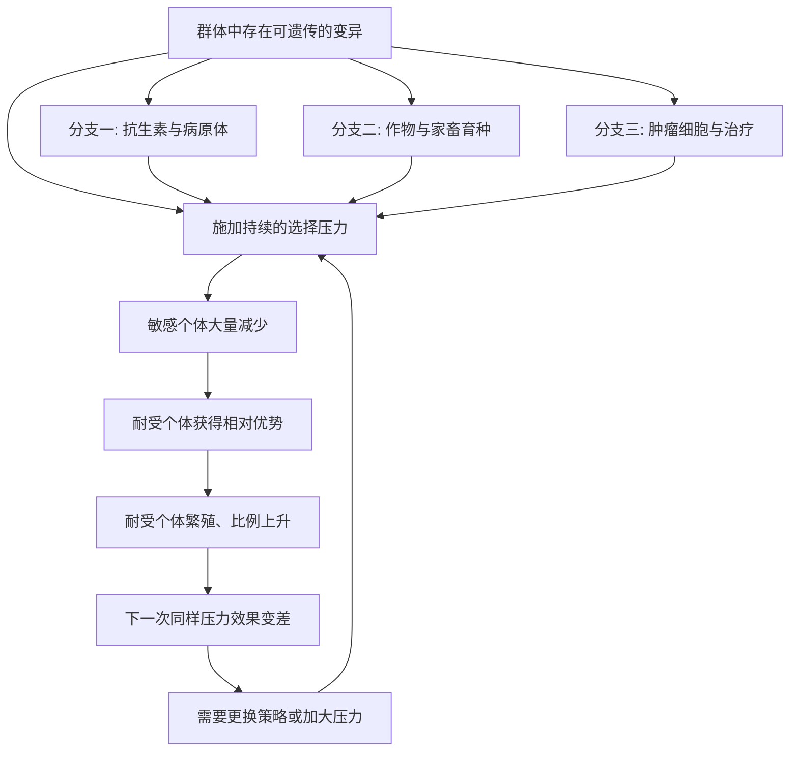

# 16｜进化论对今天有什么用？

> 一个一百五十多年前的理论，和我们的日常生活有什么关系？

---

## 一、先说结论

王立铭认为：进化论不是一门只讲远古历史的学问，而是理解生命与健康的通用工具。

只要一个群体里同时存在三件事——个体之间有差异（变异）、差异能传给下一代（遗传）、某些差异的携带者留下更多后代（选择）——这个群体就会持续变化。**这三件事一旦成立，无论发生在细菌、庄稼还是你身体里的细胞上，逻辑都是同一套。**

因此，抗生素为什么会失效、作物为什么能被改良、癌症为什么会复发，都可以用同一个框架来理解。进化论提供的不只是知识，更是一种看清动态过程的能力。

---

## 二、我们先理解一个问题

先破一个印象：很多人觉得进化论是“讲过去的”，动不动就是几百万年、几亿年，跟今天的自己没什么关系。

但事实恰恰相反。进化的速度并不总以百万年计。当选择压力足够强、繁殖周期足够短时，变化可以在几天、几个月、几年之内被观察到。

真正值得问的是：**如果进化此刻正在我们身边发生，那我们能不能用这套逻辑，反过来指导自己的选择？** 比如该不该用完一个疗程的抗生素，该怎样安排农田，该怎样设计一种治疗方案。

---

## 三、作者到底提出了什么观点？

王立铭的观点可以概括为三句话：

**第一，进化论是一个“通用解释框架”，而不仅是生物学的一个分支。** 它描述的是变异、遗传、选择这三件事共同作用时的必然结果，因此适用范围极广。

**第二，它最大的价值在于“动态视角”。** 大多数日常思维习惯把事物看成静态的：这种药有效，这个品种高产，这个肿瘤被切掉了。进化论提醒我们，这些判断都有一个隐含的时间尺度，过了这个尺度，结论可能翻转。

**第三，它直接指向可操作的决策。** 理解选择压力如何起作用，就能明白为什么要避免制造过强的选择压力，为什么要给那些“暂时没有优势”的变异留出空间。

---

## 四、把这个观点翻译成人话

可以用一句很朴素的话来翻译：

> **只要一个群体在繁衍，并且个体之间存在可遗传的差异，那么你施加的任何持续压力，都会自动筛选出对这个压力不敏感的那些个体。**

这句话的厉害之处在于，它不需要你知道具体是什么生物、什么药物、什么环境。只要前提成立，结论就会跟着来。

在日常生活里，它大概对应三种决策：

- 面对致病微生物，我们该怎样用药，才不至于亲手筛出“打不死”的那一批；
- 面对作物和家畜，我们该怎样选择，才能把想要的特征一点点积累起来；
- 面对体内的异常细胞，我们该怎样治疗，才不会在杀灭大部分之后，反而给最顽固的那一小撮让出位置。

三件事看起来风马牛不相及，底层却是同一句话。

---

## 五、为什么会这样？

把通用机制画出来：

图里最关键的，是 **A 到 B** 这一步，以及那条**回到 B 的回路**。

A 告诉我们：变异是“库存”，它通常早就存在，只是比例很低，平时看不出来。B 告诉我们：压力不会“创造”耐受者，只会“放大”本来就有的耐受者。回路则说明：同一招用得越久、越彻底，效果越会衰减——这不是药变差了，而是对手变了。

顺着这张图，还能自然推出几条反直觉的实践原则：**不要总是使用最大的压力；不要只依赖一种手段；在压力之外，尽量消耗对方的变异库存。** 这些原则，恰恰是现代医学与农业中反复被验证的经验。

---

## 六、举一个现实生活中的例子

**第一个例子是抗生素耐药。**

细菌群体里，天然就存在极少数对某种抗生素不敏感的个体，这来自随机的突变。当抗生素被使用——尤其是使用得不规范、剂量不足、疗程没走完——它就像一道筛子：敏感的被大量杀死，不敏感的活了下来，然后迅速繁殖。

结果是，下一次感染时，同样的药效果变差，甚至完全无效。这个过程在医院、社区和养殖场里反复上演，速度之快，足以让人眼睁睁看着一种新药在几年内“变钝”。更麻烦的是，细菌之间还能彼此传递耐药基因，让耐药性扩散得比单纯繁殖更快。

这直接解释了那几条看起来像“唠叨”的医嘱为什么重要：**按疗程用药，是为了不给敏感菌留下苟延残喘的空间；不自行滥用抗生素，是为了减少无谓的选择压力；在养殖中限制使用，同样是为了缩小筛选的规模。**

**第二个例子是作物育种。**

我们现在吃的很多作物，与它们的野生祖先差别巨大。以玉米为例，它的野生近亲果穗小、籽粒少、成熟后容易散落，几乎不适合收获。经过一代代人的选择——只留下符合口味的个体来繁殖——穗更大、粒更多、不易脱落这些特征被不断累积，最终形成了今天的栽培玉米。

这里的“选择者”不是环境，而是人。但机制没有变：**变异提供原料，人的偏好充当筛子，遗传把结果固定下来。** 人类其实是把自然选择的逻辑，反过来用在了自己需要的方向上。这正是进化论最直接的实用价值之一——它让“选择”从被动发生，变成可以主动设计。

**第三个例子是癌症治疗。**

肿瘤不是一团完全相同的细胞，而是一个内部存在差异的细胞群体。不同细胞的生长速度、侵袭能力、对药物的敏感程度各不相同。当化疗或靶向治疗施加压力时，敏感的细胞被大量清除，而少数不敏感的细胞存活下来，继续增殖。

于是常见的情形是：肿瘤明显缩小，过一段时间又重新长大，而且对原来的药物不再敏感。这就是耐药与复发的演化解释。它带来了一项重要的治疗思路转变：**与其用最大剂量把敏感细胞全部杀光、只留下最顽固的一小撮，不如考虑在时间和剂量上做文章，设法控制肿瘤、延缓耐药，把治疗变成一场长期的博弈。**

需要说明的是，这个思路在不同癌种中的成熟度差异很大，有些已经进入临床实践，有些仍在研究与试验之中。但它背后的演化逻辑是清楚的。

---

## 七、回到书中重新理解

现在再回看进化论的核心——**变异、遗传、选择**——会发现它不只是三个知识点的名字，而是一套可以随身携带的思维工具。

它的用法是：**先问这个群体里存在什么变异，再问我施加的压力会放大什么，最后问持续下去会发生什么。**

这三个问题，能让很多原本模糊的判断变得清楚：

- 为什么“药越强越好”未必成立？因为更强的压力，往往筛出更顽固的对手。
- 为什么“彻底消灭”有时不如“长期共存”？因为清空的位置，可能被更麻烦的东西填上。
- 为什么“保持多样性”不只是环保口号？因为多样性就是变异库存，是应对未知变化的底气。

进化论给的不是一个结论，而是一种**对时间、对群体、对反馈的敏感**。

---

## 八、这个观点背后还有什么？

**第一，它催生了一门跨学科领域：进化医学。** 把疾病放在演化史与选择压力的框架下理解，而不是只看当下的生理机制。它解释了为什么某些“坏设计”会长期存在，比如与直立行走相关的腰背问题，也解释了病原体与宿主之间的长期博弈。

**第二，它把“解释”和“干预”连了起来。** 光知道耐药会发生的机制还不够，关键是据此设计用药策略、轮换方案、监测体系。理论的价值，最终体现在决策上。

**第三，它提供了一种通用的方法论。** 面对任何会繁殖、会变化、会对压力作出反应的系统——从病原体到害虫，从肿瘤到语言与技术的传播——同样的提问方式都可能适用。

**第四，它划定了使用的边界。** 进化论擅长解释“为什么会这样”，但它不负责回答“应该怎样”。把“是什么”直接推成“应该怎样”，是错误的一步。

---

## 九、这个观点有问题吗？

这一判断总体成立，但仍需三点保留。

**第一，进化论不是万能钥匙。** 它提供了理解许多现象的框架，但具体的疾病机制、药物研发、作物基因功能，仍然需要各自领域的生物学与实验研究。用“演化”一句话替代细节，是偷懒而不是应用。

**第二，“用进化论指导实践”的成熟度参差不齐。** 抗生素耐药的管理、育种的方向性选择，已有长期实践和较明确的共识；而肿瘤的演化治疗、微生物组的干预等，很多仍处在研究前沿。关于其中一些具体策略的有效性，学界存在不同解释与正在进行的验证。

**第三，必须警惕误用的历史。** 把进化论直接套到人类社会与道德上，曾带来严重误导。科学框架解释的是自然过程，不能自动推出社会应该怎样组织。使用它时，这条边界必须一直画着。

所以更准确的说法是：**进化论是理解生命与健康的基础性工具，用途广泛且日益清晰；但它有自己的适用范围，也有必须守住的边界。**

---

## 十、今天再看这个观点

以下部分是当代科学与技术的现代延伸，不是王立铭的原话。

近年来，进化视角在多个方向上继续扩展：病原体基因组的实时监测，让耐药的扩散路径可以被追踪；肿瘤的基因组分析，让治疗期间的演化过程变得可观察；农业上，对作物多样性、抗病性与气候适应性的关注，本质上都是在管理选择压力与变异库存。

与此同时，计算能力的提升让“群体如何随时间变化”这类问题可以被更细致地模拟与预测。这并不意味着演化变得可被完全预测，但它确实让“基于演化逻辑做决策”从原则变成了日常操作。

---

## 十一、这一篇真正应该记住什么？

1. **进化论是理解生命与健康的通用工具，不是只讲远古的学问。**
2. **变异、遗传、选择这三件事一旦成立，群体就会持续变化——无论对象是细菌、作物还是肿瘤细胞。**
3. **压力不创造耐受者，只放大本来就存在的耐受者。**
4. **抗生素要按疗程用、育种要有方向、肿瘤治疗要控制而非只求清空——背后是同一套逻辑。**
5. **它有强大的解释力和实用价值，但也有明确的适用边界。**

---

## 十二、留一个问题

> 如果进化论告诉我们，
> 任何持续的压力都会筛出对它不敏感的东西，
> 那么当我们今天对自然、对药物、对信息环境施加前所未有的持续压力时，
> 我们又正在把什么悄悄筛选出来？

---

回到这个系列开篇讲的那三个词：**变异、遗传、选择。**

**变异**提供原料，**遗传**把结果传递下去，**选择**决定什么被保留。这三件事同时成立，生命就会随环境而改变——不需要设计者，不需要目标，也不需要谁在努力向上走。

从大灭绝之后空出的生态位，到趋同演化中反复独立出现的眼睛；从利他行为背后“自私的基因”，到一个物种分裂成两个；从一根细枝上走出的、能够直立行走、制造工具、彼此协作并追问自己从何而来的人类——所有这一切，都是同一套机制在不同尺度上的展开。它不神秘，却足够解释生命的全部多样性；它没有方向，却造出了会寻找方向的存在。

进化论不是一本已经写完的书。它更像一副眼镜：戴上它，你会重新看见病房里的细菌、田野里的作物、你自己身体里正在发生的选择，以及你此刻所作的决定，会在时间上留下什么。

最后，把问题交还给你：**如果演化没有终点，也没有人替你选，那么你打算用什么，作为自己的筛子？**
