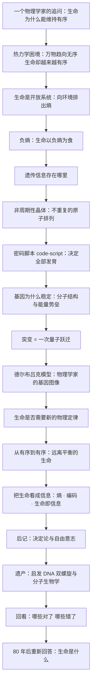

# 《生命是什么》深度解读系列

## 系列简介

「生命是什么？」这个问题，通常被交到生物学家手里。但在 1943 年，一位量子力学的奠基人，在都柏林做了一场不太寻常的公开演讲。

埃尔温·薛定谔是波动力学的创立者，写下著名的薛定谔方程，1933 年与狄拉克同获诺贝尔物理学奖。这样一位物理学家，却跨过学科边界，用物理学家的眼睛追问生命：**为什么生命能维持高度有序，而不被「万物趋向无序」的规律吞没？遗传信息究竟存放在哪里？基因为什么能一代代稳定地传下去？**

这本只有一百多页的小书，给出了一连串惊人的预言：遗传信息藏在一类「非周期性晶体」里；受精卵中有一份决定全部发育的「密码脚本」；生命「以负熵为食」；突变可能是一次「量子跃迁」。十年之后，DNA 双螺旋被发现——沃森和克里克都承认，正是这本书把他们引向了基因的秘密。

本系列不按原书章节复述，而是重建一条认知链：先理解一个物理学家为什么、以及凭什么追问生命；再走进遗传、量子与突变的论证；然后讨论熵、有序与信息；最后回到那个仍未结束的问题——**80 年后，我们该如何重新回答「生命是什么」。**

---

## 全书核心问题

| 层次 | 问题 |
|---|---|
| 视角问题 | 一个物理学家为什么要、又凭什么追问生命？ |
| 热力学问题 | 物理规律说万物趋向无序，生命为什么能维持有序？ |
| 遗传问题 | 遗传信息存放在哪里？基因为什么能稳定遗传？ |
| 量子问题 | 量子力学在基因稳定性与突变中扮演什么角色？ |
| 边界问题 | 生命是否需要超越已知物理定律的「新物理」？ |
| 哲学问题 | 如果生命由物理定律决定，自由意志还意味着什么？ |
| 遗产问题 | 这本书为什么能催生分子生物学？它又错在哪里？ |

一句话版本：

> **一个物理学家用熵、量子与信息，重新追问了生命为什么能够存在、又为什么能够延续。**

---

## 全书知识地图



再压缩成一句话：

```text
生命之谜 = 一个物理学家的问题
     → 有序为何能对抗熵增 → 生命是开放系统、以负熵为食
     → 遗传信息藏在「非周期性晶体」的密码脚本里
     → 基因靠量子稳定性遗传，突变是一次量子跃迁
     → 生命也许需要新的物理定律（这个赌注后来被质疑）
     → 但它把生命变成了可以用物理与信息严肃追问的对象
     → 十年后 DNA 双螺旋诞生，分子生物学由此启程
```

---

## 全系列目录

### 第一部分：一个物理学家的提问

#### 01｜一个量子物理学家，为什么会去问「生命是什么」？

核心问题：薛定谔为什么要跨界追问生命？作为一个物理学家，他到底想解决什么？

核心观点：薛定谔并不满足于生物学对生命的「描述」。他要问的是更底层的问题：生命为什么能维持高度有序？遗传信息如何被稳定保存和传递？他相信，物理学家熟悉的那些概念——能量、熵、量子、统计——可能正是撬开生命之谜的工具。这场跨界的本质，是换一套语言重新提问。

理解难度：★★☆☆☆

关键词：都柏林演讲、物理学家的视角、跨学科、提问方式

---

#### 02｜物理学说万物趋向无序，生命为什么能对抗熵增？

核心问题：热力学第二定律说孤立系统总是越来越无序，可生命为什么能长期维持有序？

核心观点：薛定谔指出，生命不是孤立系统，而是**开放系统**：它不断从环境吸收能量和秩序，同时把熵排出去。所以生命并没有「违反」热力学第二定律，它是靠环境的熵增来维持自身的低熵。这个视角把生命从「奇迹」变成了一个可讨论的物理过程。

理解难度：★★★☆☆

关键词：热力学第二定律、熵增、开放系统、低熵、能量流

---

#### 03｜「生命以负熵为食」：薛定谔这句话对吗？

核心问题：什么是「负熵」？这个著名的表述准确吗，还是存在误导？

核心观点：薛定谔用「负熵」（negative entropy）来描述生命从环境获取的「有序」。这句话极其有名，但严格来说并不严谨：更准确的物理量是**自由能**。薛定谔本人也承认，若只面对物理学家，他会用自由能来表述。尽管如此，「负熵」这个说法成功地把「生命即抗熵」的直觉刻进了公众认知。

理解难度：★★★★☆

关键词：负熵、自由能、表述的争议、抗熵、科学修辞

---

### 第二部分：遗传的秘密

#### 04｜遗传信息藏在哪里？——「非周期性晶体」的天才预言

核心问题：在还不知道 DNA 的年代，薛定谔凭什么推断遗传信息藏在一种特殊分子结构里？

核心观点：当时已经知道染色体携带遗传信息，但没人知道它是怎么编码的。薛定谔推断：携带海量信息的结构不可能是一遍遍重复的普通晶体——它必须是**「非周期性晶体」**：原子以一种独一无二、不重复的方式排列，从而储存几乎无限的「排列组合」。这直接预言了 DNA 的信息编码方式。

理解难度：★★★★☆

关键词：非周期性晶体、染色体、信息编码、预言 DNA、排列组合

---

#### 05｜「密码脚本」：薛定谔如何预言了遗传密码？

核心问题：薛定谔说的「code-script」是什么？它和后来发现的真正遗传密码有何异同？

核心观点：他提出，受精卵里藏着一份「微型密码脚本」，决定了从发育到成体的全部过程。这是「遗传密码」概念的雏形，深刻启发了后人。但两者有关键差别：薛定谔想象的密码更倾向**结构性、三维构型**；而真实的遗传密码是**序列性的**——碱基的排列顺序。问对了「有没有密码」，只是对「密码长什么样」猜偏了。

理解难度：★★★★☆

关键词：code-script、遗传密码、发育蓝图、序列 vs 构型、预言的偏差

---

#### 06｜基因为什么能稳定遗传几百年、几千年？

核心问题：基因要一代代稳定传递，它的稳定性来自哪里？

核心观点：薛定谔用量子力学解释：基因是一个巨大的分子，其稳定来自分子的**量子结构**与**能量势垒**，而不是经典物理里常见的统计涨落。正因如此，基因能在很长时间里保持几乎不变。稳定性不是偶然，而是「分子级别」的牢固——这为理解遗传的可靠性提供了物理图像。

理解难度：★★★★☆

关键词：基因稳定性、同分异构、能量势垒、量子结构、统计涨落

---

### 第三部分：量子、突变与分子

#### 07｜突变是「量子跃迁」吗？

核心问题：薛定谔为什么把突变说成一次「量子跃迁」？这个类比解决了他什么问题？

核心观点：突变有两个奇怪的特征：它**稀有**（大多数时候基因很稳），又**突然而离散**（变化不是渐进的）。薛定谔发现，这恰好和量子跃迁吻合：跨越能量势垒需要足够能量，因此稀少；一旦跨越，变化是「跳跃式」的。这个类比把生物学的突变，接进了量子物理的语言。

理解难度：★★★★★

关键词：突变、量子跃迁、势垒、离散性、稀有性

---

#### 08｜德尔布吕克模型：物理学家如何想象「基因」？

核心问题：薛定谔引用的「德尔布吕克模型」说了什么？它启发了谁？

核心观点：德尔布吕克用物理学的方式构造了一个基因分子模型：由相对少量的原子组成、结构稳定、靠量子机制维持。薛定谔据此刻画「基因分子」的大小与行为。这个模型的具体图像并不完全正确，但它吸引了一批物理学家转向生物学，成为分子生物学的早期火种。

理解难度：★★★★☆

关键词：德尔布吕克、基因分子模型、靶理论、物理学家转向生物学

---

#### 09｜生命需要「新的物理定律」吗？

核心问题：薛定谔猜测生命可能遵循未知的物理定律——这个赌注下对了吗？

核心观点：他认为，现有物理定律大多是**统计性**的，而生命却展现出惊人的精确有序，因此可能需要「新的物理」来解释。后来的分子生物学表明：生命的机制可以用已知的物理与化学来解释——只是极其复杂。但「生命是否具有物理上的特殊性」这个问题，至今仍在争论。

理解难度：★★★★★

关键词：新物理定律、统计物理、精确有序、分子生物学、未解之争

---

### 第四部分：有序、信息与生命

#### 10｜「从有序到有序」：生命为何能远离平衡？

核心问题：一个系统凭什么长期「远离热力学平衡」却不崩溃？

核心观点：薛定谔区分了两种过程：一种是从无序中产生有序，另一种是**从有序中汲取有序**（order from order）。生命属于后者：它靠持续的能量流，把环境中的有序「搬运」到自己身上，维持远离平衡的状态。这为后来「耗散结构」等理论埋下了先声。

理解难度：★★★★☆

关键词：远离平衡、从有序到有序、能量流、耗散结构、稳定态

---

#### 11｜把生命看成信息：薛定谔埋下的种子

核心问题：薛定谔用「密码」「信息」来描述生命，这对后世意味着什么？

核心观点：他把生命问题从「物质问题」改写成了**信息问题**：遗传不是神秘的活力，而是一套可以编码、可以复制、可以出错的指令。这一转向预示了分子生物学与信息论的联姻，也预示了今天「生命是一套信息处理系统」的现代观点。薛定谔未必想到，但他确实推开了这扇门。

理解难度：★★★★☆

关键词：信息、编码、复制与出错、生命即信息、思想转向

---

### 第五部分：决定论与自由意志

#### 12｜如果一切都由物理决定，自由意志还存在吗？

核心问题：薛定谔在后记中如何处理「决定论」与「自由意志」的冲突？

核心观点：在全书最后，薛定谔把矛头转向了哲学。他反对把人看作一台完全被因果链决定的机器，暗示意识与自由意志可能不服从经典决定论，并借用了东方哲学（「梵我一如」）的表述。这部分被不少批评者认为含糊、越界，但它触及了一个至今没有答案的问题：**物理决定的世界里，「我」的位置在哪里？**

理解难度：★★★★☆

关键词：决定论、自由意志、意识、梵我一如、后记争议

---

### 第六部分：遗产与重新回答

#### 13｜这本小书如何催生了分子生物学？

核心问题：一本薄薄的科普讲稿，为什么被认为是分子生物学的思想源头之一？

核心观点：沃森、克里克等一代人都读过它。它把「基因是什么、如何编码信息」变成了一个明确、迷人且可攻克的科学目标，促成了 DNA 双螺旋的发现。它是「问题驱动型科学」的典范：**一本提出好问题的书，比一本给出答案的书影响更深远。**

理解难度：★★★★☆

关键词：沃森、克里克、DNA 双螺旋、思想源头、问题驱动

---

#### 14｜薛定谔错在哪里，又对在哪里？

核心问题：用今天的知识回看，这本书哪些判断错了，哪些判断对了？

核心观点：错的地方：负熵的表述不严谨；把突变直接对应量子跃迁过于牵强；「生命需要新物理」很可能不必；密码被想象成结构性的而非序列性的。对的地方：遗传信息确实是一套编码；非周期性晶体的直觉惊人地准确；生命确实是开放系统。**科学的进步，常常来自提出好问题，而不是次次答对。**

理解难度：★★★★★

关键词：对与错、负熵、新物理、预言的偏差、好问题

---

#### 15｜80 年后，我们该如何重新回答「生命是什么」？

核心问题：站在合成生物学、基因编辑与人工智能的今天，「生命是什么」该怎样回答？

核心观点：今天的答案更偏向三个关键词：**信息、能量、演化**。薛定谔问对了方向，但问题并未终结——病毒算不算生命？计算机病毒呢？实验室合成的细胞呢？人工智能呢？「生命」至今没有一个让所有人满意的定义。他真正的遗产，是让这个问题从哲学思辨，变成了可以严肃追问、逐步逼近的科学问题。

理解难度：★★★★☆

关键词：合成生物学、人工智能、病毒、定义生命、未完成的问题

---

## 推荐阅读顺序

```text
第一板块｜一个物理学家的提问
  01 为什么跨界问生命
  02 生命为何能对抗熵增
  03 「生命以负熵为食」对不对

第二板块｜遗传的秘密
  04 非周期性晶体
  05 密码脚本
  06 基因为何稳定

第三板块｜量子、突变与分子
  07 突变是量子跃迁吗
  08 德尔布吕克模型
  09 生命需要新物理吗

第四板块｜有序、信息与生命
  10 从有序到有序
  11 把生命看成信息

第五板块｜决定论与自由意志
  12 物理决定与自由意志

第六板块｜遗产与重新回答
  13 如何催生分子生物学
  14 错在哪、对在哪
  15 80 年后重新回答
```

优先关系：

> 01 是全书的立场（为什么用物理学的眼光提问）；02、03 建立「有序 vs 熵」的核心张力，是理解后面一切的基础；
> 04、05、06 是遗传部分的三级台阶，需先懂「信息需要载体」才能理解「非周期性晶体」，再理解「密码脚本」；
> 07 的量子跃迁需要 06 的「基因稳定性」作前提；08 依赖 07 的突变机制；09 是对整个论证的追问与反思；
> 10、11 把话题从「物质」推向「有序与信息」，是连接物理学与生物学的桥；
> 12 是全书的哲学收尾，须在前面科学论证之后才有分量；
> 13、14、15 属于遗产与反思，放在最后，回望整段思想史。

---

## 与原书结构的对照

| 原书脉络 | 对应文章 |
|---|---|
| 第一章 经典物理学家对生命的研究方法 | 01、02、03 |
| 第二章 遗传的机制 | 04、05、06 |
| 第三章 突变 | 07 |
| 第四章 量子力学的证据 | 06、07 |
| 第五章 对德尔布吕克模型的讨论和检验 | 07、08 |
| 第六章 有序、无序和熵 | 02、03、10、11 |
| 第七章 生命是否建立在物理学定律之上？ | 09、10 |
| 后记 论决定论与自由意志 | 12 |
| 原书未直接讨论、由后世接续的遗产 | 13、14、15 |

> 说明：本对照为「主题性对应」，非原书章节的一一映射。原书篇幅很短、思辨密度高，本系列按认知难度与逻辑依赖重新编排，并补入了两项薛定谔没有展开、但由其思想引出的话题：分子生物学的诞生（13）与现代对「生命定义」的重新追问（15）。

---

## 下一步

以上是第一阶段「拆书」的成果。你可以：

- 说 **「开始写」** → 从第 01 篇开始逐篇生成 Markdown 正文；
- 说 **「写第 7 篇」** → 只生成指定篇目；
- 说 **「调整目录」** → 增删、合并、重排篇目后再动笔；
- 或者说 **「全部写完并转 HTML」** → 我将一次性完成 01–15 全部正文并生成 HTML 与目录页（像《基因传》那样）。

> 本系列将默认区分「薛定谔的观点」「科学史事实」「学界争议」与「AI 的现代延伸」，不把分析写成作者原话。
