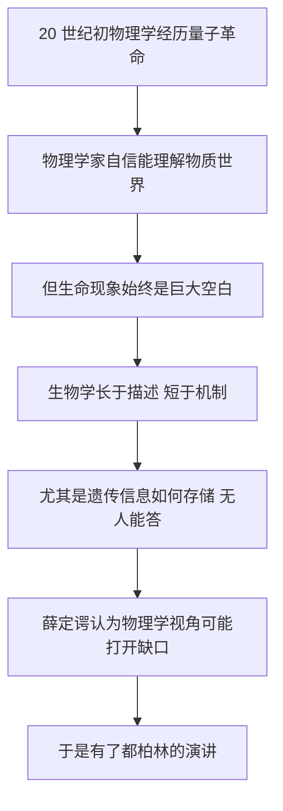

# 01｜一个量子物理学家，为什么会去问「生命是什么」？

> 薛定谔为什么要跨界追问生命？作为一个物理学家，他到底想解决什么？

---

## 一、先说结论

薛定谔不是要来抢生物学家的饭碗，他是要换一种**提问方式**。

到 1940 年代，生物学积累了大量惊人的**描述**：人们知道细胞会分裂、染色体会被传递、物种会突变。但它几乎无法**解释机制**——尤其是那个最要命的问题：遗传信息到底存放在哪里？它凭什么能一代代精准地传下去？

薛定谔相信，物理学家熟悉的那些概念——能量、熵、量子、统计——可能正是撬开这扇门的工具。他要问的不是「生命有哪些现象」，而是：

> **生命为什么能维持如此高度的有序？**

这个问题，用一句物理学家的行话来说，就是：**生命凭什么对抗「无序」？**

---

## 二、我们先理解一个问题

1943 年，一个物理学家站在都柏林的讲台上，讲「生命是什么」。

这件事本身就有点奇怪。

物理学研究原子、电子、光——那些最简单、最「死」的东西。生物学研究细胞、遗传、生命——那些最复杂、最「活」的东西。一个搞量子力学的人，为什么突然要管生命？

但反过来想，这个问题更锋利：

> **如果物理学真的掌握了物质世界最基本的规律，那生命——它明明也是物质构成的——凭什么是一个例外？**

换句话说：要么生命遵循物理定律，只是我们还没弄懂它怎么遵循；要么生命里有某种「物理之外」的东西。

薛定谔想给出的，是第一种回答的方向。而为了给出它，他必须先问清楚：物理学，究竟能对生命说些什么？

---

## 三、作者到底提出了什么观点？

薛定谔的核心主张，可以概括成三句话：

**第一，生命不违反物理定律，但它以一种非常特殊的方式实现这些定律。** 经典物理学里那些「平均」「统计」的规律，解释不了生命体惊人的精确与稳定。

**第二，所以遗传信息必须存放在一种极其稳定、又极其善于编码的结构里。** 他为此提出了一个后来被证明极具远见的猜想——「非周期性晶体」。

**第三，生命靠从环境中获取「有序」来维持自身。** 他把这形象地称为「以负熵为食」。

在这三条之上，是他真正的方法论主张：**把量子力学和统计物理的新工具，带进生物学。** 他不是来补充生物学的细节，而是来更换提问的语言。

---

## 四、把这个观点翻译成人话

想象一座巨大的城市。

城里住着一位城市规划师。他知道每条街叫什么、每栋楼做什么用、哪个路口最堵。他对这座城市的了解，细致到让人佩服。

现在来了一个物理学家。他不问街名，他问的是：

- 这座城市为什么不会自己塌掉？
- 每天维持它运转的能量，从哪里来，又流到哪里去？
- 它的「设计图」存在哪里？如果有一天要重建一座一模一样的城市，那份图纸怎么被复制？

规划师会嫌他不懂城市。但物理学家问的，恰恰是另一层问题：**秩序是怎么被维持、被传递的。**

薛定谔就是那个提着工具箱走进城市的物理学家。他没有否认生物学家的工作，他只是想站在「能量、熵与信息」的角度，重新看一眼生命这件怪事。

---

## 五、为什么会这样？

把薛定谔的动机整理成一条链：

这条链里，**D 是最关键的一环。**

当时的生物学并不是不发达，而是「偏科」：它能告诉你染色体会传递，却说不出「信息」是怎么写在染色体上的。对一个受过严格物理训练的人来说，这种「知道现象、不知机制」的状态，正是一个值得进攻的缺口。

而他手上恰好有别人没有的工具：**量子力学**。二十世纪前三十年，物理学刚刚发现，微观世界的行为和日常直觉完全不同——能量是一份一份的，变化可以是「跳跃」的。

薛定谔直觉地感到：要解释基因为何如此稳定、突变为何如此突然，这些「量子式」的想法可能派得上用场。

---

## 六、举一个现实生活中的例子

想想一家经营了几十年的老公司。

如果问一个社会学家「这家公司为什么还在」，他可能给你讲企业文化、讲员工关系、讲创始人的故事。这些都对，但都是「描述」。

如果问一个物理学家同样的问题，他可能会说：**这家公司的账本，就是它的基因。**

账本上记录着每天的进出、每笔订单、每份合同。只要账本完整、规则清楚，哪怕所有员工都换了，公司依然能照常运转——因为「秩序」被记在了账本里，而不是某一批人身上。

现在关键来了：账本要能几十年不出错，它得多可靠？它用什么方式记录，才能装下这么多信息、又不至于天天出错？

这正是薛定谔追问「生命是什么」时的态度：**生命之所以能一代代延续，一定是因为有一份极其可靠的「账本」。** 他要找的，就是这本账存在哪里、怎么写的。

---

## 七、回到书中重新理解

现在再回头看薛定谔的开场，就明白他为什么反复强调自己是「物理学家」而不是「生物学家」。

他在书里坦率地承认：作为外行，他讲的生物学细节可能有错，也可能被专家批评。但他要争取的，不是细节上的权威，而是**提问的资格**——他相信，把一个老问题用一套新的语言重新问出来，本身就可能带来突破。

这也是这本书最特别的地方：它不是一个物理学家的「科普总结」，而更像一个物理学家的「宣战书」。他瞄准的不是某一种生物现象，而是「生命」这个大问题里，最像物理学的那一部分——**有序、稳定与信息的传递。**

---

## 八、这个观点背后还有什么？

这个观点背后，藏着一个很深的前提：**还原论**。

薛定谔默认，生命再复杂，也可以一层层拆解到「分子和物理过程」。他不认为生命里有一种神秘不可分析的「活力」。

这个默认，在当时并不算主流。很多生物学家相信生命有某种特殊性，不能用物理化学简单解释。而薛定谔恰恰反过来：他认为不是生命「太特殊」，而是**我们现有的物理还太粗糙**。

还有一个不那么显眼的背景：薛定谔当时是一个流亡者。他因反对纳粹而离开德语世界，辗转来到中立的爱尔兰。某种程度上，这场关于「生命与秩序」的演讲，也带着一个流亡者对「秩序如何维持」的个人关切。这本书既是科学，也是一个人在动荡时代里对根本问题的沉思。

---

## 九、这个观点有问题吗？

有几个地方值得保持警惕。

第一，**跨界的自信。** 一个物理学家用物理学的方式谈生命，天然有「过度简化」的风险。生物学里很多复杂性——调控、环境、历史偶然——很难被几个物理概念装下。事实上，后来也确实有生物学家批评这本书「外行」。

第二，**「生命可能需要新物理」这个倾向。** 薛定谔隐约觉得，生命或许需要物理定律之外的补充。这个赌注后来被证明多半不必要（见第 14 篇），但在当时，它既是一种大胆，也是一种风险。

第三，**还原论与整体论之争。** 把生命还原到分子，是不是就理解了生命？这个问题至今没有定论。薛定谔站在还原这一边，但他没有给出证明。

不过也要公平地说：这本书的价值，很大程度上恰恰来自它的「越界」。**一个不受学科规矩束缚的外行，反而可能问出圈内人不敢问的问题。**

---

## 十、今天再看这个观点

（以下为现代延伸，非薛定谔原文）

薛定谔那次跨界的真正遗产，是开创了一种提问方式：**用物理学和信息科学的工具，去研究生命。**

今天，这种交叉已经长成了庞大的领域：生物物理学、系统生物学、单分子实验、用统计力学研究细胞内的「噪声」与「涨落」。我们甚至开始用量子效应讨论酶催化、鸟类磁导航这些生物现象——这正呼应了薛定谔「量子力学可能进入生物学」的直觉。

可以说：**他用物理学的语言问了一个生物学的问题，结果两边都被改变了。** 这件事本身，就是对「学科交叉」最好的广告。

---

## 十一、这一篇真正应该记住什么？

1. **薛定谔的贡献不是答案，而是提问方式。** 他把生命问题翻译成了物理学家听得懂的语言。

2. **他瞄准的是一个真实的空白：** 生物学能描述遗传，却说不清遗传信息存在哪里。

3. **他的核心工具是「有序与无序」**——能量、熵、量子，这些正是他的本行。

4. **他的默认前提是还原论：** 生命可以拆解到物理与分子层面，没有神秘的「活力」。

5. **越是外行，越可能问出被内行忽略的问题。** 跨界有时是弱点，有时也是优势。

---

## 十二、留一个问题

薛定谔一上来就要对付一个巨大的「不协调」：

物理学告诉我们，一个封闭的系统总是越来越乱——房间会变乱，热量会流散，秩序会崩坏。这就是「熵增」。

可生命呢？它偏偏越长越复杂、越来越有序。它凭什么？

> **如果物理定律说万物趋向无序，生命为什么能长期对抗这股力量，甚至变得更有序？**

下一篇，我们就来认真拆开这个矛盾：**热力学第二定律，和生命之间到底有没有冲突？**
