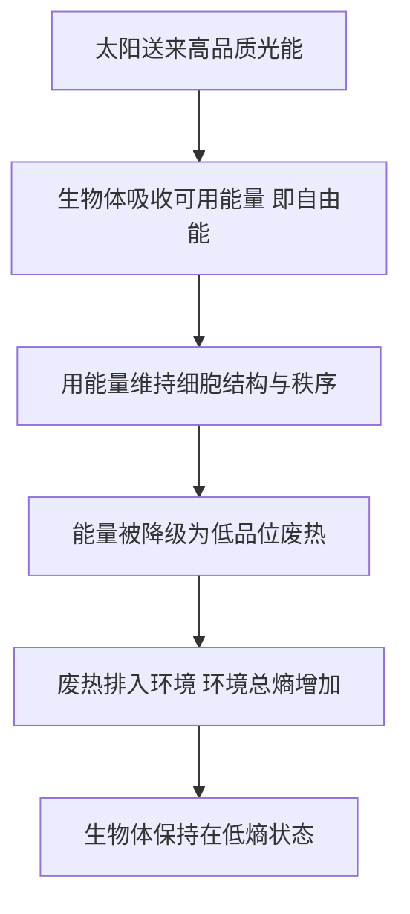

# 02｜物理学说万物趋向无序，生命为什么能对抗熵增？

> 如果宇宙的终点是一片均匀的死寂，那正在读这句话的你，算不算一个暂时的例外？

---

## 一、先说结论

生命没有对抗热力学第二定律，它只是**不在那条定律被随手误用的地方**。

第二定律说的是：**孤立系统**的总熵不会减少。关键词是「孤立」。房间会变乱，是因为它几乎不与外界交换能量；生命恰好相反——它是一个**开放系统**，一刻不停地与环境交换物质与能量。

所以准确的说法不是「生命违反熵增」，而是：

> **生命靠环境的熵增，来维持自身的低熵。**

它把熵排出去，把秩序留在体内。这不是奇迹，而是一笔账，并且账是平的。

---

## 二、我们先理解一个问题

先要澄清一个极易搞混的地方：这里的「无序」不是日常语言的「乱」。

在物理学里，熵是一个可以被计算、被比较的量。同样一堆分子，如果只有少数几种排列方式能实现它，熵就低；如果可能的微观排列方式多到天文数字，熵就高。所谓「趋向无序」，准确的意思是：**系统会自发滑向「可能性更多」的那一边。**

为什么？因为可能性多的地方，本来就更「大」。热量从热物体流向冷物体，不是因为热喜欢冷，而是因为把能量分散到冷的那一侧，对应的微观排列方式远多于集中在热的一侧。

于是第二定律可以翻译成一句关于概率的话：**系统几乎总是往概率更大的方向走。**

现在问题来了。一个细胞里几万种分子各就各位，一条染色体上的碱基排得一丝不苟——这些都是极其特殊、极其罕见的排列，熵极低。如果宇宙偏好概率大的状态，生命凭什么能长期停在概率这么小的状态里？

---

## 三、作者到底提出了什么观点？

薛定谔的回答可以拆成三层。

**第一，生命不是孤立系统。** 一个有机体每时每刻都在进食、呼吸、出汗、散热。它从未把自己封闭起来，所以「孤立系统总熵不减」这句话，不能不加限定地直接套到它头上。

**第二，生命维持低熵的办法，是持续从环境取走「有序」，再把「无序」还回去。** 薛定谔认为，有机体在不断地从环境「吸吮」秩序，用来修补和维持自身高度有序的结构。

**第三，新陈代谢真正关键的作用，不是长身体，而是排熵。** 薛定谔特别指出：有机体只要活着，就必然产生熵；而新陈代谢的核心任务，就是把这些熵及时清理出去。（此处为对薛定谔观点的转述）

这三层合起来，是一句很反直觉的话：

> 生命之所以能保持有序，恰恰因为它一直在制造更大的无序——只不过那部分无序，被记在了环境头上。

这不是钻空子，而是热力学对开放系统给出的正规结论。

---

## 四、把这个观点翻译成人话

用一个账本来理解。

想象你开了一家小店。账上有个硬规矩：**你这一侧的账，不会自己变整齐；只有当你把混乱「推」到外部，你才可能维持整洁。**

生命就是这样一家店。它每天做三件事：

- **进货**：氧气、葡萄糖、阳光、水。这些是「品质高」的能量——集中、可用、能做功。
- **干活**：用这些能量维持体温、修复细胞、搬运离子、合成蛋白质、传递神经信号。
- **出货**：二氧化碳、水、尿素，以及大量**废热**。这些是「品质低」的能量——分散、难以再利用。

进货是低熵，出货是高熵。中间赚到的那一点差价，就是自己有序的存活。而代价，是环境那本总账在变乱。

注意一个关键细节：**真正被排出去的，主要不是「混乱」这种玄乎的东西，而是热。**

---

## 五、为什么会这样？

把逻辑理成一条链：

这条链里，**D 是最关键的一步。**

从能量账上看，一焦耳的化学键能量，和一焦耳的室温热能，数值完全相同，但「可用程度」天差地别。前者可以驱动肌肉收缩、可以合成蛋白质；后者几乎什么也做不了。生命干的事，就是不断把高品位的能量降解成低品位的热。这个「降级」过程本身，就是一次不折不扣的熵增。

换句话说：**生命不是不产生熵，它只是把熵的成本转移到环境上，从而让自己这一小块地方保持整洁。**

而环境之所以能一直当「接盘者」，是因为它足够大。生物体排出去的那点熵，对地球、对宇宙来说微不足道，却足以支撑一个个细胞的低熵生存。

---

## 六、举一个现实生活中的例子

想一想冰箱。

冰箱门一关，里面的水汽凝结成霜，温度降到零下，一切显得越来越「有序」。这看起来像是公然违背第二定律。

但冰箱并没有推翻任何东西。因为它背后有一排散热管，正把**比「内部少掉的热」更多的热量**，一股脑倒进厨房。你把耳朵贴近冰箱侧面，能感觉到它在发烫——那不是故障，那就是熵在往外搬。

所以整体来看：厨房变热、变乱的程度，超过了冰箱内部变有序的程度。总账仍然是增的。

**生命，就是一台会自己走路、自己维修、还会自我复制的冰箱。** 它一边在自己内部制造秩序，一边把随之而来的熵，持续排给周围的世界。

---

## 七、回到书中重新理解

薛定谔在这一部分引入了一个很有名的公式——玻尔兹曼的 S = k log W，把熵和「实现某一宏观状态的微观排列数」直接挂上钩。

他的意思很明确：生命并不神秘，它是**统计学意义上的一个低概率状态**，靠持续的能量流被「撑住」。一旦能量流停止，它就会迅速滑回概率更大的方向——也就是死亡与分解。

他也提醒读者：第二定律是**统计性**的，不是一条逐字执行的绝对禁令。对由海量粒子组成的大系统，它几乎是不可违抗的；但在极小尺度和极短时间内，涨落确实存在。生命的低熵，并不是让这条定律失效，而是让这条定律在另一本更大的账上继续成立。

这正是薛定谔的高明之处：他没有把生命说成宇宙的例外，而是把生命重新放回物理学的框架里，并指出它在这个框架中如何可能。

---

## 八、这个观点背后还有什么？

如果只盯着生物体自己，「把熵排给环境」听起来像是在赖账。但把视野放大到整颗地球，账目就清楚了。

太阳送来的，是来自约 5500 摄氏度表面的高能光子——能量集中、品质极高。地球则以约零下十几度的低温，把热量以红外辐射的形式散进接近绝对零度的太空。一进一出，能量的「品质」被大幅拉低，对应的熵增是一个天文数字。

生命就活在这条巨大的能量瀑布上，像水车一样，从落差里取一点点功，用来编织自己的有序。

所以真正撑起生物圈的，不是地球内部有什么「生命之力」，而是**太阳这个高温源和太空这个低温汇之间的巨大温差**。薛定谔敏锐地抓住了这个结构性的事实：只要有持续的能量流，局部的秩序就可以被稳定地「维持」住。

这个洞见，后来成了整门非平衡态热力学的起点。

---

## 九、这个观点有问题吗？

有几个地方必须诚实地提出来。

**第一，这不是薛定谔的原创发现，而是对第二定律的正确应用。** 开放系统可以局部降熵，这在热力学里早就是常识：水会结冰、盐会结晶、云会形成规则对流，这些都不是生命。薛定谔的价值在于他把它清楚地说到了生命身上，而不是发明了新定律。

**第二，「生命是一个系统」这个边界并不干净。** 人体内还共生着数以万亿计的微生物；生物与环境持续交换物质，「个体边界」在哪里，某种程度上是人为划定的。系统划得不同，账的算法就会不同。

**第三，「排熵」这个说法容易把真正的难点藏起来。** 说「生命靠环境熵增来维持低熵」是对的，但它并没有回答：为什么这条能量流会自发组织出如此复杂、能自我复制的结构，而不是干脆消失成一团热？这正是薛定谔没有展开的层次。

**第四，低熵不等于复杂。** 一块冰也是低熵，但冰不会繁殖、不会进化。低熵只是生命的**必要条件**，远不是充分条件。要说明生命，还需要信息、遗传与演化。

**第五，隐含前提是「能量流足够稳定且持续」。** 生命能对抗局部熵增，前提是外部能量供应不中断。这提醒我们：所谓「对抗熵增」其实高度依赖外部条件，它更像是一种寄生于能量落差的稳定态，而非一种自主的胜利。

---

## 十、今天再看这个观点

（以下为现代延伸，非薛定谔原文）

薛定谔这一节的思路，后来长成了一整门学问：**非平衡态热力学**。

普里高津提出的**耗散结构**，描述的正是这类现象：一个远离平衡的开放系统，在持续的能量与物质流之下，可以自发形成并维持有序结构。贝纳德对流中那一片片规则的六边形胞，就是经典的例子。生命，被认为是耗散结构中最精致的一类——它必须持续「耗散」能量，才能维持自己远离平衡。

今天我们还多了一个信息维度。根据**兰道尔原理**，擦除一比特信息，至少要付出 kT ln2 的能量，并产生相应的熵。生物体处理信息、复制遗传信息，同样要付出热力学代价。生命不只是物质的耗散结构，也是**信息的耗散结构**。

地球系统科学也接过了这个话题：生物圈之所以能维持低熵，根源就在于太阳与深空之间的巨大温差。生命不是地球上的意外，而是这条能量瀑布的产物。

---

## 十一、这一篇真正应该记住什么？

1. **第二定律只对孤立系统下结论。** 生命是开放系统，不能把「孤立系统的总熵不减」直接套到它身上。

2. **生命不违反熵增，它靠环境的熵增维持自身的低熵。** 局部降熵加上全局增熵，账永远是平的。

3. **关键在能量的品质。** 生命吃进高品位能量，排出低品位废热，从中截取可用的功。

4. **新陈代谢的深层意义是排熵，而不只是长身体。** 这一点，薛定谔讲得格外清楚。

5. **低熵是生命的必要条件，不是充分条件。** 冰也是低熵，但冰不会复制自己。

---

## 十二、留一个问题

到这里，一个很自然的说法就冒出来了：

既然生命靠「吸吮有序」活着，那它吃的，是不是就是一种「负的熵」？薛定谔正是这么说的——他认为，有机体「以负熵为食」。这句话后来成了整本书里传播最广的一句。

可是，熵真的可以是负的吗？一个「负的物理量」，到底是什么意思？

> **「生命以负熵为食」这句话，是对的吗？还是在某个地方，它悄悄骗了我们一把？**

下一篇，我们就来盯住这个被引用了八十年、却常常被误读的说法：**负熵到底是什么，它错在哪里，又为什么错得这么有用。**
