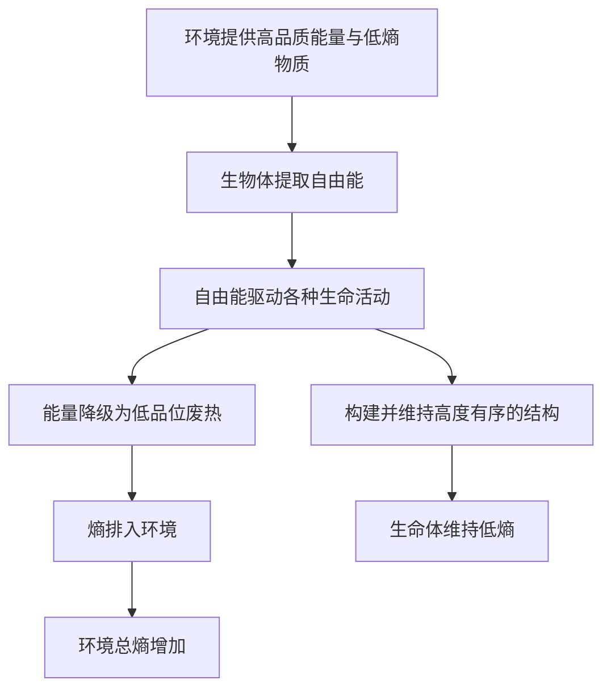

# 03｜「生命以负熵为食」：薛定谔这句话对吗？

> 「负熵」三个字，让薛定谔名满天下，也让物理学同行皱了皱眉。

---

## 一、先说结论

这句话极其有名，但它**并不是一句严格的物理表述**。

严格来说，生命从环境获取的不是「负的熵」，而是**自由能**——一种可以做功、可以驱动有序结构的能量。薛定谔本人也意识到了这一点：他承认，如果面对的是物理学家，他会改用「自由能」来表述。（此处为对薛定谔观点的转述）

所以更准确的版本是：

> **生命靠消耗自由能来维持低熵，并把熵排给环境。**

但也不能因此就断定这句话是错的。作为一句**科学修辞**，「负熵」非常成功——它把「生命即抗熵过程」这个正确直觉，牢牢钉进了公众的认知。

一句话概括本篇：**它物理上不够严谨，认知上却极为有效。**

---

## 二、我们先理解一个问题

要判断这句话对不对，先得弄清熵是什么。

第一，**熵不是「脏乱差」的日常感觉。** 它是一种统计性的度量：一个宏观状态，对应多少种微观排列方式。用玻尔兹曼的话说，S = k log W，W 就是微观排列数。

第二，**熵是状态函数，而且有确定的零点。** 热力学第三定律告诉我们：完美晶体在绝对零度时熵趋于零。这意味着，**熵天然是非负的**。它可以是零，但不会是负数。

第三，**熵不是守恒量。** 这一点常被忽略：能量守恒，一焦耳就是一焦耳；但熵不守恒，它可以在过程中被**产生**，也可以被**转移**。孤立系统里，熵只会增加。

这三条决定了「负熵」这个词的麻烦：一个从定义上就不能为负的量，你凭什么去吃它为「负」？

所以问题不在于薛定谔的直觉错了，而在于他选的那个**词**，经不起字面上的推敲。

---

## 三、作者到底提出了什么观点？

薛定谔的核心意思其实很简单：生命要维持自身高度有序，就必须从环境里获得「有序」。

他把这种「有序」命名为**负熵**，说有机体在不断「吸吮」环境的秩序。他同时明确指出：新陈代谢的关键作用，是把有机体活着时不得不产生的熵，及时排出去。（此处为转述）

他想表达的图景是清楚的：**生命是一台把「有序」搬进来、把「无序」推出去的机器。**

他还很有自知之明地补了一句大意是：如果只跟物理学家讲话，他会说有机体吃的是**自由能**。这句话非常关键——它说明薛定谔不是不懂，他是在**有意识地做一次翻译**：把物理概念翻译成普通读者能抓住的画面。

---

## 四、把这个观点翻译成人话

「负熵」翻译成日常语言，大概就是「秩序」，或者更准确些，是「可用性」。

你吃饭，并不是真的在吃一个负号。你吃的是：

- 化学键里储存的能量；
- 这些能量中**能够被身体用来做功**的那一部分。

这部分，我们就叫它**自由能**。

打个比方。一个充满电的充电宝，容量两万毫安时；一块外形相同、但已经彻底没电的废电池，重量可能差不多。前者能让手机开机、能导航、能打电话；后者什么也做不了。差别不在「有多少能量」，而在**能量的可用程度**。

自由能，就是能量的「可用程度」。生命真正吃的，是这个。

再补一句：光有能量还不够，还得看温度、浓度、化学势这些条件。同样的热量，在温差大时能做更多功，在温差小时几乎没用。自由能之所以准确，正是因为它把这些条件都装了进去——而「负熵」这个词，把它们全省掉了。

---

## 五、为什么会这样？

把这条能量流理成一张图：

看图就能明白「负熵」为什么是个借来的名字：真正在流动的，是**能量**（从高品位到低品位），以及随之而来的**熵**（从生物体到环境）。而「有序」并不是一种可以单独打包、搬运的物质，它只是这条能量流的一个**结果**。

所以更严谨的说法是：生命之所以能维持有序，是因为它持续把自由能「花掉」，并在这个过程中把熵「记」到环境账上。秩序不是被吃进来的货物，而是能量流动留下的痕迹。

---

## 六、举一个现实生活中的例子

最贴切的例子还是冰箱。

冰箱内部温度降到零下，水汽凝成霜——局部看，这是实实在在的「变有序」。但冰箱做不到凭空如此：它从插座取电，那是高品质的自由能；然后在背后把**比内部减少的更多的热量**排进厨房。结果，冰箱里是零下，厨房里却热了。

**生命就是一台自带电池、会自我维修、还会自我复制的冰箱。**

还有一个更朴素的例子：水结冰。水自发结冰时，水本身变有序了、熵降低了——可代价是它把「凝固潜热」放给了环境。局部有序从来不是免费的，它的账单总有人要付。

这两个例子都在提醒我们：「负熵」这个说法之所以让人不安，是因为它听起来像**秩序是一种可以搬来搬去的东西**。但在物理上，真正被搬动的，是能量以及它的品质。

---

## 七、回到书中重新理解

薛定谔其实比很多批评者更清醒。

他在书中一方面使用了「以负熵为食」这个说法，一方面又坦承这就是个有点别扭的措辞。他给出的理由是：对不熟悉物理的读者来说，这个说法能一下子抓住「秩序」这个要点。而他也点明，面对物理学家，他会用「自由能」来表述。（此处为转述）

换句话说，薛定谔同时给出了**两套语言**：

- 一套给公众，好记、有画面感，流传至今；
- 一套给同行，更严谨，却几乎无人引用。

这本身就是一个耐人寻味的现象：**一段科学表述的命运，常常由它的可传播性决定，而不是由它的严谨性决定。**

理解了这一点，就不会天真地以为「流传最广的说法 = 最准确的说法」，也不会因为一个说法不够严谨就否定它全部的启发价值。

---

## 八、这个观点背后还有什么？

把「有序」叫做「负熵」，本质上是一次**隐喻式的翻译**。

隐喻的力量在于：它把陌生概念挂到熟悉经验上。人本能地知道「乱」和「整」的区别，也知道「吃」意味着从外部获取能量。于是「以负熵为食」一出口，就被记住了，而且一记就是八十年。

问题在于，隐喻一旦流行，就会反过来塑造人的理解。很多人听完这句话，脑中留下的是一个错误的图像：仿佛秩序是一种可以进食的物质，仿佛生命是一块「反熵」的磁铁，天生与第二定律为敌。

这其实是科学传播中一个永恒的张力：**要说对，还是要说懂？**

薛定谔选择了「说懂」，并为此付出了一点严谨性的代价。他没有把「负熵」当成新物理量的定义，而是当一个教学用的桥。这个分寸把握得不算差——但桥被当成了岸，就是他控制不了的事了。

---

## 九、这个观点有问题吗？

必须真正讨论一下争议和隐含前提。

**第一，字面上不成立。** 熵有确定零点，不能为负。严格讲，「负熵」不是一个合法的物理量，最多是一个修辞。

**第二，它把「有序」和「低熵」混为一谈。** 「有序」是我们主观的观感，熵是客观的微观计数，两者并不总是一致。有些看起来乱的东西熵并不高，有些看起来整齐的东西熵反而很大。用主观感受去替代客观度量，是这句话最深的隐患。

**第三，它丢掉了能量的品质与温度信息。** 自由能之所以有用，跟温度、浓度梯度、化学势密切相关；只说「负熵」，等于宣称秩序可以脱离这些条件独立存在。

**第四，它容易被人拿来滥用。** 今天市场上不少挂着「负熵」招牌的商品和养生说法，跟物理学几乎毫无关系。这不能全算在薛定谔头上，但这个说法确实给了误用者方便。

**第五，也有辩护的理由。** 物理学家本来就用比喻，只要它指向正确的直觉，就不算罪过。类比不该替代解释，但它可以充当入口。薛定谔做了明确标注——他说过这是给公众的说法，对物理学家他会讲自由能。**这不是在犯错，而是在做翻译。**

所以对这句话，最公平的评判是：**表述不严谨，方向正确，传播上极为成功。**

---

## 十、今天再看这个观点

（以下为现代延伸，非薛定谔原文）

自由能这个概念今天的分量，比薛定谔时代更重。

整个生物能量学都建立在它上面：ATP 水解的自由能变化、线粒体膜两侧的质子梯度、氧化还原电位——细胞里几乎每一件「费力」的事，都是在自由能的账上结算的。

信息与热力学也再次交汇。兰道尔原理告诉我们，擦除一比特信息至少要付出 kT ln2 的能量；麦克斯韦妖的现代解，也正是在「信息换熵」的框架下被讲清楚的。

不过这里有一个必须点出的**同名陷阱**：认知科学家弗里斯顿提出的「自由能原理」，用的是**变分自由能**，来自统计推断和信息论，与热力学里的自由能不是同一个量。两者名字相同、直觉相通，但绝不能混为一谈——这恰好是「科学修辞造成混淆」在今天的又一例。

回到薛定谔：他没能给出严谨的物理量，却给出了一个正确的问题框架。后续的物理学，正是在这个框架里把答案补精确的。

---

## 十一、这一篇真正应该记住什么？

1. **「负熵」不是严格的物理量。** 熵有确定零点，不能为负；它至多是一个比喻。

2. **生命真正从环境索取的，是自由能；付出给环境的，是熵。** 这是最准确的版本。

3. **薛定谔本人知道这一点。** 他明说，若面对物理学家，他会用「自由能」来表述。

4. **这句话的价值在认知，而不在物理。** 它把「生命是抗熵过程」的直觉传播到了公众层面。

5. **好比喻能跨越时代，也可能被误用。** 分清「懂」和「对」，才不会被它骗。

---

## 十二、留一个问题

到这里，我们一直在谈能量和熵。

可生命还有另一件更让人费解的事：它不只是维持现有的有序，它还**把这份有序一代一代复制下去**。

复制，需要「信息」。而信息，必须存放在某个地方。

在还不知道 DNA 的年代，薛定谔要怎么猜出遗传信息藏在哪里？他给出的答案，是一个乍看自相矛盾的名词——**「非周期性晶体」**。

> **为什么一个「不重复」的晶体，恰好能装下生命的全部密码？**

下一篇，我们去看那个比 DNA 双螺旋早了十年的天才预言。
