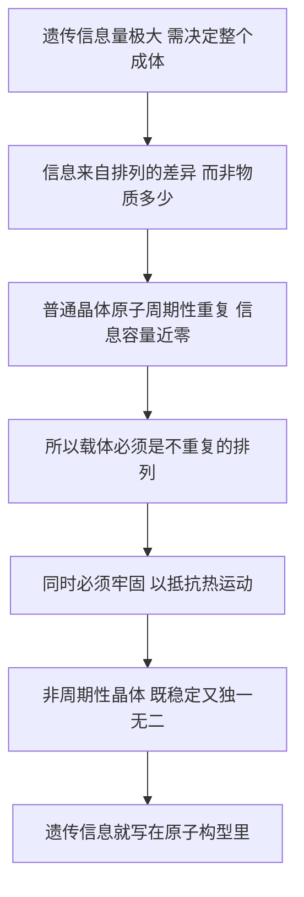

# 04｜遗传信息藏在哪里？——「非周期性晶体」的天才预言

> 在还不知道 DNA 的年代，薛定谔凭什么推断遗传信息藏在一种特殊分子结构里？

---

## 一、先说结论

1943 年，遗传学已经知道一件大事：**基因在染色体上。** 但还有一件更大的事没人说得清：**基因到底是怎么把信息写下来的？**

薛定谔绕开了「遗传物质究竟是哪种分子」这个当时吵得不可开交的问题，直接问了一个更根本的问题：**携带海量遗传信息的结构，必须具备什么性质？**

他的答案是：它不可能是一遍遍重复的普通晶体，只能是一种**非周期性晶体**——原子以一种独一无二、不重复的方式排列。

十年后，DNA 双螺旋被揭示。它的信息，恰恰就写在一串不重复的碱基序列里。

薛定谔没有猜中分子，他猜中了**分子的性质**。而后者，往往更难。

---

## 二、我们先理解一个问题

先看一个反常的事实：**一克物质里有天文数字的原子，但它可能几乎不携带任何信息。**

一块盐、一颗钻石、一粒石英，原子数目大得惊人，可你没法用它们写出任何一句话。为什么？

因为它们**重复**。盐的晶体里，钠离子和氯离子按同一套模式一遍遍排列，你看到一小块，就等于看到了全部。**重复的结构无法承载信息，因为它的每一部分都等价。**

信息不是来自「有多少原子」，而是来自「原子怎么排」。

这就像打牌。如果一副牌全是同样的黑桃 A，无论多少张，你翻出一张就知道全部。但如果五十四张各不相同，单是排列顺序就能表达出天文数字的可能。

所以问题就变成了：**遗传信息需要多大的信息量？它需要什么样的分子结构来装？**

---

## 三、作者到底提出了什么观点？

薛定谔的判断可以拆成三步。

**第一，信息量极大。** 一个受精卵要长成一个完整的成体，眼睛的位置、骨骼的比例、代谢的方式，全都被决定了。这份「说明书」的复杂度，远超人们的想象。

**第二，重复结构装不下它。** 普通晶体是周期性的，原子排列有固定周期，重复来重复去。它能很稳定，但信息容量近乎为零。

**第三，所以载体必须是「非周期性晶体」。** 原子仍然被牢固的化学键固定在确定的位置上，但排列方式不再重复——每一个位置上的原子都可以不同，整条结构因此成为一段独一无二的「长文」。

薛定谔由此推断：**遗传信息，就藏在这样一种以不重复方式排列的原子构型里。**

请注意他的推理方向：他不是先知道 DNA，再去解释它；他先从「信息需要什么条件」出发，倒推出「载体必须长什么样」。这在科学史上是一种非常漂亮的「性质预言」。

---

## 四、把这个观点翻译成人话

想象两面墙。

第一面墙，用同一种砖砌成。你从远处看、近处看、从左看、从右看，都一样。它很结实，但它没有说任何话。

第二面墙，用不同颜色、不同形状的小砖拼成的马赛克壁画。它同样结实——砖与砖之间用水泥牢牢粘住——但它记录了整幅画。

两面墙的**材料**可能完全一样，差别只在**排列**。

薛定谔说的「非周期性晶体」，就是第二面墙；或者更贴切地说：**一本用原子写成的书。** 普通晶体是「每页都印着同一个字的书」，非周期性晶体是「每页都不同的书」，一页页读下去，就是一份完整的说明书。

关键在于：这本书必须**牢固**——字迹不能被热运动搅乱；又必须**不重复**——只有这样才装得下信息。**两个条件同时满足，才配当基因的载体。**

---

## 五、为什么会这样？

把这条推理链整理一下：

这条链里最关键的一步是 **B**。

很多人凭直觉以为「信息等于物质」。但信息论告诉我们，信息来自**不确定性**：一个信号越是只能有一种可能，它携带的信息越少；越是有多种可能，信息量越大。原子排列若处处重复，就等于「只有一种可能」；只有当每处的排列都可以不同，它才能编码。

这就是为什么薛定谔能绕开「是蛋白质还是别的分子」的争论。他关心的是：**这个结构在信息上够不够用。**

---

## 六、举一个现实生活中的例子

想想图书馆和砖窑。

砖窑里出产的砖，块块一样，堆成山也只是一堆砖。你随便抽一块，得不到任何信息。

图书馆里的书不一样。同样是纸和墨，因为**排列不同**，每本书都独一无二。一排书架能装下一整个人类的知识，靠的不是纸多，而是**字与字的顺序不同**。

现在把两者合起来看，就得到一个惊人的结论：**遗传信息若要能复制、能保存、还必须写得极长，那它需要的正是「图书馆式的分子」——一种既像固体一样牢固、又像文字一样不重复的结构。**

当年人们以为遗传物质是蛋白质，理由之一是蛋白质「更复杂」。但薛定谔的标准不是复杂，而是**能不能以不重复的方式，把巨量信息稳定地固定住**。

---

## 七、回到书中重新理解

回头看薛定谔的论证，会发现他的推理其实很克制。

他并没有断言「基因就是某种特定的化学物质」。他知道染色体的化学成分主要是核酸和蛋白质，也知道当时的证据不足。他做的是**从功能反推结构**：既然基因要能储存海量信息、要能稳定遗传、还要能偶尔突变，那么承载它的分子必然具有「非周期性固体」这一组性质。

他还特别强调，这种结构未必需要天文数字的原子——因为**排列组合的数目增长得极快**。哪怕只有几百上千个位置，每个位置有几种选择，可能的排列就已经多到足以编码一个生物的全部特征。

这正是这本书最迷人的地方：**它把一个化学问题，重新表述成了信息问题。** 而信息问题，是可以先用逻辑推的。

---

## 八、这个观点背后还有什么？

背后有一个当时非常超前的前提：**遗传，本质上是信息存储。**

在薛定谔之前，人们谈遗传，谈的是「性状」「因子」「染色体的传递」。薛定谔换了一种说法：遗传本质上是**把一份编码保存下来、再复制出去**。这个说法，把生物学和信息科学接上了。

还有一层历史背景值得留意。1943 年前后，学术界对「遗传物质到底是蛋白质还是核酸」并无定论。蛋白质由二十种氨基酸组成，看起来「字母更多、更复杂」；DNA 只有四种碱基，反而显得「太简单」，不像能承担重任。

薛定谔没有卷入这场争论。他这个「外行」，反而因为不受成见束缚，直接抓住了更底层的判据：**不是看谁更复杂，而是看谁有能力做到「不重复的稳定排列」。**

需要说明的是，「非周期性晶体」并非薛定谔凭空发明的词。有研究者指出，它此前已出现在晶体学与蛋白质结构研究的圈子里；薛定谔的功劳，是把它推成了遗传信息的候选答案。

---

## 九、这个观点有问题吗？

有，而且很值得说。

**第一，它没有指出具体分子。** 薛定谔说的是「非周期性晶体」这一类性质，而不是「DNA」。真正点名核酸是遗传物质的，是 1944 年艾弗里等人的肺炎链球菌转化实验，以及 1952 年赫尔希与蔡斯的噬菌体实验。薛定谔的书与这些工作几乎同期，但他并没有给出化学答案。

**第二，「晶体」这个比喻有误导性。** 晶体暗示一种刚硬、静态、三维的固体。而真实 DNA 的许多行为——解链、复制、转录、被蛋白质弯曲折叠——都相当「柔软」，更像一根可以被反复开合的拉链，或者一根被反复卷绕的线。用「晶体」来描述，容易让人忽略它的动态性。

**第三，信息容量是否被高估过？** 他对「排列组合能装巨量信息」的直觉是对的，但对基因大小的估计受限于德尔布吕克当时的模型，并不准确。编码一个蛋白质所需的序列长度，以及基因组里大量不编码的区域，都与他当时的想象有出入。

所以更公平的说法是：**薛定谔猜对了「信息必须写在非重复的排列里」这个大方向，但在「是哪种排列、有多长、怎么被读取」这些关键细节上，他一无所知。**

---

## 十、今天再看这个观点

（以下为现代延伸，非薛定谔原文）

用一个现代数字感受一下这份「非周期性晶体」有多能装：人类基因组约有 32 亿个碱基对，若把每个碱基对算作 2 比特信息，单倍体基因组的信息量大约是 750 兆字节——差不多是一张光盘的容量。而它蜷缩在一个直径只有几微米的细胞核里，靠的正是原子级的不重复排列。

这套排列的三个现代关键词是：**序列、配对、复制。**

- **序列**：四种碱基 A、T、G、C 的线性排列顺序，就是信息的写法。
- **配对**：A 配 T、G 配 C，让一条链能精确地充当另一条的模板。
- **复制**：互补配对使「不重复的长文」可以被完整抄写一份，这正是遗传的物理基础。

回头看，薛定谔的预言真正命中的是这一句：**信息在排列里，而不在材料里。** DNA 只是这套逻辑恰好采用的化学实现方式。这一点，至今仍是理解基因组的起点。

---

## 十一、这一篇真正应该记住什么？

1. **信息来自「不重复的排列」，不来自物质的数量。** 重复的晶体再大，也写不下一句话。

2. **薛定谔是从功能反推结构：** 因为要装海量信息、要稳定、偶尔要变，所以载体必须是「非周期性固体」。

3. **他命中的是性质，不是分子。** 他没有指明 DNA，却提前描绘了 DNA 必须具备的特征。

4. **当时的主流方向是错的。** 很多人以为更「复杂」的蛋白质才是遗传物质，薛定谔则抓住了更本质的判据。

5. **这个猜想把遗传从化学问题变成了信息问题。** 这一步，才是它真正的历史分量。

---

## 十二、留一个问题

薛定谔说，基因是一种非周期性晶体，里面写满了原子级的排列信息。

可他又进一步说了一件更大胆的事：受精卵里其实藏着一份**完整的「密码脚本」**，它不只决定你像不像父母，还决定了你从一颗卵细胞长成整个人的**全部过程**。

一份看不见摸不着的「脚本」，凭什么能决定一个正在发育的生命？

下一篇，我们就来看薛定谔说的 **code-script** 到底是什么，它和后来真正的「遗传密码」又差在哪里。
