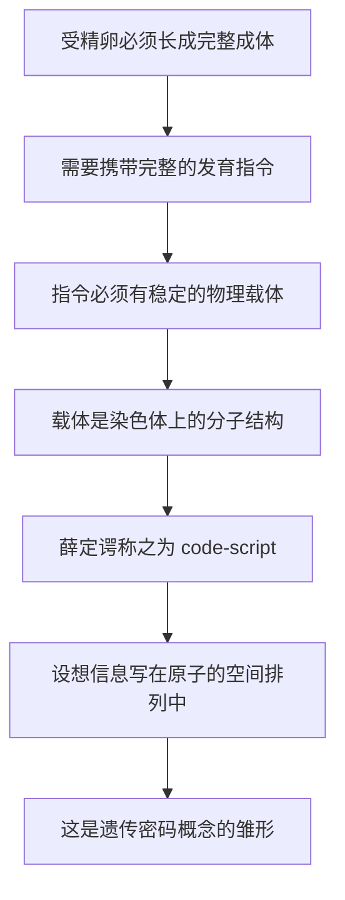

# 05｜「密码脚本」：薛定谔如何预言了遗传密码？

> 薛定谔说的「code-script」是什么？它和后来发现的真正遗传密码有何异同？

---

## 一、先说结论

薛定谔提出：受精卵里藏着一份「微型密码脚本」（code-script），它决定了从发育到成体的全部过程。

这是「遗传密码」这个概念最早的雏形之一。在他之前，人们说的是「遗传因子」；在他之后，人们开始说「编码」「指令」「脚本」。**他问对了那个问题：有没有一份密码？**

但他对「密码长什么样」的想象，更偏**结构性、三维构型**——把信息想成原子在空间中的排列形状。而真实的遗传密码是**序列性的**：四种碱基沿一条链的排列顺序，被一套分子机器一格一格地读出来。

一句话：**方向对了，形式猜偏了。**

---

## 二、我们先理解一个问题

一个受精卵，只有一个细胞。

它里面没有眼睛，没有心脏，没有骨骼，也没有手脚。可二十年后，它变成了一个会走路、会说话、会思考的人。

这中间发生了什么？

最简单的回答是「它会长」。但「长」这个字，掩盖了真正难的地方：**它怎么知道该长成什么样？**

不是随便长。两颗受精卵，一颗长成青蛙，一颗长成人，从来不会中途搞混。哪怕是同一个物种，个体之间也高度相似：眼睛长在该长的地方，心脏长在该长的地方，连出错都常常错得类似。

这意味着：**受精卵里必须有一份足够完整的「说明」，能指导这一整场发育。**

那么，这份说明是什么形式？写在哪里？由什么读出来？

薛定谔给这份说明起了个名字：**密码脚本。**

---

## 三、作者到底提出了什么观点？

薛定谔的论述大致有四层。

**第一，遗传信息集中在细胞核的染色体里。** 这一点在当时已是主流认识，他接受它。

**第二，这些信息是一份「脚本」。** 他用 code-script 这个概念，强调它不是零散的「性状清单」，而是一份**有结构、有次序的指令集**，能指导发育的整个过程。

**第三，脚本写在分子结构上。** 承接上一篇的「非周期性晶体」，他认为脚本的内容就是原子在分子中的排列方式。

**第四，这份脚本的力量惊人。** 他在书里反复强调一个令人震撼的事实：一份极其微小的结构，竟然能决定一个完整生物的全部形态与行为。

他还有一个精彩的比喻式说法：这份脚本既是**建筑师的图纸**，又是**施工者的手艺**——因为它不只描述结果，还包含执行结果的机制。

---

## 四、把这个观点翻译成人话

想象你收到一张光盘。

光盘本身很小，但里面可以装下一整部电影的每一个画面、每一句台词、每一段配乐。只要你把它放进播放器，它就能把整部电影「放」出来。

薛定谔说的「密码脚本」，就像这样一张光盘：**它本身不是人，但它包含了长出一个人所需的全部指令。**

或者更像一份**乐谱**：上面没有一个音符真的在响，但只要交给乐队，就能还原出整首交响曲。

这个比喻的精髓在于：**脚本是「指令」，不是「缩小版的人」。** 受精卵里没有藏着一个迷你小人，藏着的是一份**能让小人被一步一步造出来的指令**。

理解这一点很关键。因为接下来你会发现，后来真正的「遗传密码」，其实**正是这样一份指令**——只不过它写的方式，和薛定谔想象的不太一样。

---

## 五、为什么会这样？

把「脚本」这个概念的产生逻辑整理一下：

这条链里，**B 是关键**。

「遗传」这个词容易让人以为，基因只负责「像不像父母」——比如眼睛的颜色、鼻子的形状。但薛定谔看得更远：基因要负责的是**从一颗细胞到一整个生物的全过程**，包括什么时候分裂、哪里长骨头、哪种细胞变成神经。

这就把问题升级了：它不只是一份「特征表」，而是一份**程序**。而一旦你把它当成程序，就自然会追问：这份程序用什么「语言」写？有几个「字母」？怎么被「读取」？

薛定谔没能回答后面这些问题——但那正是他留下的路标。

---

## 六、举一个现实生活中的例子

想想自动演奏钢琴，或者工厂里的数控机床。

它们都接受一种「指令带」或「程序」：上面打着一串按顺序排列的孔或代码，机器按顺序读下去，就一个动作一个动作地执行，最后造出成品。

现在把这个画面缩小到一个细胞。细胞里有一台台「分子机器」，它们沿着一条长长的分子链向前移动，**一格一格地读**，读到什么就做什么——有的负责拼接氨基酸，有的负责开关别的基因。

这正是「脚本」这个比喻的现代版本：**生命不是被「堆」出来的，而是被「读」出来的。**

而「读」这个字，恰恰是薛定谔的比喻与真实机制之间最要紧的连接：**只要信息是按顺序被读的，它就必须是一条序列。**

---

## 七、回到书中重新理解

现在重读 code-script 这一段，会发现薛定谔其实说了两件事。

第一件**正确且惊人**：遗传信息是一份**指令性的编码**，而不只是一堆「性状」。这个观念直接影响了后来的分子生物学。克里克、沃森等人当年读他的书，受到启发的正是这一点。

第二件是**他描述得比较模糊的**：这份密码到底长什么样。薛定谔的语汇里，「排列」「构型」「同分异构」这些词反复出现，整体上更接近**三维结构的形状**——像是把信息刻在一个固体的立体构型里。

真实的情况是：遗传密码是**一维的、线性的序列**。四种碱基沿一条链排列，每三个一组（称为一个密码子），对应蛋白质中的一个氨基酸。三个碱基决定一个字母，一条基因就是一句话，一个基因组就是一整本书。

所以更准确的说法是：**薛定谔问对了「有没有密码」，也抓住了「编码」这个核心，但他把密码想象成更像「形状」的东西，而它其实是「顺序」。**

---

## 八、这个观点背后还有什么？

背后是一个更大的观念转变：**从「物质」到「信息」。**

在薛定谔之前，人们习惯问：遗传是靠什么物质传递的？是某种特殊的蛋白质，还是别的什么？

薛定谔把问题改写成：**遗传信息是怎么被编码、被保存、被读取的？**

这个改写极其重要。一旦问题变成「编码」，「用哪种化学物质」就退居其次——**纸张可以是任何材质，关键是纸上的字。** 这也解释了为什么薛定谔不知道 DNA，却能提出有价值的判断：他关心的是「编码」，而不是「墨水」。

还有一层背景：薛定谔是物理学家，他熟悉「把现象翻译成形式化描述」这件事。看到发育，他想到的不是「生命力」，而是「一套规则」。这种思维方式，让他天然地把生命看成一份**可以被读写的程序**。

---

## 九、这个观点有问题吗？

问题不少，值得一条条说。

**第一，「密码」和「程序」不是一回事。** 真实的遗传密码只规定了「哪三个碱基对应哪个氨基酸」，它**并不直接描述身体长什么样**。从基因到形状之间，隔着复杂的调控网络、细胞间相互作用与环境影响。把基因组当成一张「身体的设计图」，是过于简化的。

**第二，「蓝图」这个比喻受到了现代生物学的质疑。** 很多学者指出，发育不是一个「照着图纸施工」的过程，而是一个**自组织**的过程：细胞互相通信、环境参与塑造、很多结构在过程中才逐渐形成。基因组更像一套「反应规则」，而不是一幅「成品照片」。

**第三，薛定谔对密码形式的想象确实偏了。** 他倾向于三维构型，真实密码是一维序列。这个偏差说明：**即使问对了问题，对答案形式的直觉也可能出错。** 这也提醒我们，不要把「预言」浪漫化。

**第四，「一份脚本决定全部」这个说法，忽略了个体差异与偶然性。** 同卵双胞胎基因几乎相同，却并不完全相同；环境、随机性、发育噪声都在起作用。基因很重要，但它不是唯一的决定者。

---

## 十、今天再看这个观点

（以下为现代延伸，非薛定谔原文）

薛定谔提出的「密码」，在 1960 年代被真正破译。

过程大致是这样：1953 年 DNA 双螺旋被发现，明确了信息写在碱基序列上；1954 年前后，物理学家伽莫夫等人开始推测「几个碱基对应一个氨基酸」；1961 年，尼伦伯格与马太用人工合成的 RNA 做实验，发现全是 U 的序列会造出全是苯丙氨酸的蛋白质，密码子研究从此打开；到 1966 年前后，64 个密码子与 20 种氨基酸的对应表基本补齐。

这张表就是今天教科书上的**遗传密码表**。它有几个漂亮的性质：

- **三联体**：三个碱基决定一个氨基酸。
- **简并性**：多数氨基酸对应不止一个密码子。
- **通用性**：从细菌到人，这张表高度一致——这是所有生命同源的强证据。
- **有起点和终点**：存在起始密码子和终止密码子。

再往后，人们又发现：除了这套「密码」，还有决定基因何时何地开启的**调控密码**、决定蛋白质如何折叠与修饰的**第二套密码**，以及不改变序列却能改变表达的**表观遗传**。生命的信息层次，远比一张 64 格表复杂。

而薛定谔的比喻今天依然在被使用，只是我们更清楚它的边界：**基因组不是一张图纸，更像一份需要被解释、被调节的说明书。**

---

## 十一、这一篇真正应该记住什么？

1. **薛定谔提出了「遗传信息是一份编码」这个观念**，这是遗传密码概念最早的雏形之一。

2. **他问对了问题，但猜偏了形式：** 他倾向三维构型，真实密码是一维序列。

3. **「密码」不等于「程序」。** 遗传密码只管氨基酸对应，不直接描述身体形状。

4. **「蓝图」是一个有争议的比喻。** 发育是自组织的，基因不是唯一的决定者。

5. **一个比喻的价值，常常在于它引出的问题，而不是它有多准确。**

---

## 十二、留一个问题

密码脚本要能一代代传下去，它就必须**稳**。

想想看：一份写在分子上的说明书，时时刻刻泡在温暖的水里，周围是数以亿计的其他分子在不停碰撞、震动，偶尔还带着能量。它凭什么能在几百年、几千年里基本不变？

如果每次碰撞都能改写它一个字，那遗传早就乱套了。

基因的稳定性，究竟来自哪里？

下一篇，我们就跟着薛定谔，用物理学来解释：**基因为什么能稳定遗传几百年、几千年？**
