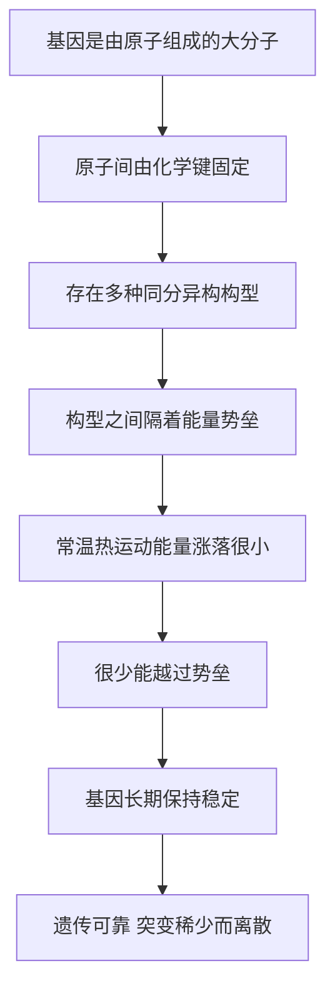

# 06｜基因为什么能稳定遗传几百年、几千年？

> 基因要一代代稳定传递，它的稳定性来自哪里？

---

## 一、先说结论

薛定谔的回答是：**因为基因是一个分子，而分子的稳定来自量子力学。**

他用两个概念搭起了这个解释：**同分异构**与**能量势垒**。

基因是一份被化学键牢牢固定住的原子排列。要改变它，必须提供足够的能量，让结构越过一道「势垒」。而在常温下，分子热运动所提供的能量，绝大多数时候远不足以越过这道坎。**所以基因能长期几乎不变。**

更关键的是，他强调这种稳定**不是统计平均的结果**，而是量子结构的产物——在经典物理的图景里，小分子本该被热运动搅得面目全非。

一句话：**基因的稳定，是「分子级别」的牢固，不是运气。**

---

## 二、我们先理解一个问题

先算一笔账。

人身上的细胞，时时刻刻都泡在 37 摄氏度的水里。水分子、离子、蛋白质在疯狂碰撞，一秒里撞击一个分子几十亿次，每次碰撞都带着能量。

现在假设，基因是一个普通的小分子。它会怎样？

它会不停地被撞得变形、扭曲，偶尔散架。就像一张纸放在大风里，你不可能指望它保持平整。**如果一个结构太小、太软，热运动就足以不断改写它。**

可现实是：基因极其稳定。你和你几百年前的祖先，某些基因几乎一模一样；水稻、果蝇这些物种延续了几百万年，它们的「说明书」大体上也没被热运动毁掉。

问题来了：**在一个如此嘈杂、如此温暖的分子世界里，一份写入分子内部的信息，凭什么能稳定保存这么久？**

这正是薛定谔要回答的问题。

---

## 三、作者到底提出了什么观点？

薛定谔的论证可以分成四步。

**第一，基因是一个分子。** 他接受德尔布吕克的图景：基因不是模糊的「生命单位」，而是一个由原子组成、有确定结构的大分子。

**第二，分子的「变化」是离散的。** 一个分子不能连续、任意地变形；它的原子排列要么是这一种，要么是那一种，中间隔着明确的能量差。化学家把「同样的原子、不同的排列」称为**同分异构**，而不同构型之间要互相转换，必须翻过一道**能量势垒**。

**第三，常温热运动越不过这道势垒。** 环境中提供的是大量**微小而随机**的能量涨落。它们能推动分子振动、转动，但要一次性凑出一大笔能量、把整个结构推过势垒，概率极低。

**第四，所以基因稳定。** 正因为「跨越」困难，「改变」才稀少；而正是这份稀少，保证了遗传的可靠性。**基因的稳定性与突变率，其实是被同一道势垒同时决定的。**

---

## 四、把这个观点翻译成人话

想象一个山谷里的球。

山谷四周是山脊。球安安静静待在谷底，微风吹不动它——风再大，也只是让它左右晃一晃，它总能落回原处。

只有当一股足够大的力量把球推过山脊，它才会滚进旁边的另一个山谷，从此**换了一个稳定状态**。

分子的世界就是这样：**谷底是稳定构型，山脊是能量势垒，推过山脊就是发生改变。**

日常热运动就是那阵微风，让分子不停地颤、不停地晃，但绝大多数时候，分子总会落回原处。只有极偶然地，一次特别集中的能量涨落，才可能把它「推过山脊」。

这就是为什么**突变既稀少、又突然**——它不是在慢慢积累中渐变，而是在某一次「翻过山脊」的瞬间完成的。

---

## 五、为什么会这样？

整理一下这条因果链：

这条链里，**E 是关键**。

薛定谔特别强调：经典物理里的稳定性大多是**统计的**，靠大量粒子的平均行为；但基因不是。基因的稳定来自**单个分子的离散状态**：一个分子要么在这个构型，要么在那个构型，没有中间地带。

他用这个论证来回应一种质疑：既然热运动这么猛烈，基因早该被撞坏。答案是——**量子化的离散状态，给分子提供了一道经典统计无法跨越的门槛。**

---

## 六、举一个现实生活中的例子

想想家里的总电闸和保险丝。

如果电流只是小小地波动，灯会忽明忽暗，但电路不会断。只有当电流**超过一个阈值**，保险丝才会「啪」地断掉——这是一个突变式的、离散的事件。

薛定谔说的基因，就是这种**有阈值的分子**。

它平时待在「稳定」这个状态里，任外面的热噪声怎么吵，它都不为所动。只有当某个瞬间的能量集中到足以跨过阈值，它才会「跳」到另一个状态。**一个状态的持久，和一个状态的跳变，是同一套物理的不同侧面。**

这也解释了遗传学里一个奇怪的现象：基因可以「同分异构」——原子完全相同、排列不同，表达的性状就不同。**信息藏在排列里，稳定性也藏在排列里。**

---

## 七、回到书中重新理解

回头看书，就能明白薛定谔为什么非得把量子力学搬进来。

1940 年代的化学已经知道化学键很强、分子很稳定。但要解释「为什么这么稳」，只用经典物理就会遇到尴尬：**在经典图景下，分子的结构只是统计近似，热运动随时可能把它抹平。**

薛定谔说：不，量子力学改变了一切。正因为能量是量子化的，分子才有确定的、离散的、可长期保持的状态。**这就是他为「遗传的可靠性」提供的物理学依据。**

他还用这一点把「遗传」和「突变」连成一体：势垒高，所以稳定、突变罕见；而当势垒偶尔被越过，基因就发生了**离散的改变**。同一套机制，同时解释了「像」和「不像」。

需要说明的是，书中关于基因大小的估算来自德尔布吕克的模型，与今天并不完全吻合；但他提出的**物理图像**——大分子、势垒、离散状态——抓住了要点。

---

## 八、这个观点背后还有什么？

背后是对「稳定性」这件事的重新理解。

日常生活里，我们认为「稳定」就是「不动」。但薛定谔告诉我们，**真正的稳定是「有门槛的稳定」**：系统可以处在两种状态之间，中间有一道必须跨越的山脊。正因为跨不过去，它才稳；也正因为它能被跨过去，它才可能变。

更有意思的是，他由此推出一个反直觉的结论：**稳定性可以用概率来描述。** 越过势垒的概率极低，但并非为零，于是「基因在某个时刻发生突变」就成了一个可以估算的罕见事件。

他还提醒读者：不要把这种稳定误解为「绝对不变」。**稳定，只是「变的概率足够小」。** 遗传学里最深刻的一点恰恰在此：一个系统要足够稳定（否则生命不能延续），又要偶尔出错（否则生命不能演化）。**这两件事看似矛盾，却由同一道势垒同时满足。**

---

## 九、这个观点有问题吗？

有问题，而且现代生物学补上了很大一块。

**第一，真实的基因稳定性，很大一部分来自「修复」，而不只是「坚固」。** DNA 并不是一块惰性的石头：它会被紫外线损伤、会被氧化、会自发脱氨、碱基会偶尔脱落。真正让基因组保持完整的，是一整套 **DNA 修复系统**：复制校对、错配修复、切除修复、双链断裂修复等。薛定谔的图景是「结构足够牢」，现代图景是「结构会坏，但有工人日夜维修」。

**第二，他低估了化学损伤的普遍性。** 如果只靠势垒，DNA 在几十年的尺度上其实会发生不少自发变化。所以「基因几百年不变」需要修正：它是在**强大的修复机制**下才成立的，而不是纯粹的自发惰性。

**第三，他把信息想成「构型与同分异构」，而真实信息是「序列」。** 同分异构是同一分子在几种形状间切换，遗传信息却是碱基沿链的排列顺序，两者是不同的层次。薛定谔借同分异构说明「离散稳定态」方向不错，但用来刻画遗传信息本身就不够贴切了。

**第四，他对稳定性的估计偏乐观。** 不同物种、不同基因的突变率差别很大；有些区域极其稳定，有些则高度易变。**稳定性不是均匀的，而是被演化与选择精细调校过的。**

**薛定谔讲对了「物理门槛」这一半，漏掉了「生物修复」这一半。** 生命的稳定，是物理与生物共同完成的。

---

## 十、今天再看这个观点

（以下为现代延伸，非薛定谔原文）

现代生物学对「遗传的稳定性」有了更量化的认识。

以人为例：DNA 复制的原始出错率约在十亿分之一量级，再加上聚合酶校对和错配修复，最终每代每碱基的突变率约在十亿分之一到百亿分之一之间。换算到整个基因组，每个人大约携带六七十个**新发突变**——这正是「稳定但非完美」的绝佳体现。

我们今天还会用「分子钟」来估算物种分化的年代：正因为突变以大致恒定的低速率随机积累，序列差异才成了一台可以读的时钟——这背后，正是薛定谔所说的那种「稀少而离散的改变」。

还有一条有趣的现代线索：有物理学家提出，DNA 中的质子可能通过**量子隧穿**从一个碱基位转移到另一个位置，从而造成配对错误——这是把「量子」直接接进「突变」的一种尝试。这个假说至今没有定论，但说明薛定谔把量子力学引入遗传的思路并未被完全丢弃。

---

## 十一、这一篇真正应该记住什么？

1. **薛定谔用分子物理解释基因稳定：** 大分子、同分异构、能量势垒、离散状态。

2. **稳定性来自「有门槛」：** 热运动能晃动它，却很难把它推过山脊。

3. **同一道势垒，同时决定了「稳定」和「突变」。** 这是本书最漂亮的一处推理。

4. **他讲对了物理的一半，漏掉了生物的一半。** 真实的基因组稳定，严重依赖 DNA 修复系统。

5. **稳定是概率性的：** 不是绝对不变，而是「变的概率很小」——这正是遗传与演化都能发生的前提。

---

## 十二、留一个问题

薛定谔说，基因的改变，是一次「翻过山脊」的事件。

它稀少，所以遗传可靠；它突然，所以变化不是渐进的；它离散，所以要么不变、要么变成另一个稳定状态。

他把这种改变，和量子力学里那个著名的图像联系了起来——**量子跃迁**。

一个电子可以在两个能级之间「跳」，中间不经过任何过渡状态。基因的突变，会不会就是这样一次「跳跃」？

下一篇，我们就来追问：**突变，真的是一次量子跃迁吗？**
