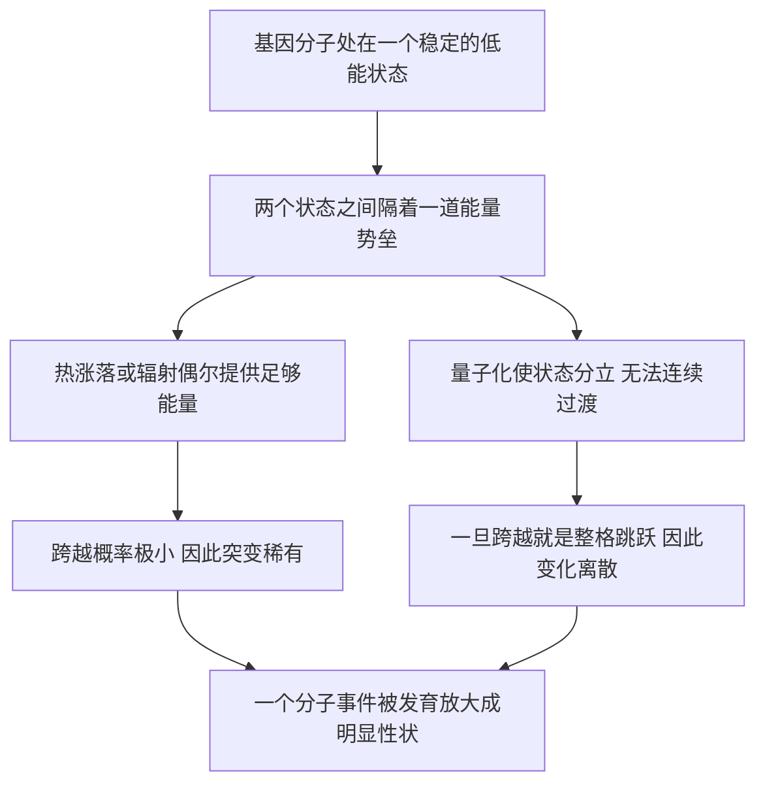

# 07｜突变是「量子跃迁」吗？

> 薛定谔为什么把突变说成一次「量子跃迁」？这个类比解决了他什么问题？

---

## 一、先说结论

薛定谔要同时解释两件看似矛盾的事：**基因绝大多数时候极稳定，可偶尔又会突变。**

稳定，说明它不容易被打乱；突变，说明它终究会被打乱。而突变的方式很怪——它**很稀有**，却又**很突然、很离散**：不是慢慢漂移，而是一步到位。

薛定谔的答案是：**突变是基因分子内部的一次「量子跃迁」。** 跨越能量势垒需要凑够一份能量，所以稀有；量子状态是分立的，所以变化是「跳跃」，不是渐变。

这个类比最重要的地方，不是它有多准，而是它第一次把生物学里最像物理的现象，接进了量子物理的语言。

## 二、我们先理解一个问题

先别急着谈量子，把「突变」这头怪兽看清楚。

真实基因的行为有两个怪处：

- **平时几乎不出错。** 一个基因可以在成千上万代里保持几乎不变。
- **一旦出错，往往一步到位。** 不是某个字母慢慢模糊成另一个，而是在某一代，某个位置**突然**换掉。

第二点尤其反直觉。日常里大多数变化是渐进的：水慢慢变热，铁慢慢生锈。可突变不是。它像电灯开关——要么开，要么关，没有「半开」。

于是薛定谔面对一个双重的谜：

> **为什么基因那么稳，却又会变？而且一变就是「跳」着变？**

## 三、作者到底提出了什么观点？

**第一，稳定与突变是同一个物理图像的两面。** 基因是一个分子，待在一个稳定的能量状态里；正因如此它才稳。

**第二，突变是它从一种状态跳到另一种状态。** 他借用化学的「同分异构」想法：同一批原子可以按不同方式排列，形成能量略有差别、却彼此分立的构型。

**第三，为什么稀有？因为中间隔着一道能量「墙」。** 重排原子必须先爬过一道能量势垒，平时能量不够，只能偶尔靠热涨落凑够一次。

**第四，为什么是「跳」不是「爬」？因为量子状态是分立的。** 系统不能停在两个状态之间，只能整格转移，于是变化天然是跳跃。

**第五，一个小事件会被放大。** 分子层面的一次微小重排，可以通过发育被放大成生物体的明显改变——这是他反复强调的「放大器」直觉。

## 四、把这个观点翻译成人话

先说「量子跃迁」。在原子里，电子只能待在几个**分立**的能级上，像楼梯：你能站在第 3 级或第 4 级，却没法悬空站在 3.4 级。量子跃迁，就是电子**不经过中间的台阶**，直接从一个能级跳到另一个，往往伴随吸收或放出一个能量正好等于两级差的光子。

再说「能量势垒」。想象一个球稳稳躺在山谷里，旁边隔着一道小山脊，山脊那边是另一个稍浅的谷。球要过去，必须被推到山脊顶上；推不上去，它就一直待在原地——这是稳定。偶尔一次足够猛的撞击，球翻过山脊，一下子滚进另一个谷——这是突变。

合起来，图像就清楚了：

- 基因窝在一个稳定的「能量坑」里——**所以稳定**；
- 要出来必须翻过「能量山脊」——**所以稀有**；
- 翻过去后不会停在半坡，而是落进另一个分立的坑——**所以是跳跃式的离散变化**。

一个图像，同时解释了三个特征：稳定、稀有、离散。

## 五、为什么会这样？

把这条推理链画出来：

这条链里，巧妙的是**B 同时分叉出两条路**。

左边（C→D）解释「稀有」：跨越势垒是概率事件，能量不够就过不去。右边（E→F）解释「离散」：就算能量够了，系统也只能整格跳，不能半个状态半个状态地挪。

换句话说，**稀有性来自热力学（能量够不够），离散性来自量子力学（状态分不分立）。** 薛定谔把它们打包进「量子跃迁」一个词里，读起来很顺，但严格说来两者来源不同——第九节还要算这笔账。

## 六、举一个现实生活中的例子

想想一个上了劲儿的老鼠夹。

它平时处于「待发」状态，你不碰它，它可以一直保持原样——这是**稳定**。要让它动作，你得给它足够大的扰动：吹一口气没用，得有一根足够分量的东西真正压上去；而日常里这种「刚好够」的扰动并不常有——这是**稀有**。它一旦触发，又不会「弹到一半」，弹簧瞬间释放，啪地合上——这是**离散、跳跃**。

基因的突变，在薛定谔的设想里就是这样一个分子级的老鼠夹：平时绷得好好的，需要一次「够格」的能量输入才触发，一旦触发就整个翻转。

提醒一句：老鼠夹只是比喻，它帮你记住「稳定、稀有、跳跃」怎么共存，但**不能代替真实的分子机制**。真实突变是怎么回事，第十节会讲清楚。

## 七、回到书中重新理解

回头看薛定谔的章节安排，就明白他为什么把突变放在稳定性之后。

在第六章（对应本系列第 06 篇）里，他已经论证：基因之所以能稳定遗传，是因为它作为一个分子，有分立的量子结构和一道能量势垒。到了突变这一章，他做的是同一件事的**反面**：

> **如果基因的稳定来自「跳不出去」，那突变自然就是「偶尔跳出去」。**

稳定和可变不是两个打架的性质，而是同一个量子图像在不同概率下的表现：绝大多数时候跳不出去，极小概率下跳出去。

也正是在这里，薛定谔触到一个极深的点：**正因为状态是「分立」的，遗传信息才可能被精确复制，出错才可能表现为跳跃式替换。** 他没说出「数字信息」这个词，但直觉已经指到那个方向。后来的分子生物学证明，他抓住了要害。

## 八、这个观点背后还有什么？

第一层，是**「基因即分子」的还原论立场**。薛定谔默认基因行为最终可用一个分子的物理状态解释。这在当时并非理所当然，因为还有人相信生命有不可还原的「活力」。

第二层，是**物理学家的思想网络**。这个量子跃迁图像不是凭空冒出来的，它主要来自德尔布吕克等人 1935 年的论文；而德尔布吕克又深受玻尔影响——玻尔在 1930 年代谈「光与生命」，主张用量子理论的「互补性」来看生命。薛定谔把这条从玻尔到德尔布吕克的思路，用最通俗的方式讲给了大众。

第三层，是一个被忽略的洞见：**一个系统只有「足够稳、又不绝对稳」，演化才可能发生。** 基因若完全不变，物种无法适应；若天天乱变，信息又会崩掉。「稀有而离散」恰好落在这个窄窗口里——薛定谔无意间给出了演化论所需的一条物理条件。

## 九、这个观点有问题吗？

**第一，「量子跃迁」这个标签有点用力过猛。** 突变的「稀有」主要来自能量势垒和热涨落的统计规律——那是玻尔兹曼式的统计物理，和「烧开水要看温度」是一类道理，并不特别「量子」；「量子」真正负责的只是「状态分立、只能跳不能滑」。把两者都叫量子跃迁，容易让人误以为每次突变都是量子隧穿。它更像一个**有力的比喻**，不是精确的机制说明。

**第二，具体机制猜错了。** 他用的是「同分异构」——同一批原子换一种排法；而真实的自发突变，主要是 DNA 序列本身改变（碱基被替换、多一个、少一个），并非整个分子换构型。他猜对了「变化是分立的」，却猜偏了「变化发生在哪一层」。

**第三，「稀有」不是铁律。** 有些突变相当频繁，有些位点更易变，突变率还受修复系统、环境和发育阶段影响。

**第四，离散性也有边界。** 基因型层面变化是分立的，但表现型层面很多性状（身高、产量）是连续的，因为它们由许多基因共同决定。

不过，即便机制猜错，**他抓住的直觉——遗传信息是分立的、可跳跃的——是对的**，这正是这个观点值得保留之处。

## 十、今天再看这个观点

（以下为现代延伸，非薛定谔原文）

今天的突变图像具体得多：DNA 复制时的配对错误、碱基自发脱氨、活性氧造成的氧化损伤、紫外线让相邻嘧啶结成二聚体、电离辐射打断链、转座子在基因组里跳动。与此同时，细胞还有一整套 DNA 修复系统不断纠错。所以真实的自发突变率，是「出错」与「修复」之间的平衡，而非单纯的物理概率。

那么「量子跃迁」错了吗？作为**机制描述**，它过于粗糙；作为**结构直觉**，它触到了要点——遗传信息是数字式的，变化是离散的。今天我们知道，「稀有而离散」的深层原因很大程度上是**信息以分立符号存储**，而不是「每次突变都是一次量子跃迁」。

但也别急着把量子效应赶出去。有一类自发突变可能真的与量子力学有关：碱基的**互变异构**。沃森和克里克在 1953 年的双螺旋论文里就猜测，碱基偶尔会以罕见形式出现，导致配对「认错」，从而产生突变；后来有人提出，这种互变异构可能通过**质子隧穿**发生——质子直接穿墙而过，是地道的量子效应。此外，紫外诱变本身就是光化学：光子被吸收、分子进入激发态，那是量子力学的主场。今天所谓的「量子生物学」正在这些地方小心寻找证据，其中不少仍是开放问题，不能夸大。

一句话：**薛定谔的「量子跃迁」，大部分是修辞，小部分是真的。**

## 十一、这一篇真正应该记住什么？

1. **突变有两个反常特征：稀有，且离散。** 大多数时候基因极稳，偶尔一步到位地改变。

2. **薛定谔用一个量子图像解释这两点：** 稀有来自能量势垒，离散来自量子分立。

3. **「量子跃迁」是强有力的类比，但不是精确机制。** 稀有性主要是统计物理，离散性才是量子的成分。

4. **他的深层直觉是对的：遗传信息是分立的、数字式的。**

5. **真实突变是一串化学事件加修复系统的平衡，** 但个别环节（质子隧穿、光化学）确实可能真用到量子力学。

## 十二、留一个问题

薛定谔并不是凭空发明了「基因分子」和「量子跃迁」这套说法。

他几乎是从一篇论文里直接借来了整个图像——1935 年，物理学家德尔布吕克和两位合作者，用量子物理的方式给「基因」画了一张像：它由大约一千个原子组成，结构稳定，靠量子机制维持。薛定谔在书里专门用一章讨论它，并把它推向了全世界。

那么，物理学家当时到底把基因想象成了什么？这个模型哪一部分惊人地准，又哪一部分错得离谱？它又为什么会把一整代物理学家吸引到生物学里来？

> **下一篇，我们就来看这张「物理学家画的基因像」——德尔布吕克模型。**
