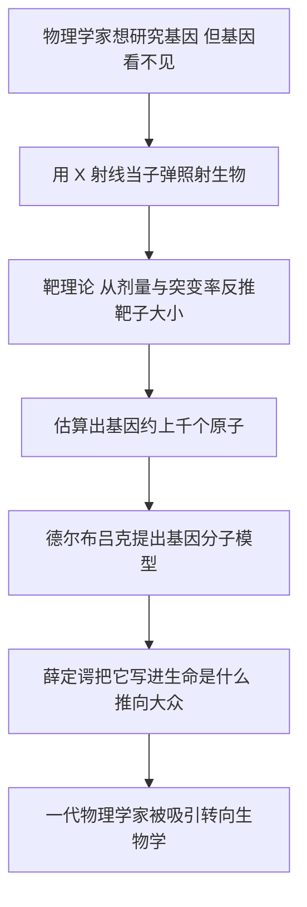

# 08｜德尔布吕克模型：物理学家如何想象「基因」？

> 薛定谔引用的「德尔布吕克模型」说了什么？它启发了谁？

---

## 一、先说结论

薛定谔书里那个著名的「基因分子」图像，主要不是他自己想出来的，而是从一篇论文里借来的。

1935 年，物理学家马克斯·德尔布吕克和遗传学家蒂莫费耶夫-列索夫斯基、物理学家齐默合作，发表了一篇论文——因为登在绿色封面的期刊上，后来被叫作「绿皮论文」，也被称为「三人论文」。他们在文章里用量子和统计物理的方式，给基因画了一张像：**基因是一个由相对少量原子组成的分子，结构稳定，靠量子机制维持；突变是这个分子内部的原子重排。**

薛定谔把它写进《生命是什么》，并给了它整整一章。这个图像后来被证明并不完全正确，却吸引了一整代物理学家转向生物学——它是分子生物学的一颗早期火种。

## 二、我们先理解一个问题

基因看不见、摸不着，在 1930 年代还没有任何办法「读」它。那么，物理学家凭什么敢谈它的大小和结构？

他们有一个很物理的办法：**用辐射当子弹去打它。**

思路是这样的：用 X 射线照射果蝇或噬菌体，看多少剂量能让基因突变。如果基因是一块有确定大小的「靶子」，那么剂量越高，击中它的机会就越大。于是，从「剂量—突变率」的关系里，可以反推出靶子的尺寸。

这个思路叫**靶理论**。它背后是一个很朴素的假设：X 射线要么击中基因、要么没击中；击中一次就可能出事；突变率大致与剂量成正比。

就是靠这种「看不见靶子、只数命中」的间接推理，人们第一次对基因的大小做出了数量级估计。而其中一个被反复引用的结论是：

> **一个基因，大致牵涉到「上千个原子」的量级。**

这个数字，后来被薛定谔原样搬进了书里。

## 三、作者到底提出了什么观点？

薛定谔在书中引述并采纳的「德尔布吕克模型」，大致包含以下几点：

**第一，基因是一个分子。** 是一个有确定原子排列的「基因分子」，而不是某种神秘的、生命特有的东西。

**第二，它不大。** 从辐射数据反推，它大约由上千个原子组成——在分子世界里算「大分子」，但和一滴水里的天文数字相比，极其微小。

**第三，它非常稳定。** 稳定来自它的量子结构：确定的分立状态，加上一道能量势垒。这正是上一篇说的那件事。

**第四，突变是它的内部重排。** 原子换个排法，就可能产生一个性质不同的新基因。

**第五，一个小分子能决定大性状。** 一个分子层面的事件，可以被发育过程层层放大，最终变成翅膀形状、眼睛颜色这类宏观特征。

薛定谔对它的评价很有意思：他一方面承认，这个模型「并没有告诉我们遗传物质到底是如何工作的」；另一方面又极其郑重地说，从这张图像里透露出一种可能——生命虽然没有违反已知的物理定律，却很可能**牵涉到一些至今未知的「别的物理定律」**。这后半句，就是下一篇要算的账。

## 四、把这个观点翻译成人话

把基因想成一块极小的乐高积木。

零件数量不多——按当时的估计，也就上千个原子；但每个零件摆在哪儿都很有讲究。摆对了，整块积木牢不可破；某一个零件被外力挪了位，整块积木的「脾气」就变了。

或者更贴切一点：把它想成一把锁。原子的排列，就是锁的内部结构；换个排法，等于换了一把锁——原来那把「钥匙」（正常的细胞过程）就打不开它了，性状因此改变。

这个图像的关键点在于：**它把基因变成了一个可以谈尺寸、谈结构、谈能量的物理对象。** 一旦基因是个「东西」，物理学家就有话可说了。

当然，乐高和锁都只是比喻。它们能帮你记住「小而精确、稳而可错」，但真正的问题——遗传信息到底是以什么化学方式写下的——这个模型其实并没有回答。

## 五、为什么会这样？

把这段科学与思想史整理成一条链：

这条链里有两次关键的「翻译」。

第一次发生在 C：把生物学里的「突变率」，翻译成物理学里的「命中概率」。这一步让不可见的基因有了一个可测的量。

第二次发生在 F：把一篇只有专业读者的小众论文，翻译成一本所有人都能读的书。后来有物理学家评价说，薛定谔这本书最大的功劳，**恰恰是让德尔布吕克那篇论文被圈子之外的人知道了**。

## 六、举一个现实生活中的例子

想象你在一个漆黑的房间里，墙上藏着一个很小的按钮。

你看不见它，但你有满满一筐小球。于是你朝墙壁乱扔，数一数：扔一百个球，大概有几个打中了按钮、触发了灯亮。扔得越多，命中的次数越多；从「命中率」和「墙面面积」的关系，你能反推出按钮大概有多大。

X 射线就是这个房间里的小球，基因就是那个看不见的按钮。物理学家不会「看见」基因，但他们可以根据命中率，推断它有多大。

当然，这个类比也暴露了靶理论的弱点：它假设按钮清清楚楚、一碰就响。可真实基因既不是孤立的按钮，也不是「一碰就必定出事」——环境、修复、多次命中都会搅乱这笔账。

## 七、回到书中重新理解

现在你会明白，薛定谔为什么要花整整两章（第四章和第五章）去讲别人的模型。

因为他需要一块**具体的物理学砖头**。如果只抽象地谈「有序」「量子」「稳定性」，读者抓不住；而一旦有了「一个上千原子的稳定分子」这个具体对象，整个论证就落地了：遗传不是神秘力量，而是一个分子在量子规则下的行为。

同时也要说清楚一件常被忽略的事：**薛定谔并没有说这个分子就是 DNA。** 他写作的 1943 至 1944 年，DNA 和蛋白质谁才是遗传物质，学界还在激烈争论；不少人偏向蛋白质。薛定谔很聪明地回避了化学身份，只谈「非周期性晶体」这种结构特征——这反而让他的预言活得更久。

换句话说：他借用了德尔布吕克的「物理图像」，又加上了自己的「信息直觉」。前者不长久，后者却命中了。

## 八、这个观点背后还有什么？

这个模型背后，是一种很特别的研究纲领，可以叫「**物理主义的生物学**」。

德尔布吕克真正想找的，不是某个生物物种的细节，而是一个像「原子」那样简单、普适的生物学对象。他后来选中了噬菌体——一种结构极简单、繁殖极快的病毒。他把它当作「生物学里的氢原子」，用最少的零件去逼近最基本的规律。

围绕这个纲领，渐渐聚起了一个松散的学术共同体——**噬菌体小组**。德尔布吕克、卢里亚、赫尔希等人互相交换菌株、共享方法、激烈争论，后来还开办了冷泉港的噬菌体课程，把这种「用简单模型做定量遗传学」的风格传给了下一代。三人后来共享了 1969 年诺贝尔生理学或医学奖。

也别忘了时代背景：1930 年代的欧洲，许多物理学家因战争和政治流离失所。德尔布吕克本人在 1937 年离开德国，辗转去了美国。一批受过量子力学训练的人，就这样带着他们的工具箱走进了生物学。

## 九、这个观点有问题吗？

问题不少，而且值得认真对待。

**第一，机制猜错了。** 模型把突变想成整个分子内部的重排（同分异构），而真实的突变是 DNA 序列上的改变——某个碱基被替换、插入或删除。方向对了，层次错了。

**第二，尺寸估算很粗。** 「上千个原子」依赖单次命中的简化假设。今天我们知道，一个典型的细菌基因有上千个碱基对，原子数量级在几万，比薛定谔的估算大一个量级以上。而且 X 射线常常是间接起作用（先打出自由基，再由自由基损伤 DNA），还牵涉复杂的修复系统，靶理论的模型因此过于干净。

**第三，化学身份含糊。** 那个年代的主流倾向是「基因可能是蛋白质」，这个偏差一直到 1944 年艾弗里的转化实验、以及 1952 年的赫尔希-蔡斯实验之后，才逐渐扭转。

**第四，「物理学方式」也有它的代价。** 后来一些历史学者批评，噬菌体小组的风格有时过度排斥生物化学，把复杂问题简化成漂亮的模型；圈子的排他性（有人戏称「噬菌体教会」）也让一些不同路数的人被边缘化。简单模型是把好刀，但它也会砍掉不该砍的东西。

**不过，功劳也是真的。** 它把「基因」从一个模糊的遗传学概念，变成了一个可以用物理学语言定量讨论的对象。这个转变本身，就是巨大的推动。

## 十、今天再看这个观点

（以下为现代延伸，非薛定谔原文）

从今天的眼光看，德尔布吕克模型的遗产分成三份。

**一份是错的：** 具体的「基因分子」图像——上千原子、同分异构式突变——已经不是今天的图景。

**一份是对的：** 「基因是一个分子」这个总判断被彻底证实。薛定谔的「非周期性晶体」，几乎就是 DNA 的信息结构。而「靶理论」也没有消失，它演变成了辐射生物学与剂量—反应模型，至今用于估算辐射风险、分析突变谱。

**一份是意外的：** 德尔布吕克本人后来渐渐离开了「基因的物理」，转向感官生理学——研究一种真菌的向光性、细菌的趋化行为。但他和噬菌体小组培养出的那套「用简单系统做定量生物学」的方法，成了分子生物学的底色。

更重要的是人：沃森、克里克这一代人，正是在这本书与这个圈子的影响下长大的。1953 年的 DNA 双螺旋、随后对遗传密码的破译，都可以看作这颗火种后来的燎原。

## 十一、这一篇真正应该记住什么？

1. **德尔布吕克模型是薛定谔「基因分子」图像的来源。** 它来自 1935 年德尔布吕克与蒂莫费耶夫-列索夫斯基、齐默的「三人论文」。

2. **它的核心是：基因是一个由少量原子组成、靠量子机制稳定的分子，突变是它的内部重排。**

3. **靶理论是那个年代研究看不见的基因的巧妙办法：** 用辐射的命中率反推靶子的大小。

4. **模型的具体机制猜错了，但它把基因变成了可定量研究的物理对象，** 并吸引一批物理学家转向生物学。

5. **薛定谔谨慎地没有指定基因的化学成分，** 这让他的「非周期性晶体」预言避开了当时 DNA 与蛋白质之争。

## 十二、留一个问题

德尔布吕克模型讲完，薛定谔抛出了全书最大胆的一句话。

他承认，生命没有违反已知的物理定律；但他紧接着说，生命很可能**牵涉到一些至今未知的「别的物理定律」**——就像相对论和量子论曾经修正经典物理那样。

这等于说：我们熟悉的物理学，可能还不够用来理解生命。

那么，这个赌注下对了吗？生命到底需不需要「新的物理定律」？如果不需要，那种惊人的精确有序又该怎么解释？

> **下一篇，我们就来认真检验这个赌注：生命需要「新的物理定律」吗？**
