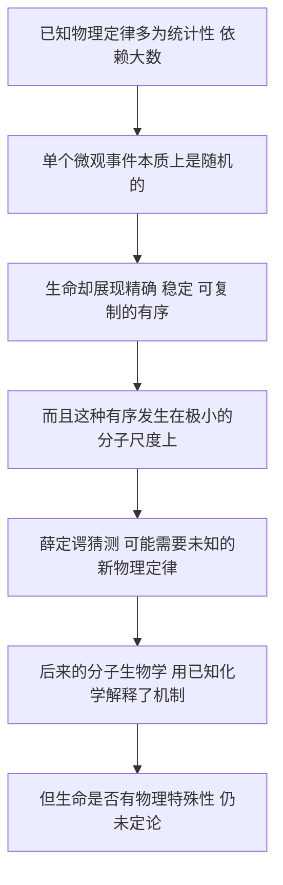

# 09｜生命需要「新的物理定律」吗？

> 薛定谔猜测生命可能遵循未知的物理定律——这个赌注下对了吗？

---

## 一、先说结论

薛定谔抛出一个大胆猜测：**已知的物理定律大多是「统计性」的**——描述的是大量原子、分子的平均行为；而生命展现出来的，却是一种极其精确、稳定、可反复复制的有序。因此他推测，生命很可能牵涉到一些「至今未知的别的物理定律」。

后来的分子生物学给出了主流回答：**生命的机制，原则上可以用已知的物理与化学解释，只是极其复杂。** 模板复制、碱基配对、酶催化、能量代谢，全是课本里的化学。

但事情没有彻底结束。「生命在物理上是否具有某种特殊性」至今仍在争论，焦点已从「要不要新定律」转向更微妙的地方。

## 二、我们先理解一个问题

先明白什么叫「统计性定律」。

设想一间装满气体的房间。你问某个分子此刻在哪儿、往哪儿走？没人答得上来——它几乎是随机的。但你要问整间屋子的压强和温度，物理定律却答得又快又准。

这就是统计规律的特点：**对个体无能为力，对集体精确无比。**

现在转向生命。一个细胞分裂，把基因组几乎一模一样的拷贝交给下一代；一个受精卵按一份「脚本」发育成完整个体。这些过程精确、稳定、可重复，而且往往是**单个的**：不是「平均而言」，而是「这一个」细胞必须精确。

于是薛定谔感到一种不协调：

> **已知物理在单个微小事件上给的是概率，生命却像一件精密的钟表，一丝不苟地运作。这两者能对得上吗？**

## 三、作者到底提出了什么观点？

**第一，已知物理定律以统计性为主。** 尤其在原子尺度，规律建立在大量粒子的平均之上。

**第二，生命的有序不是统计出来的，而是「从有序到有序」。** 他把自然界的秩序分成两类：一类「从无序中产生有序」，大量随机事件涌现出规律；另一类「从有序中汲取有序」，像机械钟表那样精确带动。生命属于后者。

**第三，所以生命可能不满足于已知物理。** 一个只有上千个原子的系统，按理容易被热涨落搅乱，可它偏偏稳定而精确；要解释这一点，他怀疑需要新原理。

**第四，这是谨慎的猜测，不是断言。** 他用量子论作类比：经典物理也曾被新定律修正；生命也许正是这样一个领域。他也坦承，手头的模型还没说明遗传物质「如何工作」。

## 四、把这个观点翻译成人话

想象一台老式机械钟，和一台收音机的白噪声。

机械钟上紧发条，齿轮咬合，一下一下精确地走。它的有序来自结构——每个零件都在自己该在的位置，按确定的方式带动下一个。这就是「从有序到有序」。

薛定谔想说的是：**生命更像那台钟，而不像那堆噪声。** 它有确定的结构、确定的动作、精确的节拍。

但问题也随之而来：这台钟小得可怜——不由亿万个零件组成，而只有上千个原子。这么小的结构，凭什么不被周围的热运动撞散？

于是他的猜测变成：也许要让「这么小的钟」也能精确走动，物理定律里还缺一块拼图。

## 五、为什么会这样？

把这条思路画出来：

这条链里最值得琢磨的是 **D 这一环**。

如果生命是宏观系统——比如一壶水——它的有序完全可以用统计规律解释，不需要新物理。真正的刺痛点在于：**生命的有序发生在极小的尺度上。** 小系统本该被涨落搅乱，可它偏偏精确。薛定谔正是盯着这个「小」，才敢下这个赌注。

所以这赌注并非玄学。它更像一个物理学家在说：当实验事实与既有理论对不上时，先怀疑理论不够，而不是宣称现象神秘。

## 六、举一个现实生活中的例子

想想一块手表的走时精度。一块好表，一天误差可以只有几秒，精度来自精密的齿轮和擒纵机构——「结构决定行为」的典型。

现在把这块表缩小到分子尺寸，只剩上千个原子。会怎样？在那么小的尺度上，分子不断被热运动撞来撞去，能量忽多忽少；按经典统计物理，这种随机撞击该很快把「指针」撞歪——像一艘小船在巨浪里，根本保持不住航向。

生命的「钟表」却还在走。薛定谔因此猜测：也许它用的不是普通的船，而是一种我们还不知道的「抗浪设计」。这个「未知的设计」，就是他所说的新物理。

当然这只是比喻。真正的问题是：**已知物理定律到底有没有能力解释这种「小尺度上的精确」？** 这正是第九节要争的。

## 七、回到书中重新理解

薛定谔给这一章起的标题本身就是问句：「生命是否建立在物理学定律之上？」

现在你能读懂他的分寸感。他没说「生命不遵守物理」——恰恰相反，他反复强调生命**没有**违反已知定律。他说的是一种更微妙的可能性：生命也许遵守着**尚未被发现**的物理定律。

这一点常被误读。有人把薛定谔当成神秘主义者，以为他要给生命开后门。但仔细看，他的逻辑完全是物理学的：**当一个系统表现出既有理论无法自然解释的精确性时，物理学家合理的反应，是预期存在新定律，而不是宣布它超越自然。**

整本书从稳定性讲到突变，从德尔布吕克模型讲到有序与无序，一路都在铺垫同一个观察：生命是一个**在小尺度上维持高度有序**的系统。这才是他下注的依据，也顺带把「从有序到有序」这个洞见，留给了后来研究「远离平衡的系统」的人——那正是下一篇的主题。

## 八、这个观点背后还有什么？

背后藏着一个更根本的哲学问题：**什么是「定律」，什么只是「条件」？**

一个高度有序的系统，比如一段特定的 DNA 序列，它的有序究竟来自某条新定律，还是仅仅来自一个概率极低的**初始条件**？物理定律从不禁止低熵构型，只说它很罕见。若是这样，生命就不需要新定律，只需要一个「幸运的开局」加一套能自我复制的机制。

另一层，是**还原论与生物学自主性之争**。一派认为生物学终究是物理化学的应用，只是更复杂；另一派（如后来的迈尔）主张生物学有自己的规律和概念，不能用物理简单还原。薛定谔站在物理一侧，却又忍不住为生物学的特殊性留了位置。

还有一层是**信息**：所谓「从有序到有序」，其实也可以读成「从信息到信息」，这或许能让生命完全不需要新定律。

## 九、这个观点有问题吗？

**批评一：薛定谔可能混淆了「定律」和「初始条件」。** 这是最有力的一击。生命高度有序，并不意味着它违反统计规律；它只是一个概率极低的构型。掷骰子掷出一长串「六」，不会产生新定律，只说明你看了一个罕见的序列。若真如此，生命的特殊性是「条件」的特殊，而非「规律」的特殊。

**批评二：「统计性」与「精确性」的二分太干净。** 已知物理里也有完全确定的定律（比如经典力学、薛定谔方程本身）；说「已知物理都是统计性的」，只描述了热力学、扩散这类宏观定律。

**批评三：后来的主流证据不支持「新物理」。** 分子生物学发现，遗传的精确性来自碱基配对、酶催化、校对与修复——全是已知化学。至少就遗传机制而言，已知物理够用。

**但反方也有道理。** 有人指出：**「能用已知定律描述」不等于「已经理解了」。** 生命的自组织、涌现、起源，以及光合作用中可能存在的量子相干，仍可能要求全新的组织原理。而且「新物理」可有两种含义：新的基本力、基本定律（大概率不需要），和新的**有效规律**（如非平衡态物理、信息—热力学定律，后者几乎肯定需要）。

**所以较稳妥的结论是：** 就「遗传和代谢的机制」而言，薛定谔的赌注基本没赢——不需要新基本物理；但就「生命为何能这样组织起来、它有没有物理上的特殊性」而言，赌注还没被彻底清算。

## 十、今天再看这个观点

（以下为现代延伸，非薛定谔原文）

先说主流答案：**生命的机制，是已知的物理与化学。**

DNA 靠碱基互补配对复制；酶靠降低活化能加速反应；能量搬运靠 ATP 这类分子的化学能；错误控制靠校对与修复。全是教科书化学，不需要新基本定律。生命看起来「神奇」，很大程度上是因为它**极其复杂**，而不是因为它违反了物理。

但薛定谔的直觉也没完全落空，它换了一副面孔继续存在。

一是**非平衡态物理**。普里高津等人的耗散结构理论说明：一个持续获得能量流的开放系统，可以自发维持有序、远离平衡。这为「生命的有序」提供了物理框架——不是新基本力，而是新的有效规律。

二是**信息物理**。兰道尔原理告诉我们，擦除一比特信息必然付出热力学代价，麦克斯韦妖的百年困惑也在信息与熵的统一中化解。「从有序到有序」于是变成「信息驱动信息」。

三是**量子生物学**。光合作用中的能量传递、鸟类的磁导航、酶中的质子隧穿等可能涉及量子效应的过程，正被认真研究。这再次唤起了薛定谔「量子进入生物学」的直觉，但要注意分寸：今天说的是「生命**用到**量子效应」，而不是「生命**需要**新物理」。

而在**生命起源**这个最前沿问题上，争论仍在继续：从无序的化学世界，如何涌现出可演化、可编码的有序？有人认为，这需要全新的、把信息与物质统一起来的原则。所以那个赌注的最佳评价或许是：**在细节上输了，在问题上赢了。**

## 十一、这一篇真正应该记住什么？

1. **薛定谔的猜测是：** 已知物理多为统计性的，而生命在小尺度上精确有序，可能因此需要「未知的别的物理定律」。

2. **他并没有说生命违反已知物理。** 他只是预期生命或许会像量子世界一样，修正我们对物理的理解。

3. **主流后来的回答是：** 遗传与代谢的机制可用已知物理化学解释，只是极其复杂——不需要新的基本物理。

4. **但这个赌注没有被完全清算。** 非平衡态物理、信息物理、量子生物学、生命起源，都是它留下的战场。

5. **他最持久的贡献，是把「生命是否特殊」变成了一个可以定量、可以反驳的科学问题。**

## 十二、留一个问题

无论「新物理」的官司最后怎么判，有一件事是清楚的：生命确实维持着一种远离平衡的有序状态。

物理规律说万物趋向无序，可生命偏偏长期「逆行」，反而越来越精细。薛定谔给出的半句答案是：生命的有序，是**「从有序到有序」**，是向环境借来的。

那么，一个系统凭什么能长期远离热力学平衡，却不走向崩溃？它靠什么「进货」，又向哪里「排污」？

> **下一篇，我们就来拆开这个说法：生命为什么能远离平衡、维持有序——「从有序到有序」到底在说什么？**
