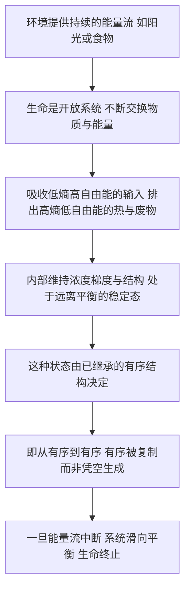

# 10｜「从有序到有序」：生命为何能远离平衡？

> 一个系统凭什么长期「远离热力学平衡」却不崩溃？薛定谔的答案，藏在一个平淡的短语里。

---

## 一、先说结论

生命不是「从混乱中凭空造出秩序」的魔术师，它是一个非常挑剔的搬运工。

薛定谔区分了两条完全不同的路：一条叫「从无序中产生有序」(order from disorder)，一条叫「从有序中汲取有序」(order from order)。他的判断是——生命走的是后一条。

也就是说：生命之所以能长期「远离平衡」而不崩溃，靠的不是无中生有的本事，而是持续不断的能量流。它把环境里**已经存在的秩序**搬到自己身上，同时把混乱排出去。它的「有序」，本质上是**借来的**。

---

## 二、我们先理解一个问题

热力学平衡是什么？

一句话：**什么都不再发生。**

一杯热水放在桌上，会慢慢变凉，直到和房间一个温度。这时热量不再净流动，温度不再变化，系统「安静」了。这就是平衡态——熵最大，梯度消失，没有可以利用的能量差。

所以问题来了：

> 生命体明明也是一个物理系统，它为什么没有滑向这种「什么都不再发生」的状态？

一个人活着的时候，体温恒定在 37℃ 左右，血糖、离子浓度、细胞内外的电位差，全都被精确地卡在某个范围内。这不是平衡——平衡意味着死亡。生命恰恰是**远离平衡、又不失控**。

那它凭什么站得住？

---

## 三、作者到底提出了什么观点？

薛定谔的观点可以分为两层。

**第一层，是「两种有序」的区分。** 他注意到，物理世界里确实存在一种过程能「从无序中产生有序」——比如统计涨落偶尔凑出一个有序的模样。但这种「从无序到有序」是偶然的、脆弱的、靠概率的。薛定谔认为，生物体里那种精确、稳定、能一代代传下去的有序，不像这一类。

**第二层，是「从有序到有序」。** 生命的有序，来自它已经继承下来的有序结构。你身上的秩序，来自你父母给你的那套分子结构；那套结构又是从更早一代来的。有序像一份文件被不断复印，而不是每次从白纸上重写。

他把这个原则，和「以负熵为食」的说法放在一起：生命从环境里吸收「有序」，再把「无序」还给环境，从而维持自己**远离平衡的稳定态**。

---

## 四、把这个观点翻译成人话

想象一台水车，架在瀑布下面。

水从高处落下来，砸在水轮上，轮子转起来。有了转动的轮子，磨坊才能磨面、锯木、带动纺车。

请仔细想：**水车本身并不「制造」能量。** 它只是站在一股本来就存在的水流中间，把水流里蕴含的落差「转译」成了转动。一旦水断了，轮子立刻停。它从不凭空产生动力。

生命就是那台水车。

它所谓的「维持自身有序」，并不是变出什么新东西，而是站在一股持续的能量流中间——阳光、食物、氧气——把「有用的能量」取进来，把「没用的能量」散出去。它借着这股流，把自己撑在一个**不停运转、却始终偏离平衡**的状态里。

瀑布一停，水车就死。能量流一断，生命就散。

---

## 五、为什么会这样？

把这些环节串起来：

这条链的要点在于 **C 到 D**：生命并不是「没有熵产生」。恰恰相反，它产生的熵很多——只是**及时排掉了**。它的低熵不是「不欠账」，而是「一边大量欠账、一边立刻还账」。整体账本依然符合第二定律。

---

## 六、举一个现实生活中的例子

想想你家里的冰箱。

冰箱内部很冷，比室温低——从「温度均匀」的角度看，它在**反着爬坡**。热量本该自动从热处流向冷处，冰箱却硬把热量从里面「搬」到外面，代价是耗电。

电从哪来？电站。电站烧煤或晒太阳，整体上产生大量熵。所以：**冰箱自己变有序了，代价是发电系统变得更乱。** 把两边加起来，熵还是增加。

生命和冰箱是同一个逻辑：局部有序，全局补账。你身体里每一个被精确维持的梯度，背后都有一笔被排到环境里的熵。

---

## 七、回到书中重新理解

现在再读薛定谔那句「以负熵为食」，就能听出他真正想说的是什么。

他不是在说生命能「吞掉麻烦」。他是在说：生命必须**持续地吃东西、持续地呼吸**，才能维持这个「偏离平衡」的状态。所以他强调的，不是某个静止的结构，而是一种**流动中的稳定**。

这也是为什么他把「从有序到有序」看得那么重：如果生命的有序每次都要从无序里碰运气碰出来，它早就散了。正因为它继承的是**现成的有序**，它才能几十年、几千年地稳定延续。

用他的话说，生命像是在**推迟**自己滑向平衡的那一天——它并没有逃出物理定律，只是把结算的时间往后拖，靠的是不断的能量流。

---

## 八、这个观点背后还有什么？

背后是一个重要的物理概念：**开放系统**。

孤立系统（不交换物质与能量）趋向平衡，这是第二定律的经典版本。但真实世界里的系统，几乎都在交换。开放系统可以在内部维持低熵，只要整体（系统加上环境）的熵在增加。

薛定谔把这一点讲给了生物学家听：你们研究的不是封闭盒子里的化学反应，而是一个**一直在通水、通电、通物质的系统**。这个视角一旦立住，生命就从「违反物理的奇迹」，变成了「符合物理的、特殊的流动过程」。

还有一个更深的暗示：既然「从有序到有序」是可能的，那么**有序不必总是来源于设计，也不必总是来源于偶然**——它也可以来源于上一个有序。这个想法，后来长出了整片森林。

---

## 九、这个观点有问题吗？

有几个地方要小心。

第一，**「有序」这个词，薛定谔用得比较松。** 物理上的有序（低熵）和信息意义上的有序，并不完全是一回事。一块规则的冰晶是低熵的，一段有意义的文字信息量很高，但两者的「有序」不是同一个度量。薛定谔在两种含义之间来回滑动，这是他这本书里反复出现的一处含糊。

第二，**他把「从无序到有序」说得有点太弱了。** 在他之后，人们发现，很多有序结构恰恰是在**远离平衡**时自发出现的——不是偶然涨落，而是系统内部的一种规律性行为。也就是说，物理世界里「从无序中长出有序」比薛定谔当时设想的要普遍得多。

第三，**「从有序到有序」有被误读成「生命不产生熵」的风险。** 这是最危险的一条。生命产生熵，而且产生得很多；它只是把熵排了出去。任何把它理解成「生命能减少总熵」的说法，都是错的。

公平地说，薛定谔在这里并没有提出一套完整的理论，而是**画了一个圈**，指出圈里有一件需要解释的事。至于圈里的细节，要留给后来的人。

---

## 十、今天再看这个观点

（以下为现代延伸，非薛定谔原文）

这段讲稿写于 1943—44 年。二十多年后，比利时物理学家普里高津（Ilya Prigogine）系统研究了**远离平衡的开放系统**，提出了「耗散结构」(dissipative structures) 理论，并因此获得 1977 年诺贝尔化学奖。

耗散结构的核心思想是：**当一个开放系统被推离平衡足够远，它可能自发形成并维持某种有序结构**——这种结构靠持续地耗散能量来维持，一旦能量流停止就瓦解。经典的例子，是加热液体中出现的贝纳德对流胞（规则的六边形图案），以及别洛索夫—扎鲍廷斯基反应里周期变化的颜色。

这里要说清楚：耗散结构**不是**薛定谔理论的直接推论，更不是他提出的。它是普里高津等人的独立工作。但两者在精神上高度呼应：都把「有序」和「持续的能量耗散」绑在一起。事实上，普里高津本人也谈过薛定谔「负熵」说法给他的影响。

今天，非平衡态统计物理、自组织理论，乃至对生命起源的研究，仍在处理同一个问题：**在能量的持续流动中，秩序如何形成并被维持？** 薛定谔没有回答它，但他把它放到了正确的位置上。

---

## 十一、这一篇真正应该记住什么？

1. **生命是开放系统，不是孤立系统。** 它靠交换物质与能量，维持内部的低熵。

2. **「从有序到有序」是关键区分。** 生命的有序主要继承自既有的有序结构，而不是每次从无序中碰运气。

3. **局部有序，全局补账。** 生命的低熵以环境的熵增为代价，整体上并不违反第二定律。

4. **远离平衡的「稳定态」不是平衡态。** 它是流动中的恒定，一旦能量流断了，就会滑向平衡——也就是死亡。

5. **薛定谔没有给出理论，他给出了位置。** 后来的耗散结构等理论，正是在他指出的方向上生长出来的。

---

## 十二、留一个问题

到这里，我们一直在说「有序」这个词。

可如果追问一句：「有序」到底是什么？是分子的整齐排列，还是一份能被复制、能被读出的**指令**？薛定谔的语气里更倾向前者，可他用的却是另一个词——「密码」。

他反复说染色体里有一份 **code-script**，说遗传是一种**编码**。这意味着什么？意味着他悄悄地把「生命是什么」这个问题，从**物质问题**改写成了**信息问题**。

> **如果我们把生命看成一套信息，而不是一堆分子，会看到什么不一样的东西？**

下一篇，我们就来谈这本书里最深、也最有生命力的一颗种子：**把生命看成信息。**
