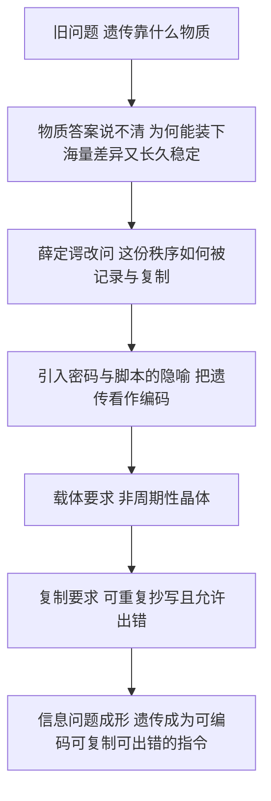

# 11｜把生命看成信息：薛定谔埋下的种子

> 薛定谔用「密码」和「信息」来描述生命，这一个词的选择，改写了整个问题的方向。

---

## 一、先说结论

薛定谔在这本书里做了一个不起眼、却影响深远的动作：他把生命问题从**物质问题**改写成了**信息问题**。

在他之前，人们问的是「生命是由什么物质构成的」；他问的是「生命里的秩序是怎么被**写下**、被**复制**、被**读出**的」。

他的回答是：遗传不是某种神秘的活力，而是一套**可以编码、可以复制、也可以出错**的指令。这个转向，预示了分子生物学与信息论的联姻，也预示了今天「生命是一套信息处理系统」的观点——尽管薛定谔本人未必想到这里。

---

## 二、我们先理解一个问题

什么是「信息」？

不用急着给它下定义。先看一个例子。

一句「明天下午三点，老地方见」，写在纸上是一行墨迹，说出口是一串声音，发到手机里是一串电信号。载体完全不同，可**内容**是同一个。这个能跨载体传递、又可以被复制的东西，我们叫它信息。

关键就在这里：**信息可以和它的物理载体分开来看。** 同一本书，印在纸上、存进硬盘、背在脑子里，内容都不变。

于是有了一种全新的问法：如果生命里也有这样一层「内容」，它写在哪里？怎么读？怎么抄？抄错了会怎样？

---

## 三、作者到底提出了什么观点？

薛定谔的主张，可以概括成三点。

**第一，遗传信息一定储存在某种结构里。** 他推断，这个结构必须能装下海量的「排列组合」，所以不能是反复重复的普通晶体，而只能是「非周期性晶体」——原子以一种独一无二、不重复的方式排列。

**第二，这个结构里有一份「密码脚本」(code-script)。** 它在受精卵中就已经写下，决定了从发育到成体的全部过程。

**第三，遗传就是这套脚本的复制过程。** 复制可以很准确，但也不是绝对不出错；偶尔的错误就是突变，就是变异的来源。

请注意他的用词：密码、脚本、复制、编码。这些词全都来自**通信与计算**的世界，而不是化学的世界。这就是转向。

---

## 四、把这个观点翻译成人话

把细胞想成一座图书馆，把 DNA 想成一本很长的书。

这本书只用四个字母写成，字母的**顺序**就是内容。细胞要造蛋白质时，会派人来「抄书」：把某一段抄成一份临时的抄本，再拿这份抄本去工厂照着生产。

这里最妙的一点是：**书的内容不取决于纸，只取决于字母的排列。** 你把这本书誊写到另一种纸上，甚至录成电子文件，只要字母顺序不变，造出来的东西就不会变。

薛定谔虽然还没看到这本书长什么样，但他已经猜到了它的**性质**：它必须是一份可以被逐字读出、可以被复制、可以出错的**文本**。

---

## 五、为什么会这样？

从「物质」到「信息」这一步是怎么发生的：

这条链的转折点是 **C**：一旦问题变成「信息怎么被记录」，物质的细节就不再是全部，**排列**本身成了主角。

---

## 六、举一个现实生活中的例子

想想二维码。

一张二维码印在纸上，你扫它，手机里跳出一个网址。同一张二维码，打印在名片上、显示在屏幕上、甚至用马克笔画出来，扫出来的结果都一样。二维码的「内容」，只由黑白格子的**排列**决定。

现在把图案里随便一个格子涂反。多数情况下，二维码直接扫不出来——**一个格子，毁掉整条信息**。

遗传也是一样：DNA 上某个字母被换掉，可能无所谓，也可能让一个蛋白质报废，进而让整个个体出问题。信息的力量，恰恰体现在这种「极小的改动，可能带来极大的后果」上。

---

## 七、回到书中重新理解

回头再看薛定谔为什么那么执着于「非周期性晶体」，就清楚了。

他不是在做化学，他是在回答一个**存储容量**的问题：要携带决定整个人体发育的信息，靠什么结构才够？他的答案是：**靠不重复的排列。** 因为只有不重复，才有足够多的组合；只有组合足够多，信息量才够大。

至于「密码脚本」，他更是直白地把发育比作**照脚本执行**。这在 1944 年是非常大胆的：当时连 DNA 是遗传物质都还没被普遍接受，他却已经在讨论「密码」和「执行」了。

---

## 八、这个观点背后还有什么？

背后有两件后来才发生的事情，值得分开说清楚。

一是**信息论**。1948 年，香农（Claude Shannon）发表了《通信的数学理论》，用一个叫「熵」的量来度量信息的不确定性——这就是「信息熵」。它和热力学里的熵在**数学形式**上非常像（都是对概率分布取对数的某种求和），但**含义不同**：一个刻画物理的无序程度，一个刻画消息的不确定性。薛定谔写这本书时（1943—44），香农的信息论还没有诞生。所以他的「信息」是**隐喻和直觉**，不是香农那套数学。

二是**分子生物学**。1953 年，DNA 双螺旋结构被发现；随后遗传密码被破译：三个碱基对应一个氨基酸。这时人们才发现，薛定谔说的「密码」确实存在，只是它更像**线性的序列**，而不是他隐约设想的那种三维构型。

---

## 九、这个观点有问题吗？

有，而且值得认真说。

第一，**薛定谔的「信息」不是严格意义上的信息论。** 他的用词是启发式的、直观的，带着强烈的物理直觉，却没有一个可计算的度量。把他的比喻直接当成信息科学，是过度解读。

第二，**「生命是信息」这个说法，有把载体一笔带过的风险。** 信息不能凭空存在，它必须有物理载体，也必须在真实的物理化学条件下被复制和读出。只谈信息、不谈能量与物质，会讲出一套漂亮却空洞的故事。

第三，**语义与语法的问题。** 香农的信息论只管「传得准不准」，不管「传的是什么意思」。可生命偏偏关心**意思**：哪个蛋白质、什么时候、在哪里表达。纯粹的语法信息，还不足以解释生命。

公平地说，薛定谔在这件事上不像科学家，更像**预言家**。他的价值不在精确，而在于指方向。

---

## 十、今天再看这个观点

（以下为现代延伸，非薛定谔原文）

薛定谔埋下的这颗种子，今天已经长成了几棵大树。

一是**生物信息学**：把 DNA 当作可读取、可比对、可计算的数据。全基因组测序、序列比对、进化分析，都是在这个框架里做的。

二是**「生命即信息处理系统」的现代观点**。从基因调控网络到单细胞信号通路，很多现代生物学家确实用「信息处理」的语言来描述细胞——它感知环境、做出判断、执行动作。这是薛定谔那一代人难以想象的图景，但方向和他一致。

三是**把信息写回物质**。合成生物学在造人造基因线路；科学家甚至尝试把数据存进 DNA，因为 DNA 是已知最密集、最耐久的存储介质之一。信息与物质，正在这两个方向上重新握手。

不过要保持清醒：**这些是现代发展，不是薛定谔的原话。** 他说对了「信息在这里很重要」，但没有、也不可能给出今天的信息科学。

---

## 十一、这一篇真正应该记住什么？

1. **薛定谔把生命问题从物质问题改写成了信息问题。** 这一转向比任何具体结论都重要。

2. **遗传被重新理解为「可编码、可复制、可出错」的指令**，而不是神秘的活力。

3. **信息可以和载体分开来看，却离不开载体。** 这是理解 DNA、也理解一切信息系统的关键。

4. **薛定谔的「信息」是直觉性的，不是香农式的数学信息论。** 后者 1948 年才出现。

5. **他说对了方向，说粗了细节**——真正的遗传密码是序列性的，而不是他设想的构型性的。

---

## 十二、留一个问题

到这里，我们已经跟着薛定谔走完了一条很长的路：从「生命为什么能对抗熵增」，到「生命的有序从何而来」，再到「生命是一套信息」。

这一整套讲法，默认了一个前提：**生命是完全由物理和化学决定的。** 基因是分子，复制是化学，信息写在物质里。这个前提，让生物学变成了一门可以硬邦邦地研究的科学。

可是，写下这本书的人，在最后一章忽然停了下来。他问了一个方向完全相反的问题：

> **如果我的身体、我的基因、我的一切都被物理定律完全决定了——那么「我」的自由意志，还剩下什么？**

下一篇，我们就来读全书最柔软、也最有争议的那一段：**决定论与自由意志。**
