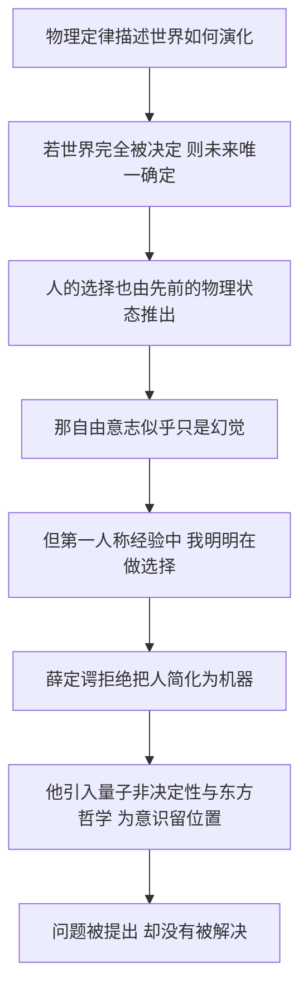

# 12｜如果一切都由物理决定，自由意志还存在吗？

> 薛定谔在后记里忽然换了话题。这一步跨出去，是洞见，还是越界？

---

## 一、先说结论

《生命是什么》的正文，是一本很硬的书：熵、量子、晶体、密码。可到了最后，薛定谔加了一篇后记，题目叫《论决定论与自由意志》。

在那里，他不再谈分子，开始谈**人**。

他的立场是：他不接受把人看成一台「完全被因果链决定的机器」。他暗示，意识和自由意志也许不服从经典意义上的决定论——并为此借用了东方哲学中的表述，尤其是奥义书传统里「梵我一如」一类的观念。

这一部分被不少批评者认为**含糊、甚至越界**。但它触及了一个至今没有答案的问题：**在一个由物理定律决定的世界里，那个说「我」的东西，站在哪里？**

---

## 二、我们先理解一个问题

先说清楚「决定论」是什么意思。

决定论（determinism）是说：在任意时刻，只要给定宇宙的完整状态和它遵循的规律，那么之后发生的一切，都被唯一地确定了。牛顿力学曾经给人这种强大的感觉：给我初始条件，我就能算出未来。

如果这个图景成立，那么你此刻「决定」举起手，这个决定本身也是被前面所有物理状态推出来的。你**感觉**自己在选，实际上没得选。

于是矛盾出现了：

> 一边是物理学：一切由因果链决定。
> 一边是亲身体验：我明明在犹豫、在权衡、在「做选择」。

这两者能不能同时为真？这正是薛定谔在后记里试图处理的问题。

---

## 三、作者到底提出了什么观点？

薛定谔的论证可以拆成几层。（这里要说明：他的行文相当松散，以下是对方立场的概括，不是逐字引文。）

**第一，他反对「人是一台机器」的图景。** 在他看来，把身体看成一台被经典因果完全驱动的机械装置，是一种过度简化的、来自物理学的**偏见**。

**第二，他注意到物理学的另一面。** 二十世纪的物理学并不全是决定论。量子力学引入的概率性、统计性描述，让「世界在细节上并非完全被钉死」成为一个严肃的科学图景。他隐约希望，这一面能为意识和自由留出空间。

**第三，他把问题引向意识本身。** 他追问：科学描述的永远是「从外部看到的世界」；可我们每个人还从**内部**直接经验到自己。这个「内部视角」，在物理方程里没有位置。他借用了东方哲学的语言，特别是奥义书中「你即梵」、个体意识与终极实在同一的思想，来表达他对意识的直觉。

请特别注意：**这是薛定谔的哲学取向，而不是物理学结论。** 他把印度哲学的观念当作思想资源来使用，这本身也是他个人长期兴趣的一部分。

---

## 四、把这个观点翻译成人话

想象两个东西：一个钟表，一朵云。

钟表是经典决定论的完美比喻：齿轮严丝合缝，下一个位置永远由上一个位置决定。给它初始状态，未来完全可算。

云则不同。它的形状每一秒都在变，边界模糊，说不清「下一朵云长什么样」。它仍然遵循物理定律，但它的行为对初始条件极其敏感。

薛定谔想说的是：**人可能更像云，而不是钟表。** 至少，把人硬塞进「钟表」的模型里，是不公平的。

再换一个角度：你在看电影，和你在演电影，是两种经验。物理学永远在「看」——从外面测量、记录、计算；可只有你自己在「演」——从里面体验、犹豫、决定。薛定谔觉得，**把「看」的结论，直接套到「演」的体验上，本身就是一种偷换。**

---

## 五、为什么会这样？

决定论和自由意志为什么会撞车：

这条链的关键是 **D**：如果前面几步都成立，自由意志就成了「感觉上有、实际上没有」的东西——这正是很多人最不能接受、又最难反驳的结论。

---

## 六、举一个现实生活中的例子

想想法庭。

如果一个人犯罪完全是基因、成长环境和脑化学的必然结果，那他还「该不该」负责？法官再判他，是在惩罚一个做错事的人，还是在给一台坏掉的机器「贴标签」？

我们整个法律和道德的体系，都建立在一个隐含假设上：**人是能选择的。** 我们说「你本可以不这样做」，这句话预设了「本来有别的可能」。

薛定谔的追问之所以重要，正是因为它碰到了这根地基：如果世界是彻底决定的，那么「本可以」到底指什么？如果「本可以」是空的，责任、赞扬、悔恨，又建立在什么上面？

---

## 七、回到书中重新理解

现在要提醒一件事：**后记和正文的气质完全不同。**

正文里，薛定谔像一位严谨的物理学家，用熵和量子分析生命；后记里，他更像一位哲学家，甚至一位神秘主义者。他不再满足于「生命如何运作」，他问的是「**那个在思考生命的『我』，到底是什么**」。

这也解释了为什么很多科学家读完后记会皱眉：它不像物理学，更像沉思。但换个角度看，这恰恰是这本书诚实的证据——薛定谔没有假装物理学能回答一切。**他在一本最硬的书里，留了一段最软的话。**

---

## 八、这个观点背后还有什么？

背后是一个后来被称作「意识难题」的东西。

物理科学能告诉我：看到红色时，大脑哪些区域在活动、哪些波长的光进入眼睛、哪些神经元在放电。它似乎解释了一切，只漏了一样——**「红色看起来是这个样子」的那种主观感受本身。** 这种「像什么」的体验为什么存在、从哪里来，至今没有公认的答案。

薛定谔正撞在这堵墙上。他用了两个策略：一是诉诸量子力学的不确定性；二是诉诸东方哲学中「意识是根本的、个体意识与整体同一」的观念。

需要说明的是：**这两个策略都是哲学性的，不是科学结论。** 量子不确定性是否与意识有关，科学界没有定论，主流看法相当怀疑；而把奥义书的思想直接拿来做意识的解释，更是他个人的哲学选择。

---

## 九、这个观点有问题吗？

问题不少，而且主要集中在这里。

第一，**「量子不确定性拯救自由意志」这个推理很弱。** 反对意见很直接：如果行为是**随机**的，那它是掷骰子，仍然不是「你自由的选择」。随机性并不等于自由，它只是把「被决定」换成了「靠运气」。大多数哲学家认为，量子力学并没有替自由意志解围。

第二，**他的论证含糊。** 他有时谈意识，有时谈自由意志，有时谈决定论，几个概念没有严格分开。批评者认为，这更像诗意的沉思，而不是能站得住脚的论证。

第三，**越界。** 一个物理学家在后记里转向形而上学与东方宗教哲学，很多人觉得这已经离开了他专业能力的范围。借用哪一套传统是一回事，能不能用它来支撑一个关于意识的**结论**，是另一回事。

第四，**对东方哲学的处理值得小心。** 薛定谔借用「梵我一如」，是他个人的解读与挪用。印度哲学传统内部极其复杂，把它简化成一句「万物一体」，本身就需要谨慎——这更像薛定谔的世界观投射，而不是对那个传统的忠实陈述。

公平地说：**这一段的价值不在于它给出了答案，而在于它承认问题还在。**

---

## 十、今天再看这个观点

（以下为现代延伸，非薛定谔原文）

今天，关于自由意志的讨论大致分成几派，各有理据。

**硬决定论**认为，世界完全被决定，自由意志是幻觉。**自由意志论（非决定论）**认为，至少某些选择并不由先前状态唯一决定。**兼容论**（compatibilism，代表人物如休谟、丹尼特等）则主张：自由和决定论其实不冲突——「自由」不需要「本可以做出别的选择」这种形而上的能力，它只需要你的行为出自你自身的意愿，不受强迫与操控。

神经科学也加入了进来。上世纪 80 年代，本杰明·利贝特（Benjamin Libet）等人的实验发现，与「想要动」的主观意识相比，大脑的准备电位可能更早出现。这个结果被广泛引用来支持「决定发生在意识之前」。但它的解读争议极大：准备电位的意义、实验范式能否支撑哲学结论，都仍在辩论中。**它没有终结问题，只是把争论推到了更细的层面。**

一个诚实的现状是：**到今天，这个问题仍然没有定论。** 薛定谔没有解决它，后来的科学也没有。但至少可以确定一点：把「物理决定论」和「自由意志」之间的张力**正视**，而不是假装它不存在，是任何诚实的思考都绕不过的一步。

---

## 十一、这一篇真正应该记住什么？

1. **薛定谔在全书最后，从科学转向了哲学。** 后记问的是「我自己」在物理世界里的位置。

2. **他明确反对把人简化为完全被决定的机器**，并希望量子不确定性为意识留出空间。

3. **他借用了东方哲学（如奥义书中「梵我一如」一类的表述）**，但这是他的哲学取向，不是物理学结论，也不代表那个传统的全貌。

4. **「量子随机性不等于自由」**，这是最常见也最有力的反驳：随机不是自由。

5. **这一部分被批评为含糊、越界，但它提出的问题至今无解**——而这正是它值得被认真对待的理由。

---

## 十二、留一个问题

到这里，我们已经读完了《生命是什么》这本小书的全部骨架：从提问，到熵与有序，到基因与量子，到信息与意识。

但还有一件事没有讲：这本书到底**做了什么**？

它不是一本给出正确答案的书。它的很多具体判断都错了，或者太粗糙了。可它偏偏被认为是二十世纪最有影响力的科学著作之一——因为它让一批年轻人决定去研究基因，其中就包括沃森和克里克。

> **一本一百多页、还有不少错误的小书，凭什么催生了一门新学科？**

下一篇，我们就来讲这本书最真实的遗产：**它如何点燃了分子生物学。**
