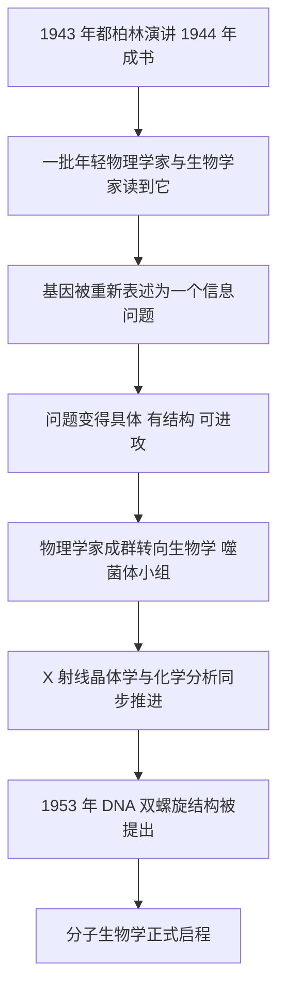

# 13｜这本小书如何催生了分子生物学？

> 一本一百多页的科普讲稿，为什么会被追认为分子生物学的思想源头之一？

---

## 一、先说结论

薛定谔这本书最反常的地方，是它几乎没提供任何后来被证明正确的生物学细节，却被一代奠基者反复提起。

它真正的功劳，是把「基因到底是什么」从生物学内部的技术难题，改造成了一个清晰、迷人、看起来可以被攻克的科学目标。它让一批年轻人相信：基因不是玄学，而是一件有结构、能编码、可以打开来读的物理对象。

用一句话概括：**一本提出好问题的书，往往比一本给出答案的书影响更深远。** 这就是所谓的「问题驱动型科学」。

---

## 二、我们先理解一个问题

先想一个反常识的现象：科学史上真正改变方向的，常常不是那些「答对了」的书。

达尔文的《物种起源》给出了一整套答案，但后来被修正得面目全非；而薛定谔这本书，连基因是什么物质都没说准，却点燃了一整代人。为什么？

关键在于：**一个学科要往前跳一大步，往往需要有人先把「我们到底不知道什么」说得足够清楚，并且让这个「不知道」显得可以赢。**

四十年代中期的遗传学，正处在这样一个临界点上。人们已经知道基因在染色体上，知道它会突变、会连锁、会分离。但那时的「基因」更像一个记账单位：你能算它的比例，却没法指着某个具体的分子说——这就是基因，这是它的内部结构，这是它写下信息的方式。

一门学问一旦长期停在这种状态，就会积累出一种焦躁：所有现象都指向某个更深的东西，但没人知道该往哪儿挖。

---

## 三、作者到底提出了什么观点？

严格说，薛定谔并没有「提出」分子生物学。他做的是另外三件事。

**第一，他给基因指定了一个物理身份。** 他判断，携带海量遗传信息的结构不可能是一遍遍重复的普通晶体，而必须是「非周期性晶体」——原子以一种独一无二、不重复的方式排列。这就是他给基因画的第一张像。

**第二，他把遗传重新描述成「编码」。** 他设想受精卵里藏着一份「密码脚本」，决定了从发育到成体的全部过程。这句话的潜台词是：遗传不是神秘的活力传递，而是一套可以被读、被复制、被写错的指令。

**第三，他给物理学家发了一张邀请函。** 他反复强调自己是物理学家而不是生物学家，并说基因的稳定性或许要用分子的量子结构来解释。这在当时等于对一整个物理学共同体说：那边有一个值得你们出手的问题。

请注意，这三条里，没有一条是「正确答案」。但它们合在一起，构成了一个**可执行的研究纲领**。

---

## 四、把这个观点翻译成人话

设想一座城市里流传着一个传说：城底下埋着一份图纸，谁找到它，谁就掌握了这座城市的一切秘密。

问题是，过去没人知道该往哪里挖，也没人知道这份图纸长什么样。于是大家只能在地面上做统计：这栋楼多高、那条街多长、猜一猜埋藏的位置。

现在来了一个人，他不负责挖，但他站出来说：**第一，那份图纸一定存在；第二，它一定是一张不重复的、写满字符的长纸；第三，它可能就藏在某类特别的分子里。**

他一条都没证实，但他把「挖宝」变成了一项有明确目标的工程。此后，所有人手里的铲子都有了方向。

薛定谔就是那个说话的人。他没有挖到图纸，但他说清了图纸大概的样子，并让一代人相信这活儿值得干。

---

## 五、为什么会这样？

把这条因果链整理出来，会看得很清楚：

这条链里，**C 到 D 是最关键的一环。**

在薛定谔之前，「基因是什么」这个问题太大、太空，甚至有点哲学味。经他一说，它变成了一个可以被分解的工程问题：先确定它是哪类分子，再确定它怎么排布，再确定它怎么编码。每一步都可以动手。

历史也给出了旁证。四十年代，德尔布吕克等人已经用噬菌体建立起一套极简的研究系统，吸引了一批物理学家进入生物学；薛定谔把德尔布吕克的模型写进了这本畅销小书，等于给这个方向做了一次面向大众的广告。沃森、克里克这一代人都读过它，也都说过它对自己的职业选择有影响。

---

## 六、举一个现实生活中的例子

想想开源社区里那个著名的「未解难题」。

一个项目把最难的 bug 贴在首页，写清楚：它一定存在，它大概长什么样，谁解决它谁就名留青史。结果，往往不是某个天才一击命中，而是无数陌生人从各个方向涌来——有人复现问题，有人写工具，有人不断试错。最后修好它的那个人，常常只是刚好站在所有铺垫之上。

薛定谔这本书就像那张公告。它没有修好 bug，但它把 bug 描述得足够诱人、足够具体，以至于全世界最聪明的一批人开始围着它转。

---

## 七、回到书中重新理解

现在再翻这本书，你会发现它最像研究纲领的地方，恰恰是它最「不严谨」的地方。

它对 DNA 的化学几乎一无所知——当时连「基因到底是蛋白质还是核酸」都还在争论（1944 年艾弗里等人的实验已指向 DNA，但接受度有限）。它也没能说清密码到底写在哪里。

但它给出了一个可以落地的框架：基因是分子，分子有结构，结构承载信息，信息决定发育。后来的每一步——查加夫发现碱基比例的规律、富兰克林与威尔金斯的 X 射线衍射、沃森与克里克搭出双螺旋——都可以被塞进这个框架里。

换句话说，这本书的贡献不在结论，而在它**为后来者准备了问题的形状**。

---

## 八、这个观点背后还有什么？

这套「思想源头」的叙事背后，其实牵扯两个更大的东西。

一个是**科学的社会学**。思想不会自己传播，它需要载体：一场演讲、一本畅销书、一个社群。德尔布吕克的噬菌体小组之所以能凝聚一批物理学家，不只是因为问题好，也因为有一个能让人互相交流、彼此激励的网络。

另一个是**还原论的胜利姿态**。薛定谔假设生命可以被拆到分子层面，而且拆到底不会有「神秘的剩余物」。这个姿态在四五十年代取得了一连串成功，也因此塑造了此后几十年生物学的主流气质。

---

## 九、这个观点有问题吗？

有，而且这个问题值得认真对待：**「一本书催生了一门学科」这个说法，很可能被夸大了。**

第一，历史学家指出，即便没有这本书，DNA 双螺旋大概率也会在十年内被发现。艾弗里的实验、赫尔希与蔡斯的实验、查加夫的碱基规律、富兰克林的衍射照片，这些证据都在独立积累。科学的进展有它自己的惯性。

第二，沃森等人的「受影响」叙述，很多是多年后的回忆。回忆本身会被后来的成就重新润色，容易把一段模糊的启发，讲成一条清晰的因果链。

第三，这种叙事容易掩盖真正动手的人。罗莎琳德·富兰克林的关键数据、奥斯瓦尔德·艾弗里的长期坚持、埃尔温·查加夫的化学发现，长期被「双螺旋神话」遮在后面。把功劳集中给一本小书，和集中给两位诺奖得主，是同一类简化。

所以更稳妥的说法是：这本书不是唯一的原因，但它是最响亮的**放大器**。

---

## 十、今天再看这个观点

（以下为现代延伸，非薛定谔原文）

「提出一个好问题，比给出一个答案更有价值」——这句话在今天已经变成了科研组织的基本原则。

人类基因组计划、蛋白质结构预测、合成生物学的最简细胞，乃至量子计算，都是先立一个清晰的宏大目标，再把全球的力量聚拢过来。AlphaFold 之所以震动学界，很大程度上也是因为它把一个长期悬空的问题变成了「可以攻的关」。

科学哲学的术语，叫「问题驱动」与「数据驱动」的互补。薛定谔这本书，是前者最经典的样本之一。

---

## 十一、这一篇真正应该记住什么？

1. **这本书的遗产不是答案，而是一个可执行的研究纲领。** 它规定了问题该往哪挖。

2. **它把「基因」从抽象单位变成了有结构、会编码的物理对象。**

3. **它靠一本畅销书，为物理学家进入生物学做了一次大规模招募。**

4. **「一本书催生一门学科」是被简化的叙事。** 真正的发现同时依赖实验证据、工具与社群。

5. **提出好问题是一种被低估的能力。** 它决定了后来者能在哪里发力。

---

## 十二、留一个问题

薛定谔问题问得好，这一点几乎无人否认。

但问题问得好，不等于答案答得对。

现在，我们已经知道了双螺旋、遗传密码、中心法则。是时候回过头，冷静地摊开这本书，一条一条地对账了：

> **用今天的知识看，薛定谔哪些判断错了，哪些判断对了？一个「错了很多」的人，为什么仍然值得被反复提起？**
