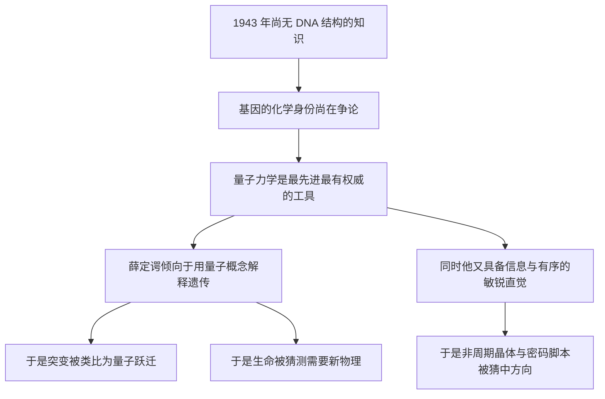

# 14｜薛定谔错在哪里，又对在哪里？

> 用八十年的科学进展回看，这本书哪些判断站住了，哪些塌了？

---

## 一、先说结论

如果要给这本书打一个粗略的分数，大概是：**方向对，细节半对半错，而错的部分同样有价值。**

错得比较明显的有四处：负熵的表述不严谨；把突变直接对应量子跃迁过于牵强；「生命需要新物理」这个赌注很可能不必；对密码的想象偏向了结构而不是序列。

对得惊人的也有几处：遗传信息确实是一套编码；非周期性晶体的直觉几乎命中；生命确实是开放系统；把生命问题改写成信息问题的方向，被后世全面继承。

一句话：**科学的进步，常常来自提出好问题，而不是次次答对。**

---

## 二、我们先理解一个问题

评价一本旧书，最偷懒的方式是拿今天的知识去嘲笑它。

但我们真正想问的其实是另一个问题：**它错的方式，是不是有价值的错？**

有一种错叫「方向性错误」——把整条路带偏了，后来者要花很大力气纠正。另一种错叫「过渡性错误」——它站在当时的信息条件下做了最合理的猜想，虽然结论不对，却把问题往前推了一步。

薛定谔的错误，绝大多数属于第二种。这也是为什么它值得被认真对账，而不是被简单翻案。

---

## 三、作者到底提出了什么观点？

为了对账，先把他的主要判断列成一张清单。

第一，生命靠从环境摄取「负熵」来维持自身的有序。

第二，遗传信息存放在「非周期性晶体」里，是一份决定全部发育的「密码脚本」。

第三，基因异常稳定，其稳定性来自分子的量子结构与能量势垒。

第四，突变相当于一次量子跃迁：稀有、突然、离散。

第五，现有物理定律大多是统计性的，生命或许需要「新的物理」。

第六，生命是一个开放系统，靠持续的「从有序到有序」维持远离平衡。

接下来，我们一条条看它们在后来的证据面前命运如何。

---

## 四、把这个观点翻译成人话

把这类科学判断，想象成老地图上的标注。

一张十五世纪的海图，会把非洲南端画歪，会把某些岛屿的位置标错几度。但如果你说「这张图没用」，那就错了——它至少指出了「往南绕过去是可行的」这个关键判断。

评价一张旧地图，要分三层：**它指对方向了吗？它标错的地方有多致命？它错的方式，有没有反而启发后来人重新测绘？**

对薛定谔的这本书，我们也该用这三层来读。

---

## 五、为什么会这样？

为什么一个物理学家会在这些问题上判断得如此两极？关键原因在于**信息的时代限制**。

这条链说明了一件事：**他的强项和弱点出自同一个源头。**

他手上最锋利的工具是量子力学和信息直觉。用得好，就得到了「非周期性晶体」这样惊人的命中；用得过头，就得到了「突变即量子跃迁」这样的牵强附会。

---

## 六、举一个现实生活中的例子

想想预言天气。

一个老农看着云和风，说「明天要下雨」。他没有气压计，也没有卫星云图，理由也说不太清，但他判断对了。另一个细节控，认真算出「明天午后三点十七分会下雨」，结果雨是下了，时间却是傍晚。

老农赢在大方向，细节控输在精度。

薛定谔更像是那个老农，外加一点细节控：他赌「基因是一套编码」，赢了；但他进一步赌「这套编码是三维构型的，突变是量子跳变」，就输在了精度上。

---

## 七、回到书中重新理解

逐条对账，结果大致如下。

**关于负熵。** 这是最常被挑出的一处。严格说，生命从环境获取的不是「负熵」这个量，而是**低熵的能量载体**，物理上更准确的描述是自由能。薛定谔本人也意识到这个说法不够严谨，曾表示若只对物理学家讲，他会换一种表达。第 03 篇已经详细讨论过这一点。

**关于非周期性晶体。** 这一条几乎完美命中。DNA 正是一根不重复的长链，碱基的排列顺序就是信息。他用「非周期」三个字，直觉地抓住了「信息在于排列，而不在于重复」这个核心。

**关于密码脚本。** 方向对，形态偏。他更倾向把密码想成一种结构性的、三维构型式的东西；真实的遗传密码则是**序列性的**：三联体碱基按顺序对应氨基酸。问对了「有没有密码」，却猜错了「密码长什么样」。

**关于基因稳定性。** 大方向对。基因确实异常稳定，稳定性确实来自分子键与能量壁垒。但他低估了修复机制与复制校对的作用——DNA 的保真不是靠「一动不动」，而是靠「出错就修」。

**关于突变即量子跃迁。** 这一条最牵强。真实的突变主要是化学事件：碱基替换、插入、缺失，由复制错误、辐射、化学诱变剂引起，多数本质上是热涨落驱动的化学反应。确实有人提出过量子隧穿可能参与某些突变（例如质子隧穿假说），量子生物学也仍在探索，但这与「突变=一次量子跃迁」的强类比相去甚远。他把「稀有而离散」这个现象学特征，误当成了量子机制的证据。

**关于需要新物理。** 这个赌注很可能不必。分子生物学表明，生命现象可以用已知的物理与化学解释——只是复杂度极高。「生命在物理上是否特殊」这个问题没有消失，但它不再需要假设一套未知定律。

**关于开放系统与从有序到有序。** 这一条站住了，并且被后来的非平衡态热力学（如耗散结构理论）系统化。生命靠持续的能量流维持结构，这个图像至今有效。

---

## 八、这个观点背后还有什么？

这份对账单背后，藏着一个关于科学如何进步的判断。

我们习惯把科学史写成「英雄答对题」的历史，但更真实的图景是：**科学靠的是一连串可被检验、可被修正的猜想。** 一个猜想哪怕错了，只要它足够清晰，就能被后来的实验证伪，从而成为路标。

薛定谔的「突变即量子跃迁」之所以有价值，恰恰因为它足够清晰——清晰到可以被反驳。反过来，那些模糊的、永远打不死的说法，对科学反而没有贡献。

---

## 九、这个观点有问题吗？

有。这里至少有三个争议值得摆上台面。

第一，**事后诸葛亮的风险。** 我们站在 DNA 双螺旋之后评判他，天然占便宜。把他猜中的说成「惊人直觉」，把他猜错的归为「时代局限」，这是一种双标。更诚实的做法是承认：他的命中率并不特别高，他只是把靶子画得特别清楚。

第二，**「错得有价值」可能被滥用。** 如果任何错误都能被说成「有价值的错误」，这个标准就失去了区分力。真正让薛定谔的错误有价值的，是它们可检验、指向明确、并且指向了正确的研究领域，而不是「错误本身有功劳」。

第三，**功劳分配之争至今未息。** 有科学史家认为，这本书的直接科学影响被严重高估，真正的推动来自艾弗里、德尔布吕克小组和晶体学家的实证工作。把薛定谔抬得过高，可能会遮蔽那些一砖一瓦把楼盖起来的人。

---

## 十、今天再看这个观点

（以下为现代延伸，非薛定谔原文）

今天回头看，这本书的处境很像一份「被证伪了大半、却仍被引用的早期路线图」。

现代生物学在细节上早已超出它可以想象的范围：我们有了大规模测序、冷冻电镜、单分子操控、基因编辑，甚至能设计自然界从未存在过的蛋白质。但这些进展走的仍然是它指出的那条路——**把生命当作信息来读，当作物理过程来算。**

更微妙的是，他关于「生命是否需要新物理」的疑问，以另一种形式复活了：量子生物学在光合作用、酶催化、鸟类磁导航等现象里发现了可能的量子效应。学界对它们的普遍性和重要性仍有争议，但这说明，他问的那个边界问题并没有完全关闭。

---

## 十一、这一篇真正应该记住什么？

1. **方向对，细节半对半错。** 他的强项与弱点同源：都来自用量子与信息去猜遗传。

2. **最大的命中是「非周期性晶体」与「密码」的方向；最大的偏差是「突变即量子跃迁」与「需要新物理」。**

3. **负熵的说法不严谨，更准确的物理量是自由能。**

4. **可检验的错误比打不倒的模糊论断更有价值。** 好问题是科学的燃料。

5. **评价旧书要分层：指对方向了吗？错得多致命？错的方式是否启发了后来者？**

---

## 十二、留一个问题

到这里，我们已经完整地走过了这本书：从熵与有序，到非周期性晶体，到量子跃迁，再到信息与自由意志。

它错了很多，却又如此深刻地影响了后来的一切。

那么，在合成生物学可以造出细胞、基因编辑可以改写生命、人工智能开始设计蛋白质的今天——如果我们重新问一次最初那个问题，答案会是什么？

> **80 年后，我们究竟该如何回答「生命是什么」？**
