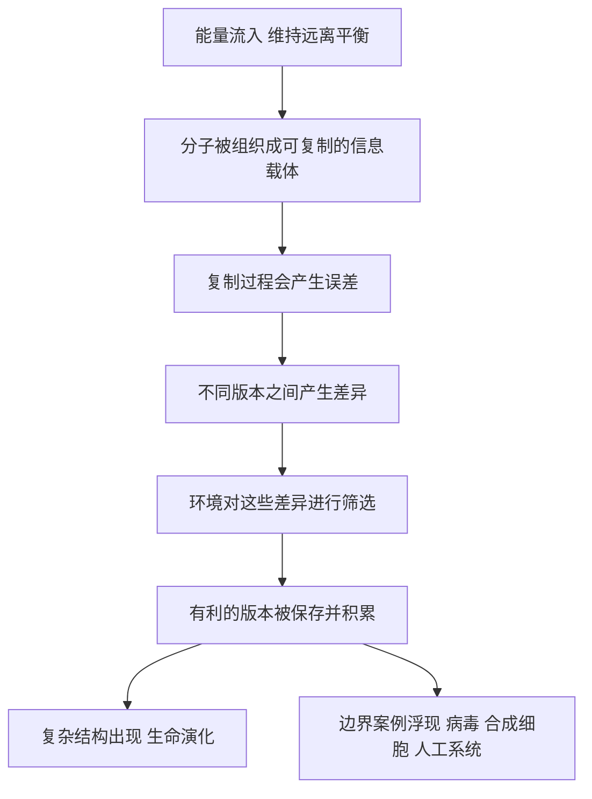

# 15｜80 年后，我们该如何重新回答「生命是什么」？

> 站在合成生物学、基因编辑与人工智能的今天，这个问题有答案了吗？

---

## 一、先说结论

如果一定要用几个词来概括今天的回答，大致是三个：**信息、能量、演化**。

生命是一套可以被编码、被复制、会出错的信息系统；它靠持续的能量流维持自身远离平衡；它在复制与变异中被选择，从而演化。

但这三个词并不是一份让所有人满意的定义。病毒算不算生命？计算机病毒呢？实验室里合成的细胞呢？能够自我改进的人工智能呢？八十年过去，问题被问得更清楚了，却依然没有终局。

薛定谔真正的遗产，或许不是某个答案，而是让这个问题从哲学思辨，变成了可以严肃追问、逐步逼近的科学问题。

---

## 二、我们先理解一个问题

为什么「生命是什么」这么难回答？

因为定义从来不是纯粹的发现，它往往带着目的。生物学家、医生、哲学家、法学家问这个问题时，想要的其实不一样。

- 医生想知道什么时候可以宣布死亡。
- 生态学家想知道一个种群算不算一个生命的单位。
- 伦理学家想知道一个胚胎、一个类器官、一个 AI 系统该被赋予什么地位。

所以，当你看到「生命至今没有公认定义」时，不必把它当作科学的失败。它更像是**自然界并不配合我们的分类癖**：从病毒到细菌再到人类，生命呈现出一条连续的谱系，而定义总是要在谱系的某处切一刀。

---

## 三、作者到底提出了什么观点？

先回到薛定谔。他的答案可以压缩成两句话。

第一，生命通过从环境摄取「有序」来维持自身的高度有序，用他的话说，是「以负熵为食」。

第二，遗传信息存放在一种非周期性的分子结构里，是一份决定全部发育的「密码脚本」。

今天我们会做一些修正和翻译：

- 「负熵」更准确的表述是**自由能**与**远离平衡的开放系统**。
- 「非周期性晶体」被证实就是 DNA，它不重复的碱基序列就是信息。
- 「密码脚本」被证实存在，只不过密码是序列性的，而非他想象的结构性的。

所以，80 年后的回答不是推翻他，而是**把他的关键词升级为现代版本：信息、能量、演化。**

---

## 四、把这个观点翻译成人话

想象三样东西：一团火、一本书、一场比赛。

**火**消耗能量、会蔓延、会熄灭，但它不携带需要被复制的信息。

**书**携带信息、可以被抄写，但它自己不消耗能量，也不会自己动。

**比赛**有信息、有能量，但真正让它持续的是**选择**：跑得快的留下来，跑不动的被淘汰。

生命之所以是生命，恰恰因为它同时具备这三样：**用能量维持着一份可以被复制、会出错的说明书，并让不同的版本互相竞争。**

少了任何一样，都只剩下半张面孔。

---

## 五、为什么会这样？

把它拆成一个流程，逻辑就更清楚了：

这条链里，**C 到 E 是最微妙的一环。**

如果复制永不犯错，生命就只是一台复读机，无法演化；如果错误太多，信息就会被冲散，无法积累。生命恰好落在「出错率不高也不低」的窄窗口里——这本身就是自然选择的产物。

也正因为核心是「复制加选择」，那些没有细胞膜、不做代谢、却携带遗传信息并在宿主中演化传播的东西（比如病毒），才让「生命」的边界变得如此暧昧。

---

## 六、举一个现实生活中的例子

回想新冠疫情的那几年。

病毒到底算不算生命？它没有代谢、没有独立的能量系统，离开宿主的分子机器，就只是一团蛋白质和核酸的包裹。按「自己会代谢」的标准，它不像活的。

但它有基因组，会复制，会变异，会被免疫系统和疫苗逼着演化。它每时每刻都在实践「复制、出错、被选择」这条公式。

于是你看到了一场典型的边界战争：一部分学者坚持生命必须能自我维持；另一部分则认为，只要携带可遗传的信息并能演化，就该被纳入生命的版图。

再往前一步：计算机病毒也自我复制、也变异、也在环境中被筛选。它缺的只是一副化学躯壳。如果我们只抓住「复制与选择」，它是不是也踩进了门口？这个问题，到今天还没有让人满意的答案。

---

## 七、回到书中重新理解

现在再回看薛定谔，会发现他其实站在一个极其有利的岔路口。

他没有能力做出正确的分子细节，但他问对了两个关键方向：**信息存在哪里？能量如何支撑秩序？**

这两个问题，构成了现代生命科学的骨架。DNA 测序是「读信息」，基因编辑是「改信息」，合成生物学是「写信息」，而代谢研究与非平衡态热力学处理的是「能量」。他当年画的那两个箭头，今天都长成了学科。

而他没有想到的是第三个词：**演化**。不是他无视演化，而是他关心的是「单个生命如何维持有序」，还没把注意力放到「群体如何在噪声中被筛选」。现代的回答，把演化补进了他的框架。

---

## 八、这个观点背后还有什么？

这个「信息、能量、演化」的回答背后，藏着几个哲学后果。

第一，**它是非本质主义的。** 它不回答「生命的本质是什么」，只描述「什么样的系统会表现出生命特征」。这是一种工程式的回答：不问它是不是真的活，只问它能做什么。

第二，**它意味着生命可能是基底无关的。** 如果关键是信息与选择，那么承载信息的材料未必必须是碳和水的组合。这就给人工生命、乃至某种形式的人工系统，留出了一道门缝。

第三，也是我最在意的：**它动摇了「生命是一道清晰界线」的直觉。** 一旦我们接受生命的边界是模糊的，那么很多原本纠缠不清的伦理争论——关于胚胎、关于类器官、关于 AI——就无法再用「它是不是活的」一劳永逸地解决。

---

## 九、这个观点有问题吗？

有，而且这些质疑至今活跃。

第一，**纯演化式的定义会误伤。** 如果生命必须能繁殖，那么骡子、工蜂、绝育的人算不算生命？他们显然活着。可见「能繁殖」是种群层面的性质，不是个体层面的。

第二，**「信息」这个词很容易滑向空泛。** 信息不是生命独有的，一张照片也有信息。如果我们不严格限定「什么样的信息、通过什么机制被复制和选择」，这个定义就会失去分辨力，甚至滑向一种新的、披着科学外衣的神秘主义。

第三，**存在人择色彩。** 我们定义的界碑，总是倾向于把人类自己稳稳地放在「生命」这一侧。这种以自我为参照的分类，难免带有偏见。

所以更诚实的说法是：**今天的三个关键词不是答案，而是一个仍在被拷问的框架。**

---

## 十、今天再看这个观点

（以下为现代延伸，非薛定谔原文）

近二十年，他的问题被一系列技术实打实地推到了眼前。

在**合成生物学**里，克雷格·文特尔团队在 2010 年宣布构建出一套可自我复制的合成基因组，并在 2016 年做出了接近「最小基因组」的合成细胞；此后研究者还尝试了多种人工设计细胞与类细胞系统。每一步都在追问：生命可以被「写」出来吗？

在**基因编辑**里，CRISPR 让改写遗传信息变得廉价而精确，两位发现者获颁 2020 年诺贝尔化学奖。薛定谔所说的「密码脚本」，如今真的可以被划掉、改字、替换。

在**人工智能**里，蛋白质结构预测与生成式模型把「生命是信息」这句话推得更远：模型可以从序列推结构，也可以设计出自然界不存在的功能蛋白。研究者甚至开始尝试用 AI 建立细胞层面的模拟。至于能否用信息装置实现某种「活」的系统，学界仍在争论，远无定论。

他当年问「生命是否需要新的物理」，今天有一个更温和的版本：生命是否带来了新的**组织原理**——不是新定律，而是新的复杂度层次。这个问题仍然开放。

---

## 十一、这一篇真正应该记住什么？

1. **今天的回答偏向三个词：信息、能量、演化。** 它们分别对应他问过的信息与能量，以及他未展开的演化。

2. **薛定谔方向对，但问题没有终点。** 病毒、计算机病毒、合成细胞、AI 都在持续冲撞那道边界。

3. **没有公认定义，不等于失败。** 定义服务于目的，而自然是连续的，界线总要切在某个地方。

4. **他的遗产是把哲学提问变成了研究纲领：** 可检验、可推进、可被后代修改。

5. **最值得注意的是边界地带。** 真正有新东西出现的地方，往往正是定义最模糊的地方。

---

## 十二、留一个问题

让我们把这条线索收拢一下。

从「生命为什么能对抗熵增」，到「遗传信息藏在非周期性晶体里」；从「突变是一次量子跃迁」，到「生命是一套信息」；再到最后那个令人不安的后记——如果一切都被物理决定，那么正在读这本书的「我」，又是谁。

薛定谔几乎每一步都没能给出正确答案，但他每一步都把问题往前挪了一寸。他用一本薄薄的小书证明了一件事：**在科学里，问清楚一个问题，往往比仓促回答它更需要勇气，也更有力量。**

那么，最后这个问题留给你：

> **如果生命只是信息在能量流中被复制、被改动、被选择，那么当一个系统开始改写自己的说明书，并因此改变自己的命运时——我们凭什么说，它不是活的？而我们自己，又究竟活在哪一层？**

80 年了，这个问题，仍然没有句号。
