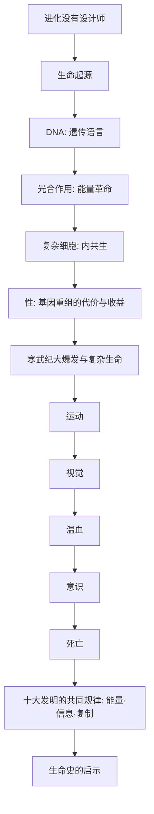

# 《生命进化的跃升》深度解读系列

## 系列简介

《生命进化的跃升》是生物化学家尼克·莱恩的代表作。它挑出了生命史上十次最关键的"发明"，逐一追问：**这些改变世界的创新，究竟是怎么出现的？**

这十项发明包括：生命本身、DNA、光合作用、复杂细胞、性、运动、视觉、温血、意识、死亡。它们不是被谁设计出来的——进化没有设计师，也没有蓝图。每一项都是偶然、筛选与数十亿年累积的结果，却共同把地球从一个无生命的星球，变成了一个会思考自己的星球。

莱恩的写法很硬核：他不满足于"讲现象"，而是深入到能量与分子的层面，追问"这在物理化学上到底是怎么可能的"。因此这本书既是一部生命史诗，也是一堂关于"能量如何塑造生命"的深度课。

本系列围绕 **15 个核心问题**，从"进化没有设计师"这个前提开始，一路讲到死亡与生命史的启示。

---

## 全书核心问题

| 层次 | 问题 |
|---|---|
| 框架问题 | 什么是"生命的十大发明"？为什么说进化没有设计师？ |
| 起点问题 | 生命、DNA、光合作用是怎么出现的？ |
| 细胞问题 | 复杂细胞、性、复杂生命为何如此关键？ |
| 感知问题 | 运动、视觉、温血、意识是如何"跃升"出来的？ |
| 终局问题 | 死亡为何存在？生命史给了我们什么启示？ |

---

## 全书知识地图



---

## 全系列目录

### 第一部分：框架

#### 01｜什么是“生命进化的十大发明”？

核心问题：为什么说生命史可以被看作一系列"关键发明"的累积？

核心观点：莱恩挑选出十项改变生命进程的"发明"：生命、DNA、光合作用、复杂细胞、性、运动、视觉、温血、意识、死亡。它们不是比喻意义上的创造，而是让生命"登上新台阶"的关键创新。理解它们，就理解了生命为什么会变成今天的样子。

理解难度：★★★☆☆

关键词：十大发明、跃升、创新、生命史

---

#### 02｜为什么说进化没有设计师？

核心问题：生命看起来处处像被精心设计，为什么却没有设计者？

核心观点：进化没有目标，也没有蓝本。看起来"精巧"的结构，是随机变异与环境筛选长期累积的结果——它像工程师的产物，却不是工程师设计的。理解这一点，是理解后面所有"发明"如何出现的前提。

理解难度：★★★★☆

关键词：自然选择、无设计、累积、拟人化陷阱

---

### 第二部分：生命的起点

#### 03｜生命是怎么诞生的？

核心问题：从无生命的分子，到第一个能自我复制的系统，中间发生了什么？

核心观点：莱恩结合化学与地质证据，讨论生命可能诞生的场景（如深海热泉）。核心难题是：如何从化学反应中产生"自维持、可复制"的系统。生命起源至今仍是科学的重大未解之谜，但已有一些有说服力的假说。

理解难度：★★★★★

关键词：生命起源、热泉、自我复制、未解之谜

---

#### 04｜DNA 是如何成为生命通用语言的？

核心问题：为什么所有生命都用同一套遗传密码？

核心观点：DNA 用四个字母编码蛋白质，作为几乎所有生命的通用语言。这种"统一性"既证明了共同祖先，也说明 DNA 是一种极其成功、几乎不可替代的"信息存储方案"。莱恩指出：生命的核心，是**信息与能量的结合**。

理解难度：★★★★☆

关键词：DNA、遗传密码、信息、共同祖先

---

#### 05｜光合作用如何改变了地球？

核心问题：一个"吃阳光"的能力，为什么能改写整个星球？

核心观点：光合作用把太阳能转化为化学能，并释放氧气。它引发了"大氧化事件"，彻底改变了大气与海洋，为复杂生命提供了能量基础，也带来了氧气的毒性挑战。它可能是生命史上最具颠覆性的一次"发明"。

理解难度：★★★★☆

关键词：光合作用、氧气、大氧化事件、能量

---

### 第三部分：细胞与性

#### 06｜复杂细胞是怎么来的？

核心问题：从简单细菌到有细胞核的复杂细胞，这一步是如何跨过去的？

核心观点：复杂细胞（真核细胞）很可能源于"内共生"：一个细胞吞入了另一个细胞，后者逐渐变成线粒体。这次"合作"带来了巨大的能量优势，是复杂生命诞生的关键一步。它说明：合作，有时比竞争更能开创新局面。

理解难度：★★★★★

关键词：真核细胞、内共生、线粒体、合作

---

#### 07｜为什么进化要选择“有性繁殖”？

核心问题：有性繁殖既麻烦又低效，为什么它如此普遍？

核心观点：有性繁殖需要找配偶、只传递一半基因，看似"吃亏"，却能通过基因重组产生大量变异，帮助后代抵御寄生虫与快速变化的环境。莱恩把"性"看作生命史上最成功的发明之一——它用短期成本，换来了长期的适应力。

理解难度：★★★★★

关键词：有性繁殖、基因重组、变异、红皇后

---

#### 08｜为什么复杂生命迟到了那么久？

核心问题：地球生命诞生很早，为什么大型复杂生命却"姗姗来迟"？

核心观点：从单细胞到复杂多细胞生命，中间隔了极其漫长的时间。制约因素包括氧气水平、能量供应与细胞协作机制。直到这些条件逐步满足，才有寒武纪大爆发式的生命多样化。这说明：**能量与环境的门槛，决定了演化能走多远。**

理解难度：★★★★☆

关键词：复杂生命、氧气、寒武纪、门槛

---

### 第四部分：运动、感知与温血

#### 09｜生命为什么会动？

核心问题：运动看似简单，为什么是生命史上的一大跃升？

核心观点：运动需要精密的分子马达与协调机制（肌肉、鞭毛）。它让生物能够主动寻找资源、逃离危险、捕食与求偶，从根本上改变了生态关系——从"被环境摆布"到"主动行动"。这是生命从被动走向主动的关键一步。

理解难度：★★★★☆

关键词：运动、分子马达、肌肉、主动性

---

#### 10｜眼睛是怎么被“发明”出来的？

核心问题：如此精密的器官，怎么可能"自然形成"？

核心观点：眼睛是"看似的设计"最经典的例子。莱恩展示了从感光细胞到成像眼睛的渐进路径，而这条路径在不同谱系中独立走过多达数十次。它证明：只要有稳定的选择压力，复杂的感知系统可以被一步步累积出来。

理解难度：★★★★☆

关键词：眼睛、感光、渐进演化、趋同

---

#### 11｜温血为什么是关键的跃升？

核心问题：恒温耗能巨大，为什么反而带来了巨大优势？

核心观点：温血（恒温）让动物能稳定维持体温，从而在寒冷环境中保持活跃、扩大活动范围与生存时间。它代价高昂（需要大量进食），却换来了更高的活动能力与生态优势——鸟类和哺乳类的成功，与它密切相关。

理解难度：★★★★☆

关键词：温血、恒温、代谢、生态优势

---

#### 12｜意识是怎么产生的？

核心问题：大脑如何从物质中"生出"主观体验？

核心观点：意识是生命史上最难解的谜。莱恩从神经科学角度讨论它的可能来源，但坦承：意识如何从神经元活动中产生，至今没有公认答案。这一篇既呈现前沿洞见，也诚实地划出未知的边界。

理解难度：★★★★★

关键词：意识、神经元、主观体验、未解之谜

---

### 第五部分：死亡与启示

#### 13｜死亡：为什么进化“需要”死亡？

核心问题：死亡看起来是失败，为什么它可能是进化的必要条件？

核心观点：莱恩指出：死亡并非纯粹的"终止"。细胞层面的程序性死亡（如细胞凋亡）是发育与维持身体的关键机制；而个体的死亡，也让世代更替与演化成为可能。没有死亡，演化几乎无法想象。

理解难度：★★★★☆

关键词：死亡、凋亡、世代更替、演化的条件

---

#### 14｜这十大发明有什么共同规律？

核心问题：跨越大相径庭的十个"发明"，是否共享某种底层逻辑？

核心观点：莱恩反复强调两条主线：**能量**与**信息**。从光合作用到温血，生命的每一次跃升都与"更高效地获取和使用能量"有关；从 DNA 到意识，则与"处理信息的能力"有关。生命的宏大叙事，可以被压缩成这两条线。

理解难度：★★★★★

关键词：能量、信息、共同规律、底层逻辑

---

#### 15｜生命史给了我们什么启示？

核心问题：读懂这十次跃升之后，我们该如何理解生命与我们自己？

核心观点：生命史展示了三重特征：偶然（没有预设的路线）、必然（能量与物理化学规律始终在起作用）、累积（每一次跃升都站在前一次的肩膀上）。理解了这一点，也就能理解我们在生命之树上的位置：我们不是终点，而是其中一次跃升的产物——而且这次跃升，还远没有结束。

理解难度：★★★★☆

关键词：偶然、必然、累积、生命之树、启示

---

## 推荐阅读顺序

**主线顺序（推荐）：01 → 15。**

```text
第一段｜框架（01–02）   十大发明 → 进化无设计师
第二段｜起点（03–05）   生命起源 → DNA → 光合作用
第三段｜细胞（06–08）   复杂细胞 → 性 → 复杂生命迟到
第四段｜感知（09–12）   运动 → 视觉 → 温血 → 意识
第五段｜终局（13–15）   死亡 → 共同规律 → 生命史启示
```

**阅读建议：**

- **想先抓住骨架**：读 01、02、05、06、14、15 六篇。
- **对能量/代谢感兴趣**：读 05、06、11、14。
- **对"生命为何复杂"感兴趣**：读 06、07、08。
- **想练习批判性阅读**：重点看 02、12、15 三篇（争议与未解之谜最集中）。

---

## 全系列状态

> 本系列共 15 篇，正文生成中。
