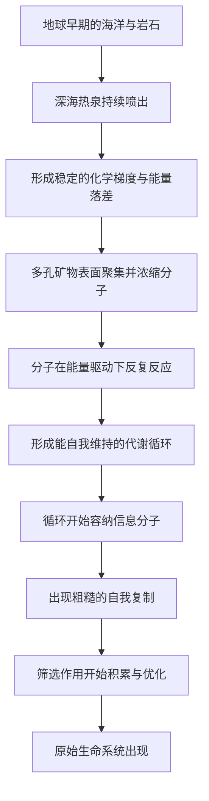

# 03｜生命是怎么诞生的？

> 从无生命的分子，到第一个能自我复制的系统，中间发生了什么？

---

## 一、先说结论

莱恩认为：生命起源的核心难题，不是"造出复杂分子"，而是**让化学反应自己维持自己，并开始复制自己**。

他倾向于一个具体的场景：生命可能诞生在**深海热泉**——那里有稳定的能量梯度、丰富的矿物表面和持续的化学失衡。在地球最早期的环境里，这样的地方可能为数不多地同时满足"有能量、有原料、有组织条件"。

但他同时非常诚实：**生命起源至今仍是一个重大未解之谜。** 热泉只是最有说服力的假说之一，它没有被证实，也没有排除其他可能。

---

## 二、我们先理解一个问题

先分清两个常被混在一起的问题。

第一个问题是：**生命需要哪些零件？** 比如氨基酸、核苷酸、脂质、糖。这个问题相对好回答，因为有一些经典实验表明，在模拟早期地球的条件下，可以生成氨基酸等有机分子。

第二个问题是：**这些零件怎么自己组装成一个"活着的系统"？** 这就难得多。

因为"活着"的关键不是有零件，而是有一个能持续进行的**循环**：一边消耗能量、一边维持自身结构，同时还能把这些信息传给下一代。一堆有机分子泡在水里，哪怕种类齐全，也不是生命——它只是原料。

所以真正的问题是：

> 是什么把一堆化学分子，变成了一个会自我维持、还会自我复制的系统？

---

## 三、作者到底提出了什么观点？

莱恩的核心观点，可以概括成三层。

第一，**生命起源的关键是"能量流"，不是"配方"。** 他不认为只要把正确的分子凑齐，生命就会自己出现。他强调，必须存在一个持续的能量梯度——化学上的"落差"——让反应能被不断驱动。

第二，**矿物表面可能充当了最早的"组织平台"。** 在热泉环境中，岩石的多孔结构提供了大量微小空间，可以把分子聚集、浓缩、并让它们在有能量供给的条件下反复反应。

第三，**复制是后来才有的，不是一开始就有的。** 莱恩认为，先出现的是一个能自我维持的代谢网络，随后才在这个网络里逐渐演化出信息存储与复制机制。也就是说：**先会"活着"，后才会"遗传"。**

这三层合起来，构成他对生命起源的完整想象：一个在能量梯度和矿物表面上，从化学失衡中长出来的自我维持系统。

---

## 四、把这个观点翻译成人话

把生命起源想象成点火。

你面前有一堆木柴，但木柴不会自己变成火。要让它烧起来，你需要三件事：可燃物、氧气，以及一个能把燃料转化为持续反应的结构。最关键的是，火一旦烧起来，**它会自己维持自己**——燃烧产生的热，又让周围的燃料持续被点燃。

莱恩说的生命起源，逻辑上非常接近：重要的不是"有没有木柴"，而是"有没有一个能持续燃烧的机制"。

这就是为什么他特别强调能量梯度和矿物表面：前者是那根火柴，后者是让"火焰"能够被固定住的炉膛。没有炉膛，化学反应转瞬即逝；有了炉膛，反应就能反复发生、循环进行，进而慢慢累积出越来越复杂的结构。

理解了这个类比，就能理解他为什么说"先活起来，再谈遗传"。

---

## 五、为什么会这样？

为什么"深海热泉"会被认为是一个可能的起源场景？看它同时满足了哪些条件：

关键在于 **C → F** 这一环。

如果能量供给是间歇的、忽有忽无的，反应就走不成长链条；而热泉提供的是一种**持续、稳定、可以被反复利用的不平衡**。在物理化学上，持续的能量落差正是驱动复杂性和组织出现的必要条件。莱恩提出的假说认为，这样的环境不需要外部设计，就能把无机的化学过程一步步推向有机的循环。

---

## 六、举一个现实生活中的例子

说的就是**深海热泉**本身。

在深海海底，海水渗入岩石，被地热加热，再带着大量溶解的物质喷涌出来。喷口周围的环境极其"不友好"：高温、高压、没有阳光，充斥着对多数生物有毒的化学物质。然而在现实世界里，正是这样的地方聚集着大量生命——有的靠化学能而非阳光生存，有的与喷口周围的化学反应紧密绑定。

莱恩据此提出：如果今天的生命可以在热泉周围繁荣，那么最初的自我维持系统，是否也可能在这样的地方诞生？

与这个场景形成对照的，是另一种更早被广泛接受的图景——**"原始汤"**。这种假说认为，早期海洋是一个富含有机分子的稀薄溶液，生命在其中慢慢"泡"出来。两组图景的争论，其实是在争一个关键问题：**生命起源需要的是"一锅均匀的溶液"，还是"一个持续供能的微环境"。** 汤的成分容易想象，但它缺少持续的能量落差与组织平台；热泉更"吵闹"，却能提供反应所需要的持续驱动。

这也是为什么莱恩更偏向热泉路线。

---

## 七、回到书中重新理解

现在再回看莱恩对生命起源的处理方式，就能看清他的用意。

他在这个问题上没有给出一个"标准答案"，而是把重点放在了**机制的可行性**上：一个没有设计者的世界，必须存在某种物理化学过程，能让无机到有机、无组织到有组织的转变在自然条件下发生。热泉假说之所以吸引人，正是因为它提供了一条不需要奇迹、也不需要预设目的的路径。

同时，他把"复制"排在"代谢"之后，也改变了我们对生命本质的直觉。我们常常以为生命 = 会复制的东西；而莱恩暗示，或许更本质的是**会维持自己的东西**，复制只是它后来学会的本领。这为后面讨论 DNA 埋下了伏笔。

---

## 八、这个观点背后还有什么？

**第一，它把生命起源从"配方问题"变成了"能量问题"。** 原料固然重要，但更关键的是有没有持续的能量流把反应推下去。

**第二，它强调"场景"比"成分"更重要。** 同样的分子，放在不同的环境里，结果可能完全不同。起源不是一个纯粹的化学式，而是一个地质与化学共同作用的场景。

**第三，它在逻辑上呼应了整本书的主线。** 莱恩反复强调能量是生命跃升的驱动力，而生命起源正是这条主线最初的起点。

**第四，"先代谢后复制"是一个有争议的排序。** 它把生命的定义重心从信息移向能量，这一选择本身就带有理论立场。

---

## 九、这个观点有问题吗？

有，而且这是全书争议最集中的地方之一。这里必须把话说清楚：**生命起源没有定论。**

**第一，热泉假说只是竞争性假说之一。** 关于生命起源，学界存在多种不同解释，包括"原始汤"式的海洋溶液路线、以 RNA 为核心的路线、以及热泉路线等。没有任何一种被公认为最终答案。

**第二，"先代谢还是先复制"，是一场长期争论。** 一种有影响力的观点认为，能同时催化反应又存储信息的 RNA 分子可能是最早的核心；而莱恩更强调先有代谢网络。一些生物学家支持前者，一些支持后者，这个问题仍在研究中。

**第三，时间和证据都极难获取。** 生命起源发生在将近四十亿年前，相关证据早已被地质作用抹去大半。任何假说都很难获得决定性的直接证据，只能依靠间接线索与实验模拟的可行性来判断。

**第四，实验成功不等于历史真实。** 在实验室里能生成某种分子，只能说明"这条路在化学上走得通"，不能说明"当年就是这么走的"。

**所以更准确的说法是**：生命起源是科学上悬而未决的根本问题。莱恩的热泉图景是一个结构清晰、有说服力的假说，它解释了许多现象，但它并未被证实，也不能排除别的路线。承认这一点，不是削弱它，而是尊重科学的本分。

---

## 十、今天再看这个观点

以下部分是基于莱恩思想的现代延伸，不是他的原话。

莱恩把生命起源理解为"能量梯度驱动下的自我组织"，这个视角在今天有不少现实回响。

一方面，它在寻找地外生命时提供了新的判据。如果生命的关键不是某种稀有配方，而是"持续的能量落差 + 合适的化学环境"，那么在天体上寻找生命的重点，就不应只盯着液态水和有机分子，而应重点寻找那些存在长期化学失衡的区域。

另一方面，它改变了合成生物学的一个思路：与其纠结于"先造出哪个分子"，不如先构建一个能自我维持的化学循环，再逐步往里加入信息分子。

这当然只是延伸与类比。实验室里的自维持系统离真正的生命还差得很远。但它至少说明，莱恩提出的"能量优先"视角，不只是一种历史假说，也是一种找生命的思路。

---

## 十一、这一篇真正应该记住什么？

1. **生命起源的核心难题是"自维持"，不是"凑齐分子"。**
2. **莱恩倾向于深海热泉场景，因为它同时提供了能量、原料与组织平台。**
3. **他主张先有代谢循环，后有信息复制。**
4. **生命起源仍是未解之谜。** 热泉假说只是竞争性假说之一，没有定论。
5. **"化学上走得通"不等于"历史上就是这样发生的"。**

---

## 十二、留一个问题

> 如果生命的起点是"能自我维持的化学循环"，
> 那么定义生命的，究竟是它储存了什么信息，
> 还是它能否把能量持续地转化为自己的存在？

---

**下一篇**：假设第一个"活着的系统"真的在热泉里出现了，它接下来面临一个必须解决的难题：怎么把"自己怎么维持"这件事记下来，并且传给下一代？如果每次都要从零开始，生命将永远停在起点。

下一篇我们就来拆开这个问题——**DNA 是如何成为生命通用语言的？**
