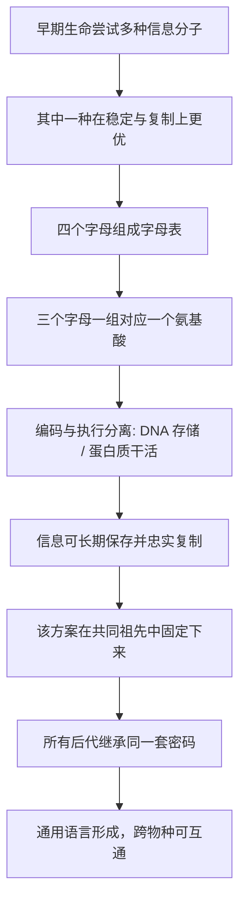

# 04｜DNA 是如何成为生命通用语言的？

> 为什么所有生命都用同一套遗传密码？

---

## 一、先说结论

莱恩认为：**DNA 是生命史上最成功的"信息存储方案"，而它的通用性，正是生命同源的最好证据。**

无论是一株草、一条鱼、一个细菌，还是一个人，都用同一套机制存储遗传信息：由四个碱基组成的字母表，通过三个字母一组的方式，编码出蛋白质的氨基酸序列。这套规则的覆盖范围之广，几乎横跨了地球上所有已知生命。

莱恩由此推进到一个更大的判断：生命的核心不是"会复制"，而是**信息与能量的结合**——信息需要能量的支撑才能被读取和传递，能量需要信息才能被有序地使用。

---

## 二、我们先理解一个问题

先理解一个看似矛盾的现象。

如果生命是各自独立起源的，那么不同的生命谱系应该发展出各自不同的遗传方式——就像不同的人类文明各自发明了不同的文字。可现实恰恰相反：地球上几乎所有生命，用的都是**同一套字母表、同一套拼写规则**。

这带来两种解释：一是生命只起源了一次，之后所有生命都是它的后代；二是生命可能起源过多次，但只有这一种"写法"胜出，别的都灭绝了。无论哪一种，都指向一个事实：**DNA 这套方案，几乎不可替代。**

于是问题来了：

> 一套编码系统，凭什么能统一整个生物圈？

---

## 三、作者到底提出了什么观点？

莱恩的观点可以拆成四点。

第一，**DNA 是一种信息存储介质，它的优势在于稳定。** 相比其他可能的信息分子，DNA 的化学性质更稳定，适合长期保存、忠实复制。信息要传得久，介质必须先扛得住。

第二，**编码是"间接"的，这一点极其关键。** DNA 并不直接干活，它储存的是"怎么造蛋白质"的指令；真正执行任务的是蛋白质，而中间还要经过 RNA 这一环。这种"存储与执行分离"的设计，让信息可以反复读取而不被消耗。

第三，**通用遗传密码证明生命共享一个共同祖先。** 如果每种生命都自己发明一套编码，就没有理由处处一致。高度一致，恰恰说明它们来自同一个源头。

第四，**信息与能量必须绑定。** 莱恩强调，读取 DNA、合成蛋白质，每一步都要消耗能量。信息不是凭空运行的，它必须建立在一个持续供能的系统之上。这是他把 DNA 与光合作用、复杂细胞放在同一条主线上的原因。

---

## 四、把这个观点翻译成人话

把 DNA 想象成一本写给全世界的说明书。

这本书只有四个字母，写着一种极其有限的"文字"。它的写法是：三个字母组成一个"词"，每个词对应一种氨基酸，氨基酸串联起来就是蛋白质。整本书不讲故事，只讲配方。

而这个配方最特别的地方在于：**它不直接做出成品。** 它只描述做法。真正被做出来的，是蛋白质——细胞里的执行者、催化者、结构件。这就好比一份菜谱：菜谱本身不能吃，但它决定了菜怎么做。

更惊人的是，全世界所有生命用的是**同一套拼写规则、同一本字典**。一株水稻和一头鲸，写的是同一种文字。正因为如此，人类才能把一段基因从一个物种转到另一个物种，甚至让细菌生产人的胰岛素——不是因为我们"发明"了通用语言，而是因为生命**本来就用同一门语言**。

---

## 五、为什么会这样？

为什么四个字母、三个一组的编码方式，能统一整个生物圈？可以这样理解：

关键在于 **A → G** 这一段。

在生命早期，很可能存在多种可能的信息分子和编码方式。但只有那些既稳定、又能被可靠复制的方案，才能在世代传递中保留下来。一旦某套方案在共同祖先身上"定稿"，它就随着后代的分化被带到所有分支里，再也没有换过。**通用，不是因为它是唯一可能的写法，而是因为它是唯一活下来的写法。**

---

## 六、举一个现实生活中的例子

说的就是**所有生命共用同一套遗传密码**这件事本身。

你如果去看一个细菌、一棵树、一只猫和一个人的 DNA，会发现它们在存储方式上没有本质区别：都是那四个碱基在排列，都是三个一组读成氨基酸。四种碱基、三个一组，理论上可以组合出六十多种编码，而生命只用了其中一部分来对应大约二十种氨基酸，冗余与容错都留有余地。

这种一致性带来一个直接后果：**基因可以跨物种工作。** 把人的一段基因放进细菌，细菌照样能照着这段指令造出人的蛋白质。这不是巧合，而是因为大家用的是同一门语言、同一套语法。

反过来看，这件事也提供了一个强有力的推理：如果生命起源过很多次、各自独立发展，那么很难解释为什么大家都用同一套编码。**一致性本身就指向同源。** 就像世界上所有国家不约而同使用同一种文字、同一套拼写规则，最合理的解释不是"各自发明"，而是"来自同一个源头、并一起传下来"。

---

## 七、回到书中重新理解

现在再回看莱恩为什么把 DNA 列为十大发明之一，就不难理解了。

DNA 的价值不只是"能遗传"。它完成了一次更深层的分工：**把信息与执行分开。** 细胞可以反复读取同一份指令，生产不同的蛋白质，而不必消耗指令本身。这套分工让生命第一次拥有了可以不断累积、不断修改的"文本"，为后面所有复杂的演化提供了基础。

更重要的是，莱恩借此把生命的两条主线明确地摆了出来。DNA 代表**信息**那条线——它让生命的经验（哪怕只是"怎么造某种蛋白质"这种经验）可以被保存、传递、重写。而读取信息所需的能量，则来自另一条线——这正是他要接着讲光合作用的原因。**没有稳定的能量来源，再好的信息也读不动。**

---

## 八、这个观点背后还有什么？

**第一，它把"遗传"从现象提升为"信息问题"。** DNA 的意义不在于它实现了遗传，而在于它为生命建立了一套通用、可读、可改写的信息系统。

**第二，编码的"间接性"是理解生命的关键。** 存储与执行分离，让信息可以稳定保存、反复使用，这是任何复杂生命都离不开的前提。

**第三，"通用"本身就是一个有解释力的事实。** 它既是共同祖先的证据，也说明早期那次"编码定型"具有极强的历史锁定效应。

**第四，它为全书的主线做了铺垫。** 信息不能独立存在，它必须与持续的能量供给绑定——这直接指向下一篇的主角。

---

## 九、这个观点有问题吗？

有，争议主要在于"通用"能推出多少结论。

**第一，遗传密码并非绝对普遍。** 研究表明，在少数生物和细胞器中，存在编码含义上的细微差异。这不影响"大体通用"这一结论，但说明它并非铁板一块。

**第二，为什么是这套密码而不是别的，学界仍有争论。** 关于这一问题，学界存在不同解释：有人认为它是适应性的，能减少突变带来的伤害；也有人认为其中含有很多历史偶然的成分。两者可能都对，比例却难有定论。

**第三，从"通用"推到"共同祖先"需要小心。** 这一推理得到广泛支持，但仍需与其他证据（如生化通路的相似性）合起来看，不能只凭编码一致就下结论。

**第四，把生命的核心定义为"信息与能量的结合"，本身是一种理论选择。** 一些生物学家更强调代谢，一些更强调信息。莱恩的表述清晰有力，但它是一种立场，而不是所有人共享的共识。

**所以更准确的说法是**：遗传密码的通用性是扎实的事实，DNA 作为信息存储方案的成功也被广泛承认；但"它为什么是这一套""这说明了什么"，仍有讨论空间。莱恩的框架解释力强，同时也在被持续检验。

---

## 十、今天再看这个观点

以下部分是基于莱恩思想的现代延伸，不是他的原话。

莱恩对 DNA 的理解——稳定、通用、可读、可改写——在今天成了许多技术的底层直觉。

基因测序、基因编辑、合成生物学，都建立在一个前提上：遗传信息是可以被读取、比较和修改的。正因为所有生命共用同一套语言，人类才可以把不同物种的基因放在同一套工具下处理。

更有意味的是，生命处理信息的方式，与我们自己的技术世界形成了一种呼应：稳定存储、标准编码、读取与执行分离——这正是所有信息系统的基本设计原则。生命在几十亿年前就这样做了。

这当然只是类比。DNA 的复制与计算机的存储机制完全不同。但它至少说明，莱恩把 DNA 称作"生命最成功的信息方案"，不只是形容，而是一种准确的定位。

---

## 十一、这一篇真正应该记住什么？

1. **所有生命几乎共用同一套遗传密码。** 这是生命同源的最强证据之一。
2. **DNA 的优势在于稳定、可复制、信息与执行分离。**
3. **"通用"是历史锁定的结果，不是它天生唯一的写法。**
4. **信息必须与能量绑定。** 读取 DNA 要耗能，这条线直接连向光合作用。
5. **它把生命从"会遗传"推进到"会处理信息"。**

---

## 十二、留一个问题

> 如果生命的第一要务是"把信息保存下来"，
> 那么支撑这套信息系统持续运转的能量，
> 又是从哪里来的——
> 在太阳之下，生命究竟是如何学会"吃光"的？

---

**下一篇**：DNA 让生命学会了存储信息，但信息要运转，必须有人付电费。而生命史上最慷慨的这笔电费，是太阳能。当第一批能用光来制造能量的生物出现时，它们不只是解决了自己的吃饭问题，还顺手改写了整个星球的大气与海洋。

下一篇我们就来拆开这个问题——**光合作用如何改变了地球？**
