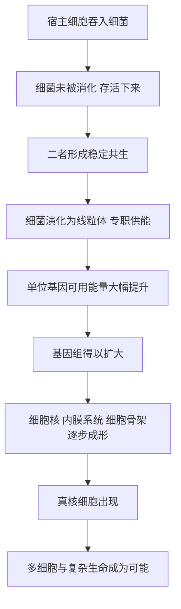

# 06｜复杂细胞是怎么来的？

> 从简单的细菌，到有核有细胞器的复杂细胞，这一跨越到底是怎么发生的？

---

## 一、先说结论

莱恩认为，复杂细胞（也就是真核细胞）的出现，不是慢慢长出来的，而是一次极其罕见的“合并”。大约在二十亿年前，一个细胞吞入了另一个细胞，后者没有被消化，反而在对方体内安顿下来，最终变成了**线粒体**。这就是所谓的“内共生”。

这次合并之所以关键，是因为线粒体带来了巨大的**能量优势**。它像一台被装进细胞里的发电厂，让细胞第一次有了“多余的能源”。有了这些能源，细胞才能养活一个庞大的基因组，才有本钱去搭建细胞核、内膜系统和各种复杂结构。

所以，复杂细胞的关键不是“更努力”，而是“找到了一个合伙者”。这也说明：在生命史上，合作有时比竞争更能开创新局面。

---

## 二、我们先理解一个问题

先把“复杂”说清楚。

细菌也是细胞，我们也是由细胞组成的，但两者差距巨大：

- 细菌是**原核细胞**：没有细胞核，没有线粒体，遗传物质是一圈裸露的 DNA，结构简单；
- 我们的细胞是**真核细胞**：DNA 被包在细胞核里，有线粒体专职供能，还有内膜系统、细胞骨架等一整套“基础设施”。

体积上，真核细胞往往比细菌大上千倍，基因组也大得多。真正让人费解的是：

> 原核细胞在地球上存在了三十多亿年，为什么始终停留在“简单”状态？而真核细胞只出现了一次，却一下打开了通向复杂生命的大门？

如果复杂是“慢慢积累”的结果，那它更该在许多谱系里反复出现才对。可事实并非如此。这提示我们：跨过这一步，可能有一个特殊的关键。

---

## 三、作者到底提出了什么观点？

莱恩的核心主张可以概括为三条。

**第一，真核细胞起源于内共生。** 他认为，线粒体原本是一种自由生活的细菌，被宿主细胞吞入后，二者形成了稳定的共生关系。证据包括：线粒体有自己的 DNA、有双层膜、靠分裂增殖，它的核糖体也更像细菌的。

**第二，能量是理解这一步的钥匙。** 莱恩反复强调，真核细胞之所以能变复杂，不是因为它“想复杂”，而是因为它“供得起”。线粒体把能量生产集中起来，让每个基因能分到的能量大幅提升。基因组要变大、结构要变多，都需要能量买单。

**第三，这一步几乎是“一次性”事件。** 莱恩认为，内共生需要的条件极苛刻，所以真正演化出复杂细胞的，可能只有一条支系——我们的祖先。

---

## 四、把这个观点翻译成人话

可以把它想象成一家小作坊的升级。

一家手工作坊，靠老板一个人又生产又记账，规模很难扩大——这就是细菌：一台“设备”要同时干所有事，效率被死死锁住。

某天，作坊里搬进来一个专门负责发电的伙伴。从此，老板不必再操心电力，能把精力全放在扩产、研发、管理上。作坊迅速变成一栋带多个车间的大厂——这就是真核细胞：线粒体负责供电，细胞核负责管理，各司其职。

关键在于：**没有那台“专属发电机”，大厂就开不起来。** 不是大厂先建好再去找电，而是先有了廉价、稳定的电，大厂才有存在的可能。

莱恩的洞见正在于此：不是“变复杂了所以需要更多能量”，而是“先有了更多能量，才有资格谈复杂”。

---

## 五、为什么会这样？

能量与复杂结构之间的关系，可以用一条链条表示：

这条链里最关键的是 **D → E → F**。

线粒体的本质，是把“产能”这件事外包给了一个专业化的结构。这样一来，细胞不必再用有限的膜面积去勉强供能，能量瓶颈被打破。而基因组一旦能变大，就能容纳更多基因，演化出更多功能——复杂，才第一次变得“付得起”。

反过来说，如果能量始终紧张，任何“变大、变复杂”的尝试都会立刻被淘汰，因为它们太费钱了。这解释了一个奇怪的事实：细菌并非没有变异，而是它们的“预算”不允许它们变复杂。

---

## 六、举一个现实生活中的例子

最贴切的例子，就是**内共生本身：一个细胞吞入另一个细胞，后者成为线粒体**。

想象两个原本各自为生的细胞。一个大细胞把一个小细胞包了进来。按常理，小细胞该被消化掉。但这一次没有：小细胞活了下来，住在大细胞里面。它继续用自己的膜和酶产能，大细胞则提供保护和原料。日子久了，两者谁也离不开谁，小细胞的独立身份慢慢消失，成了大细胞里一个专职的“发电车间”——线粒体。

今天你去查任何一个真核细胞的线粒体，几乎都能找到它“曾经是细菌”的痕迹：它有自己的环状 DNA，有双层膜，靠自己分裂繁殖，而不是由细胞从头造出来。

这个例子的震撼之处在于：**它把“合作”写进了我们每一个细胞的深处。** 你身上的每一次呼吸，都是这场二十亿年前联姻的延续。

---

## 七、回到书中重新理解

现在再回看莱恩为什么把“复杂细胞”列为十大发明之一，就清楚了。

在整本书的框架里，复杂细胞是“能量类发明”的核心一环。它承接了光合作用带来的氧气，又为后面的性、运动、视觉、意识铺好了舞台——因为复杂生命的一切“高级功能”，都需要真核细胞这种更高能效的平台。

莱恩真正想说的，不只是“线粒体怎么来的”，而是一个更大的判断：**进化能走多远，取决于能量能支持多少复杂。** 这一点在后面的“复杂生命为何迟到”“温血”“意识”几章里会不断重现。

---

## 八、这个观点背后还有什么？

**第一，它重新定义了“个体”。** 如果我们的细胞本身就是两个生命合并的产物，那么“一个生物”这个概念，其实比我们以为的更模糊。我们从来不是单一生命，而是共生体。

**第二，它把能量放到了解释的核心。** 传统讲演化，常从“形态”或“基因”入手；莱恩则坚持：先算能量账，再谈结构。

**第三，它暗示复杂生命的稀有。** 如果内共生极难发生，那么在宇宙中，复杂生命可能远比我们想象的稀少。

**第四，它也给“合作”一个正面位置。** 在“弱肉强食”的主流叙事之外，真核细胞提醒我们：生命史上一些最大跨越，恰恰来自“化敌为友”。

---

## 九、这个观点有问题吗？

关于“复杂细胞是怎么来的”，学界存在不同解释。

**第一，内共生的确证据充分，但具体过程仍有争议。** 线粒体源自被吞入的细菌，这一点已是主流共识；但“谁吞了谁”“是先有细胞核还是先有线粒体”，仍有不同模型。一些生物学家主张“线粒体早期”模型，另一些则提出“由内向外”的构想，认为细胞核与内膜系统先形成，线粒体的整合是后一步。

**第二，莱恩的“能量决定论”可能被推得过满。** 有学者认为，能量优势是重要条件，但基因组扩大、细胞结构复杂化同样受制于其他因素，比如膜系统、蛋白质运输、调控网络等，不能只归结为能量一项。

**第三，宿主是谁仍无定论。** 现代研究倾向于认为宿主是一种古菌，但具体是哪一类、内共生发生的确切时间，都还在讨论中。

**第四，但内共生作为解释框架地位稳固。** 无论细节如何修正，“一次吞并、一种共生、一个发电厂”这个大方向，已被大量证据支持。争议更多集中在“步骤与顺序”，而不在“是否发生过”。

---

## 十、今天再看这个观点

以下部分是基于莱恩思想的现代延伸，不是他的原话。

莱恩“合作 + 能量”的思路，今天有了新的回响。人们常拿细胞内的共生来类比更广泛的现象：系统要变得复杂，往往需要把“擅长的部分”专业化、模块化，并让不同模块彼此依赖。能量（资源）与分工，往往是复杂度的先行条件。

当然，这只是类比，不能直接套用到社会或技术上。但它提示了一个值得琢磨的方向：如果一个系统想变复杂，先问的不该是“结构怎么设计”，而该是“维持复杂所需的能量和资源从哪来”。

---

## 十一、这一篇真正应该记住什么？

1. **真核细胞很可能源自内共生。** 一个细胞吞入另一个细胞，后者变成线粒体。
2. **线粒体的细菌出身有硬证据。** 自带 DNA、双层膜、独立分裂。
3. **能量优势是这一步的关键。** 有了线粒体，细胞才供得起更大的基因组与更复杂的结构。
4. **这一步极其罕见。** 复杂细胞可能只在一条支系上真正出现。
5. **合作，是生命跃升的一种方式。** 化敌为友，有时比竞争更能开创新局面。

---

## 十二、留一个问题

> 如果我们的每一个细胞，都是两个生命“合并”的产物，
> 那么“个体”究竟意味着什么？
> 我们是独立的生命，还是一段从未中断的共生关系？

---

**下一篇**：复杂细胞给了生命更大的能量与更强的平台。但很快，生命又做了一个看似更“亏本”的选择——有性繁殖。它要寻找配偶，还只能传递一半基因，从账面上看简直是自找麻烦。那么，进化为什么偏偏选择了它？

下一篇我们就来拆开这个问题——**为什么进化要选择“有性繁殖”？**
