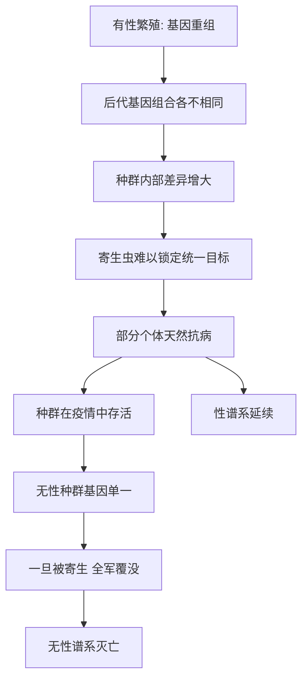

# 07｜为什么进化要选择“有性繁殖”？

> 有性繁殖既麻烦又低效，为什么它在生命世界里如此普遍？

---

## 一、先说结论

先说一个反直觉的事实：从进化的“账本”上看，有性繁殖是亏的。

有性繁殖要找到配偶，要承担求偶、竞争、被吃掉的风险；更关键的是，它每次只能把**一半**的基因传给孩子。相比之下，无性繁殖可以独自繁殖，每个后代都完整继承自己的基因，效率整整高一倍。既然如此，进化为什么还让“性”变得如此普遍？

莱恩认为，答案在于**长期收益**：性通过基因重组，把父母双方的基因重新洗牌，制造出大量新的组合。这些组合让后代更难被寄生虫锁定，也让种群在环境剧变时更有应变能力。换句话说，性用短期的高昂成本，换来了长期的适应力。

需要说明的是，学界对“性为何存在”并没有唯一答案，而是多种假说并存。莱恩的贡献，是把这个悖论讲得格外清楚。

---

## 二、我们先理解一个问题

先理解“性的双重成本”。

第一重成本，是**寻找配偶**。无性繁殖的生物，不需要伴侣，自己就能生。有性繁殖的生物，得先找到另一半，还得竞争、求偶、冒风险。这本身就很花钱。

第二重成本，更致命，叫**“雄性的代价”**。假设一个种群里有两种雌性：一种无性繁殖，一种有性繁殖。无性雌性生下的孩子全是女儿，每个都能继续生育；有性雌性生下的孩子里，有一半是雄性，而雄性不生育。结果就是：无性谱系的后代数量，会以两倍的速度增长。理论上，无性类型应该迅速压倒有性类型。

可现实是：绝大多数动物、植物，包括我们，都在有性繁殖。这说明，性一定带来了某种足以抵消这笔“巨亏”的好处。

问题于是变成：

> 到底是什么样的好处，能让生命愿意付出双倍代价，也要选择“性”？

---

## 三、作者到底提出了什么观点？

莱恩的核心主张是：**性的价值，不在于“生得多”，而在于“生得不一样”。**

他的思路大致是：

**第一，性 = 基因重组的机器。** 有性繁殖的核心不是交配本身，而是减数分裂与受精带来的基因洗牌。父母双方的基因被重新组合，每个后代都是独一无二的组合体。

**第二，变异是抵抗风险的资产。** 如果环境稳定、天敌不变，无性繁殖确实更划算。但真实世界充满了快速变化的敌人——尤其是寄生虫和病原体。它们繁殖极快，能迅速适应宿主的基因。一个基因高度一致的种群，等于给寄生虫铺好了餐桌。

**第三，性是一种“持续下注”。** 通过不断产出新的基因组合，性让种群永远握着一把没被破解的牌。代价是每代都要重新洗牌，但收益是——总有一部分个体能扛过下一轮危机。

莱恩把这个逻辑讲成一个关于“长期适应力”的故事：短期看性很傻，长期看性很值。

---

## 四、把这个观点翻译成人话

可以把它类比成“分散投资”。

假设你有一笔钱，无性繁殖相当于把所有钱押在一只股票上。如果这只股票一路涨，你赚得最多；但如果它崩了，你就血本无归。

有性繁殖则像是不断调整投资组合。每次组合都不一样，单次收益可能不如“全押”，但你几乎不可能一次输光。在一个充满不确定性的市场里，**活得久比赚得快更重要**。

更妙的是，性不只是随机分散——它还不断把父母身上“经过考验”的基因重新搭配。这就像把过去赢过的策略重新组合，试图碰出更好的方案。

莱恩想说的是：自然选择看重的不是某一代的收益最大化，而是**谱系在漫长时间里的存活概率**。性正是为此买单。

---

## 五、为什么会这样？

性、变异与抗病之间的关系，可以用这样一条链条来理解：

这里的关键对比是 **D → E → F** 与 **G → H → J**。

有性种群像一个目标不断移动的队列：寄生虫刚适应了上一代，下一代已经换了模样。无性种群则像一支纹丝不动的军队：在稳定的战场上未必吃亏，但一旦敌人找到破绽，就是灭顶之灾。

这就是所谓的“红皇后”图景：**你必须不停奔跑，才能留在原地。** 在寄生虫与宿主之间，性让宿主这边始终“跑着”。

---

## 六、举一个现实生活中的例子

这里就用有性繁殖本身来感受一下它的“看似吃亏”与“长期占优”。

想象两种生物并存。一种是全雌性的无性繁殖者：它不需要伴侣，独来独往，每个孩子都完整继承自己。另一种是我们的祖先：必须找配偶，费尽周折，最后还只传一半基因。单看一代的产量，第一种完胜。

但把时间拉长，故事就变了。假设一种致命的寄生虫出现：

- 无性种群因为彼此基因几乎相同，寄生虫只要攻克一个个体，就等于攻克了全部。疫情一来，整片种群可能在很短时间内崩溃。
- 有性种群因为每个个体基因组合都不同，总有一些个体天生就能抵抗这种寄生虫。疫情过后，幸存者带着抗性继续繁殖，种群得以延续。

于是就形成了一个耐人寻味的格局：**短期内“吃亏”的性，长期却在一次次危机中活了下来。** 而“占便宜”的无性繁殖，往往在稳定环境里风生水起，却总在环境突变时全军覆没。

这也是为什么无性繁殖在自然中虽然存在，却往往只能“暂时”出现，难以长期主导。

---

## 七、回到书中重新理解

现在再回看莱恩为什么把“性”列为十大发明之一，就顺了。

在整本书的框架里，性属于“信息类发明”。DNA 是信息的存储，性则是信息的**重组**。如果说 DNA 让生命第一次能稳定地“记住”，那么性就让生命第一次能高效地“改写”和“组合”这些记忆。

莱恩真正的洞见在于：**演化不只是关于生存，更是关于信息如何被重新洗牌。** 一个只会复制、不会重组的系统，适应力是有限的；而性给生命装上了一个永不停歇的重组引擎。这也解释了为什么后面讲到的运动、视觉、温血、意识，都建立在一个高度多样、充满变异的生命世界之上。

---

## 八、这个观点背后还有什么？

**第一，它把“收益”的时间尺度拉长了。** 很多看似吃亏的行为，只要放到足够长的时间里，就可能变成优势。性正是典型。

**第二，它强调了“多样性”本身就是资产。** 基因一致在短期内高效，长期却脆弱。多样，是抵御不确定性的保险。

**第三，它揭示了寄生虫与宿主的军备竞赛。** 这场竞赛规模巨大、永无终局，而性是最重要的战术之一。

**第四，它让“个体利益”与“谱系利益”产生了张力。** 从个体看，性不划算；从谱系看，性不可或缺。这种张力，是进化中反复出现的主题。

---

## 九、这个观点有问题吗？

关于“性为何存在”，学界存在不同解释，而且远未达成一致。

**第一，红皇后假说。** 一些生物学家认为，性之所以被保留，主要是为了应对不断进化的寄生虫和病原体。这是莱恩着墨较多的一种解释，但它也面临反驳：质疑者指出，寄生虫压力并不总是足以解释全部事实。

**第二，清除有害突变。** 另一些生物学家认为，性的关键在于清除基因中的“坏账”。无性繁殖的谱系会像棘轮一样，不断累积难以去除的有害突变（所谓“穆勒棘轮”）；而性通过重组，能把干净的基因组合到一起，把坏突变甩掉。

**第三，修复 DNA 损伤。** 还有观点认为，性的起源可能和修复遗传物质损伤有关——减数分裂本身就带有“修复”的性质。性未必一开始就是为了增加变异，而可能是从修复机制演化而来。

**第四，加速有利组合。** 也有学者强调，性能把不同个体身上出现的有利突变迅速汇集到一起，从而加快适应速度。

**所以更准确的说法是**：性的存在很可能不是单一原因造成的，而是多种机制叠加、在不同情境下各自发挥作用。莱恩给出了一个清晰有力的故事，但他并没有、也无法宣称这是唯一答案。关于“性为何存在”，至今仍是演化生物学讨论最激烈的问题之一。

---

## 十、今天再看这个观点

以下部分是基于莱恩思想的现代延伸，不是他的原话。

“性”的逻辑，今天在多个领域都能看到回声。比如在投资里，“分散”比“全押”更抗风险；在系统设计里，冗余和多样往往比极致优化更能抵御意外；在生态和农业里，单一品种的大规模种植虽然高产，却更容易被一种病害一网打尽。

当然，这些只是类比，不能直接等同于生物学上的性。但它们共享同一个直觉：**面对不确定的世界，保留多样性与重组的可能，往往比追求短期最优更明智。**

---

## 十一、这一篇真正应该记住什么？

1. **有性繁殖短期是亏的。** 找配偶、只传一半基因，账面效率远低于无性繁殖。
2. **性的核心是基因重组。** 它让每个后代都是独一无二的组合。
3. **多样性是抗风险资产。** 面对快速进化的寄生虫，基因多样的种群更可能存活。
4. **解释不止一种。** 红皇后、清除突变、修复损伤、加速适应等假说并存，学界仍在争论。
5. **短期成本换长期适应力。** 性是一笔用当下的昂贵，购买未来的存活概率。

---

## 十二、留一个问题

> 如果把“性”理解为“用多样性换取长期生存”，
> 那么一个只追求效率、排斥多样与重组的系统，
> 是不是恰恰在给未来的危机埋下伏笔？

---

**下一篇**：性让生命有了变异与重组的引擎，复杂细胞也早已就位。可奇怪的是，从复杂细胞出现，到大型复杂生命真正繁荣，中间又隔了十几亿年。生命明明已经具备了条件，为什么大型复杂生命迟迟不来？

下一篇我们就来拆开这个问题——**为什么复杂生命迟到了那么久？**
