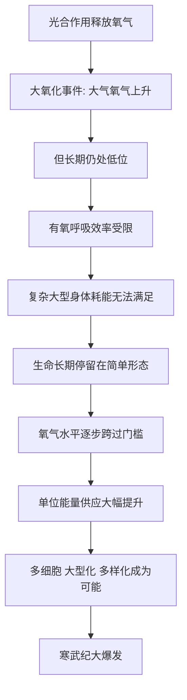

# 08｜为什么复杂生命迟到了那么久？

> 地球生命出现得很早，为什么大型复杂生命却姗姗来迟？

---

## 一、先说结论

先看一组时间：地球约 46 亿岁，生命大约 38 亿年前出现，可真正大型、复杂、肉眼可见的生命，直到大约 6 亿年前才开始繁荣，而以寒武纪大爆发为标志的多样化，则发生在大约 5.4 亿年前。

也就是说，生命在“简单”的状态下待了三十多亿年，复杂生命却像是等到最后才登场。为什么？

莱恩认为，关键制约是**能量门槛**，而能量的关键又和**氧气**密切相关。氧气充足时，生命才能高效地“燃烧”养分、获得大量能量，才供得起大型、多细胞的复杂身体。直到大气与海洋中的氧气水平跨过某个门槛，复杂生命才真正有了可能。

一句话：不是生命不想变复杂，而是**在氧气的“预算”到账之前，复杂根本负担不起**。当条件满足，寒武纪大爆发便随之而来。

---

## 二、我们先理解一个问题

先看一个“迟到”有多严重。

若把生命史压缩成一天：生命在凌晨就出现了，可直到接近深夜，才出现大型复杂生物，而我们人类，只在最后几秒钟才登场。

这里的反差，让人不得不问：

> 变复杂，真的有那么难吗？为什么它要等上三十多亿年？

这里要先破除一个直觉：我们容易以为“时间够久，什么都能进化出来”。但事实恰恰相反——在很多环境条件下，不管给多少时间，复杂都出不来。因为有一道门槛横在那里：**能量不够。**

一个复杂的身体，需要大量细胞、大量组织、大量协调。细胞越多、越大，需要的能量就越多。如果单位能量供应不足，任何“变大变复杂”的尝试都会入不敷出，被自然选择无情淘汰。

所以问题可以精确化为：

> 是什么，长期卡住了生命获取能量的上限？又是什么，最终把它松开了？

---

## 三、作者到底提出了什么观点？

莱恩的核心主张是：**能量门槛决定了演化能走多远，而氧气是打开这道门槛的关键。**

他的论证大致如下：

**第一，复杂生命需要海量能量。** 从单细胞到多细胞、从简单到复杂，身体规模和组织复杂度的每一次提升，都需要更多能量支撑。

**第二，氧气是高效产能的前提。** 用氧气来氧化养分（有氧呼吸），比无氧发酵能释放多得多的能量。没有充足的氧气，生命只能用一种低效的方式供能，复杂结构因此难以维持。

**第三，氧气水平长期偏低。** 虽然光合作用早在二十多亿年前就引发了“大氧化事件”，但氧气浓度此后长时间停留在低位，直到很晚才逐步上升，跨过了支持大型生命所需的门槛。

**第四，条件一旦满足，复杂生命便“爆发式”出现。** 随着氧气上升、生态机会打开，多细胞、大型化、多样的身体形态在相对很短的地质时间内涌现，这就是寒武纪大爆发式的景象。

---

## 四、把这个观点翻译成人话

可以把生命世界想象成一座城市，能量就是它的电力供应。

一座城市能建多高、扩多大，取决于电厂能供多少电。电力紧张时，只能维持几盏路灯，谈不上高楼大厦。哪怕有再好的建筑图纸、再多的建筑材料，没有电，城市照样长不大。

生命也一样。氧气，就是那把让“电力”大幅上涨的钥匙。在氧气不足的时代，生命只能是个“低电量”的小村子，维持简单生活尚可，想建成复杂都市则不可能。

而当氧气水平终于跨过门槛，等于电厂扩容——生命一下子有了富余的能量。于是高楼（大型身体）、地铁（循环系统）、通信网（神经系统）才有了建起来的可能。寒武纪大爆发，正是这座“生命都市”突然开始疯长的那一段。

莱恩想强调的就是：**不是设计图纸决定城市规模，而是电力供应决定了上限。**

---

## 五、为什么会这样？

氧气、能量与复杂生命之间的关系，可以这样理解：

关键的两环是 **D → E → F** 与 **G → H → I**。

前半段说明“为什么迟到”：氧气不足，供能受限，复杂身体养不起，所以生命只能一直“低配运行”。后半段说明“为什么一旦到点就爆发”：门槛被跨过后，能量不再是最紧的约束，生命的形态空间被迅速打开。

这也解释了大爆发的“突然感”：它未必是因为出现了某个“聪明”的突变，更可能是**长期积累的可能，在能量闸门打开的一刻集中兑现**。

---

## 六、举一个现实生活中的例子

最典型的例子，就是**氧气水平与能量门槛的关系，以及条件满足后的寒武纪大爆发**。

把时间拨回大约 6 亿到 5.4 亿年前。此前漫长的岁月里，氧气浓度一直不高，生命基本是单细胞或简单的多细胞，活动范围有限、身体也小。然后，情况开始变了：大气和海洋中的氧气水平逐步上升，越过了某个临界值。

变化随之而来。有了更充足的氧气，动物可以维持更大的身体、更活跃的运动、更复杂的组织；原本受限的生态空间一下被打开，捕食、逃避、掘洞、游泳等各种生活方式纷纷出现。短短几千万年（在地质尺度上只是“一瞬”），动物形态花样百出——这就是寒武纪大爆发。

这个例子的关键，不是“某一天出现了一只特别聪明的生物”，而是：**门槛一旦跨过，被压抑了数十亿年的潜力，便在一次“能量宽松”的窗口里集中释放。** 它告诉我们，进化的“速度”，有时取决于环境和能量是否松开了手。

---

## 七、回到书中重新理解

现在再回看莱恩为什么如此强调“能量”这条主线，就明白了。

在整本书里，复杂生命的迟到，是对“能量决定上限”最有力的实证之一。它上承光合作用带来的氧气，下接运动、视觉、温血与意识——因为所有这些“高级功能”，都建立在复杂多细胞身体之上，而复杂多细胞身体，又建立在充足能量之上。

莱恩真正想说的，是一个跨越全书的判断：**生命的每一次跃升，都可以理解为“能量约束被松开”的结果。** 从线粒体到温血，从复杂身体到大脑，莫不如此。理解了这一点，也就理解了为什么生命史不是均匀前进，而是一段漫长的压抑，加上几次剧烈的释放。

---

## 八、这个观点背后还有什么？

**第一，它把“时间”与“条件”区分开了。** 时间并不自动带来复杂。缺条件，给再久也没用；条件到位，可能很快爆发。

**第二，它提醒我们环境是真正的“裁判”。** 生命能走多远，不只取决于自身能力，更取决于地球给了它什么。

**第三，它揭示了“门槛”这种非线性机制。** 很多变化不是渐变，而是“过线即变”。氧气从低位升到临界的跨越，就是这种机制的典型。

**第四，它让“大爆发”不再神秘。** 看似突然的爆发，背后往往是长期的积累，加一次条件的成熟。

---

## 九、这个观点有问题吗？

关于“复杂生命为何迟到”，学界存在不同解释，氧气并非唯一被讨论的因素。

**第一，氧气假说。** 一些生物学家认为，氧气与能量门槛是核心制约。氧气上升提供了供能基础，是复杂生命登场的前提。这是最主流的解释之一，莱恩也持相近思路。

**第二，生态与“吃与被吃”的假说。** 另一些学者强调生态因素，比如捕食关系的出现带来军备竞赛，促使生物长出硬壳、眼睛、运动能力。在他们看来，寒武纪大爆发更是一场生态革命，而不仅是能量问题。

**第三，发育与基因工具。** 还有观点认为，关键在“工具箱”的成熟，比如调控发育的基因系统出现，让生物能演化出更多样的身体。也就是说，复杂需要的不只是能量，还有“会盖楼”的机制。

**第四，环境剧变假说。** 也有研究把时间点与“雪球地球”等全球性冰川事件后的环境重整联系起来，认为剧烈的气候波动打破了旧格局。

**所以更准确的说法是**：复杂生命的迟到与大爆发，很可能是能量、生态、发育、气候多重因素共同作用的结果。“氧气门槛”是其中分量很重的一条，但把它当成唯一原因，会忽略其他同样重要的线索。莱恩的贡献，是把能量这条线讲得格外清晰，但学界的图景比单一假说更复杂。

---

## 十、今天再看这个观点

以下部分是基于莱恩思想的现代延伸，不是他的原话。

“门槛”这件事，今天有强烈的现实感。一个系统能否变复杂，往往不取决于它“想不想”，而取决于某项基础资源是否跨过了临界。能源、算力、基础设施，都像当年的氧气一样，决定着一个复杂系统的上限。

当然，这只是类比，不能直接搬用到社会或技术演化上。但它提示了一个朴素而重要的道理：**在追求复杂与先进之前，先要确保“能量预算”撑得住。** 门槛不跨过，再好的构想也只是纸面。

---

## 十一、这一篇真正应该记住什么？

1. **生命出现很早，复杂生命却迟到了三十多亿年。**
2. **能量门槛是关键制约。** 复杂身体耗能巨大，供不上就长不大。
3. **氧气是打开门槛的钥匙。** 有氧呼吸效率远高于无氧方式。
4. **跨过门槛才爆发。** 氧气到位，寒武纪大爆发式的多样化随之而来。
5. **解释不止一种。** 生态、发育、气候等因素同样重要，学界仍有分歧。

---

## 十二、留一个问题

> 如果复杂生命的到来，靠的不是“更努力”，
> 而是“基础条件终于跨过了一道门槛”，
> 那么今天我们自己面对的种种“卡住”，
> 有多少其实不是能力问题，而是那一道能量与条件的门槛还没被跨过？

---

**下一篇**：能量与氧气终于松开了束缚，复杂生命登上了舞台。但生命并没有满足于“待在原地”。它开始动了起来——游泳、爬行、捕食、逃跑。运动看似平常，却是生命史上一大跃升。它究竟特殊在哪里？

下一篇我们就来拆开这个问题——**生命为什么会动？**
