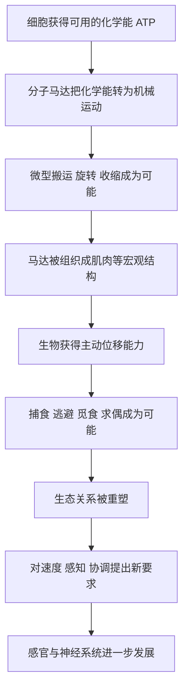

# 09｜生命为什么会动？

> 运动看似平常，为什么它是生命史上的一大跃升？

---

## 一、先说结论

植物不动，也能活得很好；许多微生物一辈子漂在海水里。可生命史的一次重要跃升，恰恰发生在生命“动起来”的那一刻。

莱恩认为，运动的特殊之处不在“位移”本身，而在于它彻底改变了生命与世界的关系。会动的生命，可以主动去寻找食物、逃离危险、追逐配偶、探索新环境——它从“被环境摆布”，变成了“主动采取行动”。

而这一切的背后，是极其精密的分子机器：**分子马达与肌肉**。它们把化学能高效地转化为机械运动。没有这些微小而精巧的装置，就不会有动物的游泳、奔跑与飞行。

一句话：运动让生命第一次成为“主体”。

---

## 二、我们先理解一个问题

先厘清一个容易忽略的区分。

不是所有“移动”都叫运动。被水流冲走的细菌、被风飘散的种子、随洋流漂荡的藻类——这些是**被动位移**，它们去哪，由环境决定。

真正的“运动”，指的是**主动位移**：生物自己能决定往哪走、走多快、何时停。这需要三个条件：

- **动力**：某种能持续做功的装置；
- **控制**：能对方向和力度做出调节；
- **目标**：能感知环境并作出反应。

于是问题来了：

> 在一个微观的细胞里，怎么可能装下一台“发动机”？
> 又是什么让生命第一次能“自己决定方向”？

这正是莱恩要讲的：在细胞尺度上，生命发明了一类极小的机器，把能量变成了动作。

---

## 三、作者到底提出了什么观点？

莱恩的核心主张是：**运动是一项由分子机器支撑的“能量—机械”革命，它让生命从被动走向主动。**

他的要点大致有三：

**第一，动力来自分子马达。** 细胞里存在一类真正的“机器”，能把化学能（比如 ATP）转化为旋转或滑动。有会转动的分子装置，也有负责在细胞内“搬货”的马达蛋白。它们共同说明：细胞是一个充满微型机械的世界。

**第二，肌肉是运动的“放大版”。** 在动物身上，这套原理被放大成肌肉：肌动蛋白与肌球蛋白相互作用，让肌肉能收缩，从而驱动游泳、爬行、奔跑、飞行。肌肉可以说是分子马达的宏观集体工程。

**第三，运动改变了生态关系。** 一旦生命能主动行动，捕食者与被捕食者、求偶者与竞争者之间的关系就被彻底重写。运动逼出了更快的速度、更敏锐的感官，也促成了后面视觉、神经系统等能力的发展。

---

## 四、把这个观点翻译成人话

可以把分子马达想象成细胞里的一台“微型电动马达”。

它不是比喻，而是真实存在的机械：有转轴，有定子，有会转动的部件，靠能量驱动持续旋转。一台这样的马达小到肉眼完全看不见，却能在细胞里完成搬运、旋转、驱动等任务。

而肌肉，就像是把成千上万台这样的小马达编排成一支“乐队”。每一台单独看只是微微一动，但当成千上万台同时、协调地收缩，就产生了可以举起重物、可以冲刺、可以飞翔的力量。

莱恩想说的其实是：**运动不是什么神秘的“生命力”，而是把化学能精确转化为机械做功的工程学。** 生命并没有违背物理规律，恰恰相反，它是把物理规律用到了极致。理解了这一点，“会动”这件事就从神奇变得可理解了。

---

## 五、为什么会这样？

从能量到主动运动，可以梳理成这样一条链条：

关键的是 **B → E → G** 这条主线。

分子马达提供了最底层的动力；一旦这股动力能被组织起来，生命就获得了主动位移；而主动位移一旦出现，整个生态立即进入新的竞赛——快者生存，慢者被吃，能感知者占优。运动于是不只是“多了一种能力”，而是**重新定义了生命与世界互动的方式**。

这也解释了为什么运动往往和视觉、神经系统相伴出现：要动得好，就必须看得清、反应快、协调准。它们是一套彼此咬合的能力组合。

---

## 六、举一个现实生活中的例子

最直接的例子，就是**肌肉与分子马达——它们让生命从被动变为主动**。

先看分子尺度。在细胞内部，有真正意义上的“马达”：有的负责把物质沿着轨道搬运，有的靠旋转完成工作。它们把化学能转换成机械动作，是“会动的细胞”的底层装置。可以说，每一个能动的细胞里，都藏着微型机械。

再看宏观尺度。肌肉把无数这样的收缩单元组织起来：当信号传来，肌动蛋白与肌球蛋白相互拉动，肌肉纤维整体变短，肌肉就收缩了。于是鱼能摆尾游动，猎豹能冲刺，鸟能扇翅高飞。

这个例子的启示在于：**运动是“小机器 + 大规模协作”的产物。** 单个分子马达的力量微乎其微，但当成千上万个协调一致地工作，就产生了足以改变命运的力量。从细胞的微小搬运，到动物的奔跑飞翔，本质上是同一原理在不同尺度上的展开。

---

## 七、回到书中重新理解

现在再回看莱恩为什么把“运动”列为十大发明之一，就清楚了。

在整本书的框架里，运动是“行动与感知类发明”的起点。它和视觉、温血、意识构成一条连贯的线索：会动的生命，需要感知方向，于是有了视觉；需要维持高强度活动，于是有了温血；需要协调与决策，于是有了神经系统，最终通向意识。

莱恩真正的洞见是：**主动行动，是生命史上的一次“身份转变”。** 在此之前，生命更多是被环境推着走；在此之后，生命第一次能对环境说“我要往那边去”。后面的种种复杂能力，都是在这份“主动性”之上生长出来的。

---

## 八、这个观点背后还有什么？

**第一，它把“运动”还原为工程问题。** 不是神秘的力量，而是化学能转化为机械做功。

**第二，它展示了尺度之美。** 同一个原理，既作用于细胞里的纳米世界，也作用于动物的宏观运动。

**第三，它强调能力之间的咬合。** 运动、感知、神经，往往成套出现，互相推动，而不是孤立演化。

**第四，它暗示主动性是宝贵的。** 能主动选择行动方式的生物，在竞争中往往掌握更多可能。

---

## 九、这个观点有问题吗？

关于“运动如何演化”，学界存在不同解释，一些细节仍在争论。

**第一，运动装置的起源可能多次发生。** 不同类群用来移动的结构并不相同，有的是鞭毛，有的是纤毛，有的靠肌肉。一些生物学家认为，这些装置可能并非同源，而是各自独立演化出来的解决方案。

**第二，关于某些复杂结构能否“渐进形成”，也有争论。** 比如细菌鞭毛这类高度复杂的装置，其演化路径曾被激烈讨论。有研究者提出了可能的渐进步骤，也有不同意见认为中间形态难以想象。这是一个仍在持续的科学辩论。

**第三，分子马达的细节仍有待厘清。** 各种马达如何分工、如何调控、起源先后如何，许多问题尚未完全解决。

**第四，但“运动源于分子机器”这一大方向是稳固的。** 无论具体路径如何，把化学能转化为机械运动、并由蛋白质机器来实现，这一点证据充分。争议更多集中在“怎么走到这一步”，而非“是不是这样”。

---

## 十、今天再看这个观点

以下部分是基于莱恩思想的现代延伸，不是他的原话。

“把能量转化为有用动作”这件事，今天在人类技术里随处可见。各种马达、引擎、执行器，本质上都在做同一件事：把某种能量变成受控的运动。而当代的一大方向，正是把这些装置做得越来越小、越来越精密，甚至模仿生物分子的工作方式。

当然，这只是类比，生物演化和人类工程并不相同。但它说明一件事：**莱恩讲的“分子机器”，不只是生命的故事，也是一种关于能量与运动如何结合的普遍思路。**

---

## 十一、这一篇真正应该记住什么？

1. **运动的本质是主动位移。** 区别于被动的漂流与搬运。
2. **动力来自分子马达。** 细胞里存在真正的微型机械，把化学能变成运动。
3. **肌肉是分子马达的“放大版”。** 无数收缩单元协同，产生宏观力量。
4. **运动重建了生态关系。** 捕食、逃避、求偶、探索都因此成为可能。
5. **主动性是生命的一次身份转变。** 后续的感知、神经、意识都建立在其上。

---

## 十二、留一个问题

> 如果运动的真正意义，是让生命第一次能“自己决定方向”，
> 那么当一种生命拥有了越来越多“主动选择”的手段，
> 它是否也在一步步远离那个“由环境决定一切”的旧世界？

---

**下一篇**：动起来的生命，必须知道往哪去，也必须知道危险在哪里。于是在运动的推动下，生命又点亮了另一项能力——看见世界。可眼睛如此精密，真的可能被自然一步步“造”出来吗？

下一篇我们就来拆开这个问题——**眼睛是怎么被“发明”出来的？**
